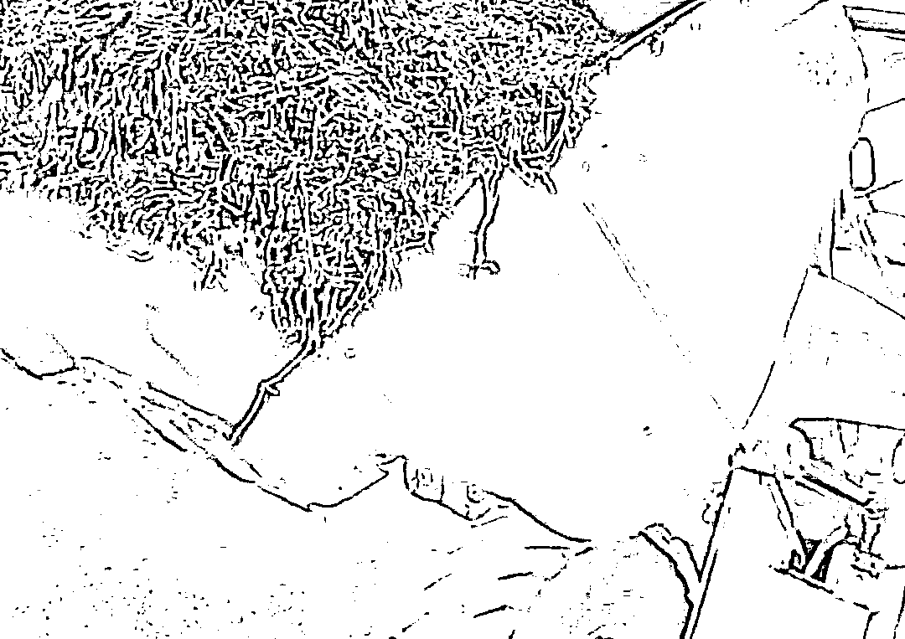
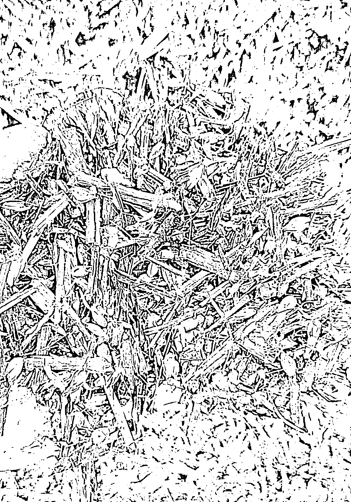
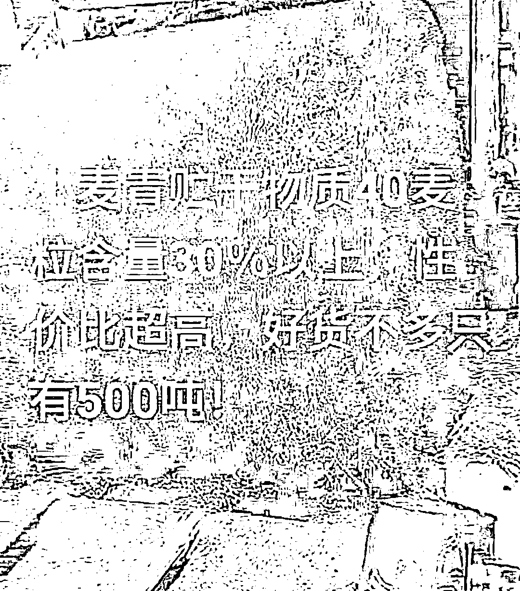

# 小麦青储疑云：谁在高价收购？

> 原文：[`mp.weixin.qq.com/s?__biz=MzIyMDYwMTk0Mw==&mid=2247536238&idx=1&sn=2dec9466a5f3e3eb673c8ee022dda1ac&chksm=97cb8556a0bc0c4078fb1d911100ebfe0e2814951ef35e49ff03c6372fb2a420657cebe55dd7&scene=27#wechat_redirect`](http://mp.weixin.qq.com/s?__biz=MzIyMDYwMTk0Mw==&mid=2247536238&idx=1&sn=2dec9466a5f3e3eb673c8ee022dda1ac&chksm=97cb8556a0bc0c4078fb1d911100ebfe0e2814951ef35e49ff03c6372fb2a420657cebe55dd7&scene=27#wechat_redirect)

一台台收割机日夜忙碌地作业，将鲜绿色的小麦青苗收割下来，像碎草一样将翻斗车装得满满当当，随着翻斗一顷而下，被压制成圆柱型的“大饼”旋转着打进包裹。这是牟石江 5 月 7 日发布的一则短视频里的画面。 

小麦青苗来不及在最后的 20 天里沉淀果实，就被机器打碎，这种看似违反常识的行为，引发舆论一片哗然。为何在小麦灌浆即熟的时期毁掉，这不是糟蹋粮食吗？还未成熟的小麦，难道比成熟的小麦价值更高？更大的疑虑弥漫开来：一面是全球粮食面临供求关系紧张，而一些人却大肆毁掉粮食，如此行径肯定别有用心，故意让国民陷入食物危机？更有甚者推测外部势力企图扰乱我国粮食安全。

各种阴谋论在平台上涌现，众声嘈杂，各执一词。而实际上，凤凰网《风暴眼》联系河北、河南、山东等地粮食收购商、畜牧场和农户后发现，收割绿油油的小麦青苗只是局部地区现象，这些青麦打碎后主要是用来作为青贮饲料喂养牛羊。去年雨水过多，导致储备的玉米青贮饲料不足，而且疫情影响饲料运输以及海外进口，加剧饲料短缺。尤其是 5 月青黄不接之际，收割小麦青苗成为一些畜牧养殖场面临饲料缺口时的应急方案之一。

***01*** 

***麦苗和麦粒价格倒挂***

牟石江没想到自己的一则视频会面临如此多的争议。他视频里赫然打出几个字“5000 亩小麦做饲草”。空旷的土地上都是被打碎后的青苗和数辆装满青苗的卡车，远处是摞成山状的数堆青苗包裹，还有两台翻斗车忙碌着将青苗打包。

牟石江在河北唐山经营一家牧草公司，有种植基地，也会收购牧草，然后售卖给地方牛羊养殖户和牧场。时值 5 月，青黄不接之际，窖里储备的散装秸秆青贮、玉米青贮存货陆续出完货，牟石江准备收购今年的小麦青贮。小麦青贮是将包含茎叶在内青绿的全株小麦切碎，经过压实、排气、密封，在厌氧条件下进行乳酸菌发酵，得到的一种可储存饲料。

短视频发出去的两三天里，牟石江陆续收到数百个农民的电话。他发现，除了唐山本地，这些电话多来自山东、河南、安徽等省的农户。不过，由于青贮不宜长时间运输，一般这些小麦就由当地的牧场直接收购了。牟石江并不打算跑到外地去收购，他只是想了解下市场，看看农民的意愿有多强烈，从而方便估价。

牟石江给出的收购价在 1200 元左右。网络流传的视频中，一亩小麦苗收购价高达 1500 元甚至 2000 元。这个价格在牟石江看来已经很高了，他明白，唐山本地麦子灌浆成熟后再卖，最多卖到八九百块钱，所以农民愿意把青贮卖给他。

小麦苗和成熟麦穗价格倒挂，吸引了一些农户。在河南商丘种植了 230 亩小麦、准备卖给面粉厂的李晟，在抖音上刷到牟石江的视频时，心里萌生了新的想法。他盘算着，麦子成熟后，一亩地产量多至一千三百斤，也就卖一千来块钱。但卖青贮的话更划算。

一亩地承包费用是 650 元，此外，种植小麦还要购买麦种、化肥，另有收割、人工成本，这些支出大约也要 500 块钱。去年以来，化肥大幅涨价，一袋一百斤的尿素以前是 80-90 元，现在已经涨到 100 多块钱。一亩地需要用一袋肥料，这给李晟增加了不小压力。

李晟信手拈来各种数字，三下五除二，最后得出结论：种小麦一亩地净利润有 300 块钱左右。他作为种植大户，种植小麦最终是供应给当地的面粉厂。收割完小麦，还要租车拉运，一车 40 吨，一吨 60 块钱，200 多亩地大概能装 4 车，4 车就是八九千块钱。再加上铲车的费用和人工成本，一共要支付 15000 元。综合下来，还不如卖青苗省心省力还赚钱。

同样是粮食生产大省的山东，也面临相似的情况。山东小麦将于 6 月初进行收割，作为粮食收购公司的工作人员，李鑫通常会从山东收购小麦和玉米。他告诉凤凰网《风暴眼》，如果卖青贮，农民不用出 60-70 元的农机费用，给农民 1500 元，还帮他们清好场地，农民当然乐得轻松。在当地，正常成熟的小麦，每亩地在 1000 斤左右，如果今年卖 1.36 元一斤，一亩地能卖 1360 元，再减去农机、拉粮食的成本，仅剩下 1280 元。那么，卖青贮和卖麦籽，一亩地收入相差 220 元。

按照全国平均数据来看，小麦青贮与麦籽价格也存在倒挂现象。根据国家发改委价格成本调查中心编制的《全国农产品成本收益资料汇编 2021》，2020 年，每亩小麦产值（收入）1009.87 元，比 2019 年的 1043.99 元降低了 3.27%。虽然没有最新统计，但业内专家预计，今年粮价攀高，小麦（麦籽）每亩收入约在 1200 元左右。那么，即便小麦青贮以 1200 元/亩的价格收割，农户售卖意愿也更高。

今年我国小麦最低收购价已回升至 1.15 元/斤，但李鑫仍担忧，“如果现在麦籽行情能到 1.46 元一斤，多少能合适一点。目前还没有正式开始收割，过一段时间，再看小麦行情。如果今年每亩地麦籽卖不到 1500 元的话，明年农民肯定会大量地卖青贮。”

***02***

***饲料储备青黄不接***

高价收购小麦青贮背后，是市场供需缺口。凤凰网《风暴眼》从多位业内人士处了解到，华北地区在去年经历一场 60 年以来的最大降水量，许多玉米地被雨水淹没，导致各个牧场玉米青贮储备不足。

去年 7 月始，暴雨倾灌华北，断断续续下到 9 月不歇。河北、河南、山东等地降水量几乎是以往的 1.5 倍。中国气象局发布的《2021 年中国气候公报》显示，去年华北地区降水量为 686.9 毫米，比平时多 54%。其中，河北降水多 71%、河南多 51%，均达到 1961 年以来雨量峰值。

而牟石江 9 月开始收购玉米青贮时，华北平原的许多田地泥泞不堪，收割机根本进不去，玉米青贮难以收割。这导致牟石江收购量锐减，供需缺口高达数千吨。“这意味着，一直到今年 10 月新的一批玉米青贮供应前，50%的牧场是没有玉米青贮可以给牛羊吃的。”牟石江称。

在雨水重灾区河南周口经营着一家肥牛养殖场的付泊，早在今年春节后，就开始陷入饲料短缺的困境。他养了 300 多头肉牛，由于去年雨水漫灌，收购玉米青贮不足，改用玉米秸秆发酵的黄贮，可到了今年 2 月底，这些饲料就已经吃完。

为了补足饲料，他只得四处联系买草。有老养殖户告诉他，以前喂牛会掺一些小麦苗。他于是想收购些小麦青贮，但在网上查询相关资料后，总觉得比例不好把握，又担心小麦可能会造成吸收不好的问题，最终未作安排。

即使不是雨水漫灌，饲料供应还面临现实的困境。河北邯郸养殖户姚军所在的区域，种植玉米较多，但因为种粮利润低，劳动力普遍外出，加上为图省事，玉米秸秆通常直接粉碎到地里，这些也加剧了饲料供给短缺问题。

这一缺口已经得到农业农村部关注。农业农村部近日借助中国奶业协会调度了奶牛养殖企业有关情况，调查结果是，黄淮海地区大型奶牛场青贮饲料缺口约 40 万吨左右。其中针对有较大缺口的养殖场户，各方正在提供供需平台的多方渠道，弥补缺口。

但饲料短缺，已经抬升了小麦青贮的价格。河南太康一种植户告诉凤凰网《风暴眼》，去年小麦青贮的售价是 550-650 元/吨。今年几乎每吨又上涨了 100 元，达到 700 元/吨。

姚军虽然养殖了数千头牛，眼下饲料缺口很大，但是并不想买小麦青贮。小麦青贮的价格太高，700 元/吨的价格几乎是玉米青贮售价的 1.4 倍，而且如果储存不当或包装不当，还可能会坏掉。所以，他一般直接上草料，用玉米做精料，再加些市场上的成品饲料，青贮的使用几乎为零。但是养殖成本持续上涨，姚军资金吃紧，无奈之下，只能缩减养殖规模。

***03***

***谁在为高价买单？***

虽然小麦青贮对养殖户来说并非首选饲料，但是饲料不足的情况下，仍有养殖户不惜高价购买。

惠农网上，仍有小麦青贮销售的信息更新，显示从湖北、湖南省发货，10 吨起批。其中一家商铺的成交记录显示，2021 年 5 月 22 日曾有人购买过 32 吨小麦青贮。

凤凰网《风暴眼》从多位人士处了解到，购买小麦青贮的多是奶牛牧场。与肉牛养殖户不同，奶牛牧场喂养，对饲料的营养价值要求较高。

与新鲜饲料相比，青贮饲料更耐储存，而与干饲料相比，青贮饲料柔软多汁、适口性好，维生素含量和能量水平也均较高，因此更富含营养。

自 2008 年我国出现三聚氰胺毒奶粉事件后，青贮饲料在奶牛业就逐渐普及。中国社会科学院农村发展研究所研究员胡冰川告诉凤凰网《风暴眼》，毒奶粉事件让乳业元气大伤，奶牛养殖业自此也进入监管时代。政府为规范牛奶营养均衡和质量安全做了大量工作。奶牛要保证高质量产奶，一定要用精饲料、粗饲料、青贮饲料做好日粮配方。

“如果用相对便宜的饲料代替青贮，会对产奶量及乳脂、乳蛋白等营养指标产生影响，进而也会影响到原料奶的定价”胡冰川说。

楚涛在河南邓州市经营一家奶牛牧场，由于没囤够玉米青贮，今年已经花了 14 万购买 200 吨小麦青贮。“奶牛要用高质量的饲料来养，否则产奶不达标，乳企会拒收。现在玉米青贮不足，燕麦、苜蓿青贮要从澳大利亚和美国进口，价格更高，只有小麦青贮可以替代”。

突破南稻北麦的传统认知，实际上南方也会种植大小麦作为青贮饲料。多位业内人士向凤凰网《风暴眼》表示，由于南方玉米种植不够丰富，在安徽、江苏等省份，会有牧场收购大麦青贮和小麦青贮作为饲料。而光明乳业等大型乳企都会在南方合作牧草基地，种植大小麦青贮。

光明乳业 2021 年年报显示，光明乳业下属全资子公司光明牧业在 2021 年，签约了 19 万亩的青贮玉米、大小麦、苜蓿、燕麦等种植基地，收购约 33 万吨饲料，金额约 2.2 亿元。2021 年 3 月，光明乳业还花费 5000 多万收购江苏盐城的牧草公司，后者种植大麦等青贮。

饲料价格上涨，推高牧场和乳企的成本。仅在 2021 年，由于饲料成本上升，光明乳业乳制品制造业营业成本上升了 22%，推高到 206 亿元。

蒙牛乳业 2021 年中期报告也提到了饲料价格上涨带来的成本压力，“2021 年上半年国内玉米、小麦、豆粕价格同比均上涨，奶牛养殖的饲料成本仍处高位。”

利润在大幅摊薄。现代牧业 CFO 朱晓辉在 2022 年 3 月 30 日举行的业绩发布会上坦言，目前饲料成本无论与历史同期比，还是从成本占比来看，都出现了大幅上涨。“现在奶价即便维持在每公斤 4 元多，养牛成本与奶价也只是基本持平。”

即便通过收购牧场降成本的光明乳业，毛利率也继续下滑。受饲料成本上升影响，光明乳业旗下牧业领域毛利率在 2021 年继续下降 3.8 个百分点，低到只有 2.9%。而乳制品制造业毛利率也下降了 3.7 个百分点，降至 19.6%。

楚涛在艰难维系着奶牛场的运营。他的牧场今年成本提高了 40%，已经面临亏损。他在年初就和乳企签订了销售合同，提前锁定了销售价格，看似一年的辛苦回报有望。但是成本涨得太快了，超乎他的意料，导致他根本不挣钱，也没办法止损，只能眼睁睁地盯着惨淡的数据，期待转机。

***04***

***粮食安全是否受到威胁？***

市场的无形之手在暗中运行的同时，小麦作为我国 14 亿人口主要的口粮品种，被用作青贮饲料引起巨大的争议。

尤其是俄乌冲突影响粮食出口大国俄罗斯和乌克兰的粮食种植，许多国家纷纷出台政策，限制粮食出口，进一步加剧粮食危机。而 5 月 4 日，联合国粮农组织发布《2022 全球粮食危机报告》显示，2021 年有 53 个国家或地区约 1.93 亿人经历了粮食危机或粮食不安全程度进一步恶化，比 2020 年增加近 4000 万人，创历史新高。此外，联合国粮农组织还表示，截至 5 月 12 日，有 2500 万吨粮食滞留在乌克兰，无法运出。粮食价格持续上涨，更是创历史新高。

糟糕的国际形势下，有关国民的“粮食安全”问题自然成为舆论焦点。

湖南农业大学教授万发春近日接受央视采访时指出，不能狭隘理解“粮食安全”的概念，应该从“大食品观”的角度出发，发展畜牧业产生的肉奶也是“粮食”，其实如今肉蛋奶、蔬菜的消耗量要超过粮食。个别地区用新麦作为青贮饲料并不会危及到粮食安全。

他强调的“大食品观”也和农业部在 2015 年启动“粮改饲”的初衷吻合。为了减库存、提升饲料价值，2015 年，农业部启动实施“粮改饲”试点工作，以全株青贮玉米为重点，推进草畜配套。燕麦叶、苜蓿、大小麦等青贮饲料均得到了应用。2021 年 5 月 11 日，央视网还专门报道，安徽合肥一家牧业公司收购红桥村 2000 亩全株小麦青贮喂养奶牛，“通过粮改饲，每亩小麦效益可增加 30 到 50 元左右。”

事实上，即便农户售卖意愿很高，但由于市场需求有限，目前我国小麦青贮用量并不大，高价收购更只是局部地区现象。胡冰川曾长期在各地进行田间调查，据他了解，2021 年，全国原料奶产量大概是 3700 万吨，饲料对产奶量的比例是 1:1，即使用 3700 多万吨饲料，分到 365 天，一天也就 10 万吨。其中，青贮饲料大概占比一半以上。而具体使用哪种青贮饲料，是看有什么，以及什么划算。受洪涝影响的山东、河南、河北虽是奶牛大省，但在全国范围内，小麦青贮使用量不会很大，实际上最终只是边际上的影响。

他还强调，大部分地区小麦青贮收购价不会高于 1500 元/亩。“因为过高的定价会突破养殖场的心理界限，养殖场也要算账，可能宁愿用精饲料顶几天，理化指标降一点就降一点。”山东、河南、河北等地的多个农户也向凤凰网《风暴眼》表示，身边并没有高价收购小麦青贮的情况。

社科院农村发展研究所研究员李国祥也对凤凰网《风暴眼》表示，我国有 3300 多万亩的青饲料，不同的作物可能都会有一点。其中主要是玉米，小麦比较少。其实如果是少量的小麦青饲料，作为混合饲料中的一个配方，那么它对国家的粮食安全是没有影响的，反而可能会有助于改善粮食的供求结构，不能完全否定它的积极意义。”

“我们有 3 亿多亩粮食，只要是有计划地来使用，就没有大的问题，不要去炒作，根据客观需要来使用。”李国祥说。

在中华全国工商业联合会农业产业商会新乡村建设专家委员会主任孙文华看来，小麦青贮要控制好用量，“河南是粮食主产地，农民卖小麦青贮一旦量大的话，就可能影响到国家粮食安全问题。现在国际疫情严重，俄乌战争等突发事件都会影响到粮食的贸易稳定，所以一定要把粮食牢牢掌握在自己手中。”

为了守住粮食安全红线，5 月 10 日，农业农村部官网发布消息称，要求各地进一步全面排查毁麦开工、青贮小麦等各类毁麦情况，对违法违规行为，发现一起处理一起。随后，河南、河北、安徽等多地农业农村部门也紧急下发通知，要求充分认识小麦是主要口粮，不能用于青贮饲料的严重性。从现在开始到麦收结束，任何地方、任何单位、任何人员不得以任何理由毁麦或将小麦用于青贮饲料。

不过政策一出，也有误伤。胡冰川提到，市场上专门用作青贮的小麦品种也受到了影响，这类品种与普通小麦价格无异，只是种子会选耐密性比较强的，种植管护方式也和普通小麦不一样。“比如青贮小麦更追求生物量最大化，而非籽实产量最大化。如果要求‘颗粒归仓’的话，反倒是弄巧成拙。”他介绍，现实中主要是养殖企业自己流转土地种青贮小麦，但占比非常小，不超过 1%。

牟石江今年在自己基地种植的 3000 亩小麦本来想卖青贮饲料，但相关政策发布后，他准备将它们全部卖粮。饲料缺口如何补上？他准备再多进口一些苜蓿、燕麦叶，不过，无论是对他还是对养殖户来说，这样的饲料成本都将提升大约 20%-30%。

面对舆论汹涌的质疑，牟石江最终删掉了原来发布的“5000 亩小麦作饲草”的视频，转而发了一则新视频。视频的正中央是三个大字“评评理”。视频很短，但声音很干脆：农民种地就是为了谋生，小麦是农产品，农民让自己的利益最大化有错吗？

（应受访者要求，文中牟石江、李晟、李鑫、于南、付泊、姚军、楚涛均为化名）

凤凰网《风暴眼》出品 文｜吕银玲 编辑｜刘培

← 向右滑动与灰产圈互动交流 →

