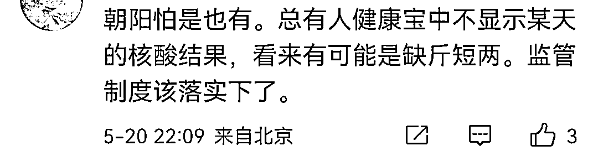

# 北京这家核酸检测公司出事了！

> 原文：[`mp.weixin.qq.com/s?__biz=MzIyMDYwMTk0Mw==&mid=2247536238&idx=2&sn=de39244d83166a1870333a6b66c48b7a&chksm=97cb8556a0bc0c40d2c6caed909fc2d28bcf2335bc3caa300f21941fa4b9a89920d727c38c26&scene=27#wechat_redirect`](http://mp.weixin.qq.com/s?__biz=MzIyMDYwMTk0Mw==&mid=2247536238&idx=2&sn=de39244d83166a1870333a6b66c48b7a&chksm=97cb8556a0bc0c40d2c6caed909fc2d28bcf2335bc3caa300f21941fa4b9a89920d727c38c26&scene=27#wechat_redirect)

前几天因为读友说北京朝安医学检验所，家人一起检测，但总有不出结果的现象，于是斗胆扒了一下。 

而后我们知道，

这是一家 2022 年 4 月 26 日成立，似乎就是为服务北京大规模核酸而生的公司。

 而在今天上午的时候，

又有一位亲友，带着很刺激的语气跟我说，北京那家核酸检测公司出事了。 

本以为是我们说的这一家，

结果不是，是一家名叫北京朴石的检测公司。

搜一下这家公司的运营动态，在行政处罚这一栏上可以看到：“监督员发现位于北京房山区广阳大街 xxxxx 的北京朴石医学检验实验室原始检测数据明显少于样本检测数量。” 

处罚的结果是：“吊销《医疗机构执业许可证》”

这种事，属于大事，虽然已经板上钉钉了，

但没有官方媒体报道，一般人也是不敢说的，包括我。

好在就在刚刚，看到有媒体终于忍不住了，

还是北京本地的重量级媒体，北京头条！

如此，就实锤又加上井盖，彻底翻不了身了。 

看一眼这家公司的介绍，可以看到，也是疫情后成立的！网友的评论是：也不是一般家庭。

搜一下相关的资讯动态，可以看到，

河南疫情有它们的影子； 

西安疫情，他们也是“疫王无前”

他们的自我介绍：是京畿测试集团控股的一家医疗检验机构。目前，实验室已为中国海关、北京市政府、房山区政府、西城区政府等各级政府机关提供相关服务，

北京朴石检验相信很多人不知道，

但京畿测试集团相信行业内外的基本都听过大名。

尤其是涉足环保这一块的。

这是一家很大很大的公司；

只是其控股的检验检测公司就有好几个，譬如青岛的这个泰思特，百分百控股，

而今天出事的北京朴石，控股也高达 75%。

换句话说，北京朴石就是其下属的子公司。嗯，法人拿的股份只有 5%！

怎么说，本以为又是一家借着疫情应运而生的一家不入流公司，没想到却是个检测届的老牌坊。

如此，做出造假的事情，祸国殃民，那就不是经验不足什么的了，而是在真正的发灾难财。

就这起事件，我们可以看到网友们的评论很不友好，就是犯罪，民众辛苦配合采集样本，拿回去一扔，给个虚假报告，有阳性也不知道。

也有网友觉得，吊销资格太轻了，学生不做核酸，都要追究刑事责任，一个核酸检测公司公然造假，居然不判刑？

最主要的是，这样敢于造假的核酸检测公司，其他的究竟还有没有！

譬如，朝阳群众就担心自己那里也有！

不止一个人如此质疑，

石景山的网友说，集体核酸 48 小时都不出结果，等出结果都没有用了。

更重要的是，这样的现象，除了北京，其他地区是否也都存在。

如果存在的话，我倒不在意别的，什么暴利啥的，诸如人民 R 报四川分社的林社长曾直接抨击说；不停止核酸的惊天暴利，疫情就必定没完没了。

我关心的只是，每天被喊下去做核酸，结果采样被扔了，那这么多的人是不是陪着你们演戏呢？

如此，手笔是不是太大了一些，底裤是否已经掉到脚裸上了？

最后，我也知道这个话题很敏感，某基因机构的举报某核酸机构造假，行贿啥的的事情，结果被打断了肋骨，现在还没有下文。

还有北京那个 W 健委主任，腐败案件中，也有收取核酸检测提成这一项，核酸的背后不是一般人可以说的。

但，这种事不说能行吗？

期待后续，谢谢！

来源： 我会永远在你身后 作者：吴秀才

← 向右滑动与灰产圈互动交流 →

