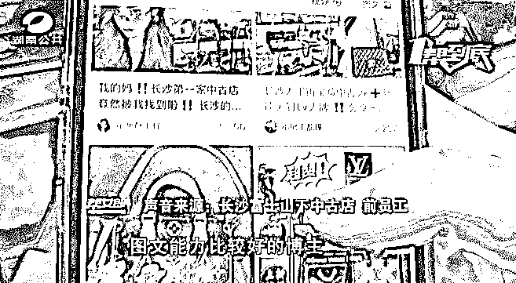
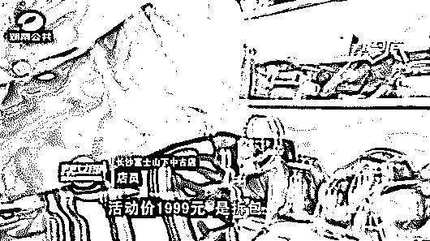

# LV 专柜涉嫌售假后，长沙又一“网红店”被曝光！执法人员已介入

> 原文：[`mp.weixin.qq.com/s?__biz=MzIyMDYwMTk0Mw==&mid=2247536238&idx=3&sn=5bd77ef88a6d094662b4b714ece28f5d&chksm=97cb8556a0bc0c4013a4e61dce416ae536da292ffec634c72b41f2020643784a145066a1145d&scene=27#wechat_redirect`](http://mp.weixin.qq.com/s?__biz=MzIyMDYwMTk0Mw==&mid=2247536238&idx=3&sn=5bd77ef88a6d094662b4b714ece28f5d&chksm=97cb8556a0bc0c4013a4e61dce416ae536da292ffec634c72b41f2020643784a145066a1145d&scene=27#wechat_redirect)

最近长沙国金中心 LV 专柜

涉嫌售假向消费者退一赔三的新闻

闹得沸沸扬扬

而就在近日

**记者接到长沙一名中古店前店员的爆料**

**称她所工作的中古店** 

**长期卖假货坑害消费者！**

**进价 150 卖几千！**

[`mp.weixin.qq.com/mp/readtemplate?t=pages/video_player_tmpl&action=mpvideo&auto=0&vid=wxv_2408330486659055618`](https://mp.weixin.qq.com/mp/readtemplate?t=pages/video_player_tmpl&action=mpvideo&auto=0&vid=wxv_2408330486659055618)

# **01**

# **长沙一网红包包店被曝光**

# **前员工：进价 150 卖几千**

长沙富士山下中古店前员工告诉记者，自己是从一个快递发现事情的不对的。 

**| 长沙富士山下中古店 前员工：**有一天我发现一个快递，我发现它来自于广州白云皮具市场，根据快递的源头，我找到了厂家，原来我们店所谓的拆包都是假的（拆包是指将包包的零件分开，进行任意的组装），批量网购的。店里面卖 1999 元或者 2999 元的，进价有的是 150 元，最高的也不过 400 元。店里整个微信收款一年大概是 500 多万元。

该中古店前员工表示，店铺对外宣传的都是正品包，并会做一些社交平台推广，营造店铺很火的氛围。

而为了让消费者相信店内卖的拆包是真的，爆料人透露，店内有一个大的 LV 旅行袋打的样，上面被剪成各种形状，顾客看到之后就会信以为真。凡是有顾客说店里卖的是假包，就有专门的客服人员跟她及时取得联系。 

# **02**

# **记者现场探访**

# **第三方鉴定机构：假货**

那么真实情况到底如何？记者以消费者的身份前往了该门店。

在现场店员表示，店内销售的都是正品。

记者购买了其中一款包，并将该产品送往了第三方专业鉴定机构进行了鉴定，鉴定结果显示：送检样品不符合品牌制造商公示的技术信息和工艺特征，为假货。

# **03**

# **长沙天心区执法人员介入**

**事件进一步调查中** 

随后，记者将情况反映给了长沙市天心区坡子街市场监督管理所，执法人员随即展开了执法行动。

**| 长沙市天心区坡子街市场监督管理所 执法人员：**对该店涉嫌销售侵犯商标专用权的产品，我们会依法进行先期登记保存，然后和相关科室联系，和商标的持有人沟通，做进一步鉴定。如果鉴定这个包为假包的话，我们将依据商标法依法依规严肃处理。

来源 ：芒果都市、芒果帮女郎、晨视频

← 向右滑动与灰产圈互动交流 →

