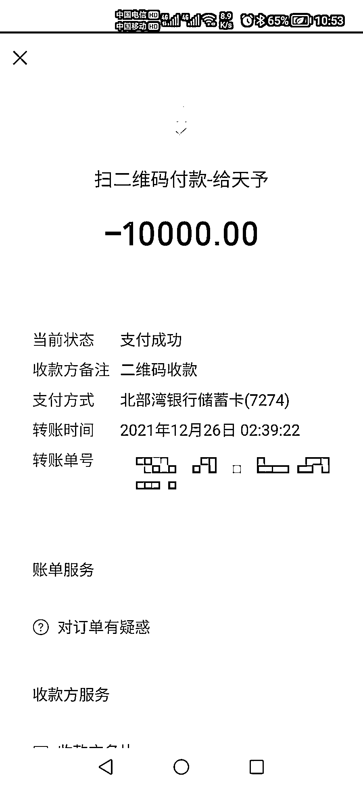
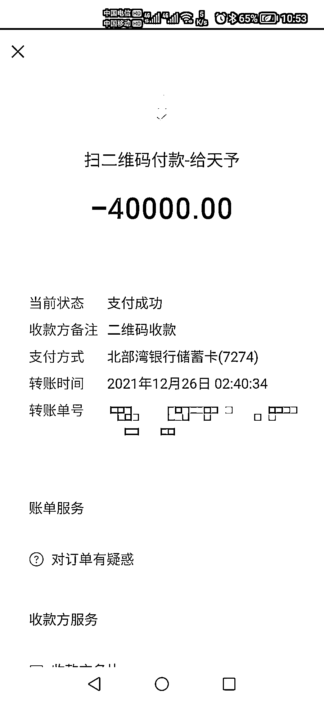
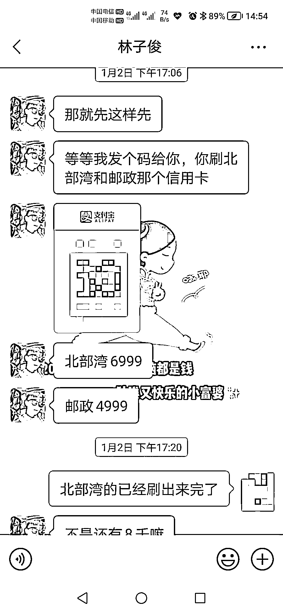
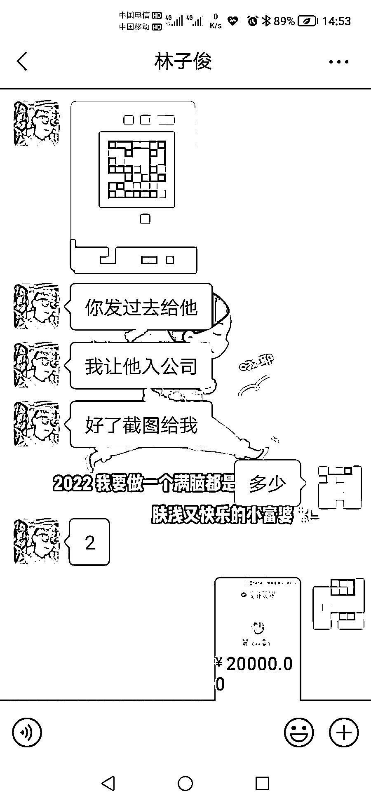
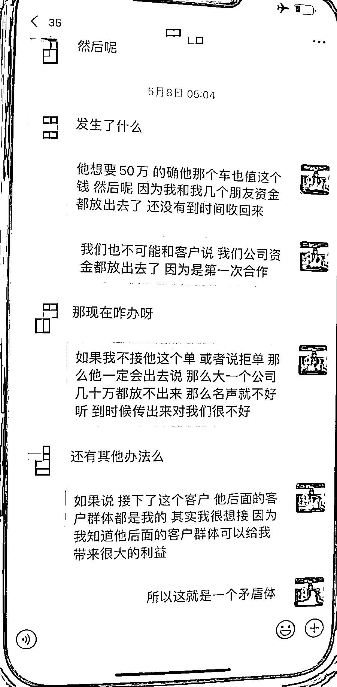
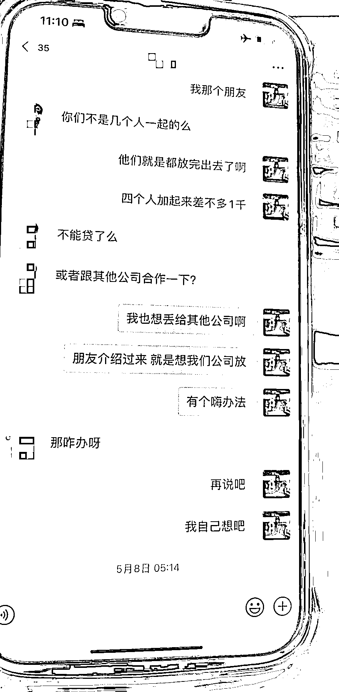
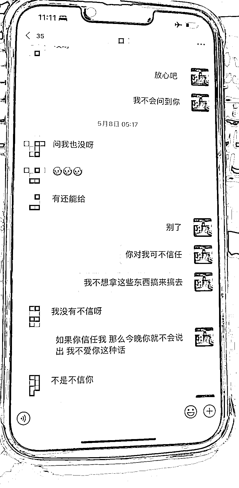
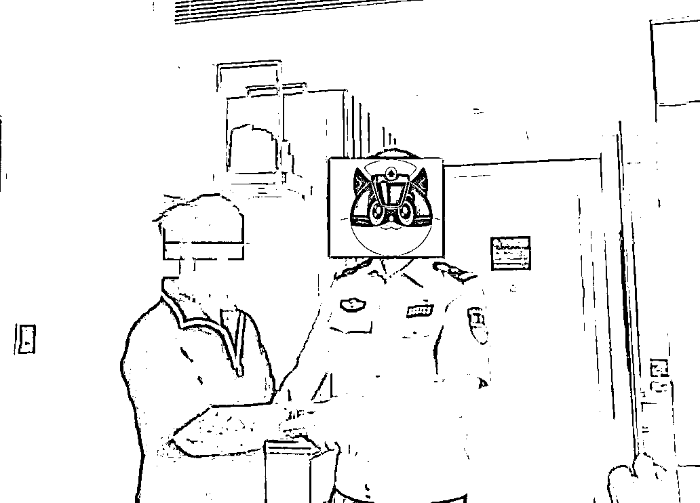

# 男子在妻子孕期，同时与 30 名女子恋爱！其中 10 人报警后发现…

> 原文：[`mp.weixin.qq.com/s?__biz=MzIyMDYwMTk0Mw==&mid=2247536238&idx=4&sn=f72a2a4127f024d14a96e201d1882a08&chksm=97cb8556a0bc0c4080fec06fb039818ec6893d28749c2a456da1a1ca7284d957aea547cdf530&scene=27#wechat_redirect`](http://mp.weixin.qq.com/s?__biz=MzIyMDYwMTk0Mw==&mid=2247536238&idx=4&sn=f72a2a4127f024d14a96e201d1882a08&chksm=97cb8556a0bc0c4080fec06fb039818ec6893d28749c2a456da1a1ca7284d957aea547cdf530&scene=27#wechat_redirect)

妻子还在孕期
丈夫却对外声称自己单身？

同时与 30 多名女性交往

实施婚恋诈骗超百万！

近日，广西南宁市公安局蒲庙派出所接到市民冯女士电话报警称，**她的男朋友以借钱做生意为由向其借款近 22 万元后失联，冯女士怀疑自己遭遇了情感诈骗。**

**南宁市公安局
蒲庙派出所副所长 周锴：**

“警方查嫌疑人车辆，**就发现他每天会换不同女孩子坐他副驾，比较亲密的，一天换一个，**我们就觉得可能被骗的女生也比较多。我们把这个男的给抓了，当时有个女的跟他在一起，但是是还没有被骗的。

被抓的当天，同时 7、8 个女孩子还问该男子什么时候到家吃饭，今晚去哪里。我们通知她，她还不相信，觉得是不是搞错了。”

△受害者转账记录 

经审讯，犯罪嫌疑人莫某是北海人，已婚，孩子目前刚满 4 个月。去年 11 月起，**莫某对外化名林子俊，对交往的女性宣称单身未婚。**

日常出行开一辆豪华名牌轿车并宣称自己在南宁凤岭北租住的一间大平层是全款购买的。**莫某把自己伪装成开公司的富二代**，通过社交软件广泛结交女性，在交往过程中对这些女性嘘寒问暖，打造出“多金暖男”的完美人设，时机成熟后，就以各种理由骗取女性钱财。

△莫某和不同受害者的聊天记录

**南宁市公安局
蒲庙派出所副所长 周锴：**

**“基本不超过一个星期，女的都会跟他确定恋爱关系了。**确定恋爱关系以后就以自己生意上经济困难为由叫那些女孩子为他提供帮助，女孩子说没钱就让女孩子通过网贷借给她。

通过查他的聊天记录同时跟他谈恋爱的有 30 几个女孩，目前我们查实的报案的 10 个女孩子，涉案金额是 104 万。”

△犯罪嫌疑人莫某 

诈骗得手后，莫某就会马上“玩失联”，将诈骗的钱财用于高档消费。

**南宁市公安局
蒲庙派出所副所长 周锴：**

“骗得上一个女孩子的钱就去找下一个女孩子。前一个女孩也不拉黑，就是不理你，什么都不接，你也找不到他。”

目前，犯罪嫌疑人莫某因涉嫌诈骗罪，已被警方采取强制措施。

[`v.qq.com/iframe/preview.html?width=500&height=375&auto=0&vid=l33385m3tew`](https://v.qq.com/iframe/preview.html?width=500&height=375&auto=0&vid=l33385m3tew)

**警方提示**

网恋有风险，交友需谨慎。在当下的网络时代中，很多诈骗分子会通过交友平台添加单身女性为好友，**随后通过频繁的聊天、体贴的关怀等方式，与受害人建立信任并确立恋爱关系。**等待关系稳定后，便会利用各种花言巧语诱导受害人向其转钱。 

对此，警方提示，在网络交友中，**一旦对方提出借钱、转账、投资等要求时，需提高警惕，务必三思而后行**，防止落入骗子的圈套，以免造成不必要的经济损失，给不法分子有机可乘。如遇此类诈骗警情，请第一时间联系公安机关报警。

来源：广西台新闻 910、邕宁警方 

← 向右滑动与灰产圈互动交流 →

