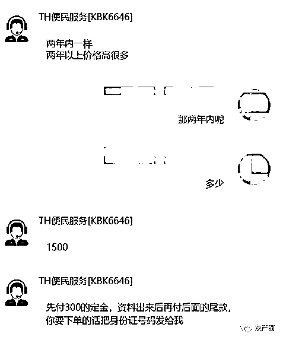
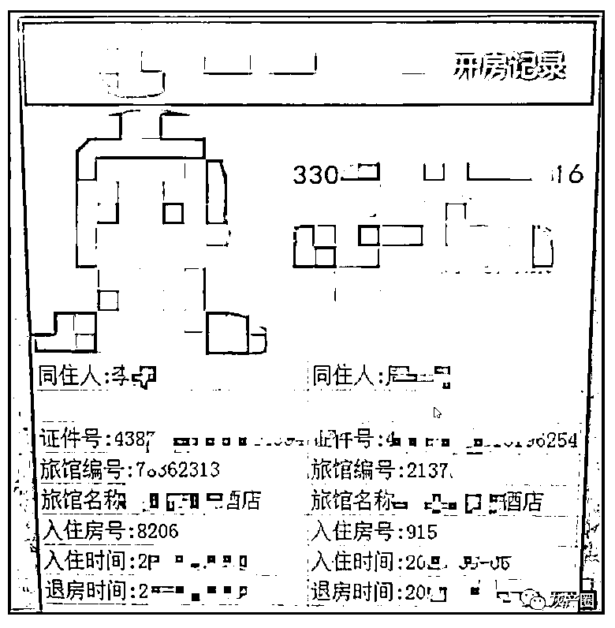
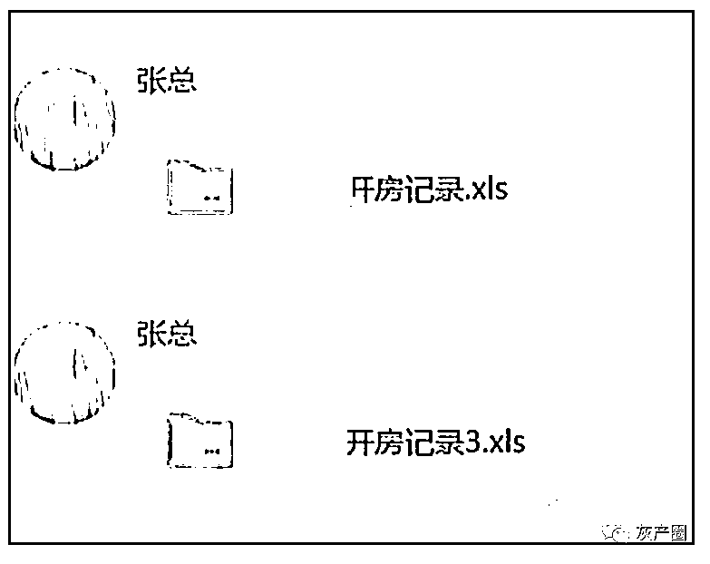
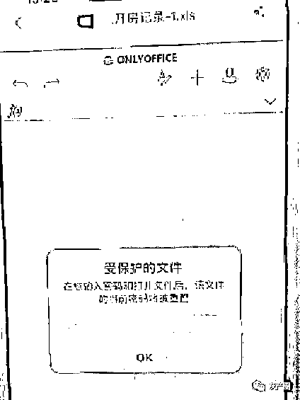
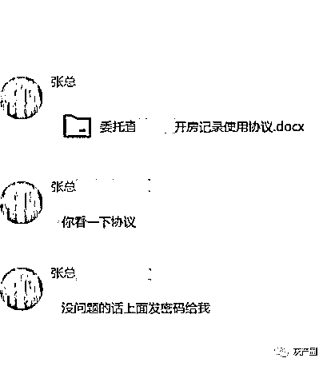
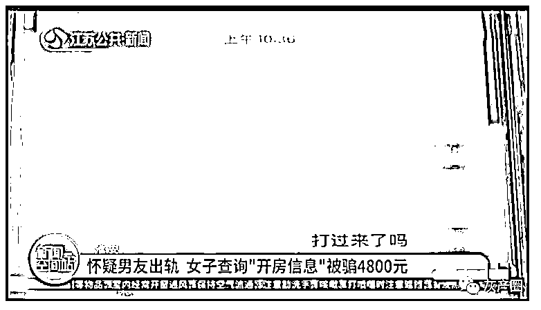
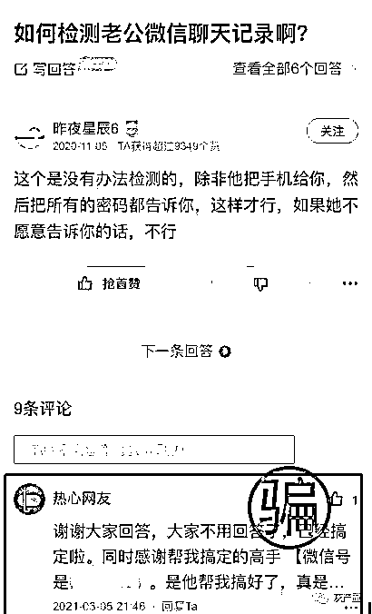
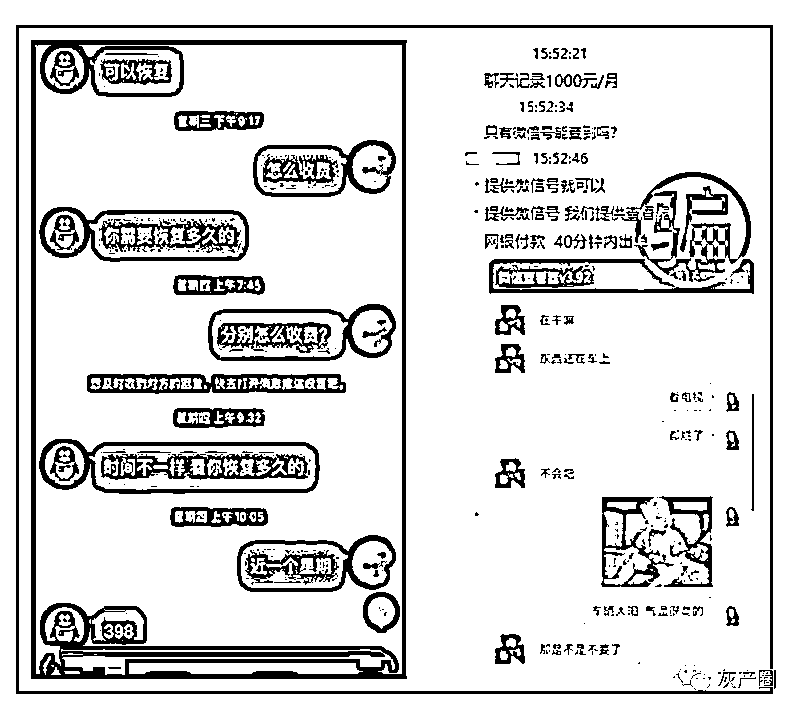

# 怀疑丈夫出轨，妻子查开房记录，结局令人崩溃

> 原文：[`mp.weixin.qq.com/s?__biz=MzIyMDYwMTk0Mw==&mid=2247536238&idx=5&sn=21c9f46d0e16d10a2f57c1e82f70a292&chksm=97cb8556a0bc0c40962aeb27bb4b0bb5d287d016e4c505ebdb7ed2f67fb03644fe530976f1fd&scene=27#wechat_redirect`](http://mp.weixin.qq.com/s?__biz=MzIyMDYwMTk0Mw==&mid=2247536238&idx=5&sn=21c9f46d0e16d10a2f57c1e82f70a292&chksm=97cb8556a0bc0c40962aeb27bb4b0bb5d287d016e4c505ebdb7ed2f67fb03644fe530976f1fd&scene=27#wechat_redirect)

浙江嘉兴的孙女士怀疑丈夫出轨，但又没什么证据，有个问题如鲠在喉，她想查查丈夫的开房记录。

前几天，她在网上看到一则广告，上面称可以通过技术手段查询酒店住宿记录、微信聊天记录等。

孙女士立即添加了图片上的微信号，对方名字显示“TH 便民服务”，孙女士问对方查询“开房记录”要多少钱。

“TH 便民服务”说：两年内便宜点，要 1500 元，两年以上价格要高一点。孙女士说要查两年内的，“TH 便民服务”说要先交 300 元定金，查询结果出来后再付尾款。

孙女士立即转给对方 300 元，把丈夫的身份证号码发给了对方。

一小时后，“TH 便民服务”来了消息：说开房记录查好了，让她在 QQ 上去加一个叫张总的人，进行交接。

加了“张总”后，“张总”发来一张截图，上面有孙女士丈夫的头像照片和身份信息，还有两条开房记录信息，不过关键信息都打了马赛克。

“果然背着我……”孙女士一看，一口怒气，为了解开打码的内容，又支付了 1200 元尾款。

“张总”又发来两个名为“开房记录”的电子表格，表格是加密文件。他告诉孙女士，解密要交 5800 元保密押金。

对方还发来“委托协议”，好像还蛮像回事，孙女士又转了 5800 元，但还是看不了加密文件，对方又说现在查得紧，还要手续费，又要孙女士交钱…… 

孙女这才觉得不对劲，赶紧报警，目前该案正在侦办中。

**这类诈骗都是交智商税的**

这类诈骗，也不是新骗局，被骗的女性也有男性也有。

你以为就此查明真相出口气，骗子正笑得乐哈哈。

2020 年，金华婺城法院判了这样一起诈骗案子，温州小伙王某和同伙王某，一个初中文化，一个高中文化，平时也没什么工作，两人合谋搞起谎称可以查开房记录进行诈骗，在网上发布查开房记录、监控他人聊天数据、恢复聊天记录等广告，诈骗得手后两人五五分成，骗取了 30 万元。法院一审判决两人 5 年，王某说，知道这是诈骗，但钱太好赚了。

**骗子利用了沉没成本让人一步步入套**

民警说，骗子在行骗时，先在网上打小广告，通过各种问答板块，自问自答进行引流，吸引受害人来与他们联系。

骗子声称有专业工具，只要提供身份证号或者微信号，就能查到。

受害人联系后，骗子先发一个事先 PS 好的截图利诱，然后发你一个加密文件、压缩包，以解密为由收取密码押金、保密押金等为由，这是骗子利用沉没成本原理，一步步向受害人索要越来越多的钱财。受害人一方面觉得自己前面已经交了定金，一方面觉得再交点钱就可以看到了，但交了这笔钱后，骗子还会用其他名义来让受害人追加钱，最后骗到实在没钱了，就把人拉黑。即便是给了密码所谓解密，打开其实是个空白文档。

根据我国法律规定 ，除因国家安全或者追查犯罪的需要，可由公安机关或检察机关依照法律规定程序，对公民个人信息进行检查外，任何组织和个人都不得以任何理由，侵犯公民的个人隐私。

民警说，公民的开房记录属于极度隐私的个人信息，除了公安机关，普通人根本没有任何手段可以查询，一些声称黑客或者技术人员的骗子看准了大家不懂这方面的门道，用话术忽悠转账查询。

**查到了个人隐私，后果很严重**

去年，温州永嘉法院审理了一起侵犯公民个人信息案。 

刘某因怀疑妻子与他人有不正当男女关系，便通过微信与昵称为“黑土”的人联系，希望能查询到他人身份信息及住宿、行踪轨迹信息等。 

2020 年 3 月份至 4 月份期间，“黑土”分三次以人民币 7600 元的价格，将从他人处购买的刘某妻子等人住宿信息 47 条、行踪轨迹信息 81 条、企业登记信息 6 条、银行核查信息 7 条以及人口信息、驾驶人信息、出入境证件信息、机动车违章信息等卖给刘某。

2020 年 4 月，刘某持上述信息质问妻子，后将妻子殴打致伤。经法医鉴定，刘某妻子的损伤程度为重伤二级。

涉案的“黑土”叫王某。

法院认为，王某向刘某出售刘某妻子与他人的住宿、行踪轨迹、企业登记等重要信息，从而引发后续的家暴事件，严重侵犯了他人的个人信息和人身安全。王某被判处有期徒刑十个月，并处罚金人民币 1 万元；追缴其违法所得人民币 7600 元，予以没收，上缴国库。

来源：全民反诈

← 向右滑动与灰产圈互动交流 →

