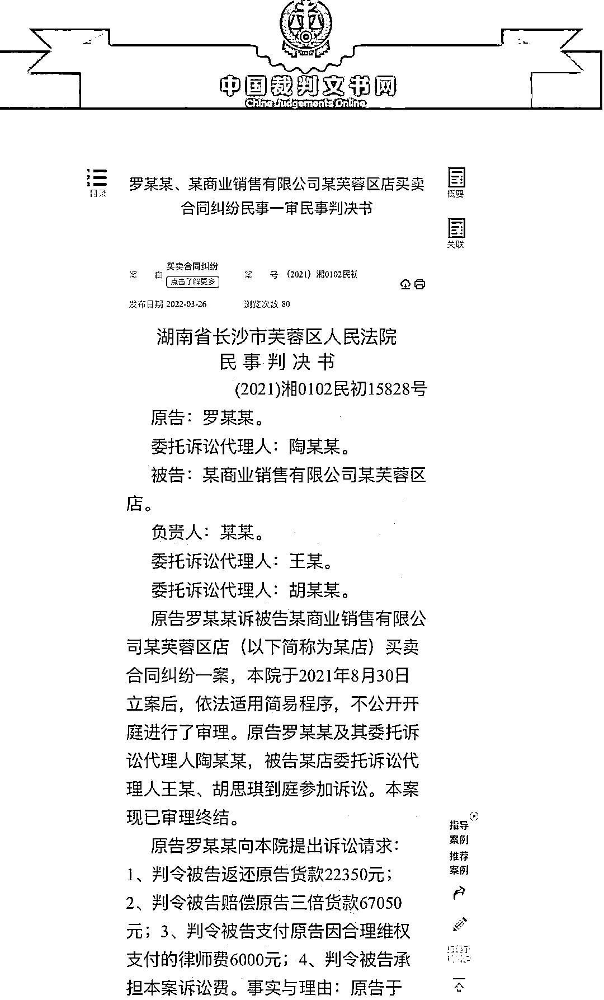
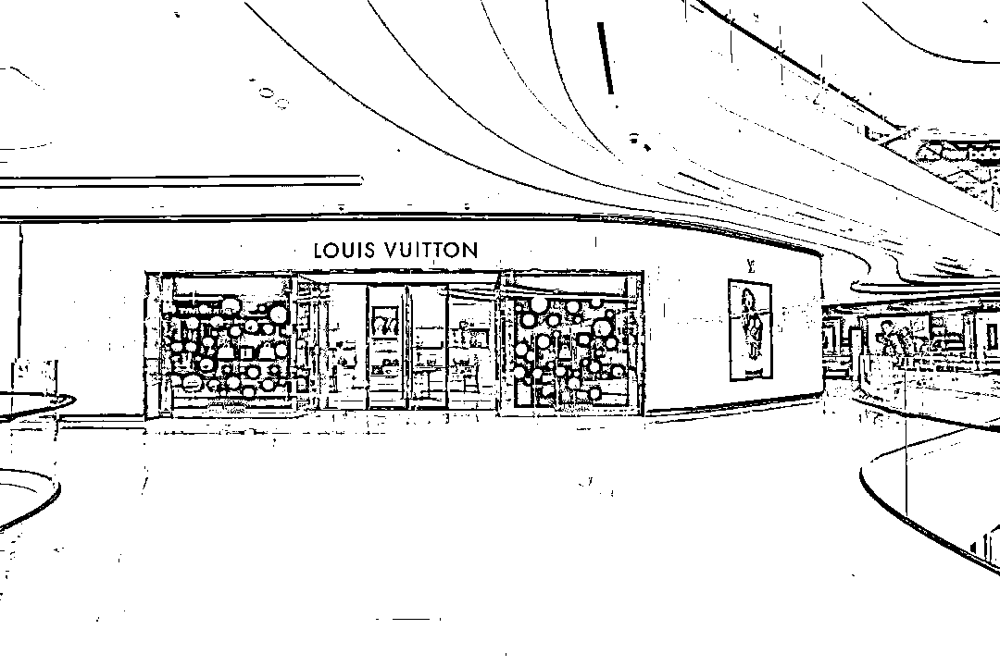
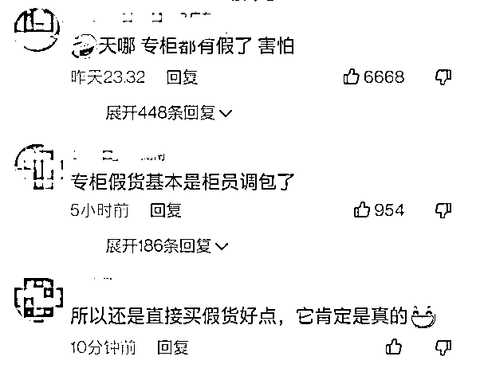
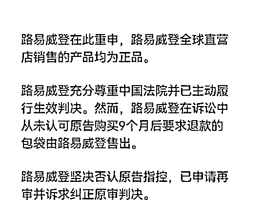
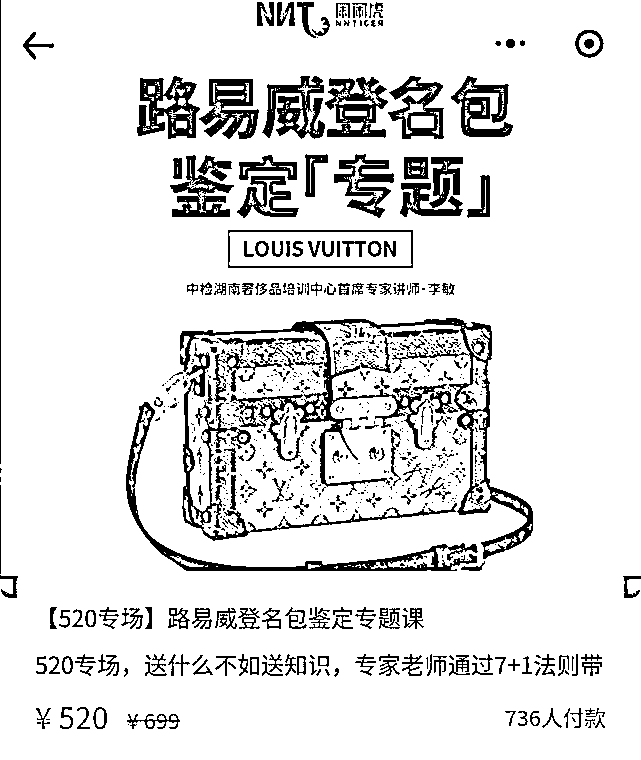

# 长沙 LV 专柜售假事件后，大批顾客前去验货

> 原文：[`mp.weixin.qq.com/s?__biz=MzIyMDYwMTk0Mw==&mid=2247536238&idx=7&sn=885927b40cdb036afe81ded03dc0a72d&chksm=97cb8556a0bc0c404e3c48e9d650f432abfc658db8f6791b114644ce88303a23dcd208880eb1&scene=27#wechat_redirect`](http://mp.weixin.qq.com/s?__biz=MzIyMDYwMTk0Mw==&mid=2247536238&idx=7&sn=885927b40cdb036afe81ded03dc0a72d&chksm=97cb8556a0bc0c404e3c48e9d650f432abfc658db8f6791b114644ce88303a23dcd208880eb1&scene=27#wechat_redirect)

长沙国金中心路易威登（LV）专柜售假？

自 5 月 19 日，

此消息一直在网上引发热议。

5 月 20 日，

针对“长沙 LV 专柜售假事件”，

路易威登公关部回应称，

其全球直营店销售的产品均为正品。

路易威登坚决否认原告指控，

**已申请再审并诉求纠正原审判决。**

**事件还原：LV“专柜售假”被判退一赔三**

2020 年 9 月 12 日，

罗小姐与男友高某一起，

在长沙市国金中心二楼 lv 专柜

购买 vaugirard 手袋一个，

价格为 18700 元，

款项由男友高某代为支付。

手袋买回以后，

罗小姐怀疑该包为假货，

并送去中国检验认证鉴定公司检验。

△图源视觉中国。图文无关。

2021 年 6 月 3 日，

**鉴定机构认为该手袋并不是 lv 公司生产。**

拿着鉴定意见，

罗小姐认为该 LV 专柜涉嫌欺诈，

她向芙蓉区人民法院提起诉讼，

请求法院判决 lv 专柜退还货款、

赔偿三倍货款同时支付律师费，

承担本案诉讼费用。

**法院认定该店作为销售者，**

**具有售假之欺诈行为，**

**应退还货款并三倍赔偿，**

最终判决 LV 专柜退还

罗小姐货款 18700 元、

赔偿三倍包款 56100 元，

驳回了罗小姐其他诉讼请求。

网友表示，

“专柜都能卖假货，

以后要去哪里买正品？”

**品牌方发布严正声明要求再审**

昨天下午，

LV 官方发布声明称：

路易威登在此重申，

**路易威登坚决否认原告指控，**

**已申请再审并诉求纠正原审判决。**

目前，

长沙国金中心 LV 门店仍在正常营业中。

****有消费者带几十个包送检****

**案件引起热议后，**

**不少长沙市民，**

**前往罗小姐鉴定的机构进行检验。**

****

**鉴定机构客服人员告诉记者，**

**5 月 20 日，**

**前来送检的消费者比平时多出不少，**

**有消费者一人带多个包前来送检，**

**“都是几十个几十个地往这边拖”。**

**“专业机构的奢侈品鉴定主要从 logo、**

**编码、金属、皮革等多方面检验，**

**包括内衬、肩带等细节也都要检查。”**

**业内人士介绍，**

**消费者选择鉴定机构时，**

**需擦亮眼睛，最好送检专业机构。**

****律师解读 LV 否认指控****

**不少网友讨论，**

**既然 LV 方坚称涉案包袋**

**不是从自己门店售出，**

**又为何在庭审判决之后**

**向罗女士转账 74800 元呢？**

**湖南万和联合律师事务所李健律师表示，**

**LV 事件引起了网友广泛讨论，**

**而事情目前正待进一步调查，**

**有可能出现反转，**

**也有可能进一步坐实。**

**这起事件对整个消费环境**

**也是一次很大的警示。**

**就法院判决和执行而言，**

**LV 向罗女士转账的行为，**

****体现了 LV 主动履行法院的生效判决，****

****但这并不代表着 LV 品牌方认可庭审结果，****

****也并不影响它申请再审。****

**“履行判决和申请再审，**

**在法律程序上说，这是两码事。”**

**来源：央视网综合长沙晚报、新京报、潇湘晨报** 

********

**← 向右滑动与灰产圈互动交流 →**

****