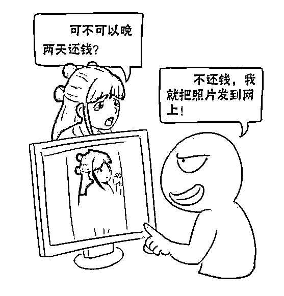
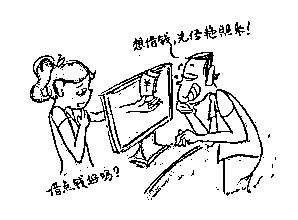
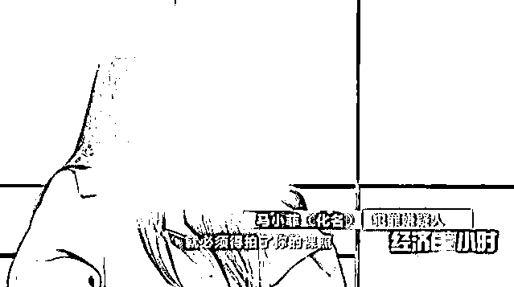

# 都 2022 年了，大学女孩们不会还在裸贷吧？

> 原文：[`mp.weixin.qq.com/s?__biz=MzIyMDYwMTk0Mw==&mid=2247536289&idx=2&sn=cfb2d8b32213587ad4afd00e8e926a28&chksm=97cb8599a0bc0c8fdc74c570edc59b97ffbc1f1c7662eeae635b68c9645cb1a7efd20eb72c10&scene=27#wechat_redirect`](http://mp.weixin.qq.com/s?__biz=MzIyMDYwMTk0Mw==&mid=2247536289&idx=2&sn=cfb2d8b32213587ad4afd00e8e926a28&chksm=97cb8599a0bc0c8fdc74c570edc59b97ffbc1f1c7662eeae635b68c9645cb1a7efd20eb72c10&scene=27#wechat_redirect)

 裸贷(裸条)是在进行借款时，以借款人手持身份证的裸体照片替代借条，当发生违约不还款时，放贷人以公开裸体照片和与借款人父母联系的手段作为要挟逼迫借款人还款。“裸贷”毁清白，丢尊严，黑暗路上再无回头路！

 [`mp.weixin.qq.com/mp/readtemplate?t=pages/video_player_tmpl&action=mpvideo&auto=0&vid=wxv_2026732446662082562`](https://mp.weixin.qq.com/mp/readtemplate?t=pages/video_player_tmpl&action=mpvideo&auto=0&vid=wxv_2026732446662082562) 

**小编****给大家深入解读**

裸贷产业链条上的重要的角色

（裸贷产业链条）

一次次的击溃借贷者的心理防线

（催债公司常见催款流程和方法）

**裸贷**这个词 

是不是感觉一听就愚不可及

**竟然会有人为了点点钱**

**去脱衣服只为贷款？**

至于吗？ 

你别不相信，还真的会有人这样做！

而且**学生**占的比例还不小呢！

可能很多人听过裸贷这个词 

但对于裸贷到底是怎么引人入坑的还不清楚

今天大 R 就来详细了解一下

**裸贷的开始**

**没钱**，是任何贷款的源头

我相信很多人，一开始根本就不想选择裸贷

只不过是想能从一些网上贷款平台贷款一些钱来用用

一开始，这些钱的金额可能都不太大

自己到期也能还上

**可能是发生了急需用钱的事情，比如看病，上学啥的**

**也可能是想需要钱来满足自己的欲望，买包买手机啥的**

 

而很多线上贷款平台

都有一个**优点**，那就是**审核门槛不高**

只要你填写自己的基本信息

比如：身份证号，姓名，电话等信息

就基本上能审核通过

但是线上贷款平台也有一个很致命的**缺点**

那就是他的**利息特别高！**

可能你一开始只是贷款了几千元

如果到期不能还款的话

利滚利的滚起来，可能就变成几万块的**巨款**

对于很多本来就没多少钱的人

几万块已经是还不上的重大压力

但如果不还，这笔钱可是不断叠加的

那如果贷款还不上了怎么办呢？ 

于是就有人想到一个点子

那就是

**不断的注册新的贷款平台**

**然后贷款出来的钱，再拿去还旧账**

但这种**拆东墙补西墙**的方式

并不会真正解决自己的债务

只会让自己陷在债务里越陷越深

在这个平台欠得越多，就得在另一个平台贷款得越多

这个坑是越填越大了

可能很多人不知道，如果欠了贷款平台的钱不还

那可是要被**催收**的

一开始可能只是电话或短信进行催收

后面还可能**到你的学校，你的家里进行催收**

仅仅在贴吧里

就找到很多“**专业催收人员”的威胁帖**

这些人，会打印一堆欠款学生的照片

在学校张贴

甚至会纠集一帮人，找到你揍一顿

还到你寝室、食堂喷油漆

甚至家里也遭殃

简直触目惊心

如果这时候**裸贷**像个救世主一样出现在你面前 

告诉你，只需要你脱光衣服，拿着身份证拍张照

就能获得低利息、高额度的贷款！

你是不是看到这个要求 

会马上拒绝 

**脱光衣服拍照这种事太难为情了**，谁会同意啊！ 

但是如果是深陷在贷款深坑立的人 

每天被催收折磨催着还钱 

他们已经没有能力去思考合法性了 

已经成了一只待宰羔羊 

只要照片一拍 

那**裸贷就在你身上成功打上印记**

普通裸贷是脱衣服加手持身份证拍照 

如果想要贷更多钱

还会要求你，脱衣服加 ZW 加手持身份证拍照 

你说，这种照片流出去，你拍不拍！

那很多人就问了

**为什么裸贷平台**

**会选择目标人群是学生呢？**

 而且很多都是**女大学生**

难道是因为学生比较单纯，比较好骗吗？ 

只能说，那是原因之一 

很多人不知道，其实会选择裸贷的人

是**不分男女，不分年龄**的 

总不可能只有女生会贷款，男生不会是吧！ 

但是很多裸贷的放贷人会发现 

很多年龄大的，大爷大妈选择了裸贷，或是男生选择裸贷

也根本就不怕照片是不是会流出去

不管是拍裸照还是手持身份证 

大爷大妈都配合 

但当要叫他们还钱的时候

他们就不理你了 

就算放贷人员威胁曝光裸照 

他们也无所谓

但如果是年轻的女生 

那就比较担心了 

所以，很多时候，**裸贷就吃准了女生面子薄**

从而成了很多女大学生的噩梦 

**裸贷之后的“色情服务”**

放贷人拿到你的裸体手持身份证只是第一步

接下来他们就会让你**完善自己的个人信息**

每让他们拿到你多一个信息

你就越难逃脱他们的手心

既然裸贷也是一种贷款方式

那就是说，**裸贷借的钱也是要还**的

如果你按时还钱也就算了

如果你还不上了

那放贷人就会开始下一步

让你**卖身还钱**了 

大家都知道 

所谓的卖身还钱是什么意思 

不只是去**KTV 里当公主，陪喝陪唱陪玩**

还可能要进行**性服务**

甚至还可能要你**卖卵赚钱**

到了这步并没有结束 

你以为你的那些裸贷资料，放贷平台会好好保管吗？ 

其实根本不会，你的资料早就挂在网上贩卖 

进行二次谋利了

看到这里 

大家也明白了

为什么放贷的人会选女大学生这个群体 

说白了就是，有市场，有利所图 

而且容易控制 

有的人一开始不过是为了自己的虚荣心

结果到最后赔上自己的清白之身 

那你们觉得，**裸贷的人值得同情吗？**

有的人说，他们丧失做人底线 

下场咎由自取 

也有人说他们也不过是受害者

只不过是被不法分子利用 

但归根结底，还是**欲望**两个字 

**裸贷的人，是为了填补金钱的欲望；**

**放贷的人，也是为了满足金钱的欲望。**

或许很多人都会为钱而愁 

但并不是每个人都会选择裸贷，走上犯罪道路 

总的来说 

金钱，取之有道，用之有方，才是正道！

## 为什么会有女生愿意去“裸贷”？

有几个原因：

①：虚荣心：进入大学了，大家都是生活在一个寝室，看着别人用苹果、买包包、自己也想得到，没钱？只能提前消费了。

②：家里条件差：有些女生是家里条件并不好，进入大学之后有些迷茫，想要彻底改变自己，家里没有钱怎么办？只能贷款了。

③：懒惰：也有好吃懒做的习惯出现，家里给生活费很快使用完，有不愿意去勤工俭学，不愿意周末出去打工做兼职，发传单啊！超市活动这些，缺钱了就去贷款了。

这些不好的生活习惯直接导致了部分女生在缺钱都时候选择了套路贷，很多人没想到，贷款难到不用还了？贷款之后的后果往往没有想清楚，甚至有人贷款一万受到三千这种情况都要去贷，只能说对自己的认知，对套路贷的认知太模糊了。 

想着一张照片没什么，看到别人有名牌包包、有好手机，不知轻重的就把自己的把柄叫给别人，到头来后悔莫及，让自己深陷其中。

来源：大 R 说安全综合中国反诈骗联盟，大 R 科普，大 R 警示，大 R 普法，网络等

← 向右滑动与灰产圈互动交流 →

