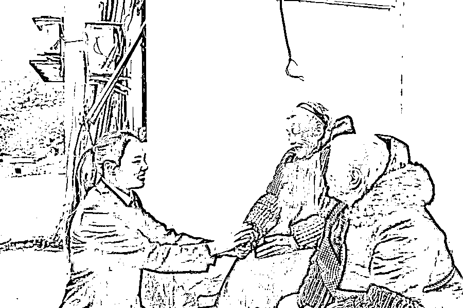
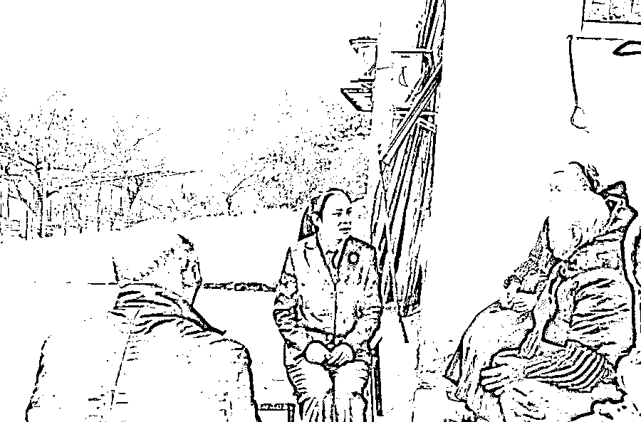
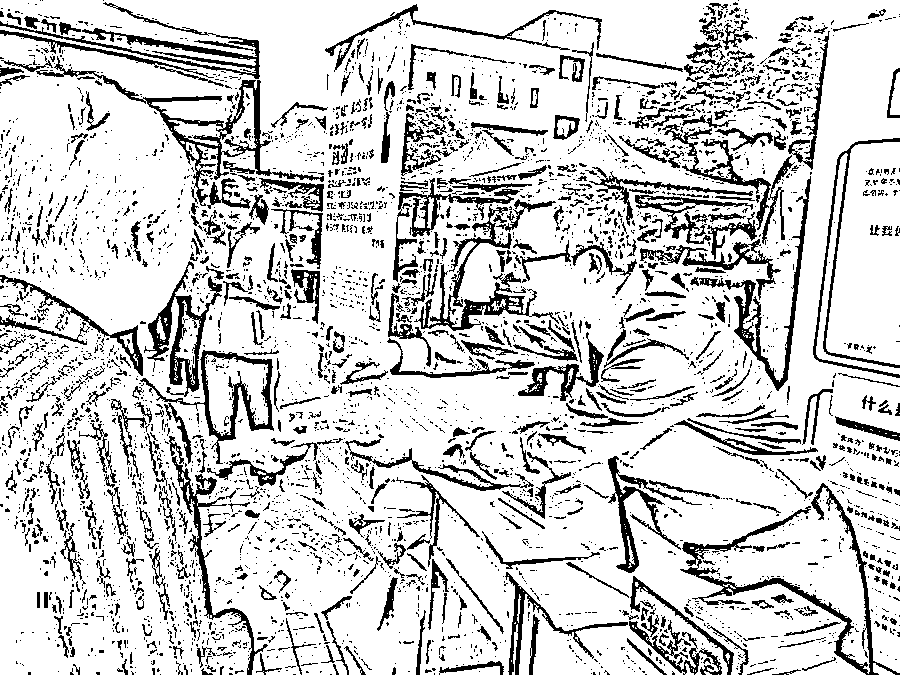

# 骗子进村，一天认了 8 个干爹干妈！

> 原文：[`mp.weixin.qq.com/s?__biz=MzIyMDYwMTk0Mw==&mid=2247536289&idx=4&sn=3c357f59349b7e01acba11ea903ae629&chksm=97cb8599a0bc0c8f0aa34f217b47bae559df6ceaa92080b537c5116316fb1cb407d87b6b0a6a&scene=27#wechat_redirect`](http://mp.weixin.qq.com/s?__biz=MzIyMDYwMTk0Mw==&mid=2247536289&idx=4&sn=3c357f59349b7e01acba11ea903ae629&chksm=97cb8599a0bc0c8f0aa34f217b47bae559df6ceaa92080b537c5116316fb1cb407d87b6b0a6a&scene=27#wechat_redirect)

近日，重庆市江津区人民检察院检察官张燕驱车 1 个小时，再次来到了当地麻沟村（化名）。几名老人看到警车，围过来和她打招呼，“闺女，你来啦。”

2019 年，张燕办理了一起诈骗案，犯罪团伙用蛋白粉冒充“包治百病”的神药高价出售，**受骗者清一色是 60 岁以上的老年人，该村的受骗情况最严重，共有 282 位老人被骗。**

两年多时间过去，这些老人过得还好吗?

# **每一个被骗的老人，都有挥之不去的孤独**

75 岁的王大爷和老伴育有 4 个孩子，都在外务工，留他们在农村居住。三儿子前年在越南修铁路时不幸去世，王大爷和老伴很少互相提起这件事。只是有时候，两人坐在院坝里，会突然沉默起来。

“这蛋白粉呀，本来是想买来治疗他的高血压的，后来发现被骗，他当场就犯了高血压。”王大爷的老伴打趣道。王大爷在一旁附和着说，“蛋白粉‘甜眯眯’的，后来我只能当成糖水喝。再说，后来钱不是又退给我们了吗。”

王大爷一家的收入，主要依靠政府每个月发放的 125 元的养老金，以及孩子们逢年过节给的孝敬钱。

因为这事儿，王大爷当时连着怄了几天气。还好孩子们没有责怪他，春节过年的时候，又默契地多孝敬了些钱给夫妇俩。王大爷最终缓过了劲儿，现在心里也没气了。

“你这算啥子哟。”一旁的陈大爷插嘴道，“骗子给我说他卖的这款蛋白粉在中央电视台 7 点整黄金时段打广告，我为了治头痛买了 500 块钱的蛋白粉，晚上从 6 点半开始就守着电视，后来《新闻联播》的音乐一起，我才想起来，7 点钟咋会放广告呢。”

陈大爷今年 67 岁，大女儿常年在广州务工，小女儿在江津城里工作。他长期一个人在家，老伴儿也在城里照顾小外孙，周末偶尔回来一趟。

“大外孙正在上大学，小外孙还在幼儿园，都是花钱多的年龄，我怎么好开口向孩子们要钱。”陈大爷种了几十棵花椒树，去年忙了三个月才采摘完，手掌上划得满是小口。花椒最后按 2 块钱一斤的价格，卖给了贩子。**老伴和两个女儿回村后，才听说自家老爷子攒下的一季“花椒钱”，被骗了个一干二净。**

一连好几周，大女儿和小女儿轮番对父亲进行“教育”，告诫他以后不要再上当受骗，最后连哄带骗把陈大爷拉进了医院做了一番检查。临走前，两个女儿还把 500 块钱悄悄地放在了陈大爷的枕头下面。

91 岁的邱婆婆也花了 1500 块钱，买了 12 桶蛋白粉。邱婆婆的精神状况很好，耳聪目明，唯独风湿这个老毛病困扰了她多年，手指和腰上最严重。用她的话说，“天晴落雨都痛”。**邱婆婆把骗子称为“大闺女”，骗子说蛋白粉对治疗风湿有奇效，邱婆婆就买了。不仅是她，邱婆婆的两个儿子也入了坑。**

邱婆婆曾生育了 6 个孩子，如今四世同堂，拍全家福时整整站了 4 排。邱婆婆的老伴在 3 年前去世，现在一个人住，自己煮一日三餐。老人家心态很好，得知被骗后竟也没怎么生气。“他们今年没有来了。”

那堆满褶皱的笑容里，有着说不出的落寞。

# **骗子一天认了 8 个“干爹”“干妈”**

****

谈起被骗时的情景，老人们记忆犹新。

2019 年 10 月 10 日，田里的农活已经忙完了，王大爷跟妻子悠闲地躺在大门口的摇椅上。有两个陌生人找到他，说要在村里开超市，想用 50 元一天的价格租下院坝做开业宣传。

王大爷为人和善，从没跟人吵过架。虽然并不认识，但他还是回屋端出板凳和茶水招呼客人。王大爷的身体不好，患有严重的高血压，不能干太重的农活。坝子闲着也是闲着，他与老伴商量了一下，决定租给他们。

隔天一大早，王大爷发现自家院坝支起了一个简易的大棚和舞台，摆满牙刷、纸巾、电饭煲等物品。听了游行车“免费送礼品”的吆喝，村里的老人半信半疑地来到现场。到场的都如愿拿到了一包纸巾，老人们个个喜出望外。

所谓的“工作人员”有 3 个人，中等年纪。王大爷回忆，他们都非常能说会道，“大爷大妈”“老辈子”招呼个不停，一个劲儿地把小礼品往老人手里塞，还跟大家摆龙门阵（扯家常），哄得老人们非常开心。这一天，“工作人员”小芬（化名）认了 8 个“干爹”“干妈”。

他们的话术几乎如出一辙——**公司“王总”即将在村里开超市，他是个精明又仗义的生意人，为给乡亲们送福利，所以安排他们进村开展“有买有送”活动。**

“有买就有送！”但具体送什么，怎么问他们也不肯明说。

有位老人选了一瓶食用油和一包盐，付了 18 块钱。“工作人员”将东西打包好之后，当即把 18 块原封不动地返还给了老人。原来“有买有送”就是不要钱，这让老人们顿时“恍然大悟”。

“免费”的名头对老人有很大的诱惑，第二天，来到现场的老人比更多了。王大爷惊奇地发现，瘫痪多年的二叔坐着轮椅也来了。

**“今天我们王总来了，给老辈子们带来了好产品，你们就瞧好吧。”**“工作人员”们笑脸盈盈。伴着一阵喧闹的音乐声，自称是超市老板的“王总”穿着一身西装，踩着点走上了舞台。

“我进村的时候，在路边看到一个儿子殴打他的老父亲，老爷子头发都全白了，不孝子打老汉（方言，指父亲）要天打雷劈的。我马上下车跟他儿子讲道理，他起初是油盐不进，后来把话总算是听进去了。我走的时候给了几百块钱，把老爷子感动得不行。人生在世谁又没个难处……”“王总”拿着话筒，声情并茂地讲述着。

“王总”说，他也是这个村子里的人，小时候家里十分困难，幸好他的恩师一直帮助他。讲到这里时，他的声音哽咽了，眼眶微润。台下有老人欣慰地点点头。

“没有我的恩师就没有我的今天，过几天我恩师过生日，我带老辈子们都去吃酒，不交份子钱，纯粹地为我恩师添福贺寿！”“王总”一番话说得激情昂扬，老人们在台下纷纷鼓掌叫好。

有孝心、热心肠、生意成功、知恩图报——一个完美人设就这样立了起来。

紧接着，“王总”话风一转，向大家隆重推荐一款“骆驼牌”蛋白粉产品。“这个蛋白粉能治高血压、风湿病、脑血栓、前列腺炎、糖尿病等各种病症，非常出名，连脑瘫都可以治！”

“只有花 10 块钱买了预订卡的人，明天才有资格买蛋白粉，这 10 块钱明天也会退还给大家，这么做只是为了考验大家的诚意。”他一再强调，让老人们把钱都带上。

对这个“王总”，老人们有着说不清道不明的亲切感。**“他说明天能退款就肯定能退款，摆明了想给大家免费发蛋白粉。”1 个，2 个，3 个……老人们纷纷买了预订卡。**

第三天，“工作人员”果然把 10 块钱退给了老人。

“原价 385 元一桶的蛋白粉，今天 500 元两桶卖给大家，先到先得。大家记住是‘有买有送’，我们明天还在这里等着大家！”工作人员拿着大喇叭不停地吆喝。

老人们拿着钱涌上前，争先恐后地交钱。有的老人买了 6 桶，有的老人买了 2 桶。

然而，“工作人员”没有当即把钱立刻退还给他们。“我当时还想，没关系，明天他们还会来，那天实在太忙了。”邱婆婆说。

**隔天，老人们又早早地来到院坝，现场人去“棚”空。迎接他们的只有未来得及收拾的大棚，和一脸懵圈的王大爷夫妇。**

# **如何避免“骗了这村骗那村”？**

“就算他们不退钱也没关系，蛋白粉这么神奇，能治好我的病就好。”即便如此，怀着这种想法的老人也不少。

但残酷的事实是，**“王总”口中所谓价值 500 元的“骆驼”牌蛋白粉，每罐成本不足 10 元。**

“他们都是彻头彻尾的骗子！”老人们获悉真相，源于隔壁村的“东窗事发”。诈骗团伙潜入隔壁村，“如法炮制”了一场蛋白粉骗局。一个寡居老太太为治病买了一堆蛋白粉，儿子知道后立刻报警，老太太一时气急攻心差点中风。

消息在麻沟村很快传开，老人们这才知道，**“包治百病”的蛋白粉根本没有一丁点用。**

经查，2019 年 1 月至 12 月，犯罪嫌疑人汤某、杨某等 12 人先后前往重庆市江津区、永川区，四川省泸州市，贵州省赤水市等地的农村地区，以将在当地新开大型超市的名义吸引空巢老人聚集，参与免费赠送礼品活动，并以多次售卖商品后退款的行为，给老人强烈的“购物即返款”心理暗示进行诈骗。

**“汤某等人将成本极低的蛋白粉包装成‘神药’，高价‘卖’给被害人后携款逃离，该案仅江津区就涉及 16 个村，被骗人数多达 300 余人。”**张燕介绍。

瞄准外出务工多、青壮年人少的偏远农村，犯罪团伙流窜作案，被骗者人数多且分布广——据检察官分析，**空巢老人屡屡被骗的背后，有骗术狡猾、病急乱投医、缺乏子女陪伴三个不同层次的原因。**

据介绍，汤某等人的诈骗模式可分成“前棚”“后棚”两个阶段。“前棚”为 1 至 2 天的预备阶段，用免费发放小礼品和先购物再退款等方式，吸引老人到场参与活动，给人以强烈的“购物即退款”的心理暗示。“后棚”为 1 至 2 天的实施阶段，团伙成员假扮超市老板现身，虚假夸大蛋白粉的功效及价格，并借助购卡筛选对象实施精准诈骗。

**“诈骗团伙的目标明确，专门针对农村的空巢老人。”**张燕说，这些老人们年纪较大，绝大多数不与后辈同居，外界信息接收渠道单一，防骗意识较差。再加上老年人上当受骗后应对能力差，很少采用报警等手段维权，“如果不是有子女果断报警，恐怕还会有更多老人上当受骗”。

张燕还介绍，“实际上，遇上有子女带着父母来‘闹’的，该团伙会选择悄悄将其拉到一旁退款了事，这也是该案迟迟未‘暴雷’的原因之一。”

与此同时，该类犯罪追赃挽损也存在困难，让很多老年人“血本无归”。到案后，犯罪嫌疑人仍以“有买有送并不是承诺退款”“不过就是利润高而已”等理由百般狡辩，既拒不承认犯罪事实，又拒不承认退还被骗人损失。经检察官反复释法说理，部分嫌疑人认罪认罚，并根据其指认退还相关被害人 9 万余元，约占全部犯罪金额的一半。

法网恢恢，疏而不漏。2020 年 9 月 10 日，经江津区检察院提起公诉，**汤某等 12 人因犯诈骗罪被依法判处有期****徒刑六个月至六年不等，并处罚金五千元至四万元不等。**

“一边是套路繁多、花样翻新的诈骗名目，一边是身处信息孤岛的农村老年群体，这堪称犯罪领域的‘降维打击’。”重庆市检察院相关负责人表示。

他介绍，当前农村地区诈骗犯罪主要呈现诈骗对象主要针对老人妇女，诈骗方法主要利用知识缺乏，诈骗类型主要采取团伙犯罪，诈骗形式主要选择流窜作案四个主要特征。“现在，即使是偏远农村生活，空巢老人的经济条件也普遍好了，过去城里常见的‘保健品’诈骗，在农村也越来越常见。”

一项数据表明，重庆市 60 岁以上老年人达 721 万，占总人口 21%，人口老龄化率居全国第六位。而对中西部外出务工省份来说，如何在广大农村老年人面前设置一道“防骗墙”，建立反诈骗快速反应、联防联控机制，这是一项亟待解决的基层社会治理难题。

“事后打击不如事先防范”，重庆市江津区人民检察院将宣传预警放在全民反诈的最前线，与当地镇政府、公安机关达成共识共建反诈骗普法宣传。2021 年以来，“莎姐”检察官深入留守老人数量较多的农村、城镇地区，将法治课堂开到村社，开展“送法活动”10 余次，覆盖 3 千余人次，有效降低受骗的概率。

“这次回访发现，随着当地镇政府尤其是公安机关反诈骗普法宣传的持续加强，老百姓防骗意识大为增强，再加上疫情防控的原因，近一年来连商品推销的都很少见到。”张燕说。

不仅是“走穴卖保健品”，忽悠老人的骗术层出不穷。张燕说，近年来电信网络诈骗呈现出高发趋势，**在投资养老项目、“民族资产解冻”、网络链接病毒等新型诈骗面前，老年人普遍防范意识弱，很容易上当受骗。**

5 月 7 日，全国打击整治养老诈骗专项行动办公室召开全国专项行动推进会，通报各地打击整治养老诈骗专项行动部署启动和宣传发动情况，分析专项行动遇到的新情况新问题，部署打击整治环节的阶段性目标任务，推动全国专项行动依法有力有序开展。会议强调，要坚决铲除养老诈骗问题隐患，坚持宣传教育、依法打击、整治规范“三箭齐发”，依法严惩养老诈骗违法犯罪，延伸治理侵害老年人合法权益的涉诈乱象问题，为广大老年人安享幸福晚年营造良好社会环境。

接下来，重庆市公检法等各单位还将继续全力投身开展“反诈防骗”法治宣传活动，着力打造防诈“金钟罩”，筑牢全民反诈“防火墙”。

来源：重庆长安网，长安剑

← 向右滑动与灰产圈互动交流 →

