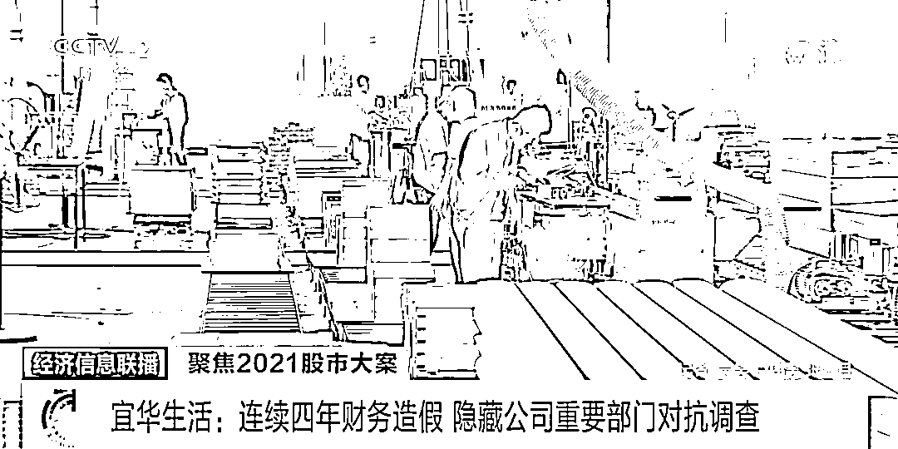
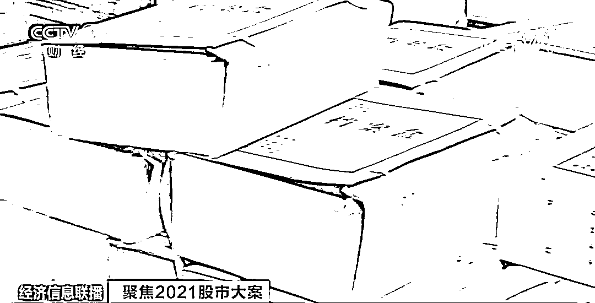
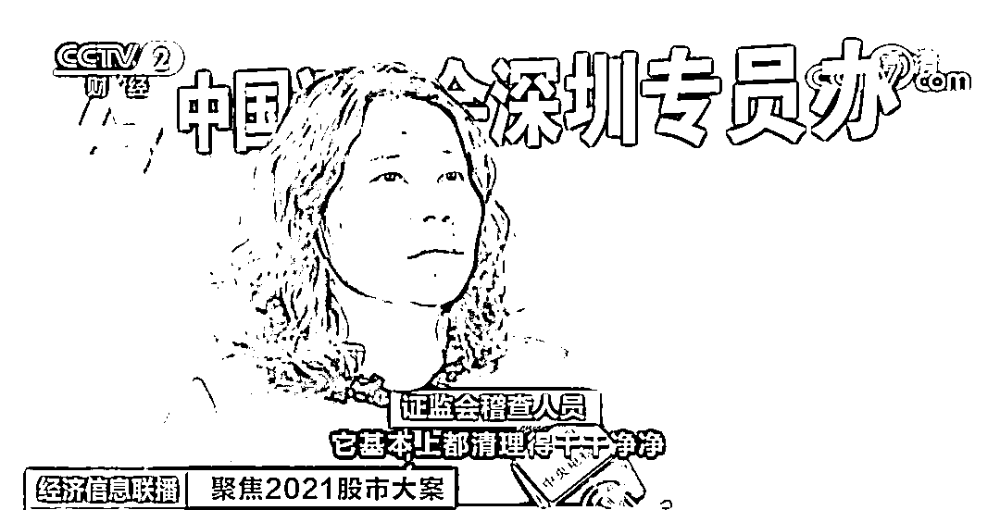
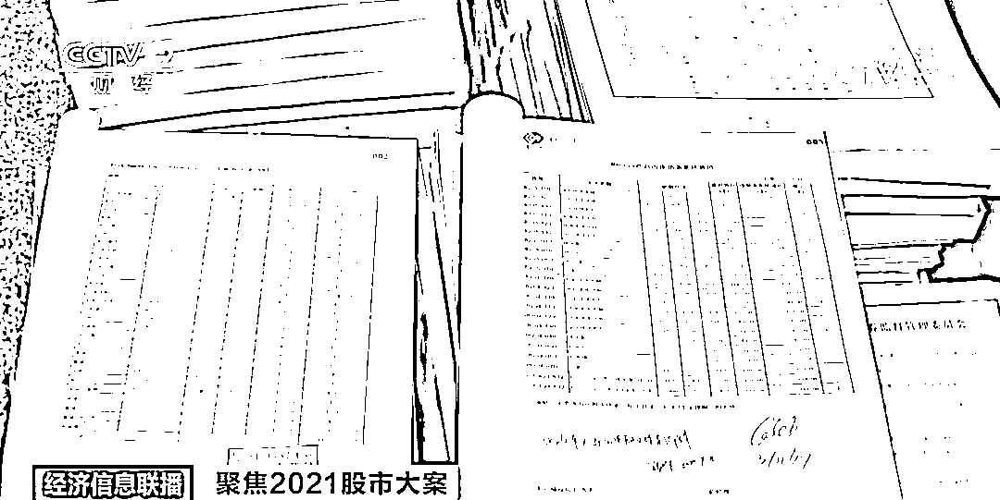
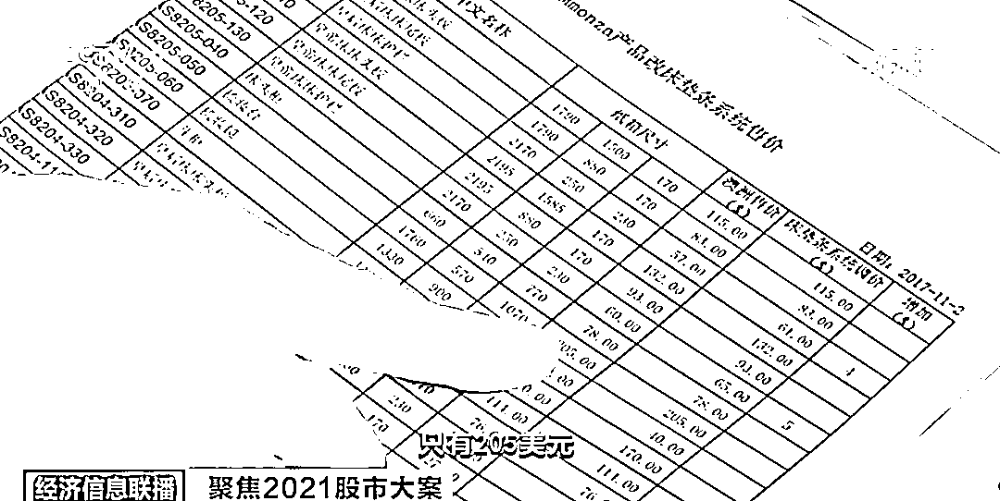
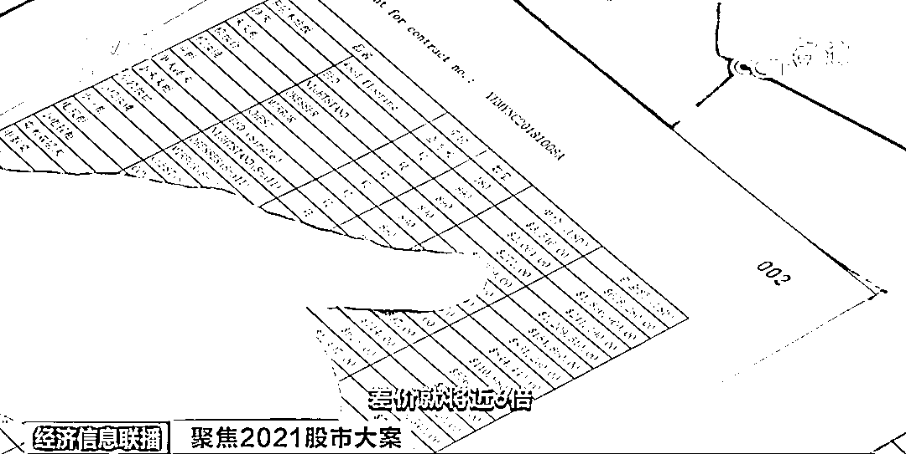
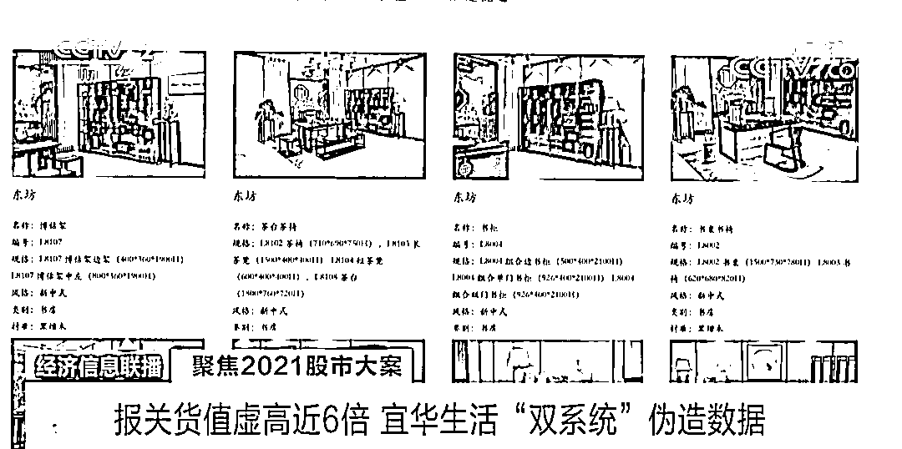
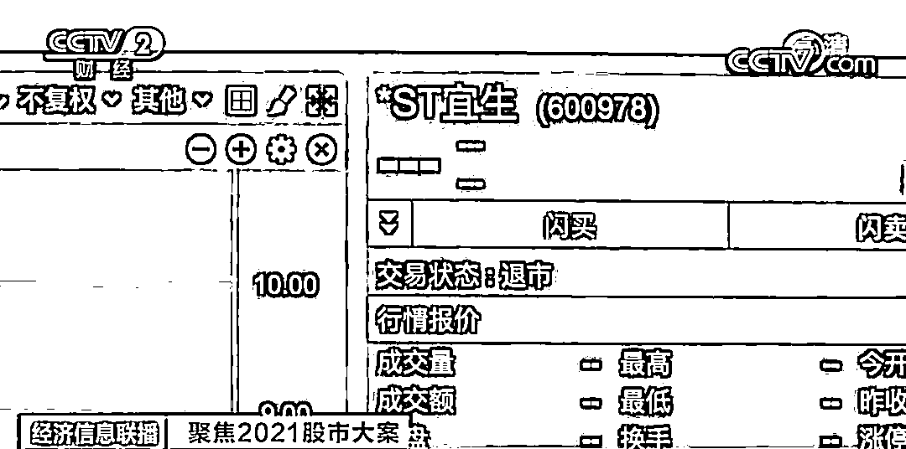

# 惊人大案！手段曝光！

> 原文：[`mp.weixin.qq.com/s?__biz=MzIyMDYwMTk0Mw==&mid=2247536289&idx=6&sn=0ae7b2d2fe05a0e96af0960f4c13a199&chksm=97cb8599a0bc0c8fc07a0cf3c34a1d31fd1ab998079eba8fcbff0cee15c732b38924ff44ba06&scene=27#wechat_redirect`](http://mp.weixin.qq.com/s?__biz=MzIyMDYwMTk0Mw==&mid=2247536289&idx=6&sn=0ae7b2d2fe05a0e96af0960f4c13a199&chksm=97cb8599a0bc0c8fc07a0cf3c34a1d31fd1ab998079eba8fcbff0cee15c732b38924ff44ba06&scene=27#wechat_redirect)

近日，证监会公布 2021 年证监稽查 20 起典型违法案例，其中家居企业“宜华生活”信息披露违法违规案，是一起实际控制人指使上市公司实施财务造假的典型案件。**在 2016 年至 2019 年期间，“宜华生活”通过虚构销售业务等方式，累计虚增收入 71 亿元。**

 ****宜华生活是通过哪些手段来编织财务谎言？为了对抗证监会的调查，它又耍了哪些花招？****

******宜华生活：连续四年财务造假 隐藏公司重要部门对抗调查******

 ****[`mp.weixin.qq.com/mp/readtemplate?t=pages/video_player_tmpl&action=mpvideo&auto=0&vid=wxv_2406913856389480449`](https://mp.weixin.qq.com/mp/readtemplate?t=pages/video_player_tmpl&action=mpvideo&auto=0&vid=wxv_2406913856389480449)**** 

****△央视财经《经济信息联播》栏目视频**** 

****公开资料显示，宜华生活主营业务为家具和木地板等家居产品的设计、生产与销售，其中产品外销占比高达 70%以上。2019 年 4 月 27 日，宜华生活发布了 2018 年年度报告，在报告期末，宜华生活货币资金余额为 33.89 亿元，长期借款、短期借款、应付债券余额合计为 52.56 亿元，报告期内财务费用 4.47 亿元，占归母净利润的 115.50%。**一边账面上躺着数十亿元货币资金，一边为融资支付高额利息，宜华生活异常的财务数据，引起了监管部门的注意。**2020 年 4 月，证监会依法对宜华生活涉嫌信息披露违法违规立案调查。**** 

********

****证监会稽查人员告诉记者，宜华生活有六大生产基地，合并报表的子公司一共有 47 家，为了寻找线索，他们需要将所有公司的财务凭证都调到公司现场来。虽然稽查人员心里早有预期，但面对当时会议室堆积如山的财务凭证仍感到了压力。**** 

********

****要从浩如烟海的财务凭证中找到公司财务造假的证据实属不易，更让稽查人员感到棘手的是，虽然公司明面十分配合调查工作，但是实际上却在暗地里对抗。宜华生活提供的所有和境外客户签订的合同，都只有一个框架协议，不提供基础交易资料，公司整个外销流程不透明，**而稽查人员想要问询的核心员工或者高管，不是离职就是联系不上，甚至公司整个进出口部门消失了。****** 

********

******证监会稽查人员**：我们去的时候，财务部，特别是进出口部，基本上都清理得干干净净，电脑都没有，只有一叠很薄的框架合同，作为业务资料留在那里供我们检查。公司为了规避调查，把正常的进出口部，这些业务部门的工作人员，全部隐匿到条件比较差的生产车间的临时办公室，不让主要的业务人员跟调查人员接触。**** 

******报关货值虚高近 6 倍 宜华生活“双系统”伪造数据******

 ****[`mp.weixin.qq.com/mp/readtemplate?t=pages/video_player_tmpl&action=mpvideo&auto=0&vid=wxv_2406913576495185925`](https://mp.weixin.qq.com/mp/readtemplate?t=pages/video_player_tmpl&action=mpvideo&auto=0&vid=wxv_2406913576495185925)**** 

****△央视财经《经济信息联播》栏目视频**** 

****证监会稽查人员告诉记者，以往他们查的财务造假案一般是假出口，它没有真正的出口和报关，因此整套数据都是假的。然而宜华生活是真出口、真报关，但是报关价格虚高、货值虚高，以此来虚增企业营收和利润。因此要想找到该公司造假的强有力证据，获取到它和境外客户真实的报价合同尤为关键。****

 ****从表面上来看，宜华生活提供给证监会稽查人员查阅的框架协议，无论是报关单价还是总额，和海关数据都是一致的，它的财务数据跟这些框架协议也相吻合，然而**在调查中稽查人员发现，公司竟然暗地里运行着另外一套生产业务系统，每次稽查人员进场，他们就偷偷把这套系统电源给拔了。******

********

******通过两个完全独立的生产业务系统，宜华生活分别做出了两套数据，一套数据货值虚高，用于报关，另外一套数据则是跟境外客户对账的真实数据。**最终，调查组找到了公司出口货物真实价格的相关证据，包括报价、英文发票、装箱单等货运凭证，以及对账、催款明细等。**** 

********

********

******证监会稽查人员**：有一个实例给大家看。这一本是它的真实报价记录，这一本是它的出口报关记录。这个梳妆台的真实报价，只有 205 美元，但是在出口报关的时候，梳妆台报价高达 1359 美元，差价将近 6 倍。****

 ********宜华生活真实交易资料的查获，为案件的调查打开了一扇大门，为了进一步夯实证据，稽查人员同时申请了跨境执法合作，请境外的监管部门协查一些境外客户的具体情况，从后续协查反馈回来的数据来看，宜华生活财务造假铁证如山。为了具体计算出宜华生活各个年度外销的虚假数据，证监会稽查人员更是将该公司从 2016 年到 2019 年，整个出口的 12000 多个集装箱号码，都进行了一一核对。******** 

****************

**********证监会稽查人员**：宜华生活系统性长期造假，违法金额特别巨大，性质也比较恶劣。因为它的 2019 年年报是在 2020 年的 4 月份公布的，适用了新的证券法，对它进行了处罚，**对公司罚款 600 万元。 **********

**********在全面推行注册制改革的背景下，随着证券法的实施，资本市场的监管制度与退市制度进一步完善，宜华生活财务造假案，成为首批适用新证券法惩处的恶性案件。去年 3 月 22 日，由于收盘价格连续 20 个交易日低于 1 元，宜华生活被上海证券交易所摘牌，正式退出 A 股市场，它也由此成为退市新规下的首批“1 元退市股”之一。********** 

********************

************证监会稽查人员：**新证券法的威力在这个案子里得到了充分体现。首先是新证券法赋予了我们更多的相应执法权限。此外，在相应后续的处罚里，新证券法提高了违法成本。给上市公司的警示主要体现在，首先上市公司必须完善自己的公司治理，其次就是需要遵规守法地经营，不能轻易突破底线，否则就只能自食其果。**********

**********来源：潇湘晨报，央视新闻**********

****************************************

**********← 向右滑动与灰产圈互动交流 →**********

********************