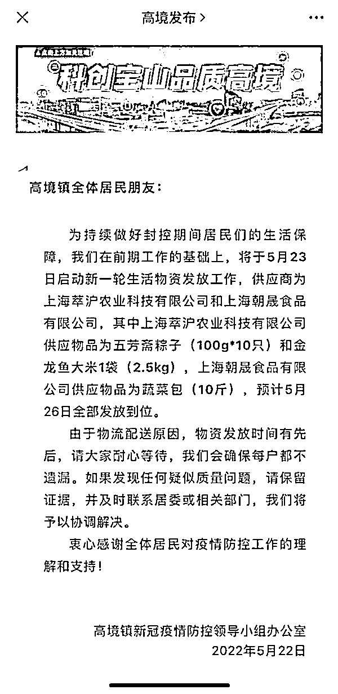
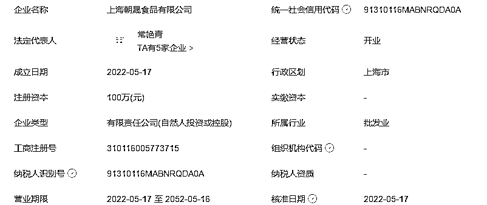
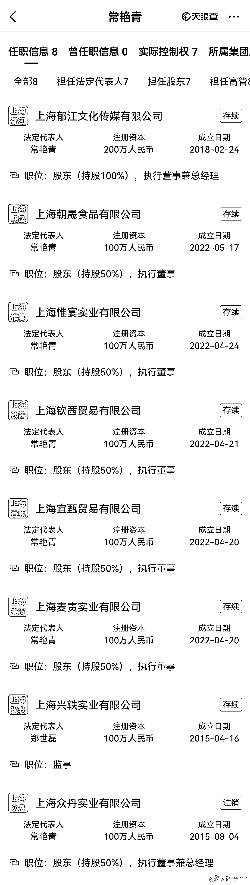
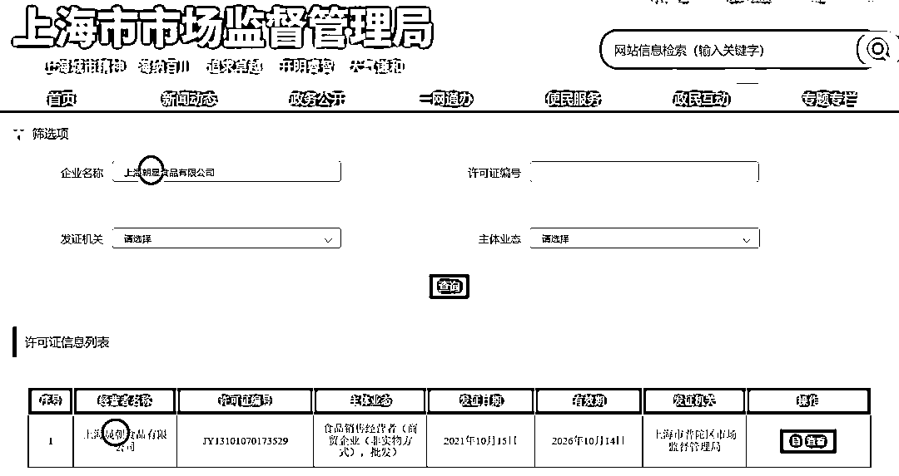
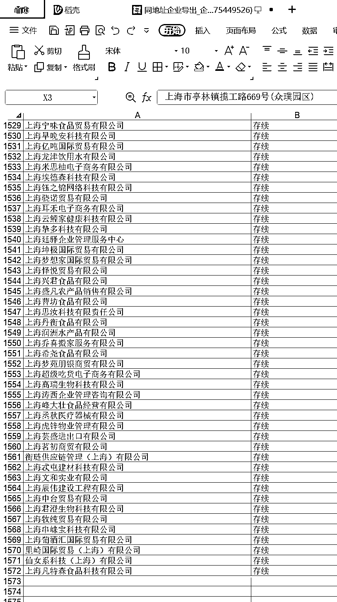
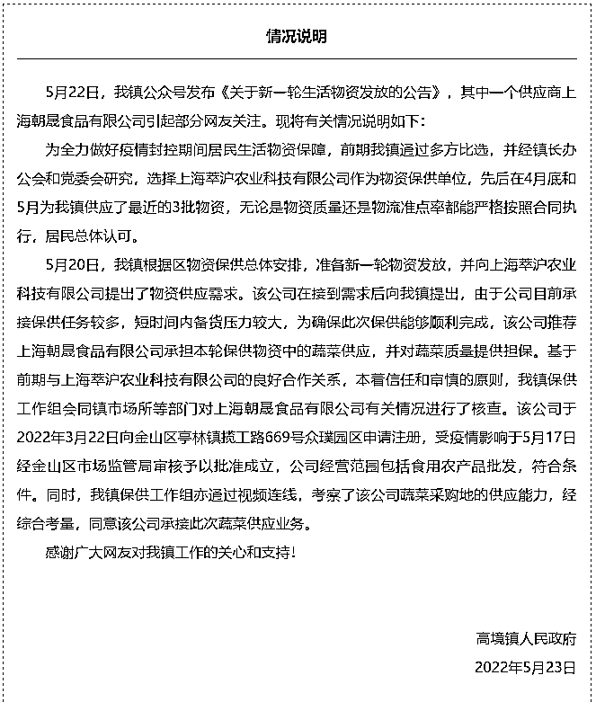

# 疫情中的暖心故事：成立五天的公司为上海市民保供

> 原文：[`mp.weixin.qq.com/s?__biz=MzIyMDYwMTk0Mw==&mid=2247536364&idx=1&sn=c597f63263db63ea0ac697c5e15c9f0f&chksm=97cb85d4a0bc0cc2c986e757489c4c71776bc1752de98ed50f9a3a3db636a7d42ea7088c32b8&scene=27#wechat_redirect`](http://mp.weixin.qq.com/s?__biz=MzIyMDYwMTk0Mw==&mid=2247536364&idx=1&sn=c597f63263db63ea0ac697c5e15c9f0f&chksm=97cb85d4a0bc0cc2c986e757489c4c71776bc1752de98ed50f9a3a3db636a7d42ea7088c32b8&scene=27#wechat_redirect)

图源：电影《九品芝麻官》

在 99%的人不思进取的待在家里不去上班的时候，这些努力的人发财真是太合理了。

这几天，上海居民都在寻找两位名叫常艳青和郑世磊的高人。

估计是想当面感谢他们。

因为他们旗下一家名为“上海朝晟食品有限公司”的企业，在成立短短 5 天的时间里便进入到了保供名单，获准参与保供物资的发放，为上海防疫做出积极贡献。

上海宝山区高境镇新冠疫情防控领导小组办公室 2022 年 5 月 22 日官方消息称：为持续做好封控期间居民们的生活保障，将于 5 月 23 日启动新一轮生活物资发放工作，**供应商为上海萃沪农业科技有限公司和上海朝晟食品有限公司**，其中上海萃沪农业科技有限公司供应物品为五芳斋粽子（100g*10 只）和金龙鱼大米 1 袋（2.5kg），上海朝晟食品有限公司供应物品为蔬菜包（10 斤），预计 5 月 26 日全部发放到位。

根据天眼查信息显示，上海朝晟食品有限公司成立于 2022 年 5 月 17 日，注册资本 100 万元，实缴资本和参保人数均未公布，上海朝晟食品有限公司股东为郑世磊占股 50%，常艳青占股 50%。

**5 月 17 日成立，5 月 22 日上午就被公布拿下了订单。**

很显然，不可能是 5 月 22 日进行的招标。

**也就是说，在成立 5 天的时间里，上海朝晟食品有限公司，就成为了高境镇的保供单位。**

这速度估计让阿里、京东、盒马都纳闷了，一家成立 5 天的小公司，让这些大资本都不得不服……

神奇的是，法人常艳青名下的企业，从 4 月 20 日开始，迅速地注册了 5 家公司。

我们都知道 4 月上海大家都停工了，上海的市场监督管理局还在加班加点批执照，多么感人。

一般来说，食品经营许可证需要经过申请、查验、现场核验等几道程序，通常自受理的 20 天内会进行现场核查，若受理遇到特殊情况，可以延长 10 天。

受理成功后，企业便可在 10 天之内领证。

**整个过程，几乎不可能在短短几天之内完成。**

**更别说，上海在疫情期间到处封控。**

上海朝晟食品公司显然实力雄厚，把不可能变为可能。

但尴尬的是，目前没有在上海市市场监督管理局的官网查到上海朝晟食品相关许可证。

相反，一家与上海朝晟食品公司名字极为相似的“上海晟朝食品有限公司”拥有上海普陀区市监局发放的食品经营许可证。

从注册地址看，这家公司貌似也不太靠谱。

资料显示，上海朝晟食品的注册地址为“上海市亭林镇揽工路 669 号（众璞园区）”，这是一个集群地址。

包括上海朝晟食品在内，一共有超过 1500 家公司在这同一个地址上注册。

**综上，保供单位上海朝晟食品目前还处于皮包公司状态。**

宝山区高境镇下辖 28 个社区，2021 年 10 月统计常住人口近 16 万人。

我就真的挺好奇的，上海搞食品的公司成千上万，如此大额订单怎么就选中了朝晟了呢？

这个公司有什么过人之处？

更重要的一点是，5 月 17 日才成立的公司，在短短的几天时间内，你们又是怎么知道的？

**正常的物流快递商超不用，把人限死，只能用什么保供公司，不得不佩服上海有些人寻租的心眼这叫一个多。**

**突然又觉得这是疫情中的暖心故事：**

**在 99%的人不思进取的待在家里不去上班的时候，这些努力的人发财真是太合理了。**

有记者联系到上海朝晟食品有限公司的股东之一常艳青女士，于是就有了如下采访。

记者：公司相关手续是否齐全？

常女士：公司所有的手续都是合规、齐全的。

记者：至于为何会突然注册一家食品公司？

**常女士：自己原本就是出于好意，想为保供做点贡献。但没想到，竟因此受到质疑，让我十分困扰。**

记者：怎么这么快就能申请成供应商？

常女士：朋友推荐。

有朋友给高靖镇提供过保供物资，在镇里再次找到他时。由于他忙不过来，就将常女士推荐了过去。

真是高风亮节。 

5 月 23 日 13:25，“高境发布”微信公众号发布情况说明。

说明称，上海朝晟食品有限公司是由原保供单位上海萃沪农业科技有限公司推荐。

我有个朋友猜测是不是有一种可能：

**搞定某些关节的重要人物，突击注册公司，快速进入保供，拿下采购单子，然后大家数钱……**

**看到这，我只能羡慕地说句：恭喜发财。** 

来源：昌南大队长

← 向右滑动与灰产圈互动交流 →

