# 谭副院长“流氓短信”事件的全景分析

> 原文：[`mp.weixin.qq.com/s?__biz=MzIyMDYwMTk0Mw==&mid=2247536364&idx=2&sn=5d44c06bd37cf3c0826dfe2803bedf91&chksm=97cb85d4a0bc0cc2143fdf490104d53607ee35244431bc09629ecee3df6a155ced379191e162&scene=27#wechat_redirect`](http://mp.weixin.qq.com/s?__biz=MzIyMDYwMTk0Mw==&mid=2247536364&idx=2&sn=5d44c06bd37cf3c0826dfe2803bedf91&chksm=97cb85d4a0bc0cc2143fdf490104d53607ee35244431bc09629ecee3df6a155ced379191e162&scene=27#wechat_redirect)

郑州轻工业大学一下子火了。这所始建于 1977 年，当时隶属于国家轻工业部（名为郑州轻工业学院），2011 年与国家烟草局共建、2018 年更改为现校名、在河南省高校综合实力排名前十的河南省特色骨干大学，一夜间被一个叫谭俊超的常务副院长带火了。

5 月 19 日 23:36，正是子夜时分，在一个有着 173 名成员的郑州轻工业大学三实书院工作群里，常务副院长谭俊超突然发了一条劲爆香艳的信息： 

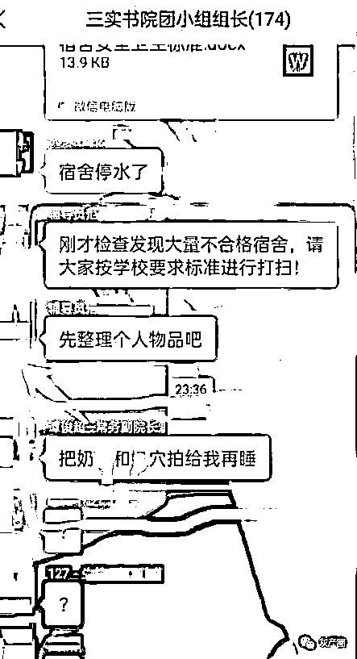

关于谭院长想看的那四个字的内容，因为大家在转发时打的马赛克的位置不同，于是引发网友许多想象。 

有的马赛克是这样打的： 

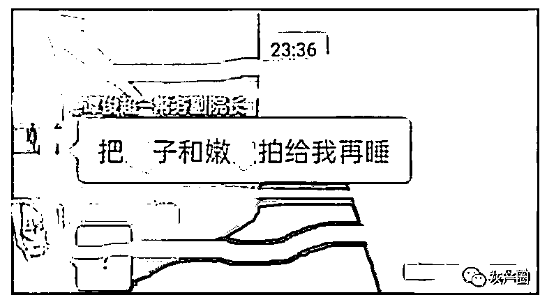

网友说这是果子和嫩叶，也有说这是儿子和嫩手。当然，这是后话。 

话说谭俊超发过信息后，群友们顿时一脸懵逼，列队打出“？”。

也许是收到了私信提醒，谭俊超也懵逼了，想把信息撤回来，但就是差那么几秒钟的功夫，信息已经撤不回了。

谭院长毕竟是见过大世面的人，见信息已经撤不回来，立马在群里做出说明：被盗号了！ 

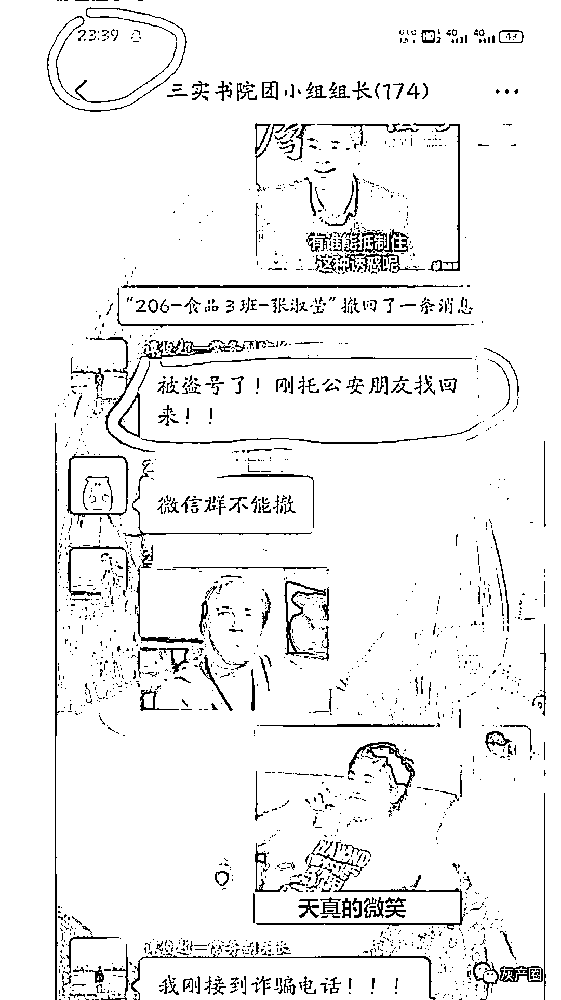

谭院长进而解释：刚接到诈骗电话，微信被黑了。 

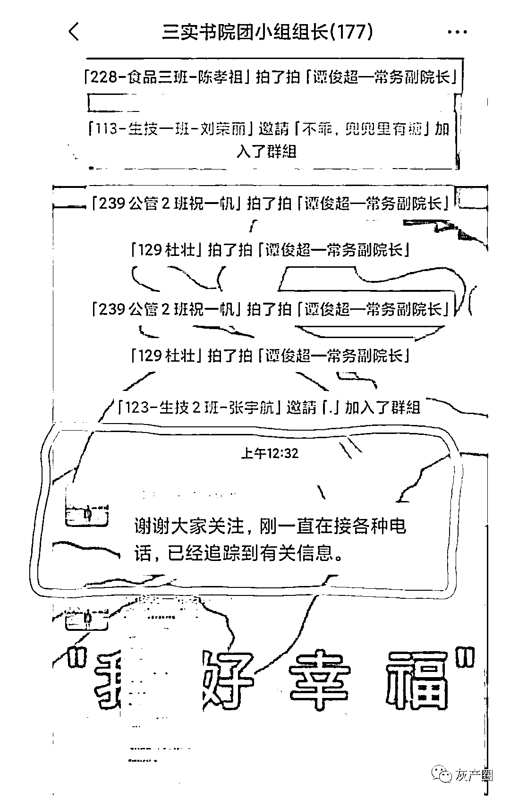

乖乖，两句话 6 个感叹号。眼看已经是半夜快 1 点了，谭俊超还在群里解释着。群友们那叫一个大写的“服”。

这个事情连夜就被传到了网上。

5 月 20 日上午，谭院长的贴心家奴——体育学院党政办负责人接受媒体采访时这样为主子辟谣：确实微信号被盗，正在“补救”。

微信号这么容易被盗，还能放心使用嘛。腾讯不背这个锅，发了一则声明：经我方(腾讯微信团队)查证，该教师账号近期登陆 IP 与登陆设备无变化，其微信账号不存在被盗情况。

腾讯方面表示，将对虚构事实者保留追究法律责任的权利。

实在编、瞒不下去了，21 日 下午，郑州轻工业大学发布了一则《情况通报》。 

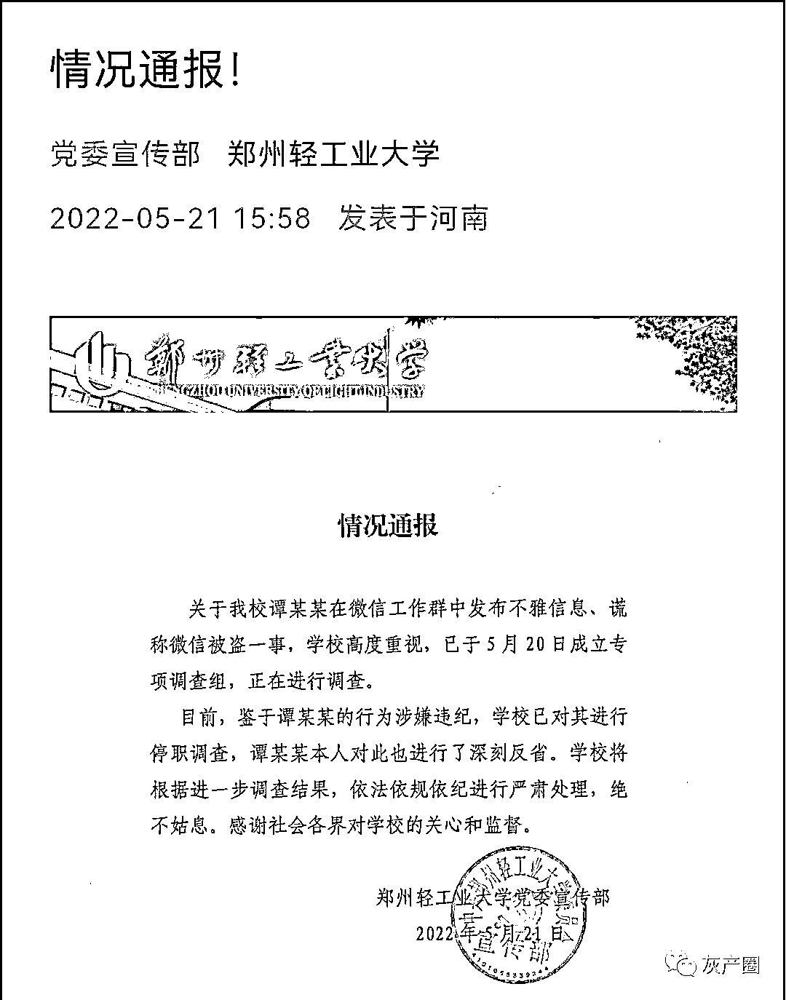

声明明确了四点： 

1、谭俊超在微信工作群发布了不雅信息； 

2.谎称微信被盗；

3.涉嫌违纪、停职调查；

4\. 会依法依规依纪严肃处理；

5.感谢各界监督。

 既然愿意接受各界监督，就提醒几点：

**1.声明说，谭俊超对此进行了深刻反省，这个结论为时过早!**

当夜，谭俊超在发现错发信息后，谎称微信号被盗，这是典型的将错就错。此乃第一错。

次日接受媒体采访时，谭俊超说上述露骨短信是发给其妻的。这是在哄二傻子吗？有了前面的公然撒谎，这一说法十有八九也是在撒谎。此乃第二错。 

既然调查了，是不是深究一下，谭院长是不是撒谎成性？ 

**2.谭院长的露骨短信是发给老师的，还是发给学生的，是不是惯犯？**

**3.对满嘴谎话的体育学院党政办负责人是不是也应该一并调查处理了？**

谭俊超是谁。

有说是郑州轻工业大学体育学院常委副院长的，有说副校长的。三实书院微信群里的备注名单里，谭俊超的职务：常务副院长。因此，这个常务副院长，应该是三实书院的职务。

宾曰语云检索郑州轻工业大学官网后发现，谭俊超的官方职务是： 

**1.郑州轻工业大学体育学院党总支副书记。**

2020 年 9 月 14 日下午，体育学院在学院专业阅览室组织召开党总支理论学习中心组（扩大）学习会，专题学习典型案例，深化以案促改。会议由党总支副书记谭俊超主持。

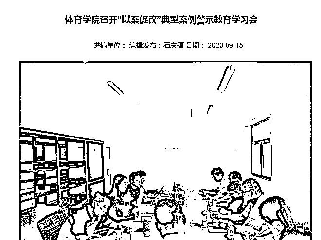

 2021 年 3 月 25 日下午，体育学院在科学校区体育馆会议室召开党史学习教育动员会。会上，学院党总支副书记谭俊超领学了《中共郑州轻工业大学委员会关于开展党史学习教育的实施方案》。 

2021 年 4 月 27 日中午，体育学院在学生活动中心 125 室召开了心理健康工作会议，会议由学院党总支副书记谭俊超主持。 

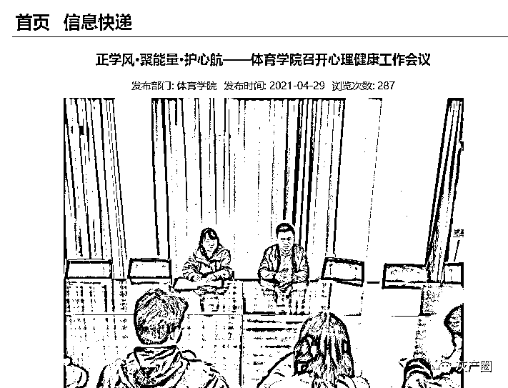

**2.三实书院常务副院长。**

2021 年 11 月 24 日上午，三实书院在体育馆音乐厅举办《郑州轻工业大学学生国际交流现状与展望》专题讲座，三实书院常务副院长谭俊超参加了此次讲座。

此外，谭俊超还担任过河南省整治“帮圈文化”专项排查工作郑州轻工业大学的联系人、郑州轻工业大学党委第三巡察工作组成员、学生资助领导小组成员、体育学院校友工作队伍分管领导。

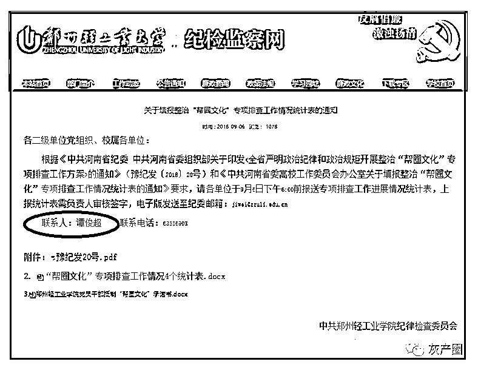

谭俊超获得过的荣誉有很多。

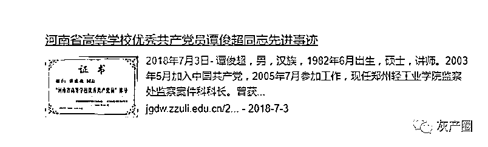

不到 40 周岁的他，原本有着光明的前景。

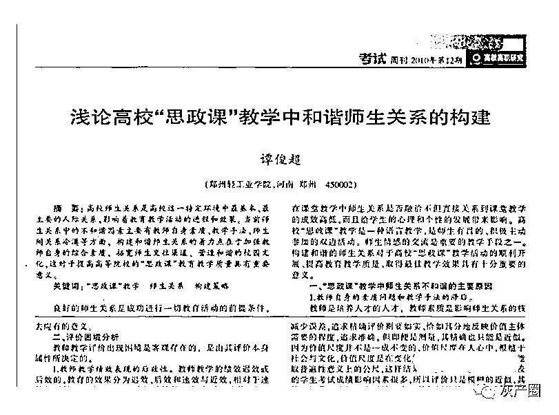

谭俊超还是学校的“笔杆子”。去年 5 月 9 日，河南日报首届中原武术传承人高峰论坛在郑州轻工业大学召开的新闻，就出自谭俊超之手。2019 年，体育学院召开分工会委员补选会议，谭俊超按照规章程序成功补选后，亲自给学校官网撰写了一篇动态新闻。

上个月 14 号，三实书院在书院会议室召开学生座谈会，书院副院长谭俊超还在和学生代表侃侃而谈。下个月，是谭院长的 40 岁生日。

去年 9 月 22 日，邢台市任泽区住建局“耿卫平局长”在一个 74 人的“工作通知群”中发言说“明天做一回吧不戴套了。”群聊截图在网上流传后引发热议。

后，耿卫平被免去住建局党组书记、局长职务。

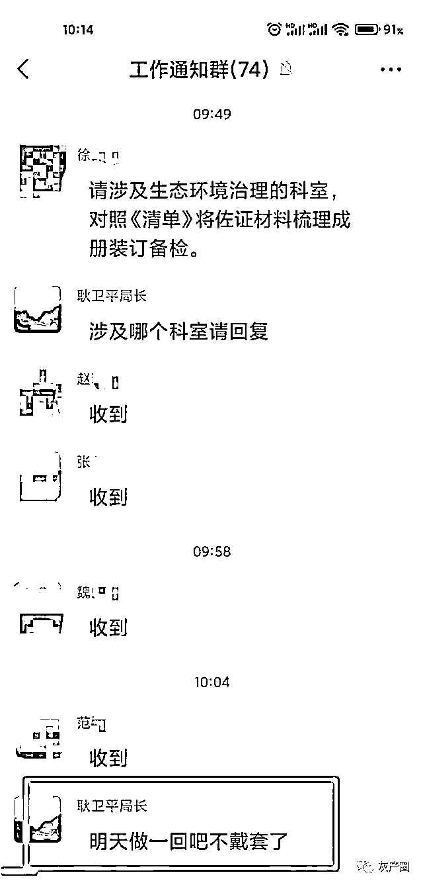

 去年 5 月，在浙江文成县（隶属温州市）一个有着 160 名成员的“文成广电工作群”里，“赵青松台长”情到深处难自禁，爱到浓时宝贝亲，与融媒体中心的一位妹子当众秀恩爱，互称“宝贝”，玩起了“抱抱”游戏。

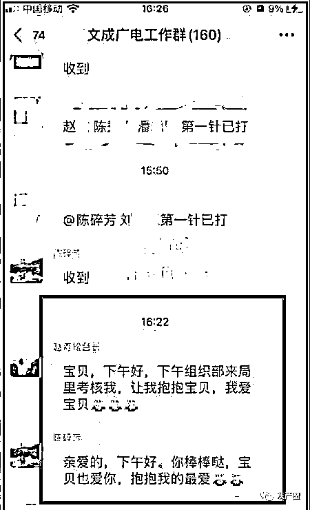

5 月 7 日，文成县政府官网发布“文政干【2021】10 号”文件：《关于赵青松免职的通知》，文成县政府于 4 月 29 日决定免去赵青松的县应急管理局副局长职务。

教训。 

教训 1：连微信的基本功能都不熟悉，还是打电话或者发短信吧。

教训 2：工作群一定要设置个背景色，标注：这是个工作群。

教训 3：发微信一定要看准目标，发错群的话，基本上就没有再“玩”的机会了。（作者：宾语 ）（宾曰语云微信公众号：lzkj328）

**来源:宾曰语云  编辑：夏荷   审稿：宾语**

********

**← 向右滑动与灰产圈互动交流 →**

****