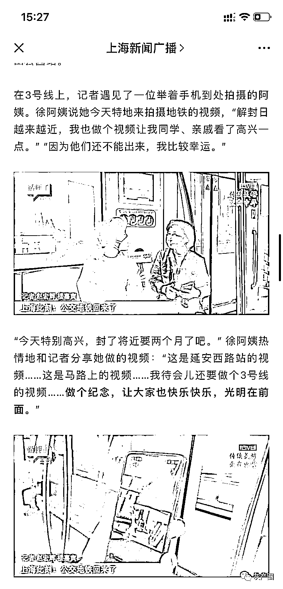

# 记者上海采访真路人连续翻车，采访紧急中断

> 原文：[`mp.weixin.qq.com/s?__biz=MzIyMDYwMTk0Mw==&mid=2247536364&idx=4&sn=608d8096af37b97258b91ce298d651e5&chksm=97cb85d4a0bc0cc24da7dddbec879aa37f19f38bfee380f10f50c95d6154e2a684e05e865987&scene=27#wechat_redirect`](http://mp.weixin.qq.com/s?__biz=MzIyMDYwMTk0Mw==&mid=2247536364&idx=4&sn=608d8096af37b97258b91ce298d651e5&chksm=97cb85d4a0bc0cc24da7dddbec879aa37f19f38bfee380f10f50c95d6154e2a684e05e865987&scene=27#wechat_redirect)

5 月 22 日上海开通地铁进行采访，还进行了直播

结果出现了两个让人啼笑皆非的名场面

采访一位当地阿姨，采访者手中的话筒。。。

[`mp.weixin.qq.com/mp/readtemplate?t=pages/video_player_tmpl&action=mpvideo&auto=0&vid=wxv_2409764942452310020`](https://mp.weixin.qq.com/mp/readtemplate?t=pages/video_player_tmpl&action=mpvideo&auto=0&vid=wxv_2409764942452310020)

采访一位带着行李的阿姨 

[`mp.weixin.qq.com/mp/readtemplate?t=pages/video_player_tmpl&action=mpvideo&auto=0&vid=wxv_2409763648224313346`](https://mp.weixin.qq.com/mp/readtemplate?t=pages/video_player_tmpl&action=mpvideo&auto=0&vid=wxv_2409763648224313346)

新闻报道的效果是这样的： 

来源：微博那些事儿

← 向右滑动与灰产圈互动交流 →

