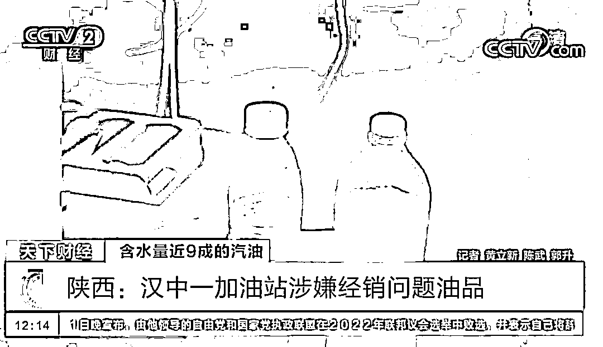
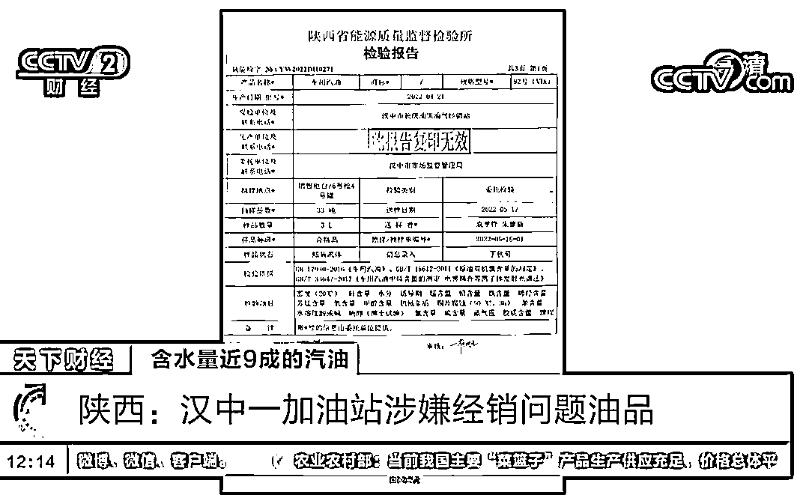
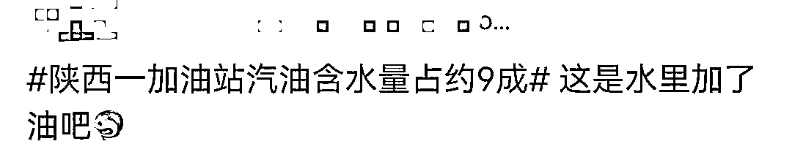
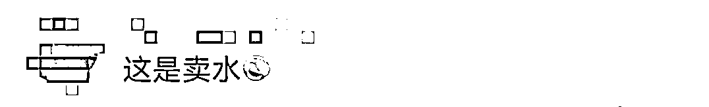
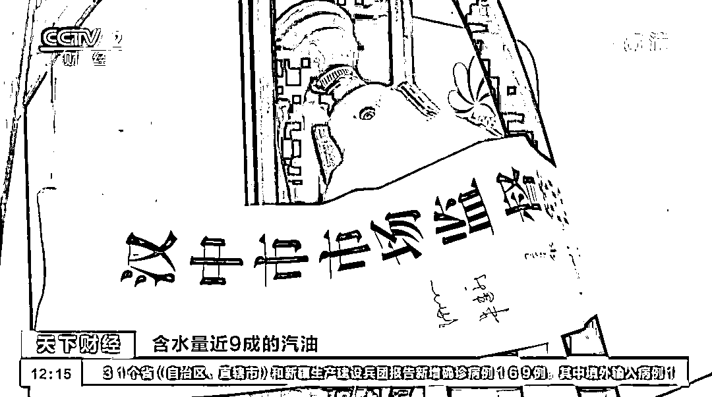

# 加油站汽油变“汽水”？立案侦查！

> 原文：[`mp.weixin.qq.com/s?__biz=MzIyMDYwMTk0Mw==&mid=2247536364&idx=6&sn=10ed174bb3cd5c16becca3e5f230f598&chksm=97cb85d4a0bc0cc2d9835f02639d02d67654669da0b5bd42b3930702847c271eaa78caa9c8c4&scene=27#wechat_redirect`](http://mp.weixin.qq.com/s?__biz=MzIyMDYwMTk0Mw==&mid=2247536364&idx=6&sn=10ed174bb3cd5c16becca3e5f230f598&chksm=97cb85d4a0bc0cc2d9835f02639d02d67654669da0b5bd42b3930702847c271eaa78caa9c8c4&scene=27#wechat_redirect)

近日

陕西汉中一个加油站出现油品事故 

多名车主称

**加油后没开出多远**

**车辆就出现故障**

**有数十辆车抛锚**

[`mp.weixin.qq.com/mp/readtemplate?t=pages/video_player_tmpl&action=mpvideo&auto=0&vid=wxv_2410746261999370243`](https://mp.weixin.qq.com/mp/readtemplate?t=pages/video_player_tmpl&action=mpvideo&auto=0&vid=wxv_2410746261999370243)

从油箱抽出的汽油明显分层

并且有沉淀的浑浊物

车主们立即报警

5 月 21 日

陕西省能源质量监督检验所

出具的检验报告显示

**涉事加油站的汽油样品有多项指标不符合**

**92 号汽油国家技术标准**

**属于不合格油品**

其中 

**水分占到油品的比例为 88%**

网友称： 

这分明是水里掺了点油

目前

涉事加油站因涉嫌销售伪劣产品罪

**已被当地警方立案侦查**

**加油站相关人员被控制**

来源：央视网、央视新闻

← 向右滑动与灰产圈互动交流 →

