# 又有两个知名品牌广告被指抄袭！

> 原文：[`mp.weixin.qq.com/s?__biz=MzIyMDYwMTk0Mw==&mid=2247536364&idx=8&sn=cbb897ffde44934887a3570daf053fa5&chksm=97cb85d4a0bc0cc237f7a29656b50d08dd43c09b57b709bf85e823a173564b5486fa97a5229c&scene=27#wechat_redirect`](http://mp.weixin.qq.com/s?__biz=MzIyMDYwMTk0Mw==&mid=2247536364&idx=8&sn=cbb897ffde44934887a3570daf053fa5&chksm=97cb85d4a0bc0cc237f7a29656b50d08dd43c09b57b709bf85e823a173564b5486fa97a5229c&scene=27#wechat_redirect)

继奥迪“小满”广告涉嫌抄袭事件霸屏热搜后

****#奥迪广告涉事导演一宝马广告被下架#****

**也引发大量网友关注** 

**▼**

**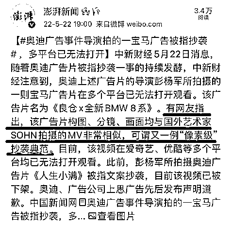**

**微信公号“ StinkFilms”**

****发布了两部视频里极为相似的镜头剪辑对比****

**▼**

 **[`mp.weixin.qq.com/mp/readtemplate?t=pages/video_player_tmpl&action=mpvideo&auto=0&vid=wxv_2409412530302435329`](https://mp.weixin.qq.com/mp/readtemplate?t=pages/video_player_tmpl&action=mpvideo&auto=0&vid=wxv_2409412530302435329)** 

**并发文：**

****“我们真的坐不住了！”****

****“希望更多人知道****保护知识产权的重要性”****

**▼**

**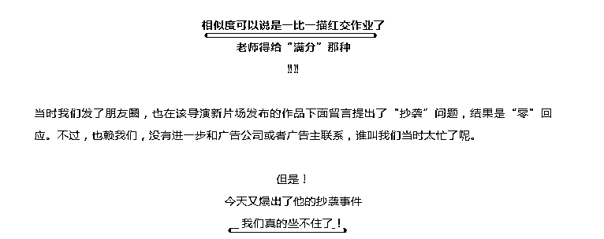** 

**目前，**

****该视频在爱奇艺、优酷等多个平台****

****均已无法打开****

**▼**

**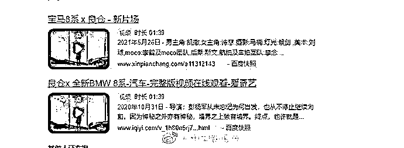**

**然而** 

**让网友们意想不到是**

****昨晚还有一家车企因广告****

****冲上热搜****

**▼**

****

**在“奥迪广告抄袭侵权事件”余波未了时，本田汽车广告疑似侵权一事又出现在大众视野里。**

**红星新闻记者了解到，东风本田公司一款汽车广告创意被成都远家品牌创始人宁远质疑抄袭，**她称该广告中的女主人公的创业故事完全盗用了自己的人生经历，用作商业广告。****

 ****[`mp.weixin.qq.com/mp/readtemplate?t=pages/video_player_tmpl&action=mpvideo&auto=0&vid=wxv_2409669473248165890`](https://mp.weixin.qq.com/mp/readtemplate?t=pages/video_player_tmpl&action=mpvideo&auto=0&vid=wxv_2409669473248165890)**** 

****▲来源沸点视频****

******“感觉自己的人生被偷走了……”**宁远还向记者表示，该广告不仅借用了她的创业机构场地，“女主说的那些（话），好多都是我书里写的，或是我在微博上发的原话”。****

****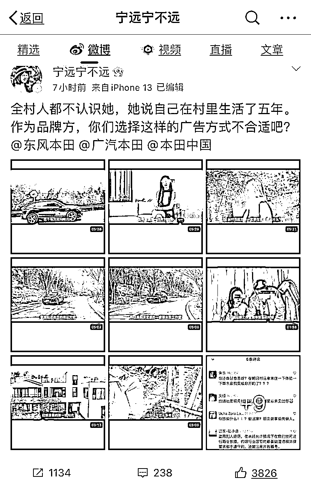****

****宁远发文质疑****

****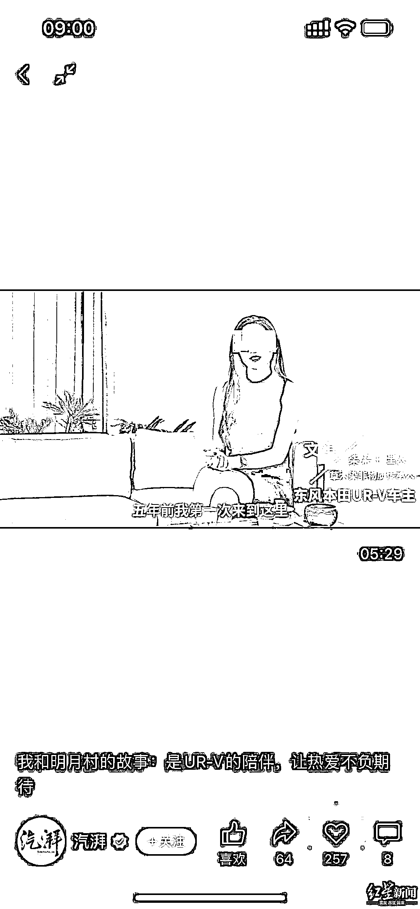****

****视频中的女主人公“文淇”****

****据宁远介绍，该广告发布有一段时间了，是几天前当地工作人员在用“明月村”为关键词搜索时偶然间搜到的，“他们没仔细看，还以为是我拍的”，就转发了这条视频到朋友圈。**宁远的同事看到后很气愤，就给视频作者留言说这是侵权，但视频号没有任何回应。******

****5 月 22 日，同事就把该广告视频发给了宁远，宁远也很气愤便在微博上发文。她认为对方把自己的这些话组装起来，拍成广告**“很无耻”。******

******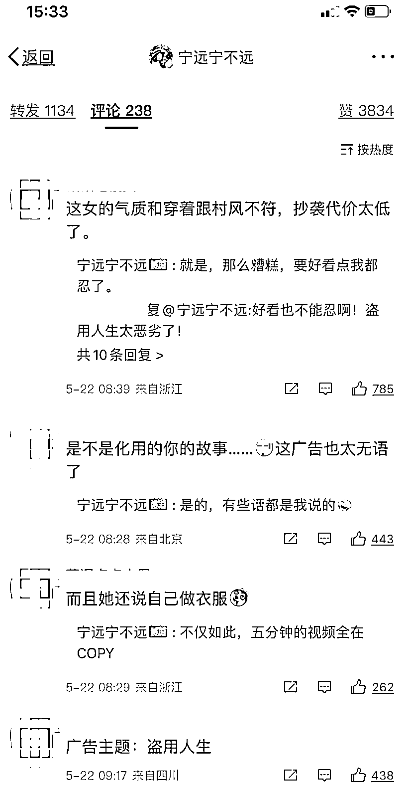******

******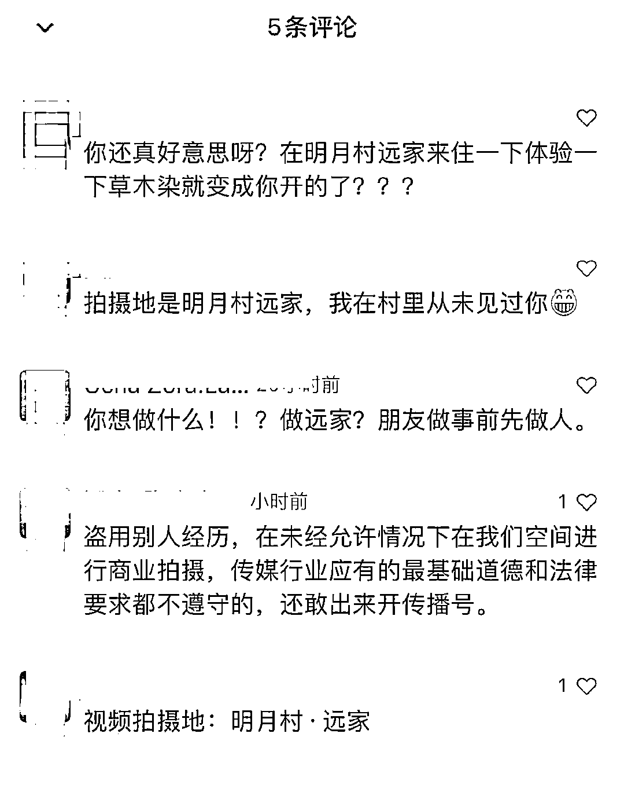******

******网友评论******

********东风本田：********

********目前内部还在确认********

********接下来将跟广告视频拍摄方确认相关信息********

******随后，记者也联系上该广告视频拍摄方“汽湃”负责人钟先生，据他介绍，该视频确实是给本田汽车做的一个广告，**但广告视频纯属虚构，****“包括画面和文案都是原创，绝对没有抄袭”。**对于宁远对文案中女主人公的经历和拍摄场地的疑虑，他们也将跟对方沟通。******

******钟先生告诉记者，他们当时要做的是一个本田 UR-V 车主的故事，之前他们也曾找真正的车主来做，但拍摄效果不好，**所以他们就在公司内部找了一位名叫张淇的公司员工作为女主人公“文淇”进行拍摄。********

******钟先生表示，他们公司有专门的视频团队，在制作拍摄脚本前也没有看过有关宁远经历的介绍，**“如果我知道，我肯定不会去做这个事”**。******

******接下来，他们也将与宁远方面进行充分沟通，就没有提前告知是商业拍摄向对方致歉，同时告诉对方整个拍摄包括脚本创作的来龙去脉。******

******记者联系上东风本田方媒体对接人，据其介绍，**这件事他们也是 5 月 22 日上午才得知，目前内部还在确认，他们接下来也将跟广告视频拍摄方确认相关信息。********

******5 月 22 日下午，**“汽湃”删除了该广告视频。********

********一连三个品牌疑似“翻车”********

********网友感叹********

********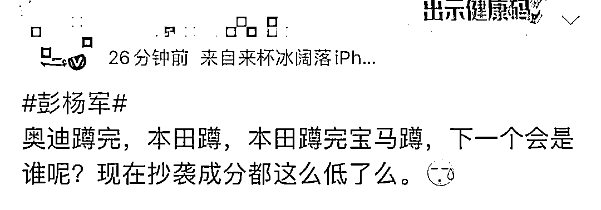********

********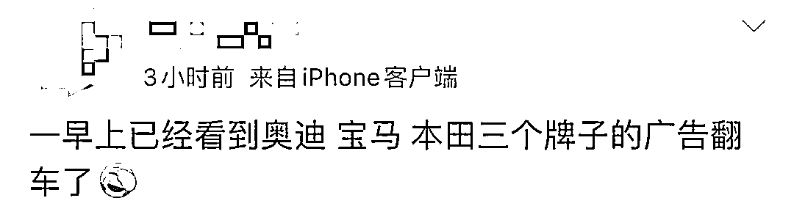********

********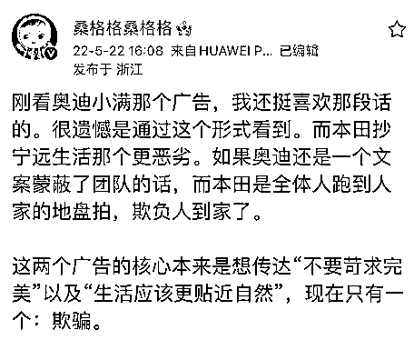********

**********人民日报评论：** **一起“车祸”，该有人担责**********

**********▼**********

**********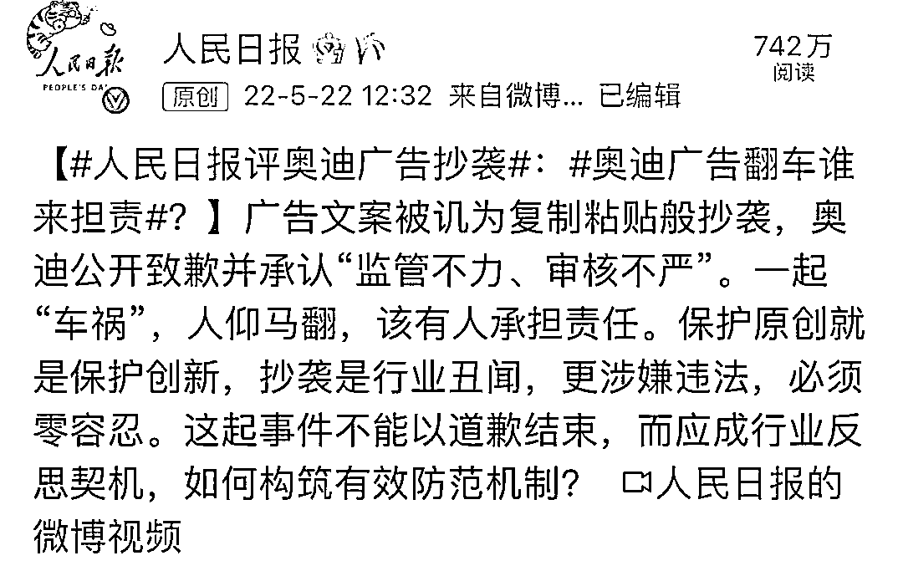**********

**********来源：钱江晚报、红星新闻、沸点视频、公众号“StinkFilms”、澎湃新闻、人民日报、网友等**********

****************************************

**********← 向右滑动与灰产圈互动交流 →**********

********************