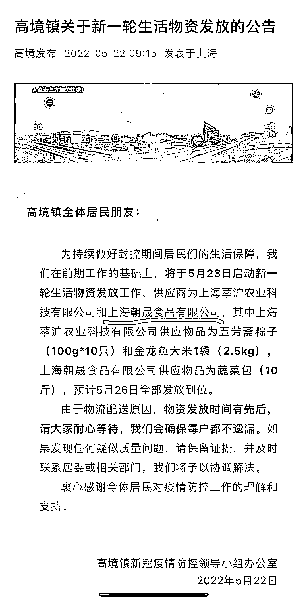
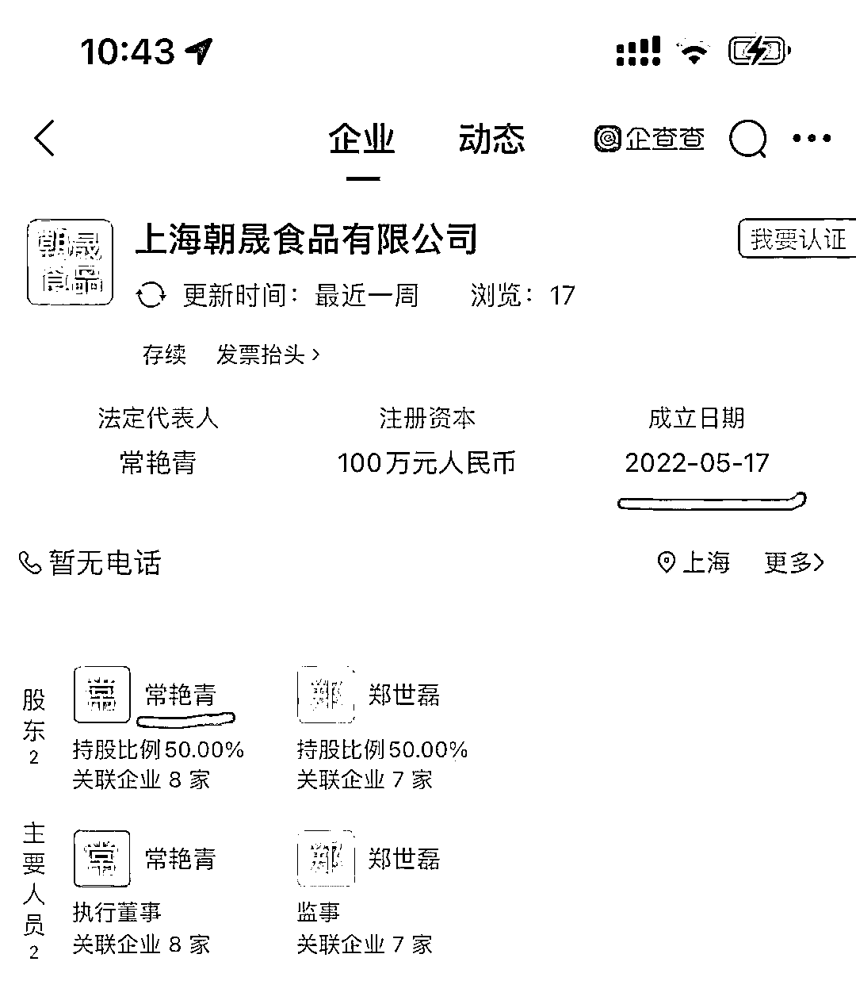
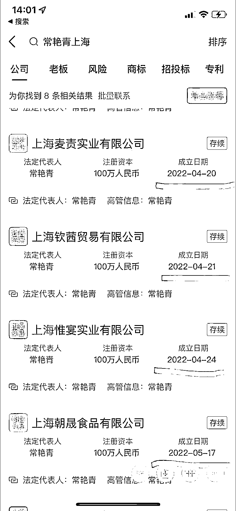

# 上海“高人”常艳青回应质疑，却被曝更多内幕！

> 原文：[`mp.weixin.qq.com/s?__biz=MzIyMDYwMTk0Mw==&mid=2247536437&idx=2&sn=f6b6f6d31eac0aff5d5f8917fd783c78&chksm=97cb840da0bc0d1b29945f3b6f0df14a0e72432bf0d4edcc66d309ea113756e4310724f9d1d8&scene=27#wechat_redirect`](http://mp.weixin.qq.com/s?__biz=MzIyMDYwMTk0Mw==&mid=2247536437&idx=2&sn=f6b6f6d31eac0aff5d5f8917fd783c78&chksm=97cb840da0bc0d1b29945f3b6f0df14a0e72432bf0d4edcc66d309ea113756e4310724f9d1d8&scene=27#wechat_redirect)

**1、神了！成立 5 天，成为上海供保商**

**是的，上海果然有高人，不是我们小老百姓能够企及的。封控期间，我们已经见识过跟多的上海“高人”。**

**这不，都说封控快结束了，依旧有“高人”冒出来。事情是这样的，5 月 22 日，上海一个乡镇发出了一则公告，内容如下：**

****

**公告内容很简单，就是告诉辖区的人民，又有物资要发放了，大家耐心等等哈。端午节还没到，粽子已经帮大家准备好了哈。**

**吧啦吧啦，上海人民已经见怪不怪了。但毕竟被关在家里，无聊啊，于是有人手贱，搜了一下物资供养商上海朝晟食品有限公司是何方神圣大企业？**

****不搜还好，一搜眼挣大了：“高，实在是高！这企业家绝对是高人！”****

****因为这企业成立不过才 5 天！****

********

****暂不说一家仅成立于 5 天前的企业，竟然也能成为某地封控期间居民生活物资保障的供应商。因为毕竟没有那条规定刚成立的企业不能成为物资保障供应商啊。**** 

******还高在哪里呢？高在人家的经济头脑啊。你看那些被封控在家里的人，天天只知道抱怨，而人家呢，却知道去注册公司，而且还是上海人民现在最需要的食品类公司。******

 ******你会说，我也想啊，但被封在家，出不去，连从京东阿里这类大公司买的产品，快递都送不进来的啊！难道工商部门上班了？就算我能注册公司，但是还要办食卫证啊，这要有场地，有工人，有健康证等等，还要食卫监督部门的同志上门实查，才能给我办出来啊。****** 

********你看你，就会抱怨。这不，人家常某某咋就办出来了呢？而且一开就是好几家公司啊：********

****************

**********2、常艳青回应质疑**********

******那么在 4 月和 5 月上海封控状态下，上述两位股东怎么会成立了这么多企业？成立仅 6 天的上海朝晟食品有限公司又是如何成为高境镇的保供企业的呢？****** 

******常艳青表示，自己的公司此前就做农副食品相关业务，认识的做食品的朋友也很多，想着以后可能会有这方面的业务，就申请注册了公司。另一大股东郑世磊是自己的朋友。两人已经认识很多年，因此一起注册成立了这些公司。******

********常艳青透露，这些公司其实大部分在上海封控之前都已经申请注册成立。但是因为 4 月份、5 月份疫情变得严重，就一直被搁置。********

********以朝晟公司为例，其实在 3 月份上海实行封控之前就已经申请注册，直到 5 月下旬，金山区一部分地方陆续解封后，注册流程才重新开始走起来，并在 5 月 17 日正式获批注册成立。********

********“今天早上工商局已经去我们申请注册的那个园区核对过注册申请时间了，我们所有的手续和流程都是合法合规的，我们提供的物资也是没有问题的。”常艳青表示。********

********至于为什么不在名单中却能成为高境镇的物资保供企业，常艳青指出，其实高境镇政府刚开始也并没有找朝晟，找的是另外一家已经和镇政府有合作关系的供应商上海萃沪农业科技有限公司。******** 

********“我和这家供应商的老板是朋友，也有间接的合作关系。后来镇政府找他询价让提供保供物资，他可能业务比较多忙不过来，就推荐了我们，我们收到询价通知也是在公司注册成立后。”常艳青表示。********

********常艳青表示，收到询价通知的应该不只自己一家，应该是咨询了好几家公司。镇政府也提出了保供物资的采购要求，比如说菜品要好、重量多少、价格不可以定高等。********

**********“我们提供的蔬菜包一份大概 12 斤，里面有山药、红薯、豇豆等，而且质量都是非常好的。这样一份蔬菜包我们和基地的合同价是 58 元，给政府的保供价是 60 元，基本上是最低的了。”**********

**********在问到是否有看到网上传言的“有背景”“官商勾结”“发国难财”的质疑甚至谩骂时，常艳青忍不住哭了起来。**********

********她哽咽着说到：“昨天已经有朋友把那些评论转发给我看了，我很难受。后来我把抖音、头条都卸载了，强迫自己别去关注这件事。我已经怀孕七八个月了，不想生闷气影响到胎儿，但我昨晚还是一宿没睡着。”********

********常艳青表示：“这些绝对都是谣言，我不是他们说的什么有背景的人，就是一个普通人。我感觉很委屈，但我也不知道去怎么去解释，现在好像怎么说都挺苍白的。”********

|   |

**********高境镇政府政府回应：朝晟公司符合保供条件**********

**********5 月 23 日下午，高境镇政府对该事件进行了回应，称因上海萃沪农业科技有限公司司目前承接保供任务较多，短时间内备货压力较大，为确保此次保供能够顺利完成，该公司推荐上海朝晟食品有限公司承担本轮保供物资中的蔬菜供应，并对蔬菜质量提供担保。**********

**********高境镇保供工作组会同镇市场所等部门对上海朝晟食品有限公司有关情况进行了核查。该公司于 2022 年 3 月 22 日向金山区亭林镇揽工路 669 号众璞园区申请注册，受疫情影响于 5 月 17 日经金山区市场监管局审核予以批准成立，公司经营范围包括食用农产品批发，符合条件。**********

**********同时，高境镇保供工作组亦通过视频连线，考察了该公司蔬菜采购地的供应能力，经综合考量，同意了该公司承接此次蔬菜供应业务。**********

************看看，事实胜于雄辩吧，人家这公司都是实实在在办出来的。************

************所以，咱除了酸，就只能说，佩服佩服！膜拜膜拜了！************

************3、网友爆料：这些线索要查一查************

********常艳青接受采访后，对媒体的解释，网友并不认同。********

********有网友爆料：********

********1、朝晟食品有个股东叫郑世磊，郑总有个公司叫上海兴轶实业。这家公司不简单，**这轮疫情之前就多次中标宝山区所辖镇政府的采购招标，从高温慰问品到垃圾袋，没少给当地的朋友们送。**

2、常艳青的公司里有一位叫做高秀萍的高管，这个“高秀萍”的名字出现在了 3 月份以来上海新成立的 13 家公司里。

从室内装修到网络科技，从食品供应到法律咨询，高总就没有不能干的。但她最关键的身份，其实是上海鼎芮企业管理有限公司的股东。

**根据简介，鼎芮主要帮其他公司处理代理记账、税务筹划以及公司注册等业务。**********

**********巧了，高境镇的两家保供企业：都是鼎芮的客户。**

不少网友直接怼：**价格再便宜，质量再好，都不能改变其是否通过非竞争方式成为供应商的嫌疑。**********

******来源：喻言亭阁******

************************

******← 向右滑动与灰产圈互动交流 →******

************