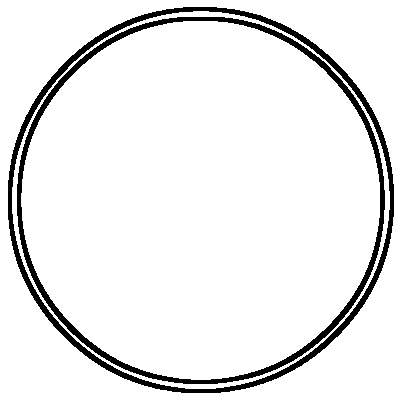

# 为了赚钱故意制造假阳性，全国发生多少起了？

> 原文：[`mp.weixin.qq.com/s?__biz=MzIyMDYwMTk0Mw==&mid=2247536437&idx=3&sn=695ecaac82a60e047ed78c8e2935551c&chksm=97cb840da0bc0d1bdfd5fd9734e785208793947fca9ec8cd314d1073ba99cc884c0b699b02dc&scene=27#wechat_redirect`](http://mp.weixin.qq.com/s?__biz=MzIyMDYwMTk0Mw==&mid=2247536437&idx=3&sn=695ecaac82a60e047ed78c8e2935551c&chksm=97cb840da0bc0d1bdfd5fd9734e785208793947fca9ec8cd314d1073ba99cc884c0b699b02dc&scene=27#wechat_redirect)

核酸造假事件竟频频发生，到底......

**Vol****.1**

近日，因北京一家核酸公司被吊销许可证，6 人被采取刑事强制措施而登上了热搜：

2022 年 5 月 14 日，监督员发现位于北京市房山区广阳大街 9 号 1 幢 3 层 315-323 的北京朴石医学检验实验室有限公司原始检测数据明显少于样本检测数量。

也就是说，采集了十万人的样本可实际上检测的却没有十万。

那么，这些人健康码上的阴性阳性**数据是从何而来？**

一名地方疾控检测科负责人分析称，样本检测数据为出了结果的样本数，而原始检测数据为真实检测数据。

实验室环节中，每个样本在检测时都会有一副对应的图谱，没有图谱就是没有检测。

换而言之，可能是存在较大批量没检测就直接出具结果的情况，而“假阴性”的检测结果会导致疫情在社会面隐匿传播的可能。

核酸检测涉及到我们实现动态清零的防疫大局，涉及到无数国人的切身利益，资本公司这样枉顾人命，官方给出的处理结果却是吊销执业许可证？

仅仅吊销就完了吗？核酸检测是发现隐匿传染源的最有效手段，是尽早切断传播链的关键一环。

人为造成阳性案例严重扰乱国家动态清零的大政方针，拖慢了清零的速度扰乱复工复产，为何不予以严肃查处？

**Vol****.2**

先前上海融创滨江壹号的 13 名业主被润达医疗旗下的第三方实验室中科润达润达医疗检测出“阳性”，但因为其中一名阳性业主强烈反对，他自认疫情以来从未出过门，坚决不信润达的检测结果，要求复核，事件才得以揭穿！

值得一提的是，上海融创滨江壹号均价都得十万/m²以上，里面的业主也都非富即贵！

果然，还得是有分量的人才能在平静的水面击起浪花~

话说回来，虽有专家指出：出现“假阳性”的原因或为采样、转运、检测等某个环节受到环境污染，但即便是试剂等各种问题，出现假阳性可以理解，可是一个小区同时出现 13 个人全是假阳性，这真的是无意为之吗？

**Vol****.3**

因为什么导致核酸造假事件频频发生？早在 4 月份合肥市疫情防控应急指挥部就发布通报，对合肥和合医学检验实验室、合肥诺为尔医学检验实验室两家核酸检测实验室给予警告并暂停合作。

既然几次出具“假阳性”报告，严重干扰了疫情防控大局，何解只是暂停合作？

他们为什么敢如此猖狂？谁给他们的胆子弄虚作假？不正正是因为违法成本如此的低吗？

在所有人上下勠力同心抗疫的关键时刻，在所有市民渴盼早日实现社会面清零的时候，核酸检测机构数据造假，是冒天下之大不韪。

小而言之是利欲熏心，大而言之，是在拿疫情防控大局不当回事，拿无数医护人员、志愿者和市民的付出当儿戏。

因为假阳性，多少人要反复的配合检测；

因为假阳性，浪费了多少人力物力；

因为假阳性，多少人被无故拉去方舱和阳性患者隔离？

以病毒的传播速度，一个阴性患者到达方舱后感染的几率有多大我想大家心里明白，不用多久假阳性就会变成真阳性，以此掩盖造假的手法真的可耻！

郑州女大学生私会男友，瞒报行程感染新 guan，导致全校 6000 多人被迫隔离，尚且需要付出惨痛代价，那核酸检测公司造假，这要比个人的行程造假、个人隐藏自身阳性、个人不遵守防疫规定，处罚要重 n 倍吧？

为何还会屡次出现，真正的原因毋庸置疑吧？ 

新 guan 疫情对于老百姓来说确实是一场公共灾难，但也是一群（第三方医学检验机构）的福音，资产阶级永远是在公共灾难中发家成长的，这在人类历史上是一个无需争论的规律。

面对庞大的检测量，有些人并不希望疫情结束。

如果没有国家力量的介入，单靠市场调节，资本一窝蜂涌入下，一定会出现良莠不齐的局面，一定有资本家为了利润无所不用其极，从核酸检测公司到核酸采集员再到核酸检测员就会出现各种问题，我们的防控也会出现越来越多的漏洞。

第三方核酸检测机构，并不能保障检测的准确性，反而出现了越来越多的问题，制造了巨大的贫富分化，引起了越来越多的老百姓不满，甚至产生了一些对立情绪和矛盾冲突。

新 guan 疫情下国内核酸检测需求爆发，推动第三方医学诊断(ICL)行业迎来快速发展。

第三方独立医学检测机构作为填补医院以外防疫工作缺口的重要力量，在扩张规模求利润的同时保证检测质量。

**核酸基建的标准必须全国统一，承建单位应当全国统一，并且公开透明。**

**绝不能见利忘义，置法律法规不顾，置商业伦理不顾，置大众情感不顾而发国难财啊！**

不狠查核酸存在的问题，疫情就会没完没了。

在此，强烈呼吁有关部门必须揪出制假者背后的巨大隐形的网，这样就可以顺滕摸瓜，彻查幕后邪恶势力，早日实现社会清零，还人民群众一个海清河宴的春天！！  

来源：医学之声 ，喻言亭阁

<mpprofile class="js_uneditable custom_select_card mp_profile_iframe" data-pluginname="mpprofile" data-id="Mzg3OTExNDYyOQ==" data-headimg="http://mmbiz.qpic.cn/mmbiz_png/GRlxTX33QD6Fv9XKiab7dPpVmRrG7UYeibgPDkkS2VZ3C9aFZSsmmpQkZodb2pVjUEaC6LlRgkpJjgscYod2L2iaA/0?wx_fmt=png" data-nickname="IT 灰产圈" data-alias="ithuichanquan" data-signature="互联网黑灰产业链调查揭秘，创始于 2017" data-from="0">=</mpprofile>

← 向右滑动与灰产圈互动交流 →

