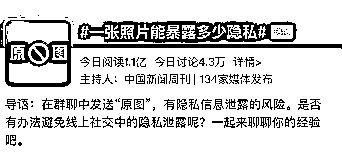
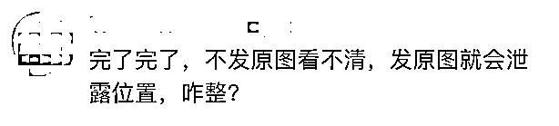
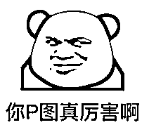
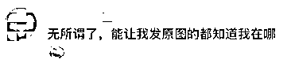
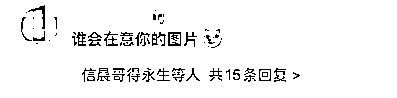
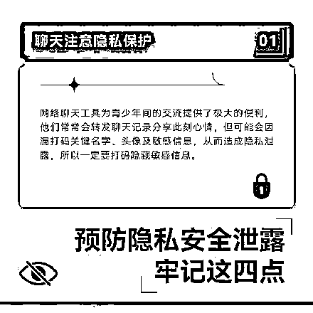
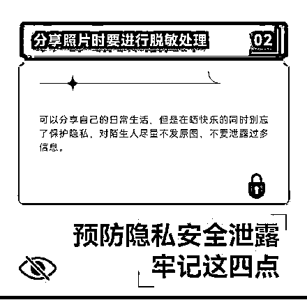
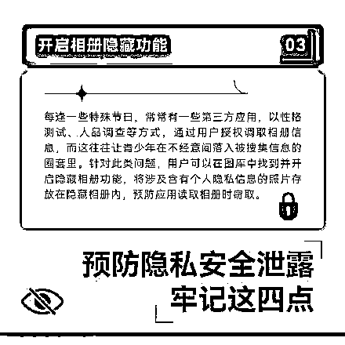
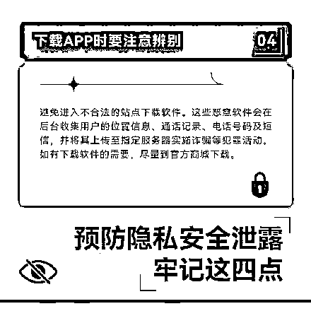

# 一张原图暴露的隐私，超出你想象！

> 原文：[`mp.weixin.qq.com/s?__biz=MzIyMDYwMTk0Mw==&mid=2247536437&idx=4&sn=9971152053263ee1048075a13d990d8e&chksm=97cb840da0bc0d1bfe02ebd68874ea4e3c25555a2d1e5995bc6bc2987767d10b21a23f4d319b&scene=27#wechat_redirect`](http://mp.weixin.qq.com/s?__biz=MzIyMDYwMTk0Mw==&mid=2247536437&idx=4&sn=9971152053263ee1048075a13d990d8e&chksm=97cb840da0bc0d1bfe02ebd68874ea4e3c25555a2d1e5995bc6bc2987767d10b21a23f4d319b&scene=27#wechat_redirect)

随着隐私保护意识的提升，

大家对于电话地址、身份证信息

这种看得见的隐私已经格外在意。

对于聊天照片、原图

这类看不见的隐私，

却还没有引起足够的重视。

上午，

#一张照片能暴露多少隐私#的话题

冲上微博热搜，

引发关注和热议。

**你在群聊中发过“原图”吗？**

**群聊时，**

**随意发送照片原图，**

**会泄露你的家庭住址等信息！**

**是真的吗？**

**其实除了在群聊中发送原图，**

****短信、邮件或是其他传输工具发送原图，****

****都会将附带信息一并发送。****

**我们日常生活中用手机相机记录，**

**每张照片中都有详细的 Exif 信息。**

**当你发送原图后，**

**相片中的 Exif 信息也会毫无保留地传出，**

**任何人都能读取其中的**

****机型型号、镜头参数、****

****拍摄时间以及地理位置信息。****

**比如你在自家窗口拍摄了一张风景图，**

**并发送原图到群里，**

**这就相当于给群里所有的陌生人**

**公布了你家 GPS 位置数据，**

**甚至通过拍摄时间与拍摄角度分析，**

**还可能准确推断出你家的楼层和门牌号。**

**同理，通过短信或者邮件发送的原图，**

**一样能暴露这些信息。**

****

****如何避免此类问题？****

****有没有办法避免原图泄密呢？****

****首先要建立陌生人群聊中隐私防范意识，****

****尽量不发实拍照片，****

****发送时也尽量不去勾选原图。****

****其次针对这一现象，****

****也有部分手机厂家关注到隐私泄露的风险，****

****在操作系统层面就提供隐私安全抹除的功能，****

****帮助用户更加安全地进行互联网社交。****

****微信团队此前也做出过回应****

******回应全文：******

******如今，任何智能手机拍摄的照片，都含有 Exif 参数，可以调用 GPS 全球定位系统数据，在照片中记录下位置、时间等信息**。**无论你用微信、短信、邮件或是其他传输工具发送原图，都会将附带信息一并发送。**不过，朋友圈发送的照片都经过系统自动压缩，不带位置等信息。********

******实在担心的话，可以避免发原图，或者关闭定位。**还有一招绝杀，P 完图再发。********

******总之，解决问题的方法很简单：****** 

********①避免发原图；********

********②实在必须发，那就关掉手机定位；******** 

********③绝杀招：****P 图 ************

************

******不过，******

******虽然有一些网友******

******因为担心泄露位置有点慌，******

******还有相当一部分网友******

******表现得淡定多了。****** 

********能让我发原图的人，********

********我都认识。******** 

****************

************

************

************ 

******不过我们还是要再次提醒！******

******预防隐私安全泄露，******

******要牢记这四点↓******

************

************

************

************

******你会经常在社交平台上晒自己的照片吗？******

******评论区聊聊******

******来源：央视网综合中国新闻周刊、中国新闻网、人民网、微信派、央广网****** ************************

******← 向右滑动与灰产圈互动交流 →******

************