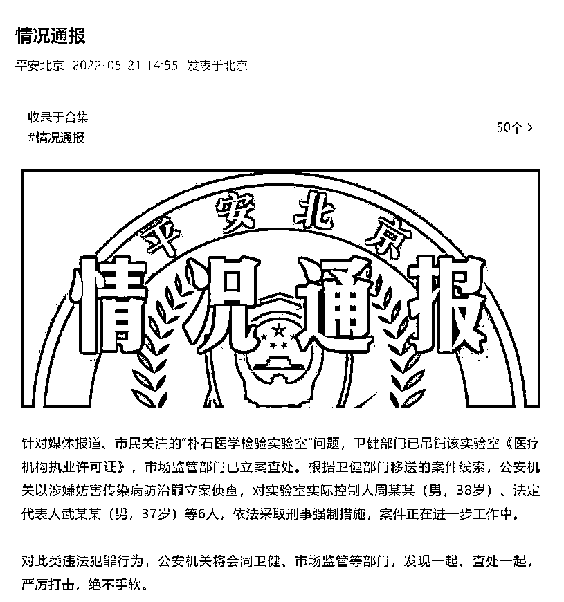
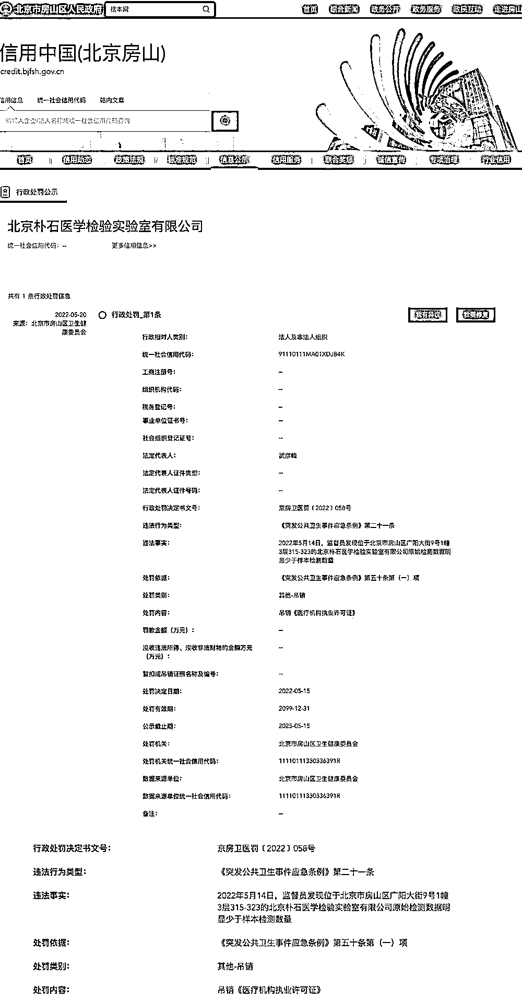
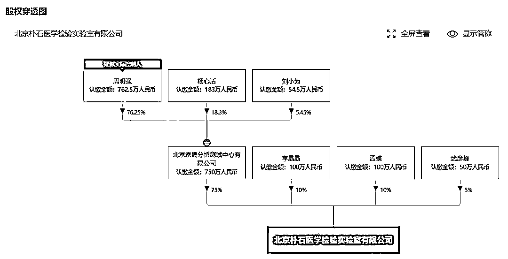
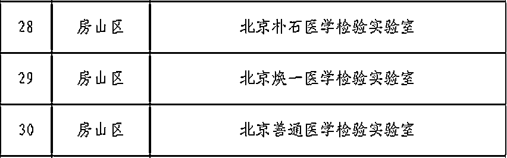
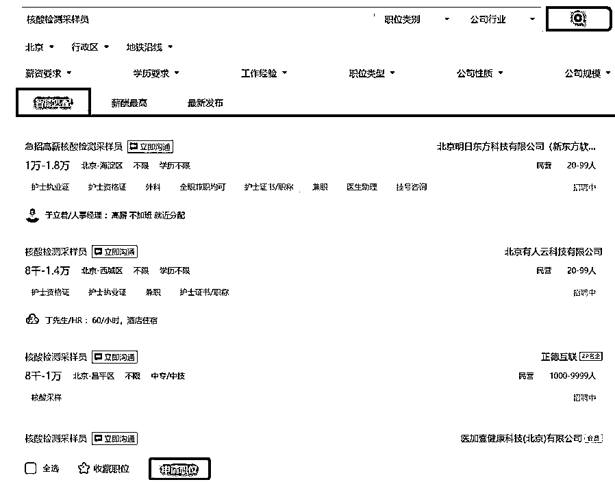
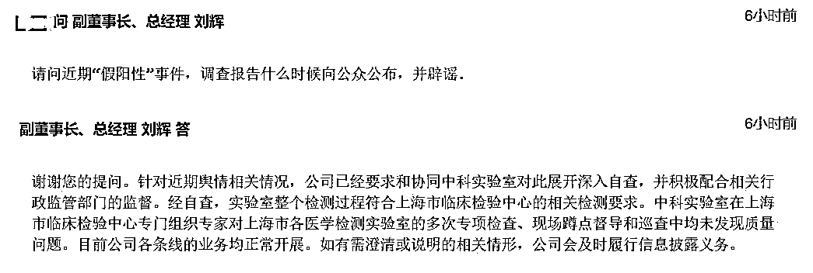

# 核酸检测实验室乱象何时休！前有“假阳”事件真相未明，今有数据“造假” 立案被查

> 原文：[`mp.weixin.qq.com/s?__biz=MzIyMDYwMTk0Mw==&mid=2247536437&idx=5&sn=3d7973ea5b0ae48090987911dbcbc3b0&chksm=97cb840da0bc0d1beb56ae55e2220e76fa625a849a74630fcab42308ff93f1fb168dc6b7a2af&scene=27#wechat_redirect`](http://mp.weixin.qq.com/s?__biz=MzIyMDYwMTk0Mw==&mid=2247536437&idx=5&sn=3d7973ea5b0ae48090987911dbcbc3b0&chksm=97cb840da0bc0d1beb56ae55e2220e76fa625a849a74630fcab42308ff93f1fb168dc6b7a2af&scene=27#wechat_redirect)

因疫情而“一夜暴富”的核酸检测实验室，究竟还有多少灰色利益链不为外人知。 

**日前，北京朴石医学检验实验室有限公司因涉及原始检测数据明显少于样本检测数量，被卫健部门吊销相关实验室《医疗机构执业许可证》，市场监管部门亦立案查处，相关责任人被依法采取刑事强制措施。**

朴石医学或许只是揭开了核酸检测实验室乱象一角。此前还有过“假阳”事件、伪造核酸证明等现象，屡屡被舆论曝光、监管部门“点名”。

有某地方防疫部门负责人对上证报记者表示，北京此次反应迅速、信息披露充分，卫健委、市场监查和公安都积极采取措施，不管是警示效果，还是及时停止不良机构从而保障核酸检测质量的效果，都起到了正向的作用。

如今，全国多地开始实施常态化核酸检测政策，是目前应对奥密克戎综合性、中长期社会成本最小的防疫方式。面对这一项疫情防控的重大“基建工程”，市场端扩容带来的经济增长显然不再是公众关注的重点，而“核酸检测常态化”之后，产品、服务成本大幅下降，**如何保障全链条质量和新冠检测服务能力的一如既往，从而达到常态化核酸检测下社会面对新冠病毒的有效控制，考验着产业链的成熟与安全，更拷问着每一个市场参与者的道德与底线。 **

文 | 张雪

本文转载自微信公众号“上海证券报”（ID：shzqbwx），原文首发于 2022 年 5 月 22 日，原标题为《核酸检测实验室乱象何时休！前有“假阳”事件真相未明，今有数据“造假” 立案被查》。

**1**

**朴石医学被查**

* * *

5 月 21 日，北京市公安局官方微信发布通报： 

通报中称，针对媒体报道、市民关注的“朴石医学检验实验室”问题，卫健部门已吊销该实验室《医疗机构执业许可证》，市场监管部门已立案查处。根据卫健部门移送的案件线索，公安机关以涉嫌妨害传染病防治罪立案侦查，对实验室实际控制人周某某（男，38 岁）、法定代表人武某某（男，37 岁）等 6 人，依法采取刑事强制措施，案件正在进一步工作中。

**对此类违法犯罪行为，公安机关将会同卫健、市场监管等部门，发现一起、查处一起，严厉打击，绝不手软。**

此前，据北京市房山区政府网站消息，因原始检测数据明显少于样本检测数量，北京朴石医学检验实验室有限公司被房山区卫生健康委员会吊销《医疗机构执业许可证》。

调查发现的违法事实是，2022 年 5 月 14 日，监督员发现位于北京市房山区广阳大街 9 号 1 幢 3 层 315-323 的北京朴石医学检验实验室有限公司原始检测数据明显少于样本检测数量。

据天眼查显示，北京朴石医学检验实验室公司成立于 2020 年 11 月，注册资本为 1000 万人民币，法定代表人为武彦峰，实际控制人为周明强。

在北京市新冠病毒核酸检测医学检验实验室 2022 年 4 月审核合格机构名单中，朴石医学在列，为房山区 3 家核酸机构之一。

记者采访某核酸试剂企业负责人了解到，只要仪器进行了试剂检测后，机器会自动保存检测数据，即便机构自己删除了数据，也会有上机的 log 文件。如存在原始检测数据少于样本检测数量的情况，存在没有检测而直接伪造数据的可能。

有律师指出，**北京朴石医学检验实验室有限公司的责任人可能涉嫌两个罪名：涉嫌妨碍传染病防治罪和涉嫌提供虚假证明文件罪。**根据《刑法》第三百三十条的规定，引起甲类传染病传播或者有传播严重危险的，处三年以下有期徒刑或者拘役；后果特别严重的，处三年以上七年以下有期徒刑。

根据《刑法修正案（十一）》第二十五：承担资产评估……安全评价、环境影响评价等职责的中介组织的人员故意提供虚假证明文件，情节严重的，处五年以下有期徒刑或者拘役，并处罚金。

**2**

**“假阳”事件真相至今未明**

* * *

2022 年 4 月开始，核酸检测亭、核酸检测站等第三方服务越来越多。**甚至一些与核酸检测服务相关的职业招聘，如核酸检测采样员、实验员等岗位也逐步在招聘网站上醒目起来。** 

**但与此同时，核酸检测领域乱象却频频曝光。**

最近的一起就出现在本月初，因为被曝在多个小区检测中发生多例“假阳性”， 上海中科润达医学检验实验室的新冠病毒核酸检测准确性正遭到质疑。

**有居民指出，多名居民核酸被上海中科润达医学检验实验室检测出阳性，但是后续的方舱或医院核酸复核中这些案例无一例外全部为“阴性”，而核酸“假阳”导致多人被拉去方舱。**

天眼查资料显示，上海中科润达医学检验实验室有限公司成立于 2017 年，注册地在上海虹口区，由上海中科润达精准医学检验有限公司 100%控股，而上海中科润达精准医学检验有限公司背后是上市公司润达医疗，润达医疗持有其 48.43%的股权。

天眼查信息进一步显示，除润达医疗外，中科润达的股东榜中还有巨星医疗旗下的上海安百达投资管理顾问有限公司持股 37.04%，中国科学院上海高等研究院持股 5.03%，此外，润理供应链管理（上海）有限公司持股 4.75%，另外，上海润潆企业管理合伙企业（有限合伙）同样持股 4.75%。

在 5 月 10 日上午举行的上海市新冠肺炎疫情防控工作新闻发布会上，上海市卫健委副主任赵丹丹表示，针对网上部分市民对核酸检测结果的情况反映，已开展对相关第三方检测机构的调查，如果发现违法违规问题，将依法依规从严查处，决不姑息。 

5 月 11 日，针对“假阳性”事件，润达医疗发布公告回应称，公司已要求中科实验室就相关情况启动内部自查，并配合有关部门调查。同日，上海证券交易所还曾对润达医疗下发监管工作函，就媒体报道相关事项提出工作要求。

**截至目前，此事仍未有官方结论，真相难明。公司的常规化检测仍在继续，接受检测的用户心有余悸。**

公司在上周的业绩说明会上，有疑似解释说明的回复称，该实验室在上海市临床检验中心专门组织专家对上海市各医学检测实验室的多次专项检查、现场蹲点督导和巡查中均未发现质量问题。

润达医疗不是唯一一家因为核酸检测结果引发争议而遭到舆论和监管关注的公司。**近一年来，有个别企业也曾因核酸检测结果没有能够客观、及时做出反映，遭监管部门“点名”。**

记者采访到的上述核酸试剂企业负责人表示，像北京朴石医学、中科润达这一类第三方或类似第三方机构，它们都肩负着很重要的社会职能，其出具的数据报告和提供的结论，会直接做为政府决策参考的依据，会直接关系到社会的公正和公平。

来源：实测

← 向右滑动与灰产圈互动交流 →

