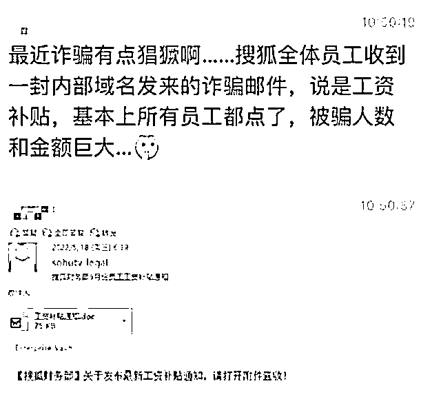
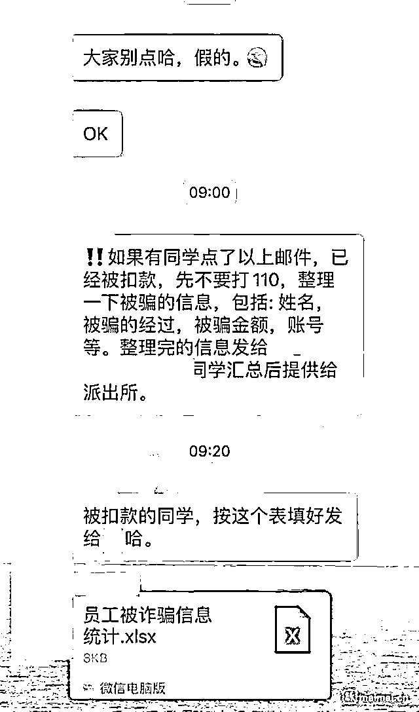
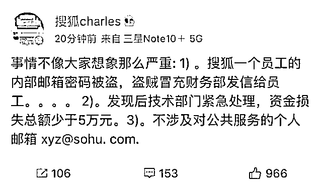

# 知名互联网公司全体员工遭遇工资诈骗？回应来了

> 原文：[`mp.weixin.qq.com/s?__biz=MzIyMDYwMTk0Mw==&mid=2247536437&idx=6&sn=f3f92fdd5e8570ff564a8acb245a27a6&chksm=97cb840da0bc0d1bbc5139324f86b3205f4e79f7c8571d812e89e646a2ca95f1e19df98f7dde&scene=27#wechat_redirect`](http://mp.weixin.qq.com/s?__biz=MzIyMDYwMTk0Mw==&mid=2247536437&idx=6&sn=f3f92fdd5e8570ff564a8acb245a27a6&chksm=97cb840da0bc0d1bbc5139324f86b3205f4e79f7c8571d812e89e646a2ca95f1e19df98f7dde&scene=27#wechat_redirect)

[`mp.weixin.qq.com/mp/readtemplate?t=pages/video_player_tmpl&action=mpvideo&auto=0&vid=wxv_2413575169622573059`](https://mp.weixin.qq.com/mp/readtemplate?t=pages/video_player_tmpl&action=mpvideo&auto=0&vid=wxv_2413575169622573059)

近日，一条来自网络的微信群聊记录显示，搜狐全体员工在 5 月 18 日早晨收到一封来自“搜狐财务部”名为《5 月份员工工资补助通知》的邮件，大量员工按照附件要求扫码，并填写了银行账号等信息，最终不但没有等到所谓的补助，工资卡内的余额也被划走。

5 月 25 日中午，搜狐公司 CEO 张朝阳回应此事，称“事情不像大家想象那么严重”，系搜狐一个员工的内部邮箱密码被盗，盗贼冒充财务部发信给员工，资金损失总额少于五万元，并且不涉及对公共服务的个人邮箱 xyz@sohu. com。

来源： 晨视频、潇湘晨报 记者：张岳

← 向右滑动与灰产圈互动交流 →

