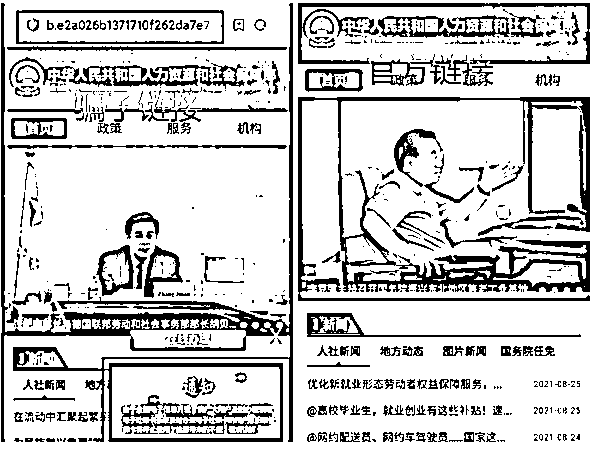
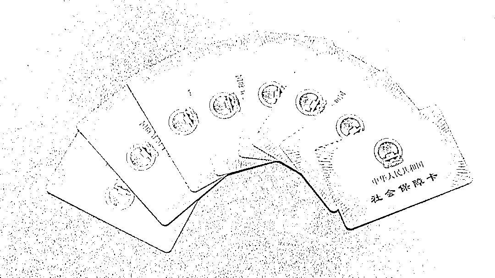

# 注意！您收到的“全国社保卡升级”信息是诈骗！

> 原文：[`mp.weixin.qq.com/s?__biz=MzIyMDYwMTk0Mw==&mid=2247536437&idx=7&sn=8b4f4fa914c80301168cecdd59fd669d&chksm=97cb840da0bc0d1b5a18f82372e825269dc1eea026266e1202ccbc1291207239716e8c3f436c&scene=27#wechat_redirect`](http://mp.weixin.qq.com/s?__biz=MzIyMDYwMTk0Mw==&mid=2247536437&idx=7&sn=8b4f4fa914c80301168cecdd59fd669d&chksm=97cb840da0bc0d1b5a18f82372e825269dc1eea026266e1202ccbc1291207239716e8c3f436c&scene=27#wechat_redirect)

最近

很多人的朋友圈

都刷到了这样一条提醒

**预警！预警！预警！ **

新的诈骗信息来了

收到**“全国社保卡升级”**的信息

不要点击

更不能填写任何个人信息 

该网站为涉诈网址

收到此类带有网址的信息

千万不要随意点击！

**新型社保卡骗局**

**提高警惕别“中招”**

图片中这条升级社保卡的短信就是最新社保卡骗局，目前已经有人中招。

**福建泉州**

8 月 3 日，安海西垵村一男子收到自称是“社保中心”的短信，称其社保账户未上传电子审核需要点击链接(p.uukp1.cc)在线办理，过时将被注销账户。该男子按要求填写个人信息、银行卡号验证码后发现被骗 9999 元。 

警方提示：个人信息不透露，警惕在线升级电子社保卡诈骗！

**甘肃兰州**

7 月 30 日 13 时许，林先生接到冒充社保局的短信，大致内容是：“【社保中心】，您好 ，你的社保账户未上传电子审核，请于 7 月 30 日前打开 a.szxq9.cc 点击在线办理，过时将被注销账户！”

林先生点击短信内链接，手机界面显示出“中华人民共和国人力资源和社会保障部”，对此，林先生没有产生怀疑。

随后，林先生登录了，短信中提供的链接。

他点击“在线办理”飘窗，并按照页面提示，一步步登录、填写个人信息、身份证号、手机号后，系统提示需要及时办理新版电子社保卡，并需要进行“支付宝认证身份信息”。

于是，林先生又在界面中，填写了支付宝账号、密码。

然而，当林先生填写完上述信息后，没等到新的电子社保卡，却等来了支付宝连续 4 次被扣款 4990 元，共计 19960 元的短信通知，林先生这时才发现被骗并报警。

现在很多人

在网上申请电子社保卡

所以对这个不明不白的信息

可能会有些好奇

想打开网址看看

下面两幅图

一个是骗子的网站首页

一个是官方的

我们看有什么区别？

骗子的网站做得很精致的，大部分内容都一样，只有一些细微差别。

**1、左边图上的链接，非官方网址。**

**官方网址是 http://www.mohrss.gov.cn/**

**我们要注意，政府官方网址一般以 gov.cn 结束。**

**2、骗子网站以吸引人注意的通知，以旧卡要停用的说法，催促你按他的步骤办理。**

如果你没有识别出是骗子的网站，我们看按照他的指引，会出现什么呢？

**1、收集你的个人信息：姓名，身份证，手机号。**

**2、想要的银行卡号和密码。**

**还想要你的支付宝账号和支付密码！**

**当你输完这些**

**基本上就算是把钱送到骗子手上了**

**为什么还有那么多人受骗呢？**

骗子就是利用人们对政府部门的信任。如果你没有在收到短信和进入网站时识别出骗局，如果你认为那是真的社保网站，你就不会有什么警惕心，因为我们一般认为政府部门是不会骗我们钱的。

除了上面的新型骗局，以下是社保卡常规骗局，已多地多人受骗。后面会讲防骗措施，请大家耐心看完。

一、谎称发放补贴。你有一笔社保补贴金尚未领取！

**方式一，伪造网站，收集受害人信息。**

伪装成人力资源社会保障热线 12333 发送短信，让人放松警惕，诱导受害人点击网址。

打开网站会发现是同样的招数，搜集你的所有信息，方便把钱转走！

**方式二，发来短信，诱导回拨电话，然后诱导受害人把钱转给骗子！**

骗子以领取社保补贴为名发送诈骗短信或微信，诱惑参保人员拨打所谓“社保机构”的电话，诱骗参保人员的个人身份信息和银行卡信息，实施诈骗 。

大家可能很好奇，骗子怎么能把自己设置成社保热线来发短信呢？

很简单，网上有很多改号软件。

还有一种就是利用伪基站

下面这个是什么？

你以为是 WIFI 路由器吗？

这是网络通信设备叫 GOIP，搭建伪基站的器材。

骗子先用“伪基站”搜索附近的手机号码，然后将诈骗短信输入设备，之后伪装成运营商或银行等（10086、10010、95588 等），直接将短信发送给附近用户。数百米范围内的手机用户都可能中招。

所以，不管是什么号码发来的短信，都要警惕！不要随便点击不明链接或拨打短信里的电话。凡收到这类“好消息”，可以就近去社保服务中心现场问清楚。

人社部门和社保卡合作银行不会要求持卡人提供个人身份信息及银行账户密码，持卡人不要点击不明链接填写信息、不轻信转账、不告知验证码。

如果市民遇到需要核实以及帮忙的情况，可以致电官方客服或者去到相关服务点或单位咨询确认，切勿随意泄露个人信息。 

重要提示

请记住

人力资源社会保障部官网地址：

**www.mohrss.gov.cn**

需要提醒的是

如果您接到了**0971-6****129110**的来电

请一定要接听

因为您可能正在遭遇诈骗

来源：昆明广播电视台、怀化网警巡查执法

← 向右滑动与灰产圈互动交流 →

