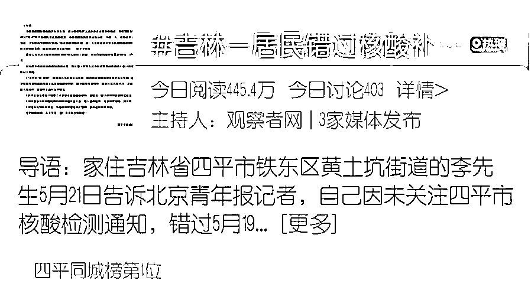
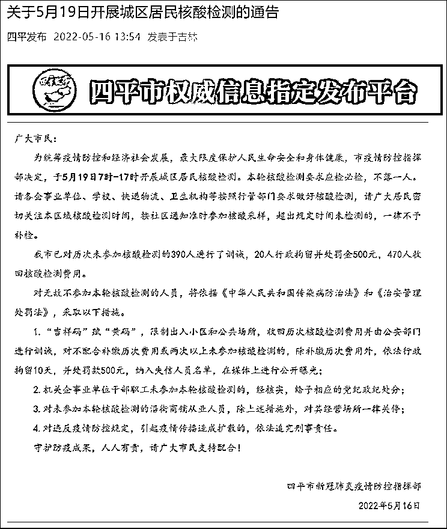

# 错过核酸被要求补缴费用，否则行拘！律师：以防疫的名义违法

> 原文：[`mp.weixin.qq.com/s?__biz=MzIyMDYwMTk0Mw==&mid=2247536437&idx=8&sn=50d77078a9f627ba3b553a01cb6b734f&chksm=97cb840da0bc0d1bb90979f1e69b82f7e3b4bc9c95c8cc4bbfc907a8c9419ed1cd18bb7dec3f&scene=27#wechat_redirect`](http://mp.weixin.qq.com/s?__biz=MzIyMDYwMTk0Mw==&mid=2247536437&idx=8&sn=50d77078a9f627ba3b553a01cb6b734f&chksm=97cb840da0bc0d1bb90979f1e69b82f7e3b4bc9c95c8cc4bbfc907a8c9419ed1cd18bb7dec3f&scene=27#wechat_redirect)

**错过第 25 轮核酸被要求补缴前 24 轮费用，否则将被行拘？**

今日，#吉林一居民错过核酸补缴前 24 轮费用#话题登上热搜。

据北青报报道，家住吉林省四平市铁东区黄土坑街道的李先生在四平市解封后退出了社区微信群，因没收到通知而错过了定于 5 月 19 日开展的第 25 轮核酸检测。

当晚，李先生接到一位自称回访人员的电话，询问未参加核酸检测的原因，李先生说自己没看到通知，询问是否需要补测，工作人员称只负责回访不清楚其他情况。

李先生表示，20 日上午其询问社区是否需要补测，社区工作人员表示需要补测，并且还要补缴前二十四轮核酸检测费用。于是李先生在 20 日下午主动补测了核酸，核酸检测结果显示，其于 5 月 20 日下午 14 时 23 分采样做了核酸检测。

20 日下午，李先生接到辖区派出所电话，要求补缴前二十四轮核酸检测费用。李先生告诉北青报记者，在派出所，他见到多人因未参加第 25 轮核酸被要求补缴费用。**民警表示，如果不补缴费用，就要面临因“以拒不参加核酸检测”而被拘留 10 日、罚款 500 元的处罚**。李先生认为，自己主动补测了核酸，并非拒不配合核酸检测，不能认可“拒不配合核酸检测”的处罚理由。

在派出所的调解下，李先生和其他几位未参加检测的市民向社区补缴了前二十四轮核酸检测费用，未受到罚款或拘留处罚。李先生出示的微信转账记录显示，他分两笔向社区工作人员转了他和儿子两人前二十四轮核酸费用，共计 384 元，社区未出示收据。

21 日，李先生所在社区的工作人员向北青报记者确认收到李先生补缴的核酸检测费用，每轮 8 元共 24 轮，2 人一共 384 元。工作人员表示，李先生需要的话可以出具收据，“这个钱也不是我们个人收，都要交上去的。”

此外，社区工作人员并不认可李先生所称的“未看到通知”，其表示，社区曾多次在微信群内发布通知，而李先生自己退出了社区群。此外，在 19 日做核酸当天，社区用大喇叭在每个单元楼都喊话通知了，“连没有智能机、腿脚不便的老人都下来了，但是他家没下来。”对此，李先生表示，社区通知用的喇叭和商贩卖货的喇叭一样，自己住六楼，关上窗不仔细听确实听不见。

社区工作人员还表示，该社区有封管时间，19 日上午已完成检测，并通知未参加的居民下午补测，李先生也没有参加 19 日下午的补测。社区工作人员称：“如果确有正当理由补测即可，但李先生是态度问题，他在社区表示现在解封了无需再测核酸。”

“法度 Law”注意到，李先生的情况并非个例。

此前，微信公众号“四平发布”发布《关于 5 月 19 日开展城区居民核酸检测的通告》。**其中提到，我市已对历次未参加核酸检测的 390 人进行了训诫，20 人行政拘留并处罚金 500 元，470 人收回核酸检测费用**。

对于 5 月 19 日开展的核酸检测，通告中强调，对无故不参加本轮核酸检测的人员，将依据《中华人民共和国传染病防治法》和《治安管理处罚法》，采取的措施之一便是：“吉祥码”赋“黄码”，限制出入小区和公共场所，收回历次核酸检测费用并由公安部门进行训诫，对不配合补缴历次费用或两次以上未参加核酸检测的，除补缴历次费用外，依法行政拘留 10 天，并处罚款 500 元，纳入失信人员名单，在媒体上进行公开曝光。

对于李先生遇到的的情况，**中国法学会会员、广东国晖律师事务所律师林波向“法度 Law”表示**，当地社区要求四平居民李先生因错过前 24 轮核酸检测，被要求补缴前 24 轮费用的作法违反《行政处罚法》的规定。

林波律师认为，要求补交核酸检测费，实质上就是罚款。因为李先生前面没有做检测，就不会产生检测费，何来补交一说。法律规定实施行政处罚权的主体只能是行政机关，社区根本无权行使处罚权。同时对未检测人员要求补交前面的检测费并未有上位法的支持，有违行政法中的目的性原则。

而派出所调解李先生和其他几位未参加检测的市民向社区补缴了前二十四轮核酸检测费用，否则就要受到罚款或拘留处罚则更是违法。行政处罚纠纷法院都无权调解结案，何况是派出所。

至于不补交费用就要拘留，则更需要明确的法律依据。当地的行政法规没有拘留权，《行政处罚法》第 10 条规定，行政法规可以设定除限制人身自由以外的行政处罚。行政拘留只能是是行政法规之外的法律赋予的。

“所以四平市人大常委会应当依法对这个规定予以修改或废除。”林波律师称。

**北京市才良律师事务所朱孝顶律师向“法度 Law”表示**，四平疫情防控指挥部的一纸通告既不是全国人大认定的法律，也不是国务院制定的行政法规，和地方性法规、政府部门规章，但这一纸通告却直接设定了“称无故未参加核酸检测人员，要收回历次核酸检测费用并由公安部门进行训诫、对不配合补缴历次费用或两次以上未参加核酸检测的，除补缴历次费用外，依法行政拘留 10 天，并处罚款 500 元，纳入失信人员名单，在媒体上进行公开曝光”等一系列对于公民的处罚事项，这是严重违反宪法、立法法和行政处罚法、行政强制法的错误规定。

公民未参加核酸检测，却被要求补缴核酸检测费用，有“强买强卖”、“强制接受服务”、“强制缴费”嫌疑，其中 8 元的核酸检测费用的认定依据、缴纳费用的去向、监管，均无法律依据。派出所直接参与通知补缴核酸检测费用更非人民警察的法定职责，公安部早就三令五申严禁人民警察从事非警务活动。“因不补缴核酸检测费用”而被训诫、拘留、罚款，更是让人瞠目结舌，执法的动机令人怀疑。

“补缴核酸检测费用”完全没有法律依据，应当立即予以叫停，已经收取的补缴核酸检测费用应当依法予以审计、应送司法机关依法处理。

**中国法学会会员葛树春律师向“法度 law”表示**，首先可以确定，我国任何一部法律都没有市民需要补缴核酸检测费用的规定，也并没有规定不补缴核酸检测费用就会被拘留并处罚金。此事中所谓的规定，是疫情防控指挥部自设的规定，该规定不属于法律法规，因此，无论是补缴此前的核酸检测费用还是“若不补缴则面临罚款、被拘留”等处罚都无法律依据。

具体到此事，李先生共分两笔向社区工作人员转了他和儿子两人前二十四轮核酸费用，共计 384 元，但社区却没有出示收据或者发票，那么这笔钱最终去向哪里？很值得人们深思！结合社区工作人员接受采访时所称是态度问题不属于正当理由，因此被要求补缴历次核酸费用的言论，不排除此事有人从中借机小题大做以示威严。

而这种一次没做就补缴以前检测费用的做法，有将防疫经济化和有以罚代管之嫌疑，实际上还给一些人造成了不小的困扰，比如行动不便者或者确实对本轮核酸检测不知情者。尽管疫情防控指挥部自设的规定初衷是为了防止疫情的扩延，防止疫情的再次爆发，但合理性是值得商榷的。

再具体到此事，如果在当地有人因没有补缴核酸检测费用而被行政拘留并处罚金，被行政拘留人可以依法向有关部门申请行政复议，或者依法提起行政诉讼要求撤销拘留及罚款决定。因为根据我国行政复议法和行政诉讼法规定，公民、法人或者其他组织认为行政机关和行政机关工作人员的行政行为侵犯其合法权益，有权依照本法向法院提起诉讼或向行政机关申请行政复议。

作者：赵果 来源：法度 Law，宾曰语云

← 向右滑动与灰产圈互动交流 →

