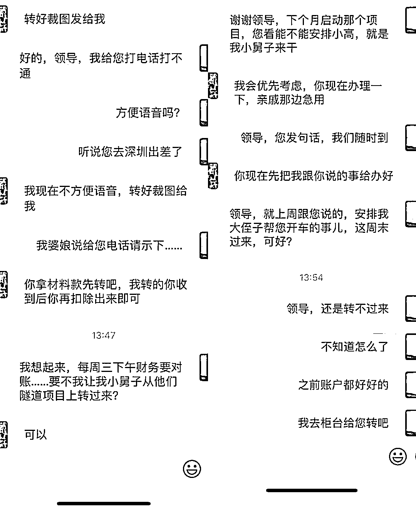

# 假装被骗，前记者将计就计拿到骗子收款卡号，接下来他向骗子要钱了……

> 原文：[`mp.weixin.qq.com/s?__biz=MzIyMDYwMTk0Mw==&mid=2247536540&idx=7&sn=9efceb48bc0cff9ea15de653a4e6702b&chksm=97cb84a4a0bc0db28b248dc95b41ae57be6be6ecfcafa5388f6cb5ec626036fa347ea7fc9527&scene=27#wechat_redirect`](http://mp.weixin.qq.com/s?__biz=MzIyMDYwMTk0Mw==&mid=2247536540&idx=7&sn=9efceb48bc0cff9ea15de653a4e6702b&chksm=97cb84a4a0bc0db28b248dc95b41ae57be6be6ecfcafa5388f6cb5ec626036fa347ea7fc9527&scene=27#wechat_redirect)

平时面都难见到的大领导突然加微信，嘘寒问暖一番就开始“要钱”。

微信这头，小白领把收起激动的表情，寥寥几句话语，开始套路“反杀”。

事了一顿装委屈，深藏功与名。

没想到吧，“名不经传”的小白领，竟然是位前记者。

今天，我们就来聊聊这个套路反杀骗子的故事……

**开头**

** “平平无奇” **

国企大领导，只有开大会见得着。昨天，突然加了几层小职员阿朱的微信，给我们这位做宣传的小白领激动坏了。

难道这就是传说中的“事业转折点”？

阿朱手都不敢抖，看到好友申请里备注的大名，小心翼翼点了同意。

领导蔚然有君子之风，百忙之中温言软语慰问下属工作。阿朱自然不敢怠慢，言语间礼貌又不失热情。

是时候表现要为领导鞍前马后的忠心了，阿朱一句“有什么安排”脱口而出。

果然无事不登三宝殿，“领导”上来就提钱。

亲戚需要用钱，需要阿朱转账周转。

63 万！只能说，“领导”太不了解阿朱的家底了。

**转折**

** “惊喜连连” **

这明显有点为难。

不过领导发话了，他会提前把钱给阿朱转过去，不会让阿朱有损失。

顺手转个账就能帮领导的大忙。为了前途，这忙该不该帮？

阿朱心里打了个转。

不只是因为“穷”，还因为，他毕竟“出身不凡”。

阿朱是咱们反诈中心各大宣传平台的长年老粉，最重要的是，他曾经任职某媒体，名副其实的“前记者”。

于是，阿朱抖了个机灵，给“领导”发了个假的账号。

果不其然，“领导”五分钟后发来一张付款凭证。

根本不存在的账号，又怎么能转账呢？“领导”还向阿朱解释已经跟银行客服确认，戏份已经相当足。

**扮猪吃老虎**

** 反杀！ **

为了让阿朱快点转钱，“领导”已经不用伪装任何下限。

材料费可以挪用吗？当然可以。

工程可以给小舅子做吗？没问题。

大侄子能来当司机吗？那行……

阿朱连番轰炸，骗子啥都答应。心里却焦急，你倒是先把钱转过来啊。

不急，阿朱这才来了兴致，慢慢聊啊，“上个月给你转了 18 万还没还呢。”

骗子已经无力还击，只是机械地催促阿朱转钱。

阿朱使出“王炸”，要辞职，什么破公司，天天让员工转账。

骗子……你慢慢玩，我不陪了

**其实**

**从一开始他就知道这是骗局**

反杀成功，阿朱兴奋之余，决定免费贡献案例，让其他人免遭骗局。

**诈骗套路解析**

**01**

首先，骗子通过不法渠道，盗取群众手机通讯录上所有联系人的联系方式，随后精准发送信息，导致最后出现“一人信息泄露，全单位遭殃”的悲催情况。

**02**

由于单位内部通讯信息泄露，骗子对单位组织架构、人员组成、联络信息等了如指掌，一番伪装后，便通过微信大面积“撒网”添加相关工作人员为好友。

**03**

骗子可以伪装成有关领导，并叫得出你、以及你单位领导、高管的名字。建立联系后骗子做的第一件事自然是博取受害人信任降低后者戒备心。骗子用关心下属工作的口吻，让受害人“如沐春风”，感到受宠若惊，以为自己的工作得到领导的肯定，极大降低戒备之心。

**04**

接下来，便到了下套的时候了

鱼儿上钩后，骗子抓住受害人对领导敬畏、不敢质疑的心理，频繁使用“尽快”“马上”“立即”这些催促性的词语，营造紧张气氛，编造理由让受害人转账，此时利用时间差降低受害人核实转账需求真假的可能性。

**然后，大额的资金就这么被骗走了！！**

**反诈民警提示：**

**领导让转钱？先核实对方的身份是否真实。遇到上级领导添加微信或者 QQ 时，务必提高警惕。凡要求转账汇款，严格执行相关财务管理制度要求操作，以免被骗。**

来源：昆明反电信网络诈骗中心

← 向右滑动与灰产圈互动交流 →

