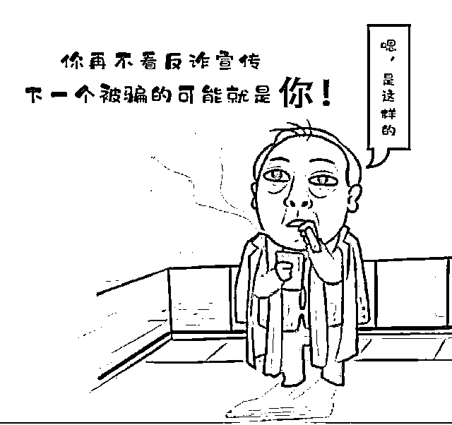

# 揭秘“境外势力招募阳性投毒中国”谣言始末

> 原文：[`mp.weixin.qq.com/s?__biz=MzIyMDYwMTk0Mw==&mid=2247536540&idx=8&sn=63975ed3a7952dda34be19c7a1c4cba1&chksm=97cb84a4a0bc0db22774a4dab14471b2b894546665acebae0fe0637fd5750be690bd840f78e8&scene=27#wechat_redirect`](http://mp.weixin.qq.com/s?__biz=MzIyMDYwMTk0Mw==&mid=2247536540&idx=8&sn=63975ed3a7952dda34be19c7a1c4cba1&chksm=97cb84a4a0bc0db22774a4dab14471b2b894546665acebae0fe0637fd5750be690bd840f78e8&scene=27#wechat_redirect)

**新冠疫情发生以来，各种版本的“一个人祸害一座城”时有发生。**

比如 64 岁的“毒王”毛老太，为过“牌瘾”将新冠病毒从南京带到扬州，致使扬州全城封控； 

安徽怀远的杨某某，因惧怕透露与高风险区域人员密接会被隔离被处罚，故意隐瞒与其从武汉回来的女儿有过接触的真相，致使怀远县医院医护人员 27 人、医院病人 61 人被隔离；

广东祝某，因为隐瞒旅居史和确诊病例的密接史，致使番禺市全城管控...

就在大家以为这些只是单纯的无知、无德时，一则猛料在网上爆出，**有人在豆瓣上招募上海博主到全国景点“打卡”，每个景点报酬一千至两万不等**。

还有网民还根据上海外溢的三起案例总结出“受招人员”的统一做法：**下车后都谎称手机坏了或没有智能手机，支付用现金，到处乱逛时，全程关手机关定位**。

那么，豆瓣上有人“招募上海博主打卡全国”一说，是真的吗？

经查证，4 月 1 日，知乎用户“mixice”在某涉上海抗疫问题下发布回答，内容是**“假如某不合法网站上有人招募，只要飞到指定城市，跑遍主要城区，就能拿到几百万”“背后的组织，以区区几百万代价，就让一座城、一个省陷入停滞。造成的损失绝对过亿”**。

随后，知乎用户“王亚斌”发布评论，内容是**“招募上海博主打卡全国”“有以下地点供选择：长沙、西安、成都、武汉...”“按这个方案，几万块就能干崩一个城市，隐蔽性强，可操性高，基本发现不了”**。

从文字中可以看出，**“招募上海博主打卡全国”****起初只是两人的猜想，然而这条内容经过二次传播，最终变成了所谓“招募公告”**。

4 月 8 日，豆瓣发布声明称，经核实，网传图片源头为其他网络平台，豆瓣用户转发至站内进行了正常讨论。**所谓“招募”系断章取义、恶意嫁接而成，豆瓣站内从未出现此类“招募信息”，该内容纯属恶意造谣。**

4 月 7 日，知乎用户“王亚斌”通过微博“不喘气的兔子”发布声明称，**“文字是我写的，但不是我复制粘贴到豆瓣的”“本人没有制作这张截图，也从未传播这张图片，更没有将它和红码图一同发布进行传播”。**

5 月 12 日，知乎用户“mixice”通过知乎发布声明，**“言论仅为个人无事实依据的猜想，实际情况与猜想不相符”。**

至此，所谓“境外势力招募上海博主打卡全国”一说真相大白，**从头到尾都只是一场网友们的假设、脑洞。**

但是正如网友所说，“有没有一种可能，我们猜到了敌人的布局”，**所以我们依然要提高警惕、严密防范，绝不能让“几万块就能干崩一个城市”成为现实！**

**阴谋论当休矣**

****疫情当前，全民防控，抵制谣言，万众一心！****

**在疫情防控的紧要关头，一旦有人无事生非，造谣生事，就会混淆视听，引发恐慌，扰乱公共秩序，干扰疫情防控工作的有序开展，损人不利己！**

****在此之际，不造谣、不信谣、不传谣，传递正能量，做好本分事，就是我们支援抗疫、参与防控的最好方式！****

**阴谋论当休矣！**

 **** 

**来源：大 R 说安全综合整理高级黑子/中国反诈骗联盟/大 R 科普/大 R 警示/大 R 普法/网络等**

**** ****

**← 向右滑动与灰产圈互动交流 →**

****