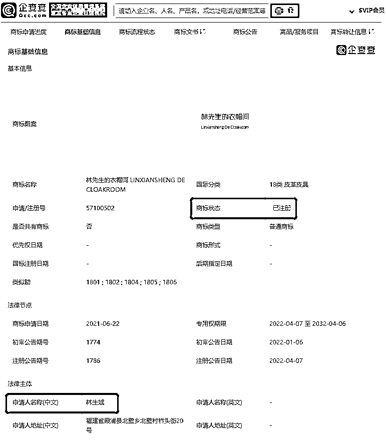
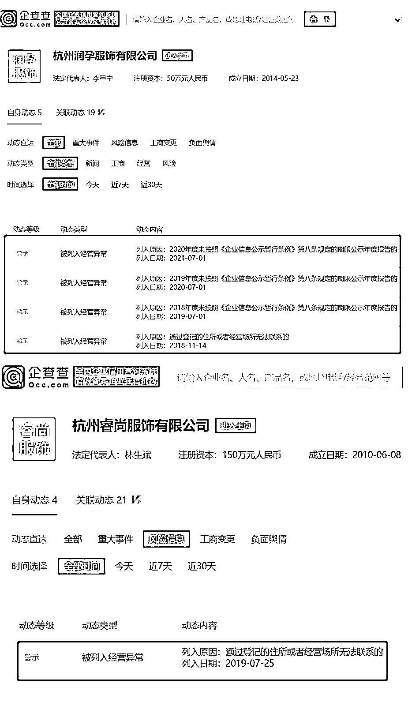

# 林生斌再上热搜！4 家公司经营异常，新商标获批！他的涉税问题…

> 原文：[`mp.weixin.qq.com/s?__biz=MzIyMDYwMTk0Mw==&mid=2247536590&idx=4&sn=26495fd0f833e2fedd1e422a39abf899&chksm=97cb84f6a0bc0de0cd72187086a2e26c1e8e96c7a13e68cb193877193622f30025aea3299c00&scene=27#wechat_redirect`](http://mp.weixin.qq.com/s?__biz=MzIyMDYwMTk0Mw==&mid=2247536590&idx=4&sn=26495fd0f833e2fedd1e422a39abf899&chksm=97cb84f6a0bc0de0cd72187086a2e26c1e8e96c7a13e68cb193877193622f30025aea3299c00&scene=27#wechat_redirect)

今日林生斌又再度被推上了热搜，而消失在网友视线中的林生斌最近又干了啥呢？

据悉，这次被推上热搜是因为林生斌又有了大动作。企查查 APP 显示，近日，林生斌成功注册林先生的衣帽间商标，国际分类涉 18 类皮革皮具。企查查信息显示，林生斌共关联 11 家企业，目前共有 6 家存续，担任其中 2 家企业法定代表人职务，值得注意的是，以上 2 家企业均被当地监管局列为经营异常，此外，其分别担任董事和监事的杭州御垅正衣服饰有限公司、杭州润孕服饰有限公司两家企业也被列为经营异常。

这不得不让人怀疑！有网友甚至直言不讳地说：建议税务局严查！

但其实林生斌注册商标早已不是什么新鲜事了，之前他成立的“潼臻一生”童装就涉嫌偷税漏税的行为，在网上也曾经闹得沸沸扬扬，网友们至今也都还记得！

**林生斌退款**

**偷税漏税的后续呢？**

关于林生斌的公益退款，网上其实存在着两种声音：

有人认为，林生斌是害怕了，因为他涉嫌非法公开募捐。

去年，林生斌事件发生后，有网友提交的举报信，就直指林生斌有“诈捐”“非法募捐、非法集资”的问题。 

而在 2021 年 8 月 3 日，杭州市联合调查组也对林生斌事件发布了通告。 

上面明确写着：“相关部门已按照程序认真开展调查，查证确有违法违规事实的，将依法依规严肃处理。”

在通告发布后不久，林生斌就开始大规模退款了。 

所以这部分网友认为，林生斌心虚了，如果顺着非法募捐的线索盘剥下去，可能会发现更多不为人知的线索。 

还有一部分网友认为，东窗事发后，林生斌受到了巨大的舆论压力，所以选择退款对他来说可能是最好的选择。

但，这次退款究竟是他因为道德绑架不得已而为之，还是留下来的身为人的一丝良知呢~

不管怎样，林生斌还是一片争议声中回归了大众的视野。 

无论最后事件将以何种方式彻底消失在时间中，至少眼前的林生斌，身上还存在着 3 个疑点。

**林生斌偷税漏税事件剖****析**

从杭州警方关于林生斌涉嫌其他违法违规行为的核查情况中，我们看到了 3 个关键词，分别是：涉嫌偷税漏税、涉嫌非法公开募捐、诈捐。

自 2018 年 5 月 1 日起，年应税销售额≤500 万元，为小规模纳税人；年应税额＞500 万元，为一般纳税人。

但公开资料显示，林生斌创办的童装“潼臻一生”网店，在 2020 年 7 月-2021 年 7 月，仅在抖音平台上的销售总额已经接近 2000 万元。

淘宝数据分析服务商店查查数据显示，潼臻一生品牌店未下架商品前宝贝数为 381，月销量为 1.78 万笔。此前，林生斌直播间的商品价格区间基本上在 100-300 元间。若以客单价 200 元粗略推算，该淘宝店全年销售额或超 4000 万元。

根据名嘴宋祖德表示：

“林生斌公司规模很大，至少是一般纳税人，需按照增值税率 9%至 13%纳税，童装成本很低，增值部分大约是营业额的 80%，按照六亿网络营业额计算的话，增值部分应该是 4 亿多，按照 13%增值税率，他网上销售需纳税 5000 万左右。” 

不过针对宋祖德的这种算法，也有网友表示质疑：增值税是分进销项的——营业额*13%，只是个销项税额，公司买的原材料还会产生一个进项税额，销项税额减掉进项税额之后，才是真实的应纳税金。

但要注意，销项- 进项 ，这个算法，销项是用营业额直接乘税率 13%的，不是用 4 亿多这个数乘出来的。

所以说如果增值部分在 4 亿左右，那网上销售需纳税确实是在 5000 万左右。

假设宋祖德所言为实，而且林生斌这 5000 万一分钱没缴纳过，或将面临“50%以上 5 倍以下的罚款”；

如果林生斌确实违法，而且满足“初次被罚免罪”的条件，可以免除“处 3 年以下有期徒刑或者拘役，并处罚金”的刑法处罚。

其次，林生斌曾透露将设立“潼臻一生”公益基金会，不过这个组织却没有在官网上找到相关的信息，反而在淘宝上已经有相关的公益募捐，这就涉及非法公开募捐了。

最后，林生斌还涉嫌诈捐，之前采访的时候说过要将赔偿全部用到基金会，结果可能也没有兑现。

最后，大家对林生斌注册林先生的衣帽间商标有什么看法呢？一起来评论区讨论一下吧！

**此前报道：**

[亡妻生前最后的录音：林生斌你究竟隐瞒了什么？](http://mp.weixin.qq.com/s?__biz=MzIyMDYwMTk0Mw==&mid=2247516937&idx=2&sn=7ec7634c1c15a9125186a18a3f5853d2&chksm=97cb4831a0bcc12707fee0702d01109fa3a624b006d5f7542e6a0be8c4792b01fcabb1656e42&scene=21#wechat_redirect) 

[林生斌首次回应，朋友圈截图曝光：事情真没这么简单！](http://mp.weixin.qq.com/s?__biz=MzIyMDYwMTk0Mw==&mid=2247516982&idx=1&sn=ab40f1ca2c61d99ec17a8859681ccf93&chksm=97cb480ea0bcc1185b4669a8529ca8633ce63ac9869774b5a158319ef9395f0e3570df2e3265&scene=21#wechat_redirect)

[终于有人行动了！林生斌被举报偷税漏税！](http://mp.weixin.qq.com/s?__biz=MzIyMDYwMTk0Mw==&mid=2247517345&idx=2&sn=87390fe5a951b2c6a7545672be32b089&chksm=97cb4f99a0bcc68f2ecc7adba4731b1d9917e92f6d26eb3fc1fe8f83bf414b90518a0a160b48&scene=21#wechat_redirect)

[这些年最大的骗子！出轨还家暴！林生斌被前岳父母公开撕了](http://mp.weixin.qq.com/s?__biz=MzIyMDYwMTk0Mw==&mid=2247518270&idx=1&sn=c771f1d2cedb04f78e856bed15765239&chksm=97cb4306a0bcca10a4085aa3a87e419fee87ff45c76cdc1c6af049496623e380d599fb14ef2b&scene=21#wechat_redirect)

[杭州通报“林生斌”相关调查情况](http://mp.weixin.qq.com/s?__biz=MzIyMDYwMTk0Mw==&mid=2247518416&idx=2&sn=05ae4640cd6cd28aa273d7aac1077f3d&chksm=97cb43e8a0bccafe77547d0cbdbc8710528b6ac069c84ea553d932bab7effdc3282c3b7c3b02&scene=21#wechat_redirect)

来源：会计网

← 向右滑动与灰产圈互动交流 →

