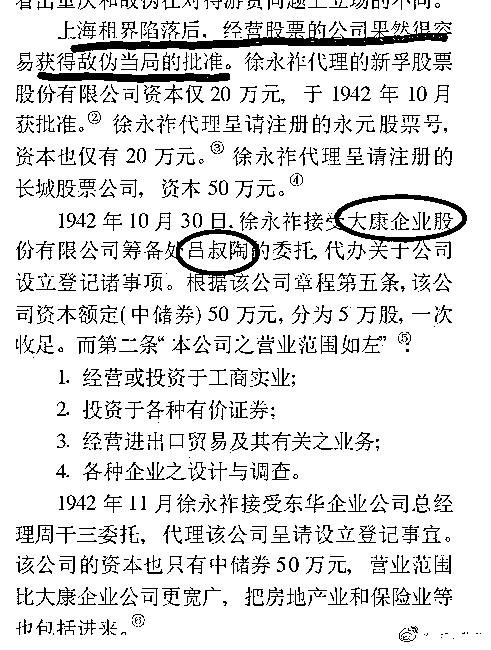
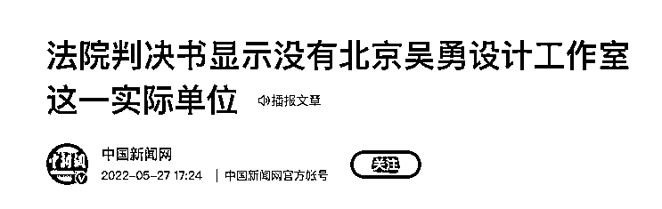

# 关于人教版数学教科书插图的事，有一个人绕不过去——吕敬人！

> 原文：[`mp.weixin.qq.com/s?__biz=MzIyMDYwMTk0Mw==&mid=2247536644&idx=1&sn=38fb66808285d6268d8bda7dc29c93c5&chksm=97cb9b3ca0bc122a3fffd908d6210f37d866b1dba087ed7b9d2d143146255d78ae306a8e17a1&scene=27#wechat_redirect`](http://mp.weixin.qq.com/s?__biz=MzIyMDYwMTk0Mw==&mid=2247536644&idx=1&sn=38fb66808285d6268d8bda7dc29c93c5&chksm=97cb9b3ca0bc122a3fffd908d6210f37d866b1dba087ed7b9d2d143146255d78ae306a8e17a1&scene=27#wechat_redirect)

**明德先生：《关于人教版数学教科书插图的事，有一个人绕不过去——吕敬人！》** 

1、教科书的封面显示，版式设计是北京吴勇设计工作室，封面设计中的吕旻，其父叫吕敬人。

2、吴勇的恩师叫吕敬人。

3、吴勇和吕敬人都曾经在中国青年出版社工作，他们两个人有 1998 年成立工作室，得到了时任中国青年出版社社长的大力支持。 

4、吕敬人何许人也？统编教材的艺术设计总顾问。吕在接受采访时明确提到：“在此之前我们做小学、初中教材已经花费了 7 年的时间，教材推出后社会上出现了各种声音，但我们还是继续按照计划把原有的三阶段设计贯彻完整。” 

5、吕敬人是什么背景？根据公开资料可知，吕家五兄弟，三个在国外。 

6、吕敬人的父亲何许人也？媒体报道时声称，吕敬仁的父亲吕叔陶是一名上海的丝绸商人，曾经参加过淞沪会战。疑点在于，既然是抗战之后来到上海，那自然是 1937 年 7 月之后，而当年 11 月上海就沦陷了，吕老先生带着全家人到上海参加淞沪抗战？此处存疑。

7、查到一篇学术论文《抗战时期的企业公司评价》，里面提到一个“吕叔陶”，在敌伪统治的上海注册了一家名为“大康企业股份有限公司”的企业，此吕叔陶是否为彼吕叔陶，不详。

* * *

**明德先生：《用<申报>证明：此吕叔陶乃彼吕叔陶也！》** 

现在来回答上条微博末尾的问题：那个 1942 年在敌伪政权统治下成立大康企业的吕叔陶，是不是吕敬人之父吕叔陶？

1、根据申报 1941 年 4 月 1 日刊登的资料可知，印花绸厂闻人吕辛伯的弟弟吕叔陶、吕鸿逵和高宣琴、蔡瑞荣二女士结婚。（图 1）媒体吹捧吕家祖上辉煌时明确提到“高宣琴”（吕敬人之母）的名字。（图 2）

由此可知，申报上这个 1941.3 成亲的吕叔陶，就是吕敬人的父亲。而且，吕敬人生于 1947 年，前面有四个哥哥，所以父母于 1941 年成亲，时间吻合。

2、图 1 中提到一个信息，吕叔陶的哥哥是印花绸厂闻人，如果能确定图 3 中的吕叔陶成立的大康企业股份有限公司也是印染厂之类的，我们基本可以断定此吕叔陶就是彼吕叔陶。

3、还是《申报》给力，图 4 为我们提供了一个佐证，1945.2.8 竞华染织有限公司受让给了大康企业股份有限公司——基本证实，吕叔陶的大康企业，也是做染织业的。考虑到前图吕辛伯为弟弟刊登结婚公告时提到的身份——印花绸厂闻人，我们基本可断定，大康企业是吕敬人父亲吕叔陶于 1942 年在敌伪政府统治下创立的。

4、上海当时的印染业是什么情况呢？从图 5 的文献我们可以知道，上海的民族印染业是被日寇军管、然后掠夺的，那么请问：吕叔陶如何在敌伪统治下的 1942 年 12 月 26 日成立印染公司的呢？

5、再说个好玩的事，回到图 1 右上角，就是吕叔陶结婚的消息上面，看到一个叫“盛植人”的名字没有？这是个大汉奸，图 7 是他被军统刺杀的经过。（图 6）

6、在《申报》还查到一条消息（图 8），吕叔陶捐款的消息，更好玩的是，在捐款消息的左侧，新闻大字上赫然写着反英美大会——嗯哼？这是日伪政权，当然要反英美了

7、吕家在日伪政权管理下如鱼得水，说明什么呢？（图 9）

吕家人称自己祖上是民族资本家，不管你信不信，我反正是信了。

* * *

**贩财局：《吴勇这个人，越挖越心惊》（节选）** 

**首先，吴勇这人背景很深。**

**吴勇毕业于清华美院，1998 年从中青社“下海”搞了这个工作室。**

**工作室成立一年，就拿到了瑞士诺华公司，英国皇家芭蕾舞团，美国波士顿交响乐团，联合国儿童基金会的大单，还成为了联合国儿童基金会的顾问。**

********

****吴勇何德何能？这难道不蹊跷吗？****

******后来有网友查到，吴勇大学老师是吕敬人。吴勇在中国青年出版社工作时，老板也是吕敬人。******

******吕敬人是谁？******

******号称是书籍设计界的泰斗，地位很高。******

******吕在接受采访时明确提到：“在此之前我们做小学、初中教材已经花费了 7 年的时间，教材推出后社会上出现了各种声音，但我们还是继续按照计划把原有的三阶段设计贯彻完整。”******

************

******吕敬人是编写教材的艺术总顾问******

******吴勇是吕敬人的学生******

******吕旻是吕敬人的儿子******

******郑文娟既是出版社的编辑，又是吴勇工作室的员工。******

******这个关系网，吕敬人是绕不过去的。******

********然后，吴勇这人很精明，金蝉脱壳********

******新黄河记者检索发现，北京互联网法院曾认定，并没有“北京吴勇设计工作室”这一实际的单位。******

************

******是的，你没看错，《北京吴勇设计工作室》根本不存在这世上。******

******谁也没想到，一个不存在的设计工作室，用了 10 年小学教材，居然是三无产品？******

******一家公司想要正规经营，都要先去工商局完成工商注册登记。假冒公司名义活动是严重违法行为。******

******审批，创作，编辑，批准，出版，发行……居然可以一路绿灯，这下离了大谱了。******

******不过，一个不存在的工作室，彻底形成一个风险隔离，法律层面很难吴勇本人多大责任。******

******也许吴勇预判到有这一天，想办法让自己脱离风险，这招金蝉脱壳真妙啊。******

********结语********

******“吴勇”是个圈子，是个群体，不是个体！******

******来源：实测******

************************

******← 向右滑动与灰产圈互动交流 →******

************