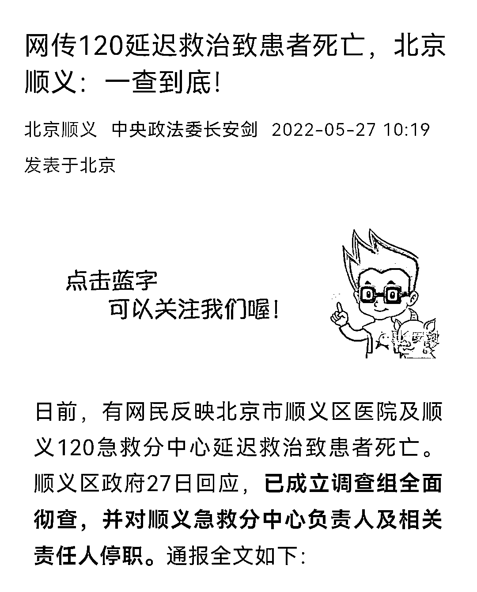
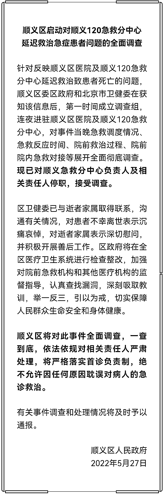
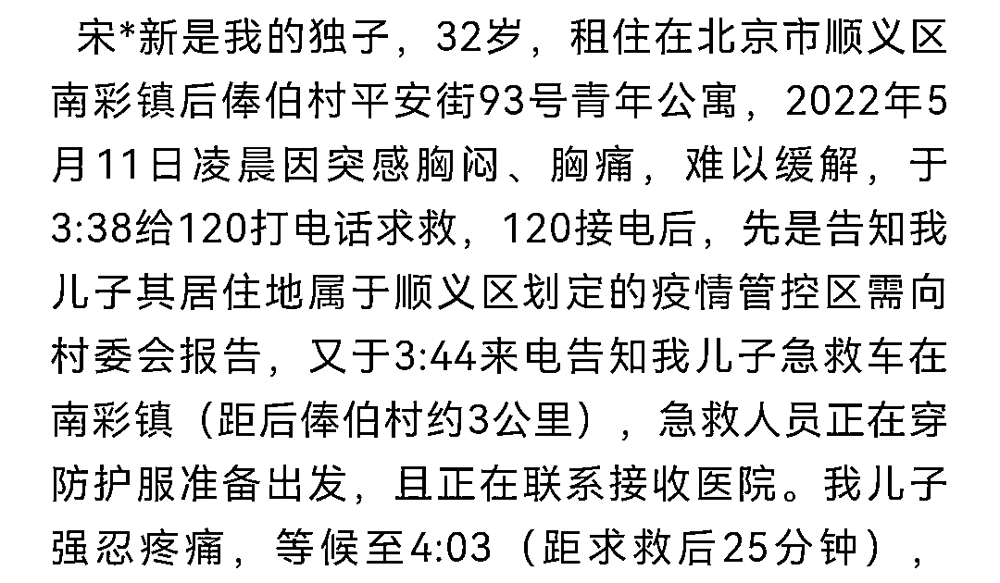
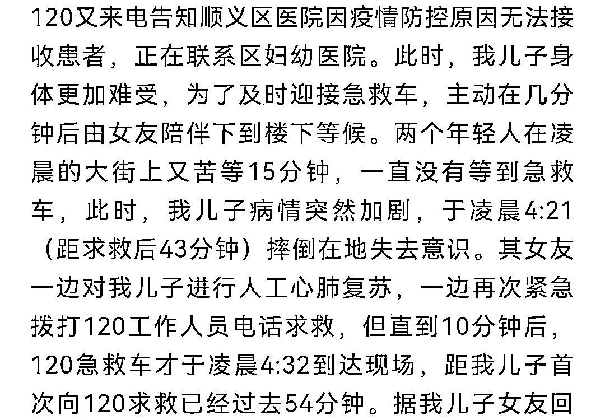
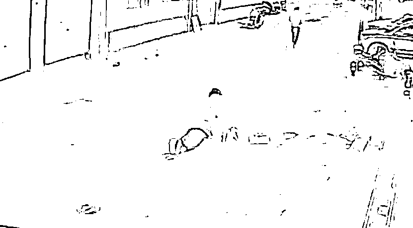
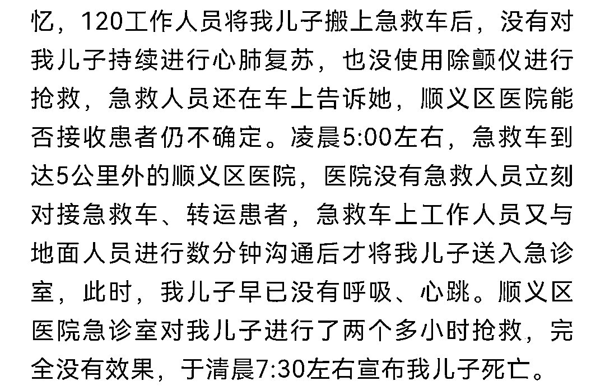
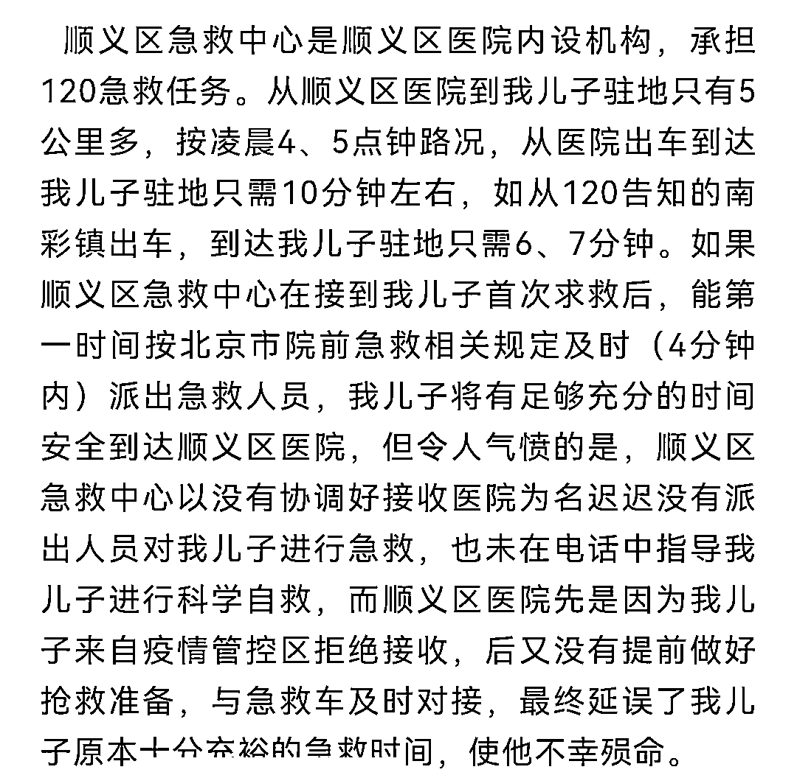
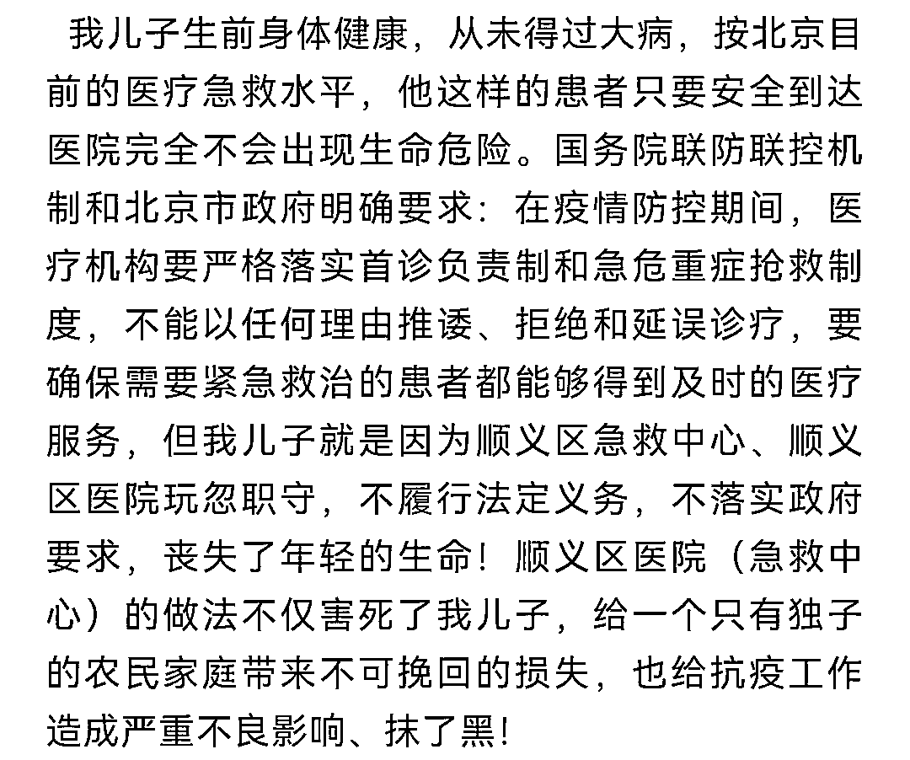

# 在西安上海反复出现的悲剧，北京也没逃脱！

> 原文：[`mp.weixin.qq.com/s?__biz=MzIyMDYwMTk0Mw==&mid=2247536644&idx=2&sn=b510432a5065f036633ef9ccfe87b8f0&chksm=97cb9b3ca0bc122a6ead957ffe9fb706aff98d5e583bd859acc45323c17475fb2538189e8887&scene=27#wechat_redirect`](http://mp.weixin.qq.com/s?__biz=MzIyMDYwMTk0Mw==&mid=2247536644&idx=2&sn=b510432a5065f036633ef9ccfe87b8f0&chksm=97cb9b3ca0bc122a6ead957ffe9fb706aff98d5e583bd859acc45323c17475fb2538189e8887&scene=27#wechat_redirect)

这件事，没有官方的通报出来之前，我们真的不敢说。 

一是被一些偏激的小作文坑害，细节严重失实下，后面很容易反转被打脸（疫情在家出不去，也没法求证）；

二是凡涉及北京的话题，基本都很敏感，尤其在当下。

这件悲剧，是一个朋友在后台发来的。

开始之前，我们先看一下官方的通报，大意是 120 延迟救治致患者死亡。

顺义区的通报全文，措辞很严厉。在调查结果出来之前，这个急救中心的负责人以及相关责任人便已经被停职。 

具体事件的细节，是这位不幸患者的父亲发出来的，他还是一位退伍 J 人！

一个细节是，悲剧发生的日期是 5 月 11 日，身体出现不适时，于凌晨 3:38 分拨打 120 电话求助。120 接通后，先是告知其需向居委会报备，而后于凌晨 3:44 分告知其救护车距离 3 公里，患者等候至 4:03 分还没有等来，而此时已经据拨打 120 过去 25 分钟了。

没有等来，120 却打来电话，告知其顺义区医院无法接受，只能联系其他医院，而后患者为了能及时迎接急救车，在女友的陪伴下到楼下等候，而后在凌晨 4:21 分失去意识，最终急救车在凌晨 4:32 分才来到。而这已经过去了 54 分钟。

女友现场对患者实施心肺复苏的截图；

据老人儿子的女友回忆说，120 工作人员在将患者搬至救护车后，并没有对其持续进行心肺复苏，也未使用除颤仪抢救，凌晨 5 点抵达顺义区医院，医院也没有立即对已经失去意识的患者进行紧急急救，而是沟通数分钟后才送入急诊，但遗憾的是没能抢救回来。

老人认为，医院出车的时间到其儿子那里，仅需 10 分钟的时间，原本有充足的时间可以及时救治，但最终却出现了悲剧，实在令人愤怒。

法律法规规定的也是，疫情防控期间，医疗机构需落实急危重症抢救制度；

事件的脉络，基本就是这样，老人强调自己的所言所述，都有人证物证，相信后续顺义区官方应该能调查清楚。

写至此，我不知道各位对这起事件的看法怎样，其实类似的悲剧在疫情之后，很多地方都已经出现过，被大量讨论无数次了。

包括，我们昨天的文章讨论的也是这个课题。

一如张强医生说的那般，救人的时候先不要管那些条条框框，处分就处分呗，先把命救回来。

我也说了，如果疫情开始，那个救护车的医生不是遵循如此多的规则，而是遵循一个内里的基本道德准则行事，那么老人就不会死；如果吉林那个罹患喉炎的 4 岁女童，在医院遇到的不全都是遵循规则办事的医务人员，哪怕出现一个敢于用良知打破规则的人，她才开始的生命就不会消逝！

不过，也有读者评论说：“张医生做的事好事。但我觉得我们不能把这套逻辑强加在救护车事件的当事医生中，毕竟风险和责任都是当事人承担，我们这叫站着说话不腰疼。我们可以要求自己基于好心打破规则，但不应该要求别人。”

这位读者说得也有道理，世道就是这样，不能用自我的标杆来要求别人也这样，毕竟各人的生活，其冷暖隐晦也只有自己知道。

也所以一个很重要的问题出现了!

为何面对生命的时候，我们去救人都要畏畏缩缩，会拘泥于条条框框内，人性的本真被束缚；为何我们的土壤会导致很多想做好人好事的人不愿意出来做了；为何我们自始至终都没有一个可以让医生，警察等等群体提供一个“做好人”的免责机制。

我们什么时候，人性都被所谓的规则消耗掉，大家都变得不再勇敢，畏缩起来！

如此，大家是都听话了。但人性，互信，道德，底线都没了的时候，我们的未来在哪里？

作者： 吴秀才 来源：我会永远在你身后

← 向右滑动与灰产圈互动交流 →

