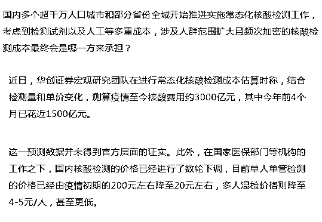
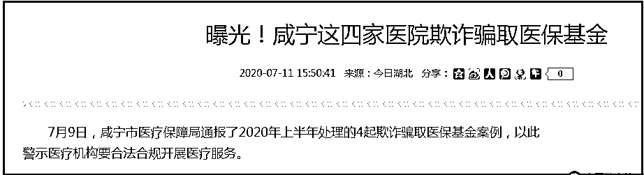

# 核酸已花约 3000 亿元，医保出 80％！全国医保还能坚持多久？刚刚，国家医保局紧急叫停...

> 原文：[`mp.weixin.qq.com/s?__biz=MzIyMDYwMTk0Mw==&mid=2247536644&idx=4&sn=136ca3f026dc10ce9010f007d17764b4&chksm=97cb9b3ca0bc122ab8b1880386b72a9825a8d51f9f74a2f10fe42c231fdd656ae3b8db1edcbe&scene=27#wechat_redirect`](http://mp.weixin.qq.com/s?__biz=MzIyMDYwMTk0Mw==&mid=2247536644&idx=4&sn=136ca3f026dc10ce9010f007d17764b4&chksm=97cb9b3ca0bc122ab8b1880386b72a9825a8d51f9f74a2f10fe42c231fdd656ae3b8db1edcbe&scene=27#wechat_redirect)

**尽管姗姗来迟，但终究还是叫停了。** 

**据第一财经报道：**近日，全国多地的医保部门陆续收到了国家医保局抄送的一份函件，明确提出用医保基金支付大规模人群核酸检测费用不符合现行医保政策规定，要求相关地区立即整改。

第一财经从两个不同省份的市级医保管理部门获悉了这份函件内容。一位医保业内人士对第一财经表示，近日南方某地向国家医保局请示是否可用医保基金支付大规模人群核酸检测费用，国家医保局办公室回复这种做法“不符合现行规定”。

“国家医保局批复不得用医保基金支付大规模人群核酸检测费用，要求该地立即整改，并将函件内容抄告全国 31 个省市的医保部门”，这位人士称。

第一财经从相关人士处了解到，由于该地医保基金结余量非常大，在抗疫这两年间，该地允许医保基金用于支付大规模人群核酸检测的费用。具体的做法是大规模人群核酸检测的该区域内参保人费用纳入医保基金按照一级医疗机构住院报销比例，其余由各级财政负担。

《2021 年医疗保障事业发展统计快报》显示，2021 年末基本医疗保险（含生育保险）累计结存 36121.54 亿元。此外，结余主要集中在部分人口流入的省份和地区。 

**按照《国家医疗保障待遇清单（2020 年版）》的规定，包括“应当由公共卫生负担的”在内的六种情形医疗保险将不予支付。但该文件也规定，“遇对经济社会发展有重大影响的，经法定程序，可做临时调整”。**

某证券研究部门日前发布的一份报告中提到，江苏省宿迁市有规定由医保报销 70%～95%的核酸检测费用，但据第一财经向相关人士采访证实，宿迁全面执行江苏省医保局的相关规定，医保基金并没有支付大规模人群核酸检测的费用。

中国政法大学民商经济法学院教授、社会法研究所所长娄宇对第一财经表示，医保基金由参保人缴费汇集而成，所有权人是统筹地区的参保人，应当由参保人代表在法律的范围内决定其用途。按照我国《社会保险法》的规定，社保基金不得用于平衡政府预算，县级以上人民政府在社会保险基金出现支付不足时，给予补贴。

**再此之前，第一财经报道：**

**但不管核酸检测价格如何下调，相关成本终究还需有人承担。“扩围加密”且基本对参与民众免费的常态化核酸检测，到底是谁在买单？**

**上述研究团队称，一个被遗忘、但至关重要的测算前提，是常态化核酸费用约 80％由医保负担，各级财政仅需支付约 20％。而全国医保仍有 3.6 万亿元“余粮”，足够全民 2 天一测 3 年半。**

**此外，医保基金是人民群众的“看病钱”“救命钱”，地方上如需大规模使用势必要经过监管部门的授权和许可，且要考虑基金的可持续性问题。**

**当前，全国层面并未统一常态化核酸检测的支付方式。华创证券的上述研究报告称，从深圳、青岛、宿迁等地的规定看，70％~95％由医保报销，财政负担仅约 2 成。**

广东省是我国较早将大规模核酸检测费用纳入医保基金支付的省份。广东省允许大规模人群核酸检测的省内参保人费用纳入医保基金按一级医疗机构住院报销比例支付，其余由各级财政承担。

**山东、北京等规定所需费用由财政资金和医保基金共同负担。山东省明确规定了财政和医保各自负担的内容：发热门诊(哨点)患者、住院患者核酸检测费用由医保基金按原规定支付，其余费用由财政负担。** 

**从地方医保基金的实际情况来看，一些地区尤其是中西部地区的医保基金在承担大规模核酸检测费用方面也显得“力不从心”。**

**《2021 年医疗保障事业发展统计快报》显示，2021 年，基本医疗保险基金（含生育保险）总收入、总支出分别为 28710.28 亿元、24011.09 亿元，年末基本医疗保险（含生育保险）累计结存 36121.54 亿元。**

从参保群体分布看，这 3.6 万亿元结存中又主要分为两部分：一是职工基本医疗保险基金（含生育保险）年末累计结存 29409.24 亿元，其中统筹基金累计结存 17833.82 亿元，个人账户累计结存 11575.43 亿元；二是城乡居民基本医疗保险基金年末累计结存 6712.30 亿元。

这也意味着，职工个人账户累计结存大约占到了整体医保基金结存的 32%。

**此外，虽然从全国范围来看有高达 3.6 万亿元的累计结存，但基金结余地区分布非常不平衡，主要集中在部分人口流入的省份，集中程度还在不断提高。国家医保局统计，人口流入较多的东部 6 个省市，职工医保的统筹基金累计结余，2020 年占全国比例已经上升到 56.6%，同时在老龄化的影响下，基金收入增速低于支出增速将成为新常态，很多地方的医疗保障基金当期和中长期平衡都存在一定压力。**

**有民众反映一些地方出现了医保报销待遇下降，之前能报销的药品和项目报销不了的情况，因此认为是医保基金用于抗疫的费用挤占了正常的医疗支出。**

以上内容来自第一财经，文末，我们再普及一下先医保的基础知识。

医保又称医疗保险基金，是指国家为保障职工的基本医疗，由医疗保险经办机构按国家有关规定，向单位和个人筹集用于职工基本医疗保险的专项基金。

基本医疗保险基金包括社会统筹基金和个人账户两部分，由用人单位和职工个人按—定比例共同缴纳。

一句话：医保基金是人民群众的“看病钱”“救命钱”。

尽管是救命钱，但非法套取医保基金的案件几乎年年都有发生。

这么多人套取医保基金，难道医保金很宽裕？事实上恰恰相反，数据显示，很都地方，医保基金已经“穿底”。

甚至早已入不敷出。

也是在刚刚，国家医保局办公室、国务院联防联控机制医疗救治组日前印发《关于进一步降低新冠病毒核酸检测和抗原检测价格的通知》，要求各地在 6 月 10 日前将新冠病毒核酸检测单人单检降至不高于每人份 16 元，多人混检降至不高于每人份 5 元。

此前，国家卫生健康委医政医管局负责人表示，我国疫情防控进入应对奥密克戎变异株流行新阶段，部分地区已经开展常态化核酸检测。根据通知，新冠病毒核酸检测政府指导价为最高限价，公立医疗机构实际收费标准不得上浮，下浮不限。

来源：喻言亭阁 

← 向右滑动与灰产圈互动交流 →

