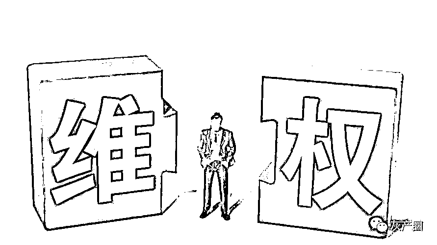

# 维权为什么这么难？维权该找谁？16 个投诉电话告诉你（值得收藏）

> 原文：[`mp.weixin.qq.com/s?__biz=MzIyMDYwMTk0Mw==&mid=2247536644&idx=5&sn=41cc27a2a6a274ccd25271459639b425&chksm=97cb9b3ca0bc122aff30cbe95c8db249fb2c2fc5ebce9ce37c13d27b24a94b2b453a1cf47835&scene=27#wechat_redirect`](http://mp.weixin.qq.com/s?__biz=MzIyMDYwMTk0Mw==&mid=2247536644&idx=5&sn=41cc27a2a6a274ccd25271459639b425&chksm=97cb9b3ca0bc122aff30cbe95c8db249fb2c2fc5ebce9ce37c13d27b24a94b2b453a1cf47835&scene=27#wechat_redirect)

你是否遇到过在餐厅吃出异物，不知道如何维权？ 

在网上购物，商品出现质量问题，不知道如何解决？

手机经常接到骚扰电话，烦得不知道怎么办？

被人打了后，如何文明维权？

买房被坑，交房后出现各种问题，怎样做才能维护自己的合法权益？

工作了好久，结不到工资，急得焦头烂额？

    

16 个电话，包含公安、检察院、法院、劳动者、公司、衣食住行等方方面面，为你解决问题：

一、12345 政务服务便民热线（简称 12345 热线），指各地市人民政府设立的由电话 12345、市长信箱、手机短信、手机客户端、微博、微信等方式组成的专门受理热线事项的公共服务平台，提供“7×24 小时”全天候人工服务。

二、12348 是市、区县司法局及法律援助中心面向广大市民群众的法律咨询专用电话，它接受解答群众的法律咨询，配合调处民间纠纷，及时反映群众的法律需求信息，指导和接受法律援助申请，维护贫弱当事人的合法权益、维护司法公正、维护社会稳定。

三、12333 是全国人设政务服务平台，为您提供就业创业、社会保障、人才人事、劳动关系、社会保障卡等方面的服务。

四、12389 全国公安机关及民警违纪违法举报电话。

五、12309 全国检察机关统一对外的智能化检察为民综合服务网络平台，通过 12309 网站、12309 检察服务热线（电话）、12309 移动客户端（手机 APP)和 12309 微信公众号四种渠道，向社会提供服务。

六、12368 全国司法信息公益服务号码，主要用于案件信息查询，提供诉讼指引，协助联系法院工作人员的。

七、12388 全国纪检监察机关统一举报电话于，受理群众对党员及领导干部和国家公务员违反党纪政纪行为的检举控告，或对党风廉政建设和反腐败工作方面的意见建议。

八、12358 物价局举报电话，可以举报关于产品价格哄抬价格、变相压低抬高 、操纵市场价格，损害消费者、经营者或者国家利益的行为等。

九、12365 全国举报投诉处理、咨询服务、信息传递等综合服务平台，负责受理关于产品质量、计量、标准化等发面的申诉、投诉、举报、产品质量咨询、产品防伪查询等。

十、12338 是全国妇女维权公益服务热线，主要为妇女儿童提供法律、婚姻、家庭、心理、教育等方面的咨询，并受理有关妇女儿童侵权案件的投诉。

十一、12328 交通运输服务监督电话，是各级交通运输主管部门倾听民声、畅通民意、汇集民智的载体，可以为人民群众表达意愿心声、反映利益诉求、参与行业治理。

十二、12377 是互联网违法和不良信息举报中心，设立针对网站、论坛、社区、博客、微信、微博、QQ、云盘、抖音、快手等通讯和下载工具、自媒体平台等传播各类违法和不良信息的监督。

十三、12336 是中华人民共和国国土资源部开通的违法举报电话号码，意在对社会各界对违法用地情况、违反土地资源管理的情况进行举报监督。

十四、12319 城建设部、信息产业部确认的城市建设服务热线，涉及公共交通、供水、燃气、供暖、违章建筑等方面。

十五、12315 市场监督管理局解决消费者因生活消费、使用商品、接受服务、经营者违法社会监督管理法律、法规的举报。

十六、12366 国家税务总局纳税服务热线，纳税人偷、逃、骗税税，发票违章，纳税申报和查询等。

维权，维护的是自己的权益，不是道德绑架博同情。在国内，普遍的缺乏维权意识，不识法，不知法！在没有涉及到自身利益的时候，往往都是袖手旁观。该不该维权，当然应该！至少我遇到想要维权的数百人当中，都是为了那么一点点的权益。 

实际上在年轻的一代人中的维权意识，已经很高了！

来源：实测

← 向右滑动与灰产圈互动交流 →

