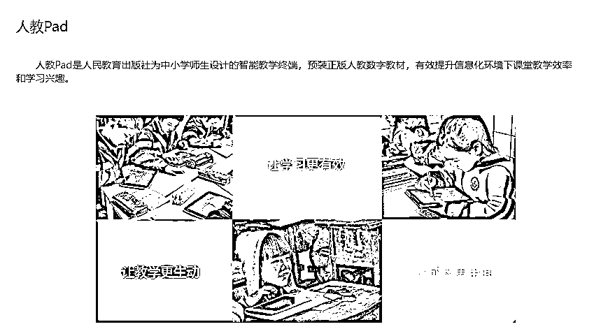
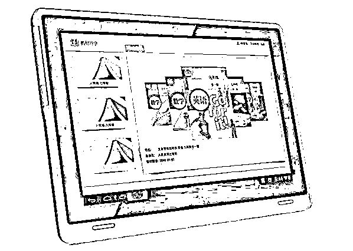
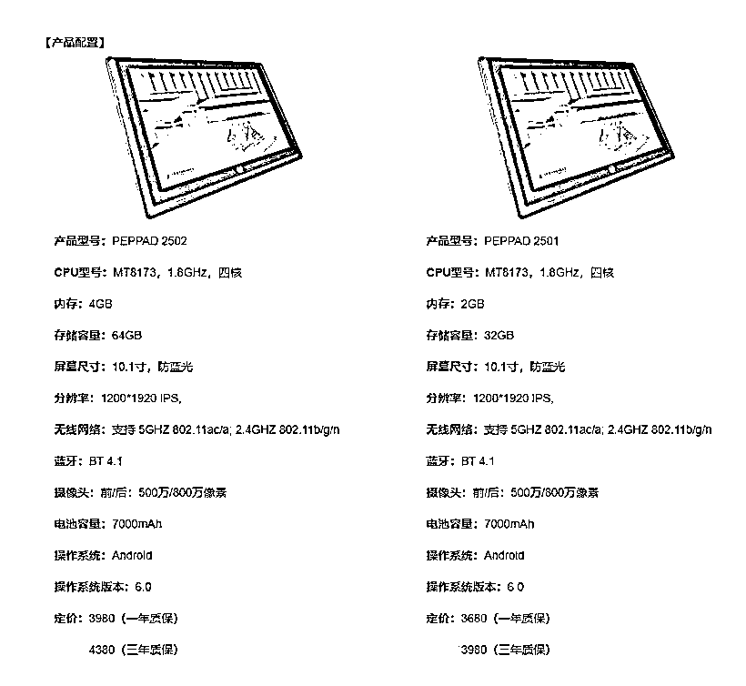

# 人教 Pad 被扒：定价超 4000 元，配置低端

> 原文：[`mp.weixin.qq.com/s?__biz=MzIyMDYwMTk0Mw==&mid=2247536644&idx=6&sn=609c23bd76bd0d9b74307bd645fe3e7a&chksm=97cb9b3ca0bc122a1de1e092d3b2f1c83f7eda6924e909bfd80c68085bb135e9e6cf3662246e&scene=27#wechat_redirect`](http://mp.weixin.qq.com/s?__biz=MzIyMDYwMTk0Mw==&mid=2247536644&idx=6&sn=609c23bd76bd0d9b74307bd645fe3e7a&chksm=97cb9b3ca0bc122a1de1e092d3b2f1c83f7eda6924e909bfd80c68085bb135e9e6cf3662246e&scene=27#wechat_redirect)

近日，成立于 1950 年的人民教育出版社（下称人教社）因教材插图“丑”，引发大量关注。

5 月 26 日教育部教材局已介入调查插图争议事件。同日，人教社表示已着手重新绘制有关册次数学教材封面和部分插图。

与此同时，人教社的一款平板电脑产品也被媒体扒出，据中新经纬报道，人教社也加入了近年来各教育和硬件巨头扎堆进入的**学生平板电脑**（Pad）业务。

官网显示，人教 Pad 是人教社为中小学师生设计的智能教学终端，预装正版人教数字教材，分为两种配置，依据质保期限不同，定价不同，价格区间在 **3680 元 —4380 元**之间。人教社在 2016 年曾披露，第二代人教 Pad 已服务珠海市 50 余所学校。

人教社官方客服称，目前人教 Pad 不向个人消费者出售，均为学校统一采购，**采购价以官网披露的价格为准**，不存在“量大从优”之类的优惠。

IT 之家查看人教社官网发现，人教 Pad 配置低端，采用 10.1 英寸 1200*1920 分辨率的大屏，搭载联发科 **2015** 年推出的 **MT8173** 四核处理器，最高存储规格为 4+64GB，运行 Android 6.0 系统。

来源：IT 之家

← 向右滑动与灰产圈互动交流 →

