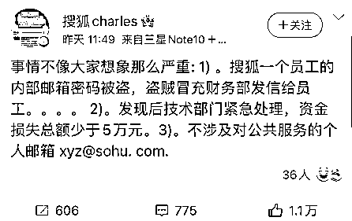
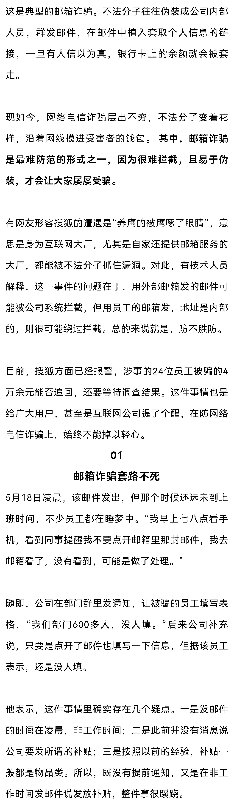
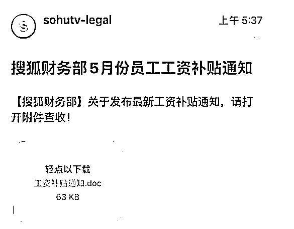
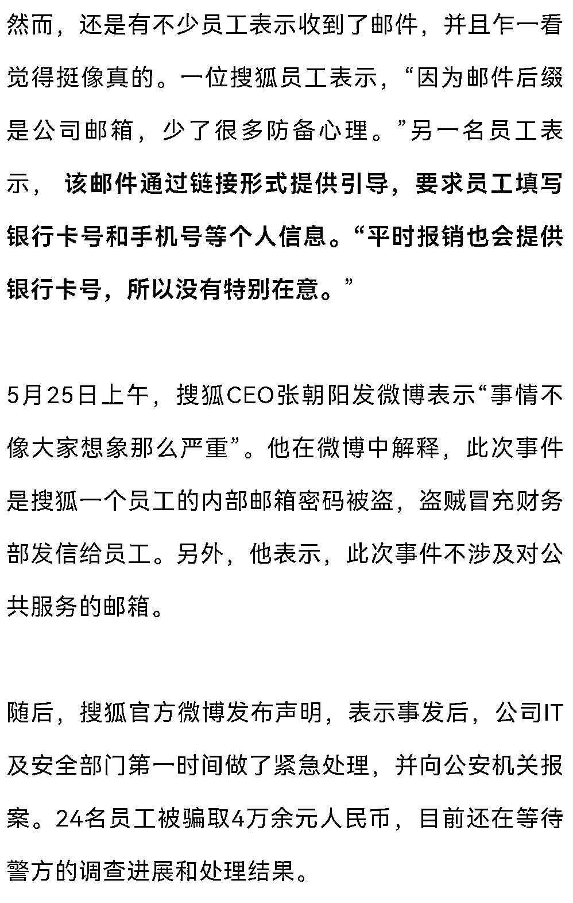
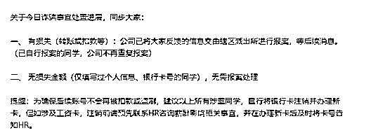
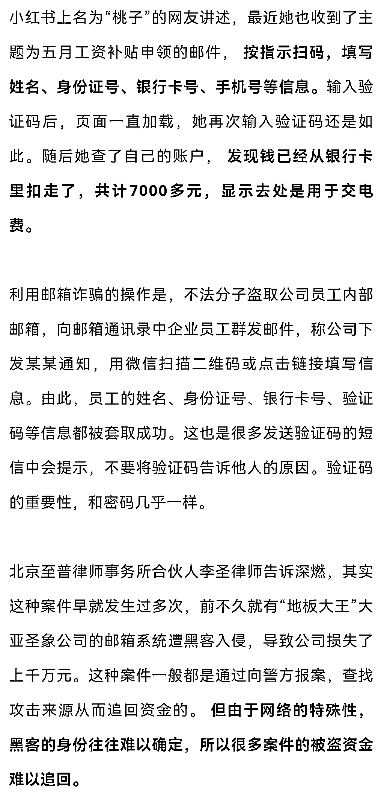
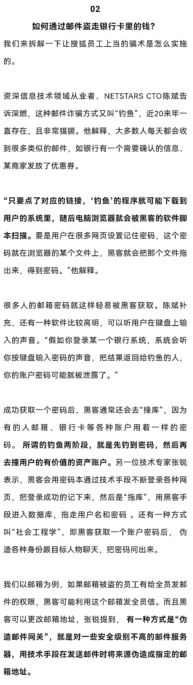
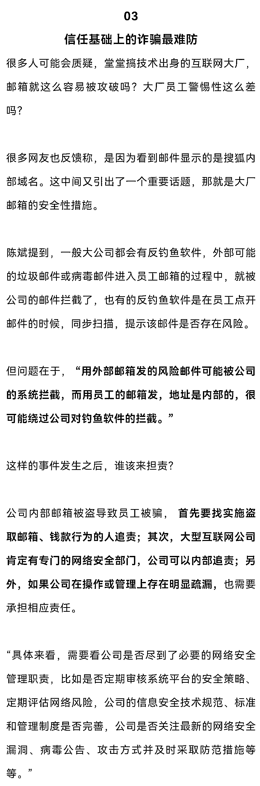
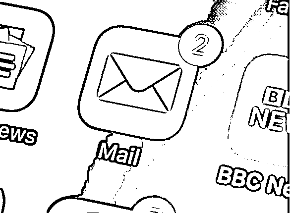

# 做邮箱服务“搜狐”被邮箱诈骗了，IT 精英也逃不过的电信诈骗距您还远吗？

> 原文：[`mp.weixin.qq.com/s?__biz=MzIyMDYwMTk0Mw==&mid=2247536644&idx=7&sn=5e15cb113b4868fc43ea7210e862b5e9&chksm=97cb9b3ca0bc122a6c35a8aac1837f49a164fe68ad5298b79030d66597083e871fe103319401&scene=27#wechat_redirect`](http://mp.weixin.qq.com/s?__biz=MzIyMDYwMTk0Mw==&mid=2247536644&idx=7&sn=5e15cb113b4868fc43ea7210e862b5e9&chksm=97cb9b3ca0bc122a6c35a8aac1837f49a164fe68ad5298b79030d66597083e871fe103319401&scene=27#wechat_redirect)

以下内容来源于深燃微信公众号，作者深燃团队。

**做邮箱服务的搜狐，被邮箱诈骗盯上了**。据一份网传的微信群聊记录显示，搜狐全体员工在 5 月 18 日早晨收到一封名为“搜狐财务部 5 月份员工工资补贴通知”的邮件，发件人的域名是“sohutv-legal”，邮件正文再次标注来自搜狐财务部。层层包裹下，这看起来似乎就是一封正经的内部邮件。** 有搜狐员工点进去，按照指示操作，填入了个人信息，结果银行卡上的余额被划走。**

到了 5 月 25 日，事件持续发酵，一度登上微博热搜第一。搜狐 CEO 张朝阳也公开做了回应。

该邮件的内容 来源 / 受访者供图

搜狐员工群里的通知 来源 / 受访者供图有网友表示，如果是自己遇到这种邮件，写着“补贴”，而不是“发工资”这么明显的谎言，肯定也会忍不住点开。** 这恰恰就是不法分子踩准的心理，攻进内部邮箱只是第一步，还要起一个“诱人又合理”的标题。**5 月 25 日下午，360 集团 CEO 周鸿祎发布微博，提到了邮箱诈骗的套路。他分析，假借单位的名义给大家发邮件，如加薪名单等等，再做成 Excel、PDF、Word，“你一定会忍不住看下，只要你打开看，就会有恶意程序或代码利用漏洞入驻，然后对你发起进一步网络攻击。”网传的搜狐内部聊天记录截图中提到，搜狐作为一家做邮箱的公司，自己的邮箱反倒被入侵，这种事情好比是“一个网络公司，被人偷了家。”实际上，搜狐员工不是唯一的受害者，此类骗局也并不新鲜。事情在网上引起讨论之后，不少网友表示，自己的公司也曾遇到过类似的情况，甚至有的公司还会组织“防骗演习”，发送邮件测试员工是否有防骗意识。

假如黑客获取的员工邮箱没有权限给全公司员工发邮件，想要攻下公司财务部负责人的邮箱也不难。陈斌举例，黑客可以冒充该员工给公司财务部负责人发邮件，假装咨询事情，只要财务部负责人点了设定好的链接，黑客又可以通过前文所述的方式获取公司财务部邮箱的密码，冒用财务部的权限来发全员邮件。至于最后黑客冒充公司给员工发邮件骗取信息的套路也有很多，陈斌提到，有骗子假装公司发出类似“为了加强公司信息安全，所有人今天都要把某某账户的旧密码换成新密码”，** 换密码的时候系统提示先输入旧密码，再输入新密码，这样骗子就把用户的两个密码都掌握了。**获取密码的下一步是拿到资产。某技术类大厂员工瑞奇解释，银行卡上的钱被划走分两类，转账或消费。如果是转账稍微麻烦点，大部分需要要授权，比如密码、验证码之类；消费更简单点，不一定要输入银行卡绑定的手机验证码。这里面又分两种情况，一种是骗子通过一定的技巧获取用户信任，得到了银行卡号、密码、验证码等个人信息，这样拿走卡内资产就相当容易了。还有一种是，骗子只是获取了用户的银行卡号，通过“撞库”获取了密码，再加上一些银行的网页版，没有验证功能，有账号密码直接登录就可以，也可能划走银行卡里的钱。就这样，从点击一封垃圾邮件或一个不明链接，到自己的账户被盗，再到银行卡的钱被转走，一条完整的路径就出来了。

对公司来说，“搜狐作为知名的互联网科技公司，** 其内部邮箱被盗必定会使大众对其网络科技水平产生质疑，对公司形象造成的负面影响**，搜狐可以要求黑客对由此造成的经济损失进行赔偿。被骗员工在不存在明显过失的情况下，可以要求公司先进行相应的补偿，在追回款项后，公司可以向黑客进行追偿。”
在量刑上，以发放补贴的名义骗取员工银行卡号，划走卡内钱款，达到一定金额的，构成诈骗罪，本案虽然被骗金额未超过 5 万元，** 但利用电信网络技术手段诈骗公私财物价值三万元以上的，已经达到了刑法第 266 条诈骗罪中“数额巨大”的程度。**“作案者涉嫌构成非法获取计算机信息系统数据、非法控制计算机信息系统罪以及诈骗罪，需要对此承担相应的刑事责任。”最后，再次提醒所有人，警惕诈骗，要从方方方面做起。结合多位技术专家的观点，** 首先要看清楚收到的邮件和短信等信息。**一个商家或企业发来的信息，邮件域名应该是这个企业的名称，要检查发件人的地址是不是真实，打开的网页网址是不是正规。其次，个人账户安全方面，“很多用户的密码设置得太简单，大部分人用的是自己和家人的姓名、生日、纪念日、电话号码等，这些信息用各种手段都很容易获取，再用技术规则不断试就行了。”**为了账户安全，除了重视密码设置，还要做银行卡安全设置。****比如超过一定数额的转账需要人脸识别或者语音确认；****不到必须的时候，不提供完整银行卡号，只提供卡号的前四位和后四位数；****扫描二维码的时候注意看屏幕提示，跟场景不对的不要点确定，不扫来源不明的码。**陌生人通过网络、短信、电话等方式要求转账汇款的，一律不要听信；短信、社交软件上陌生人发来的各种链接一律不要点击；不要轻信天上掉馅饼的中奖信息、高息贷款信息；最后，不要轻易将自己或家人的身份信息、联系方式等泄露给他人，遇到疑似诈骗信息时，要多方查证，避免上当。但，所有的避坑方式，都很难解决在信任基础上的诈骗。像搜狐员工事件，就是因为部分员工相信了这是来自公司的信息。“安全性是个对抗问题，利益足够大的时候，就会有高手盯上，双方相互出招拆招。”我们能做的，只有万分警惕，擦亮眼睛。

*题图来源于视觉中国，文中配图来源于 unsplash。应受访者要求，文中张锐、瑞奇为化名。

来源：天下有诈，深燃

← 向右滑动与灰产圈互动交流 →

