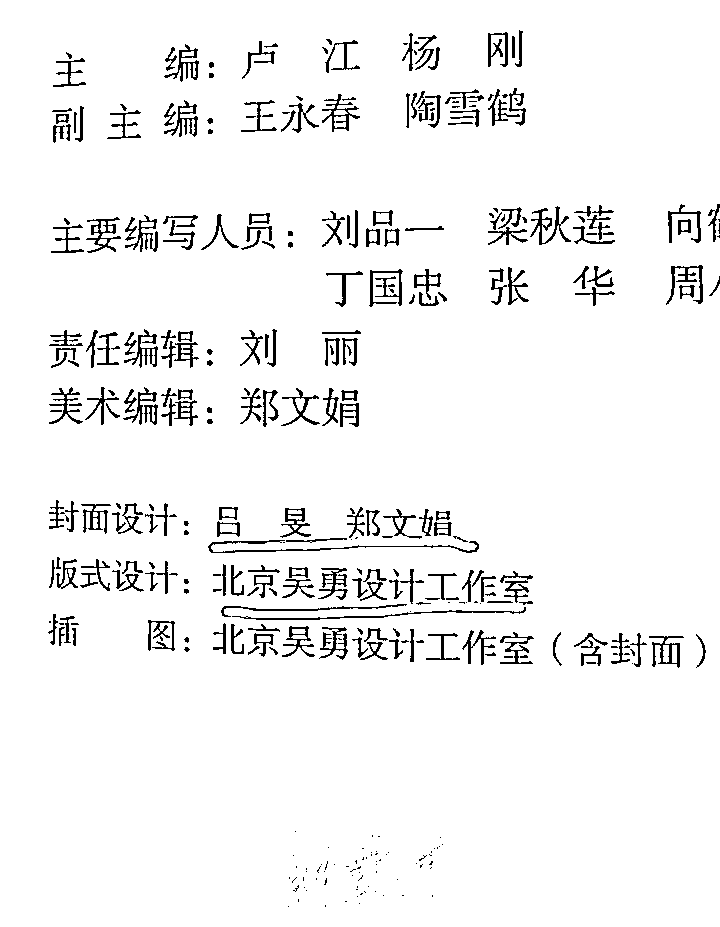
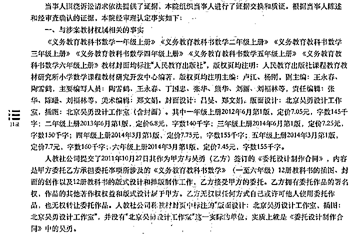
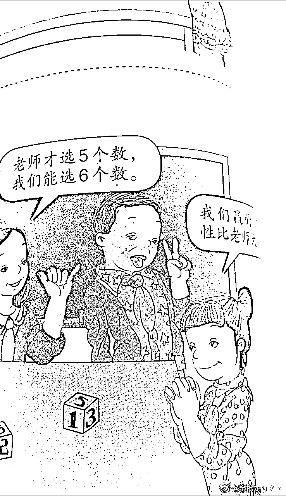

# 北京互联网法院认定：吴勇设计工作室不存在

> 原文：[`mp.weixin.qq.com/s?__biz=MzIyMDYwMTk0Mw==&mid=2247536703&idx=1&sn=6b7a9df6122057cb080806dd91c6b4ef&chksm=97cb9b07a0bc1211294f1e4de4e54a0175a3a27a35811bb2f8f34903ba87a2fea1a10ec592dd&scene=27#wechat_redirect`](http://mp.weixin.qq.com/s?__biz=MzIyMDYwMTk0Mw==&mid=2247536703&idx=1&sn=6b7a9df6122057cb080806dd91c6b4ef&chksm=97cb9b07a0bc1211294f1e4de4e54a0175a3a27a35811bb2f8f34903ba87a2fea1a10ec592dd&scene=27#wechat_redirect)

近日，人教版数学教材插图引发巨大争议（此前报道：[唐氏儿、裸露、纹身……人教版教材引发全网愤怒！背后真相细思极恐……](http://mp.weixin.qq.com/s?__biz=Mzg3OTExNDYyOQ==&mid=2247485404&idx=1&sn=f74975d5c108a9ab309bda2d248a6eb6&chksm=cf082736f87fae2006aa88305c93271fc85288882b421872f464181a3466142fd6b3c1032174&scene=21#wechat_redirect)）。部分网友表示，插画人物眼神奇怪、毫无审美可言。该教材自审定以来，已经使用了 10 多年。 

5 月 26 日教育部教材局已介入调查插图争议事件。同日，人教社表示已着手重新绘制有关册次数学教材封面和部分插图。教材副页显示，插图（含封面）由北京吴勇设计工作室设计。事发至今吴勇及吴勇工作室均无正面回应公众的质疑。

新黄河记者检索发现，在中国裁判文书网 4 月 1 日公布的一份判决书显示，北京互联网法院认定，并没有“北京吴勇设计工作室”这一实际的单位。

据判决书内容，厦门一公司在未经人教社公司许可的情况下，在其运营的微信公众号分别上传了 1-6 年级人教版电子数学教材，公众可以在规定的时间和地点获取上述教材，侵犯了人教社公司对此享有的信息网络传播权。最终，北京互联网法院判处该公司赔偿人民教育出版社有限公司经济损失 12000 元。而所涉数学教材的插画正是人教社公司委托吴勇设计制作。

这份判决书的当事双方是厦门一公司跟人教社公司的纠纷，跟吴勇并没有关系，但意外的是，在判决书中，透露了有关人教社公司与北京吴勇设计工作室的合作细节。据判决书显示，2011 年 10 月 27 日，人教社公司作为甲方与吴勇（乙方）签订的《委托设计制作合同》，内容是甲方委托乙方承担委托事项所涉及的《义务教育教科书数学》（一至六年级）12 册教科书的插图、封面的创作以及 12 册教科书的版式设计和排版制作工作，乙方接受甲方的委托。乙方拥有委托作品的署名权，作品的其他著作权权益和版式设计属于甲方。乙方无权以任何方式自己或许可他人使用委托作品，也无权转让委托作品。人教社公司称教材封页中标注的“版面设计：北京吴勇设计工作室，插图：北京吴勇设计工作室”，并没有“北京吴勇设计工作室”这一实际的单位，实质上就是《委托设计制作合同》中的吴勇。

网络上针对这本教材的插画，批评非常尖锐。有人认为，一眼看上去就不美，扭曲小孩子的审美观；有人评价画面中的儿童眼神迷茫懒散，丝毫没有反映出中国少年儿童的精气神；更有人指出，画作风格阴郁怪异，恐怕对儿童身心健康有负面影响。也有人反驳该观点，认为是过度解读。

据澎湃新闻报道，在 2014 年 6 月 3 日，一篇题为《人教社小学数学教材插图设计探究》的硕士论文通过了答辩，作者韩某就读于汕头大学长江艺术与设计学院，论文导师即为吴勇。论文中称赞来自吴勇工作室的人教版插图“个性鲜明”。

公开信息显示，吴勇，毕业于中央工艺美术学院(现清华大学美术学院)装潢系书籍装帧专业。是一名设计师，北京吴勇设计工作室创始人。他曾为汕头大学长江艺术与设计学院视觉传达专业主任、教授、硕士生导师。

（新黄河记者 王立奎 ）

来源：@济南时报

更多精华好文，请点击关注

← 向右滑动与灰产圈互动交流 →

