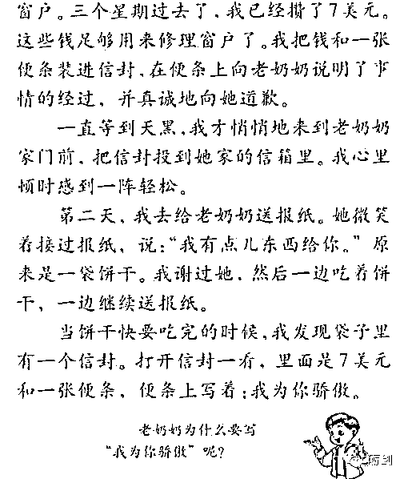

# 《小学语文课本》调查报告来了！已向教育部实名举报！

> 原文：[`mp.weixin.qq.com/s?__biz=MzIyMDYwMTk0Mw==&mid=2247536703&idx=2&sn=7b3db53420c201cef7c6801a4ed0bfff&chksm=97cb9b07a0bc1211eea33d9be7dd41cf0e9e6c4c1e200f3efc57f22ea127e76b76ed09828a02&scene=27#wechat_redirect`](http://mp.weixin.qq.com/s?__biz=MzIyMDYwMTk0Mw==&mid=2247536703&idx=2&sn=7b3db53420c201cef7c6801a4ed0bfff&chksm=97cb9b07a0bc1211eea33d9be7dd41cf0e9e6c4c1e200f3efc57f22ea127e76b76ed09828a02&scene=27#wechat_redirect)

**关于对小学语文课本内容的调查报告** 

人教版的语文教材，多年来一直被社会所诟病，如鲁迅文章篇目减少、安徒生童话被“篡改”、对比民国时期的教材差距甚多等等。除此之外，人教版的语文课本还存在着过分西化的现象，如课文中涉及外国人的故事偏大、虚假故事歌颂外国人、外国人的形象都是正面的而中国人的形象都是负面的等等。小学是青少年启蒙的关键阶段，一定程度西化的教材，势必将潜移默化地对我少年群体造成不良，形成错误的思想价值观，需引起重视。一、课文内容涉及外国的内容篇幅过多二、使用虚假的小说也要讴歌外国人三、中国人就是负面形象，外国人就是正面形象。四、教授生词也要用外国人的人名五、为西方价值观站台。六、其他问题。1**课文内容涉及外国的内容篇幅过多****以人教版小学语文课本为例，整个小学六年， 除去一年级上册，总共 4１6 篇文章。其中以外国人和事为题材的文章共计 100 篇，占了差不多四分之一的比例。我国有很多优秀的儿童故事以及寓言故事，都是可以作为教材来学习的，是否引入大量舶来品教材，值得探讨。**

|   | 课文数量 | 涉及外国人和事的课文数量 |
| 一年级下册 | 39 篇 | 2 篇 |
| 二年级上册 | 40 篇 | 2 篇 |
| 二年级下册 | 38 篇 | 9 篇 |
| 三年级上册 | 40 篇 | 14 篇 |
| 三年级下册 | 40 篇 | 12 篇 |
| 四年级上册 | 40 篇 | 12 篇 |
| 四年级下册 | 40 篇 | 14 篇 |
| 五年级上册 | 36 篇 | 7 篇 |
| 五年级下册 | 37 篇 | 11 篇 |
| 六年级上册 | 36 篇 | 10 篇 |
| 六年级下册 | 30 篇 | 7 篇 |
| 合计 | 416 篇 | 100 篇 |

**2******使用虚假的小说也要讴歌外国人********在小学课本中，并非童话故事，却使用大量的虚假故事作为教学内容，主题都是歌颂外国人。************ 

****如五年级上册第 17 课《地震中的父与子》该文章，其实就是一部短篇小说，在近几年来的教材里反复出现，而且一直在改，一直在努力自圆其说。****

****2002 年版本的开头是“1989 年美国洛杉矶发生大地震”，但事实上是 1989 年，美国洛杉矶没有发生地震；2004 年版，课文的开头改成“1994 年，美国洛杉矶发生大地震”， 1994 年 1 月 17 号，美国洛杉矶的确发生了地震，但是地震的时间是当地时间凌晨 4 点 31 分，凌晨的小学教学楼里面怎么会有学生呢？****

****期间进行了多次的修改，最近的 2016 年，课文开头又变成了“一场突如其来的大地震”。而事实上，中国汶川地震中就有很多的感人事迹，完全可以作为正能量的教学内容。****

******** ****再如二年级下册第 30 课《爱迪生救妈妈》，文章开头写到：“爱迪生是一位伟大的发明家，他从小就爱动脑筋，常常想出一些好主意。有一次，他靠自己的聪明救了妈妈的命。”此爱迪生并非我们熟知的发明家爱迪生，只是一个虚构的假故事，因为人类做第一例阑尾炎手术时，伟大的美国发明家爱迪生已经年过四十了，年过四十的人无论如何也不能说是小孩。********3**********中国人就是负面形象，外国人就是正面形象。************在人教版的课本中出现了一个奇怪现象，涉及到中国人就是负面形象，涉及到外国人是正面形象”，潜移默化地传输这么一个观念：中国人是自私愚蠢的，外国人是大方聪明的。************如在二年级上册第 7 课《一分钟》中，讲述一个叫元元的小朋友因为贪睡而导致迟到的故事；****************** ******二年级上册第 14 课《我要的是葫芦》，讲一个人种葫芦，有了虫子也不去治，说治虫和他没关系，他要的只是葫芦而已，其中的插图就是一个中国古人形象；****************** ******二年级上册第 19 课《蓝色的树叶》中，讲述一个中国小朋友不愿意借笔给另一位小朋友，从而导致另一位小朋友画出蓝色的树叶，来说明孩子的自私自利。纵观小学课本，中国人正面形象只有 2 个：司马光与曹冲。****************** ************ ******反之，外国人正面形象的文章则比比皆是。一年级下册第 29 课《手捧空花盆的孩子》，明明就是一个朝鲜寓言，却非要把主人公定为一个叫“雄日”的日本孩子，讴歌其诚实品质；****************** ******二年级下册第 22 课《我为你骄傲》，讲述一个外国孩子打碎邻居奶奶玻璃并且认错的故事；****************** ************ ******三年级上册第 32 课《好汉查理》，则赤裸裸地讲述一个查理的男孩诚实友善热心的品质；****************** ************ ************ ******四年级上册第 27 课《乌塔》，通过对比中国孩子和德国孩子乌塔，来反衬德国孩子乌塔独立自主生活能力；****************** ************ ************ ******六年级上册选读第 3 课《小抄写员》，讲述一个叫叙利奥的孩子为了减轻父亲的负担，夜晚起来帮父亲做抄写员工作的故事。****************** ******4**************教授生词也要用外国人的人名**************作为人类社会唯一硕果仅存的象形表意文字，我们的汉字普遍是具有丰富思想文化内涵的，具有微言大义特色的，这是和字母文字最大的差别。然而，人教版的教材，却毫无专业性可言，竟然使用外国人的人名作为生词来教授。如二年级上册第 22 课《窗前的气球》中，外国主人公名字“科利亚”中的“科”、“亚”；****************** ******二年级下册第 7 课《我不是最弱小的》中外国主人公名字“萨沙”中的“萨”；****************** ******二年级下册第 8 课《卡罗尔和她的小猫》中外国主人公名字“卡罗尔”的“卡”、“罗”、“尔”。教授生词的方式很多，可是赤裸裸地用外国人名教授，完全没有任何的意义。****************** ******5**************为西方价值观站台。****************在人教版的小学教材中，存在着一些为西方价值观站台的文章。如六年级上册第 15 课《这片土地是神圣的》文章，把一部印地安人被屠杀和掠夺的血泪史，以偏概全地、轻描淡写地变成放弃和转让，而且被反复吟诵。众所周知，近代史中，印第安人被百人压迫，被批转让土地，背井离乡，成千上万印第安人因为饥寒交迫和疾病，客死他乡。讲述印第安人历史的文章很多，偏偏选一篇给白人洗地的文章。************************ **************** **************** ********6******************其他问题**********************（一）圣诞节课文比春节课文还多。************************三年级上册第 31 课的《给予树》和四年级上册第 24 课《给予是快乐的》，都是讲的西方基督教圣诞节的故事，一个是讲善良的小女孩将给自己家人买礼物的钱给了别人买礼物，一个是讲保罗的哥哥圣诞节送了保罗一辆车，他用这辆车带给了两个小男孩快乐。而讲述我们自己的春节的文章，却只有六年级下册的一篇《北京的春节》。实际上，关于给予这个话题，完全没必要使用圣诞节这个背景，也没必要使用外国的人物。************************************ ************************ **************（二）课文解读不符小学生理解能力。************************如四年级下册第１０课《黄河是怎样变化的》。《黄河是怎样变化的》从强调树立保护治理环境角度而言，课文本身问题不大。但是黄河流域是中华文明的发源地，黄河是我们的母亲河，课文在强调黄母亲河的同时，从生态角度也同时把母亲河说成了是祸河，两个重要概念同时进入小学生单纯幼小的心灵，孩子们无法分辨主次。此外，近几十年来，随着国家对黄河的治理和各种水利设施的建设，黄河已经没有发生大的洪涝灾害。而同样讲黄河的课文，在苏教版的教材里面的标题是《黄河的主人》，描述的则是中华民族的勇敢和智慧，勇于战胜黄河的惊涛骇浪。两相对比，优劣立见。****************************** **********（三）把经典内容的教授换成外国内容。********************我们都知道矛和盾的故事出自我国古典名著《韩非子》，也就是自相矛盾这个成语的由来。但是三年级上册第 25 课《矛和盾的集合》，则把这个充满哲理的我国成语故事换成了英国人发明坦克。把本来可以教授具有浓厚的中国文化因素和哲理的内容，变成英国人发明战争武器。****************************** 

* * *

**********已实名举报至 jcwt@moe.edu.cn。**********

********************

********************

**********来源：红德智库（ID：hantang007），红德舆情观察室，实测**********

**********更多精华好文，请点击关注******************************

**********← 向右滑动与灰产圈互动交流 →**********

********************