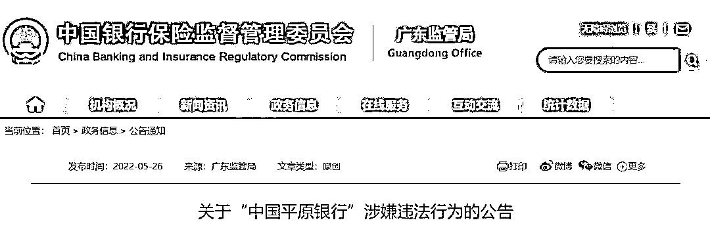
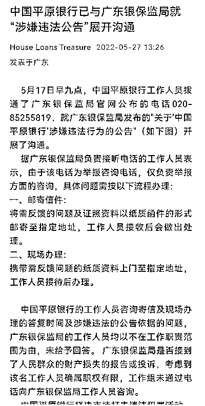
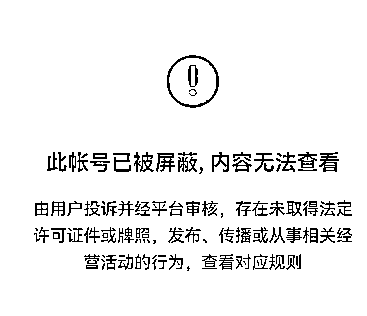
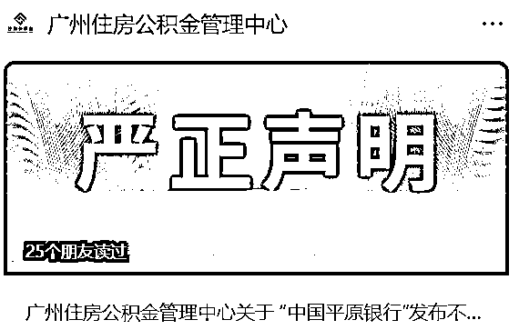
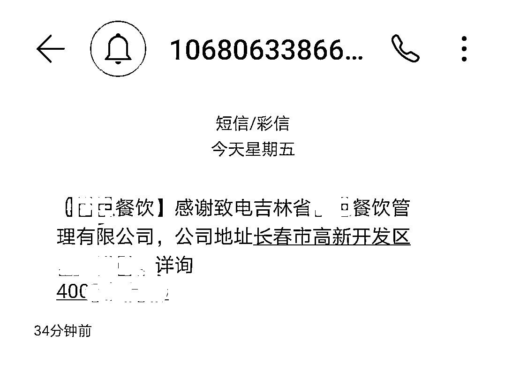

# 震惊！这家银行居然是假的！被揭穿后竟喊话监管“消除误会”

> 原文：[`mp.weixin.qq.com/s?__biz=MzIyMDYwMTk0Mw==&mid=2247536703&idx=5&sn=0ec09f3b08daa183ec19df7220e7d67b&chksm=97cb9b07a0bc1211b6ff2a20283a7e93117ce3e15b09b3fbdaf6767bf7cf459619090e97af9d&scene=27#wechat_redirect`](http://mp.weixin.qq.com/s?__biz=MzIyMDYwMTk0Mw==&mid=2247536703&idx=5&sn=0ec09f3b08daa183ec19df7220e7d67b&chksm=97cb9b07a0bc1211b6ff2a20283a7e93117ce3e15b09b3fbdaf6767bf7cf459619090e97af9d&scene=27#wechat_redirect)

5 月 26 日，

广东银保监局官网发布

《关于 " 中国平原银行 " 涉嫌违法行为的公告》。

《公告》表示，近期，广东银保监局监测发现，部分网站、微信公众号等平台上出现**“中国平原银行”**相关网络信息。**“中国平原银行”通过微信公众号等渠道收集消费者的身份、财产信息，办理开展相关业务**。

**广东银保监局郑重提醒：**

> 一、中国银保监会及其派出机构**未曾审批许可过“中国平原银行”筹备、设立并经营有关银行业金融机构业务****，****“中国平原银行”涉嫌非法设立银行业金融机构、非法从事银行业金融机构的业务活动。**
> 
> 二、根据《中华人民共和国银行业监督管理法》《中华人民共和国商业银行法》等法律规定，未经国务院银行业监督管理机构批准，任何单位或者个人不得设立银行业金融机构或者从事银行业金融机构的业务活动，任何单位不得在名称中使用“银行”字样。

> 三、敬请广大金融消费者提高警惕，增强风险防范意识和识别能力，通过正规金融机构、正规渠道办理金融业务，远离不法侵害，谨防上当受骗！**如发现广东辖内“中国平原银行”相关情况，欢迎拨打我局举报咨询电话提供线索。**
> 
> **举报咨询电话：020-85255819**
> 
> **（工作日 9:00-11:30、14:00-16:30）**

**不过雷人的是，被曝光以后，所谓的“平原银行”非但没有收敛，反而在公众号上发布了**《中国平原银行与广东银保监局积极对接》**的文章，称“计划于 5 月 27 日上午与广东银保监局积极对接，将中国平原银行的筹备情况向广东银保监局作出汇报，找出负面新闻的根本原因，达成一致并消除误会。”**

**昨天（5 月 27 日）中午 1 点多，微信公众号账号发布了**“中国平原银行广州分行”**有关推文，回应广东银保监局的声明，并声称与广东银保监局**“展开沟通”**。**

****

****目前，****

****上述微信公众号账号已被屏蔽，****

****内容无法查看。****

****

****广州住房公积金管理中心发声明****

****辟谣与“中国平原银行”有关****

**据界面新闻消息，“中国平原银行“对外称，“广州分行”办公场所位于广州市珠江新城华就路 12 号 20 楼、22 楼，但上述地址未能找到所谓广州分行的信息。这个地址实为广州住房公积金管理中心的办公场所。对于上述事情，广州公积金住房中心给予了否认。**

**昨天（27 日）晚间 19 时许，广州住房公积金管理中心亦发布严正声明，辟谣与“中国平原银行”有关，并表示**已报案处理。****

**广州住房公积金管理中心在声明中提及，**中心与“中国平原银行”从未开展任何形式的合作，中心的办公地址也从未向“中国平原银行”开放使用****，相关网络社交媒体所述的关于“中国平原银行”与该中心及负责人的情况均属虚假信息****，所传内容纯属谣言 。****

****

****全文如下****

****↓↓****

****广州住房公积金管理中心关于 “中国平原银行”发布不实信息的严正声明**** 

**日前，我中心在工作中发现，有人在网络平台、社交媒体上捏造事实，散布关于“中国平原银行”与我中心有关的虚假信息。**

**我中心特严正声明如下：**

**一、我中心支持广东银保监局 2022 年 5 月 26 日《关于“中国平原银行”涉嫌违法行为的公告》。广东银保监局已郑重提醒：中国银保监会及其派出机构未曾审批许可过“中国平原银行”筹备、设立并经营有关银行业金融机构业务，“中国平原银行”涉嫌非法设立银行业金融机构、非法从事银行业金融机构的业务活动。**

**二、我中心与“中国平原银行”从未开展任何形式的合作，我中心的办公地址也从未向“中国平原银行”开放使用，相关网络社交媒体所述的关于“中国平原银行”与我中心及负责人的情况均属虚假信息，所传内容纯属谣言 。**

**三、我中心针对上述情况已向公安机关报案，并将保留进一步追查谣言及追究相关责任人法律责任的权利。**

**四、敬请广大缴存单位和缴存人提高警惕，增强风险防范意识和识别能力，通过我中心下属网点、授权承办住房公积金业务的商业银行以及本中心公开的网上办事官方渠道办理住房公积金业务，谨防上当受骗。**

**特此声明。**

**广州住房公积金管理中心**

**2022 年 5 月 27 日**

**记者调查发现，**

**“中国平原银行”公布其广州分行的办公地址**

**在广州市珠江新城，**

**留的客服电话，**

**竟然是吉林某餐饮公司的。**

****

**记者拨打该电话，显示为某投资管理有限公司，而电话另一端自动接通的介绍是吉林省某餐饮管理有限公司，地址在长春市高新开发区，按照语音提示尝试转接“意见与反馈”后，**对方表示记者拨打的“是个人的手机号”**。**

**更多信息显示，“中国平原银行”与广州小吼成象科技有限公司有着千丝万缕的关系。小吼成象公众号曾发布《热烈庆祝我司成为中国平原银行重要合作伙伴》一文称，2021 年 10 月 31 日，广州小吼成象科技有限公司与中国平原银行筹备委员会签署合作协议，成为中国平原银行重要合作伙伴。**

**小吼成象公众号另一篇文章也提到，“自与中国平原银行筹备委员会合作并成为战略合作伙伴......”。该文章称，公司资产规模已达 5000 万元，而配图更显蹊跷，**大门上贴着“中国平原银行”透明贴纸，但大门下方却显示的是“广州住房公积金管理中心”。****

**此外，记者还注意到，一简介为“中国平原银行（筹）房贷保”的公众号，其账号主体也为**“广州小吼成象科技有限公司”。****

**启信宝显示，广州小吼成象科技有限公司注册资本 500 万元，注册地址在广州市花都区狮岭镇狮岭大道中 87 号（度假村专用道 1 号第 4 栋）第六层 602 号，法定代表人是陈素彩。**

**来源：每日经济新闻、南方都市报、界面新闻、支付界** 

**更多精华好文，请点击关注******

**← 向右滑动与灰产圈互动交流 →**

****