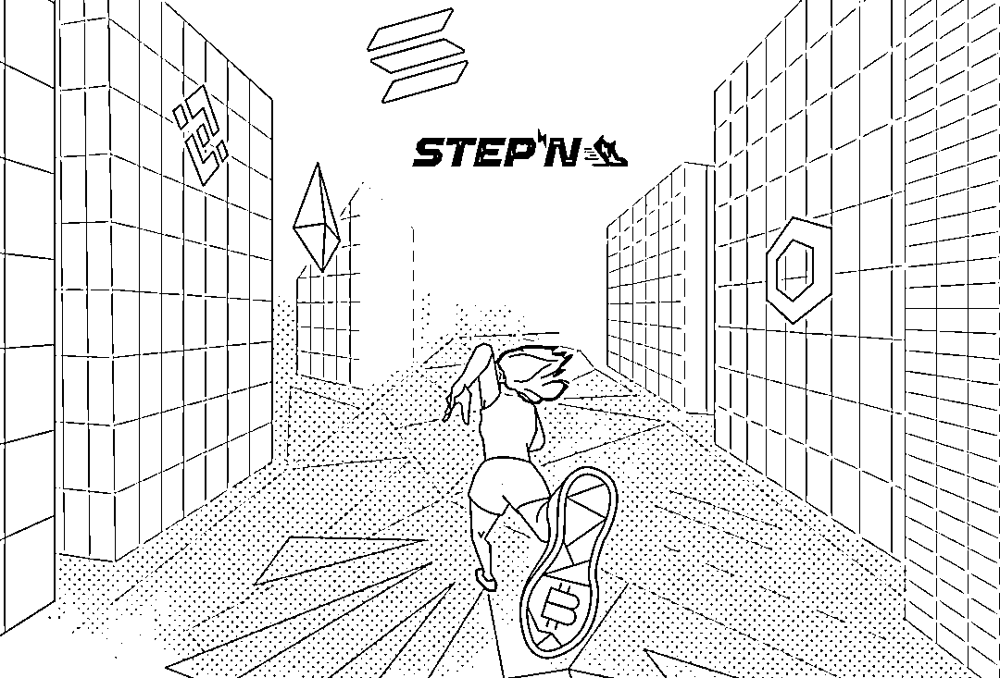
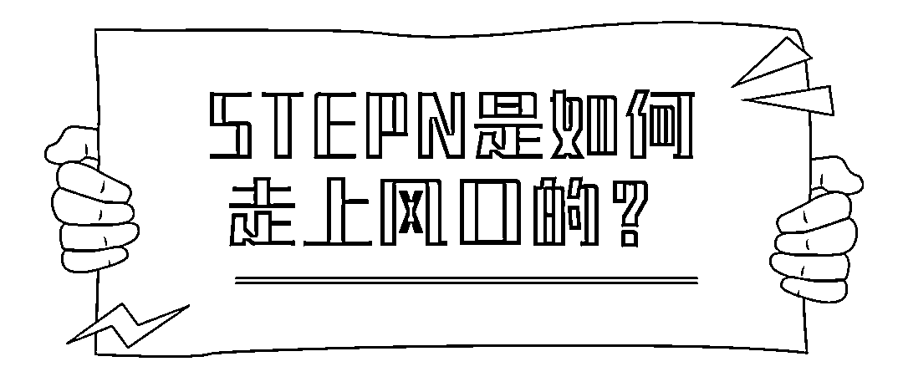
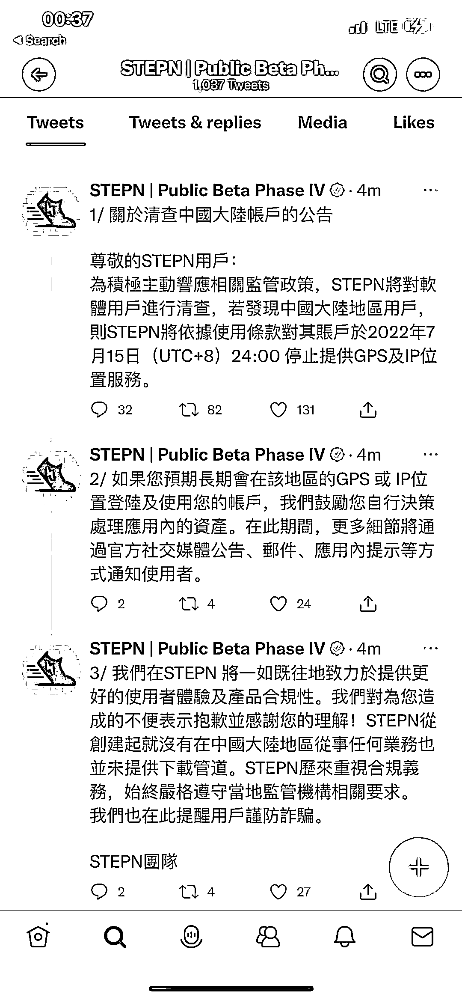
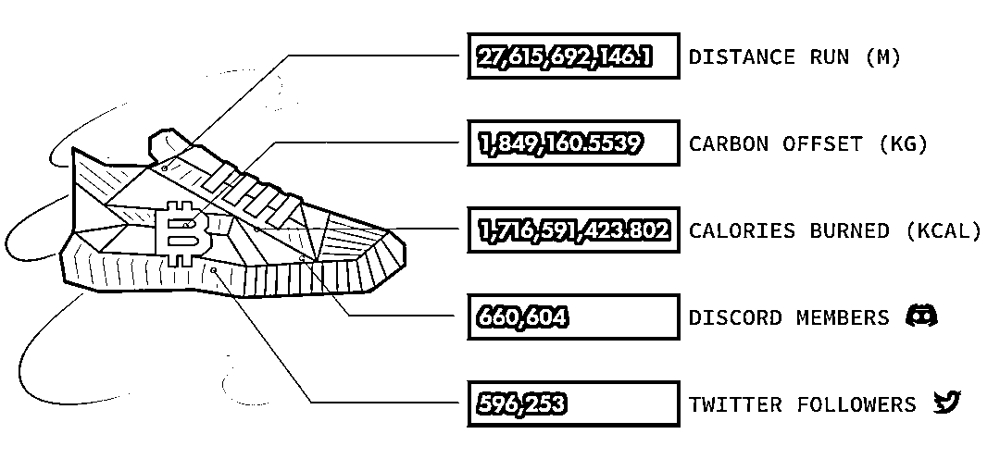
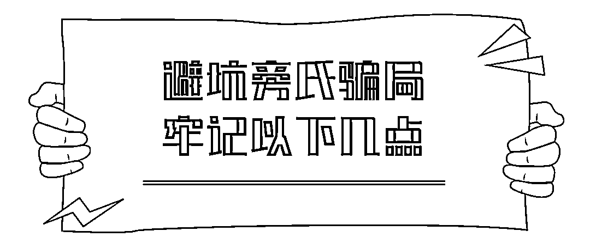

# 爆火出圈的 STEPN，会不会是又一个披着区块链外衣搞庞氏骗局的“趣步”？

> 原文：[`mp.weixin.qq.com/s?__biz=MzIyMDYwMTk0Mw==&mid=2247536703&idx=8&sn=89e78ca89b512ca828f23c0ad88db213&chksm=97cb9b07a0bc12116892732e54138cd1edaa7ce4383cd8ed77efe3ec77cc4a8b680b19b386e0&scene=27#wechat_redirect`](http://mp.weixin.qq.com/s?__biz=MzIyMDYwMTk0Mw==&mid=2247536703&idx=8&sn=89e78ca89b512ca828f23c0ad88db213&chksm=97cb9b07a0bc12116892732e54138cd1edaa7ce4383cd8ed77efe3ec77cc4a8b680b19b386e0&scene=27#wechat_redirect)

**走路、跑步就能赚钱！**

最近大火的 STEPN，就是喊着这个口号出圈的。

简单说，我们可以把它看成是一款基于公共区块链平台 Solana 链的“Move to Earn（边走边赚）”游戏。

借着 Web3 的概念，今年 1 月，STEPN 宣布完成 500 万美元种子轮融资，红杉资本印度与 Folius Ventures 领投，一时名声大噪。近期，币安 Launchpad 宣布即将上线 STEPN 治理代币 GMT，再次点燃链游玩家的热情。

但是 5 月 27 日凌晨，**STEPN 在其官网推特发文称为了响应相关政策监管，将于 2022 年 7 月 15 日停止为中国大陆地区用户提供 GPS 和 IP 位置服务。**

****

于是引起了一大波用户的恐慌，项目代币短时暴跌 40%。网上甚至盛传 STEPN 国内团队被带走调查。**不少人开始质疑 STEPN 会不会是又一个宣传“走路赚钱”却披着区块链外衣、搞庞氏骗局的“趣步”？**

趣步在 2018 年底就靠“运动赚钱”的概念出圈，该公司也发行了虚拟积分“糖果”和与之对应的虚拟货币 GHT。

趣步宣称“每天走够 4000 步，每月就至少能赚 200 元”。**但是实际上，为了增加奖励，用户需要通过“传销式”的拉人、推广等方式吸引新用户进入而获得分红。**“自己投资推广，发展团队，就能月入上千，甚至数十万”，公司就是通过这样的宣传口号为用户“打鸡血”。

趣步声称用户一度超过了 3000 万，无数大学生、宝妈加入了“走路赚钱”的浪潮之中。一时间，走路赚钱，趣步让汗水不白流等等口号不绝于耳，大街上随处可见趣步的展销广告，每一次关于趣步的新闻都是利好的。**而事实上，只有不断拉新人入局，前面的投资用户才会有收益，这个盘子才能运营下去。等到没有更多的新用户入场的时候，骗局的真相也就暴露了。**

**最终，趣步因涉嫌传销、非法集资、金融诈骗被立案调查**。趣步的核心模式是拉人头分红的庞氏骗局，并且通证不断增发、没有消耗场景，最终价格崩盘，项目跑路。

那么 Stepn 怎么赚钱呢？买鞋+跑步，当然鞋子是数字产品，也就是 NFT。鞋子有不同的种类，稀有程度，也有不同的属性。不同的种类、属性等等会影响跑步的收益，最便宜的鞋子为 7000 左右 RMB，回本周期约 30-45 天。

STEPN 会不会是又一个”趣步“？小编不做判断。据业内相关人员透露，目前 Stepn 还是运行良好，**但小编还是要提醒大家：任何投资都需谨慎。**

众所周知，庞氏骗局，是对金融领域投资诈骗的称呼，是金字塔骗局的始祖。在国内大家也会称其为“拆东墙补西墙”或“空手套白狼”。简而言之就是利用新投资人的钱来向老投资者支付利息和短期回报，以制造赚钱的假象，进而骗取更多的投资。很多非法的传销集团就是用这一招聚敛钱财。

传统的庞氏骗局有这样的特点：一边在金融方面故弄玄虚，另一边设置了巨大的诱饵，利用高额回报诱导投资，且给人们“眼见为实”的证据——最初的一批“投资者”的确在规定时间内拿到了承诺的高额回报，于是后面就有更多的“投资者”投钱进来。

而当庞氏骗局遇上区块链，又会有什么样的化学反应呢？都有哪些特征呢？ 

**当庞氏骗局结合区块链之后，出现了以下一些特征：**

**  1）智能旁氏骗局  **

在区块链时代，许多庞氏骗局在智能合约的面纱下伪装起来。我们将这些庞氏骗局称为智能庞氏骗局，并将相应的智能合约称为智能庞氏骗局合约。**因为智能合约具有自动执行、不可篡改的特性，智能合约成为庞氏骗局吸引受害者的有力工具**。更重要的是，发起人是匿名的。

**  2）通过境外服务器开展活动  **

一些不法分子通过租用境外服务器搭建网站，实质面向境内居民开展活动，并远程控制实施违法活动。**这些不法活动资金多流向境外，监管和追踪难度很大**。

** 3）聊天工具、支付工具……都是虚拟途径  **

没有实体的项目或产业，甚至连投资人都看不到。在微信、QQ 等互联网聊天工具进行交易，利用网上支付工具收支资金，声称获得了境外优质区块链项目投资额度。

**4）名人大 V“站台”，诱惑性隐蔽性极强 ** 

利用名人大 V“站台”宣传，以空投“糖果”等为诱惑，宣称“币值只涨不跌”“投资周期短、收益高、风险低”，具有较强蛊惑性。不法分子幕后操纵币的格走势、设置获利和提现门槛等手段非法牟取暴利。此外，一些不法分子还以 ICO、IFO、IEO 等花样翻新的名目发行代币，或打着共享经济的旗号以 IMO 方式进行虚拟货币炒作，具有较强的隐蔽性和迷惑性。

**5）非法集资、传销、诈骗等违法行为特征**

利诱投资人发展下线，不断扩充资金池，非法聚拢资金，涉嫌非法集资、传销、诈骗等违法特征。

骗局无处不在，骗术千奇百怪。对于我们普通人来说，最主要的还是要抵住诱惑，切忌贪婪，牢记：

**1、“天上不会掉馅饼”；**

**2、低风险、高回报是违反投资规律的，也是不可持续的；**

**3、如果要不断拉人头才能维持的项目，本质上就是拆东墙补西墙的骗局；**

**4、远离追热点、炒概念、“躺赚”的所谓“投资”，对于金字塔格局的投资者结构要警惕。**

继元宇宙、NFT 之后，Web3 正在掀起又一波的热潮，新趋势下的新的犯罪手段和趋势我们更应该多加关注。

参考资料

1、区块链行业的“庞氏骗局”你了解多少

2、如何识别区块链中的庞氏骗局？

3、投资 30 万、囤鞋 70 双，我被 Web3“走赚游戏”套路了？

来源：七星实验室

更多精华好文，请点击关注

← 向右滑动与灰产圈互动交流 →

# 原文：[`mp.weixin.qq.com/s?__biz=MzIyMDYwMTk0Mw==&mid=2247536753&idx=1&sn=beb9be0712ae81870143ba6a87d6eea3&chksm=97cb9b49a0bc125fb1c77b24df9d0e959e65f082ceb93ce855b5c452d23589a90f5d70ebaa62&scene=27#wechat_redirect`](http://mp.weixin.qq.com/s?__biz=MzIyMDYwMTk0Mw==&mid=2247536753&idx=1&sn=beb9be0712ae81870143ba6a87d6eea3&chksm=97cb9b49a0bc125fb1c77b24df9d0e959e65f082ceb93ce855b5c452d23589a90f5d70ebaa62&scene=27#wechat_redirect)