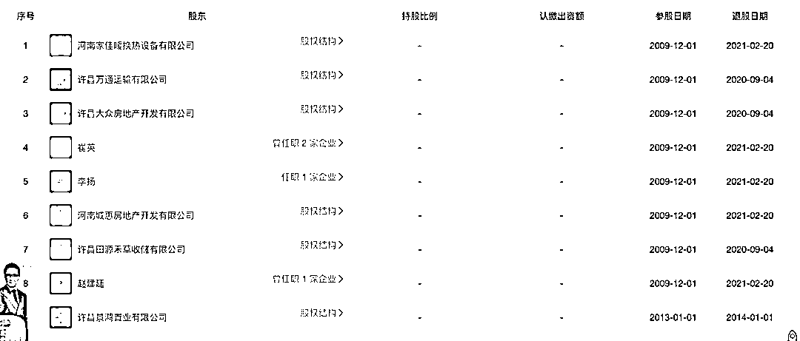

# 村镇银行取款难，许昌农商行疑点触目惊心

> 原文：[`mp.weixin.qq.com/s?__biz=MzIyMDYwMTk0Mw==&mid=2247536753&idx=2&sn=0593f1002415b354160d73c117f5ebba&chksm=97cb9b49a0bc125fb940b763fd6e98b739c3d275213cd5a4c50ed316c9cd301f8540c82923fe&scene=27#wechat_redirect`](http://mp.weixin.qq.com/s?__biz=MzIyMDYwMTk0Mw==&mid=2247536753&idx=2&sn=0593f1002415b354160d73c117f5ebba&chksm=97cb9b49a0bc125fb940b763fd6e98b739c3d275213cd5a4c50ed316c9cd301f8540c82923fe&scene=27#wechat_redirect)

4 月下旬以来，河南的 4 家村镇银行和安徽的 2 家村镇银行关闭了线上资金渠道，导致线上储户无法提现一事引发社会持续关注。 

多名涉事银行储户向凤凰网《风暴眼》表示，他们在一两年前，通过互联网金融平台，购买了相关村镇银行的存款产品，获得的利息收益比一般银行要高。不料到了今年 4 月后 ，多名储户发现自己存在这几家银行的钱再无收益入账，后来连本金取款也无法操作了。

不久，这些银行陆续发布公告称，因系统升级维护，银行的网上银行、手机银行将暂停服务。在无法取款的背后，这些储户的资金到底落流向了谁的口袋？本该是资金存放最安全的地方为什么突然取不出来？

随着事情的发酵，更多细节曝光。

凤凰网《风暴眼》发现，取款难的 6 家村镇银行中，河南省许昌市的禹州新民生村镇银行、驻马店市的上蔡惠民村镇银行、商丘市的柘城黄淮村镇银行、开封市的新东方村镇银行、安徽省蚌埠市的固镇新淮河村镇银行，这 5 家银行的发起行和大股东均为许昌农村商业银行（以下简称“许昌农商行”）。

通过挖掘 5 家银行的发起行许昌农商行，凤凰网《风暴眼》发现该行不仅股东众多股权混乱，其中七成以上大股东均为被执行人，并且其众多股东或为背后隐形股东代持。

而此混乱种种，或许便是许昌农商行旗下村镇银行取款难的根源所在。

***01***

***发起行七成以上大股东为被执行人***

凤凰网《风暴眼》发现，4 家村镇银行出现的无法取款问题，或许在发起行许昌农商行股东们身上就已经埋下了“祸根”。

许昌农商行股东众多，一共有 76 个股东，以及 9 个历史股东，其中包括大量的自然人股东和企业股东，股权结构的混乱一定程度上为其股东信息不透明、资质良莠不齐提供了便利。

事实上，在这次“取款难”事件之前，许昌农商行的股东们近几年来都已相继“出事”。

天眼查信息显示，2016 年 4 月，许昌农商行大股东许昌市润丰纺织有限公司被禹州市人民法院列为失信被执行人，执行金额近 900 万元。

另一大股东许昌宏伟实业（集团）有限公司自 2014 年以来作为被告人被起诉 24 次，陷入各种金融借款合同、借款合同、民间借贷等纠纷之中。

凤凰网《风暴眼》发现，2017 年 6 月、2017 年 11 月、2019 年 12 月和 2021 年 2 月，宏伟实业分别被招商银行许昌分行、光大银行许昌分行、中原银行许昌分行、洛阳银行许昌分行起诉，案由为金融借款合同纠纷。

甚至，就连许昌农商行也起诉了自己的这个大股东。天眼查信息显示，2020 年，许昌农商行作为原告起诉了许昌宏伟实业等公司。之后的执行结果显示，宏伟实业因未履行判决而被列为失信被执行人。

公开信息显示，目前许昌农商行公示的 76 位企业及自然人股东中，有 25 位是被执行人。

据凤凰网《风暴眼》统计，在许昌农商行持股比例超过 2%的 17 位股东中，其中有 12 位存在失信、被执行或者限制高消费等情况。而其持股比例超过 4%的 7 位大股东中，有 6 位都是失信或被执行人。

凤凰网《风暴眼》了解到，中国银行业监督管理委员会令 2018 年第 1 号《商业银行股权管理管理暂行办法》第十六条明确规定，商业银行主要股东及其控股股东、实际控制人不得存在“被列为相关部门失信联合惩戒对象”的情形。

《办法》第五十一条规定，商业银行未按要求对股东及其控股股东、实际控制人、关联方、一致行动人、最终受益人信息进行审查、审核或披露的，由银监会或其派出机构按照《中华人民共和国银行业监督管理法》第四十六条、第四十八条的规定，责令改正，并处 20 万元以上 50 万元以下罚款；对负有责任的董事长、董事会秘书和其他相关责任人员给予警告，处 5 万元以上 50 万元以下罚款。

那么，许昌农商行是否尽到了对股东信息进行审查、审核或披露的的责任呢？如果进行了审查和披露，这 25 位“失信被执行人”股东为何仍然能够稳居股东甚至大股东之列呢？

***02***

***“隐形”股东或为了方便质押融资***

除了多位股东为“失信被执行人”之外，许昌农商行还存在隐形股东代持的情形。

阿里司法拍卖平台显示，此前，河南开封市祥符区人民法院挂出了 8 笔许昌农商行的股权，合计多达 4200 万股，约占该行总股本的 4.2%。

5 月 29 日 10 点至 5 月 30 日 10 点，开封市祥符区人民法院在阿里司法拍卖平台公开拍卖这 8 笔股权。根据标的实际情况，法院公示了涉及司法纠纷的执行裁定书案号。

根据执行裁定书案号，凤凰网《风暴眼》按图索骥，发现这 4200 万股权的所有者均指向了长葛市华轩实业有限公司（以下简称“长葛华轩实业”）。

然而，令人疑惑的是，许昌农商行公示的股东中，持股比例达到 4%以上的公司并没有长葛华轩实业。

并且，国家企业信用信息公示系统显示的出质信息显示，长葛华轩实业并非个例，凤凰网《风暴眼》发现共有 12 家“隐形”股东，合计出质许昌农商行股权 7.58 亿股，状态皆为有效。

公开资料显示，许昌农商行注册资本为 10 亿元，目前该行或有超过 75%的股权是通过他人代持的方式由这些隐形股东所持有。

凤凰网《风暴眼》发现，许昌农商行股权混乱背后，股东“隐形”或为了方便其进行质押融资。

最早从 2016 年开始，这些股东就断断续续将持有的许昌农商行股权质押，质权人包括开封宋都农村商业银行股份有限公司、河南许昌许都农村商业银行股份有限公司、河南兰考农村商业银行股份有限公司、河南汝南农村商业银行股份有限公司等，大多为与许昌农商行类似的村镇银行，股权较为混乱。

而在将许昌农商行的股权质押后，其中有 11 位隐形股东所持有的近 7.1 亿股股权显示为冻结状态。其中，被冻结股份的河南奇盛电梯服务有限公司名称及股份数量，与隐形股东中河南奇盛科技有限公司高度吻合，如若两者相关，12 家公司所持的 7.58 亿股权均已被冻结。

此外，出质许昌农商行股权规模最大的为河南省美景集团有限公司，出质股权数量达 9850 万股，该公司被开封市祥符区人民法院列为被执行人，巧合的是，该公司股权冻结日期、审理案件法院与长葛华轩实业高度吻合。

其实在 2021 年前后就有媒体曝光称，许昌农商行出现了大量的信息不透明、“隐藏股东”代持股权、质押融资现象频繁等问题。甚至还有爆料称，“许昌农商行股东中 6 户为一致行动人”，只是爆料人在社交媒体平台的相关消息很快被删除，同时许昌农商行也进行了报警处理。

事实上，大量的信息不透明或早已为许昌农商行埋下“祸患”，有股东或提前知晓而退出。凤凰网《风暴眼》发现，2020 年 9 月至 2021 年 3 月，有 8 位股东这个时间段密集退出。

其中，令人奇怪的是，天眼查显示许昌万通运输公司已于 2020 年 9 月 20 日退股，但 2020 年 11 月 10 日又被郑州市金水区人民法院冻结了其持有的许昌农商行股权。

另外，许昌景鸿置业有限公司与上述隐形股东之一的长葛华轩实业或关系匪浅，长葛华轩实业常常因一起为其他公司提供担保而被追索连带责任。

***03***

***神秘操盘手吕奕与实控人疑云***

大量的信息不透明不仅指向许昌农商行股权混乱的问题，还牵出了一家游离在股东名单之外的公司——新财富集团。

该公司与许昌农商行发起设立的多家村镇银行都有关联，被质疑是许昌农商行背后的操盘手。

就在河南新财富集团被注销两个月后，禹州新民生村镇银行等六家村镇银行就关闭了线上取款、转账等资金渠道。

5 月 18 日，银保监会有关部门负责人表示，据了解，河南四家村镇银行股东——河南新财富集团通过内外勾结、利用第三方平台以及资金掮客等吸收公众资金，涉嫌违法犯罪，公安机关已立案调查。

公开信息显示，河南新财富集团成立于 2011 年，注册地址为郑州市郑东新区，注册资本 11600 万元，经营范围是“对实业投资、企业投资与管理”。该公司已于 2022 年 2 月 10 日已经注销。

据天眼查，该公司股东有两人，分别是持股 80%的余泽峰、持股 20%的林恒森。表面上看，余泽峰为新财富集团的疑似实际控制人。不过，真正的实际控制人或为商人吕奕。

据财新报道，河南新财富集团与许昌农商行发起设立的多家村镇银行都有关联，或作为“隐形”股东间接持股。有河南银行业人士透露，开封新东方村镇银行原来的实控人也是河南新财富集团，后来新财富集团退出，由河南新郑农商行控股 30%；河南新财富集团背后的实际控制人，或为商人吕奕。

河南新财富集团曾卷入郑州银行原副行长乔均安受贿一案。公开报道显示，2018 年 10 月，乔均安因受贿罪被郑州中院判处有期徒刑十四年。

一审判决书披露，2007 年至 2016 年，乔均安利用职务便利，为河南新财富集团董事长吕某控制的公司在郑州银行贷款提供帮助，后来向吕某索要累计 2394 万余元，事发后退还。

不过，种种迹象标明，尽管许昌农商行股权分散、有大量股权已处于被隐秘股东出质状态，但目前对该行进行实际控制是许昌市财政局及旗下全资国有企业。

就在 5 月 25 日，许昌农商行实控人许昌市投资集团有限公司（下称许昌市投资集团）发布了一则公告，对许昌农商行与 5 家村镇银行的关系，以及该公司与河南新财富集团的关系进行了澄清。

许昌市投资集团表示，禹州新民生村镇银行股份有限公司、柘城黄淮村镇银行股份有限公司等五家村镇银行均为独立法人机构且独立运营，许昌农商行不实际控制其经营管理。

对于许昌市投资集团与河南新财富集团关系，许昌市投资集团表示与河南新财富集团不存在股权投资、资金往来或业务合作关系。

对于孙振甫被有关机关依法侦查的情况，许昌市投资集团表示，原许昌农商行副行长孙振甫有关问题，相关部门正在调查处理中。

然而，对于这则“澄清公告”，大部分“受害”的储户们并不买账。他们认为作为涉事村镇银行的发起行或股东，许昌农商行应在此次事件中承担相应的责任。

许昌农商行众多股东间混乱的股权关系究竟有没有猫腻？储户的钱何时才能取出来？凤凰网《风暴眼》将持续关注。

凤凰网《风暴眼》出品 作者：凤凰网财经顾北 付归

← 向右滑动与灰产圈互动交流 →

