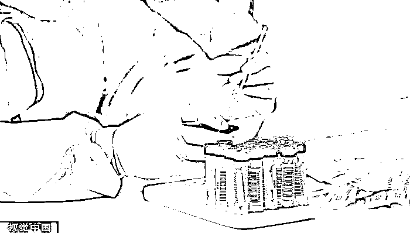

# 北京中同蓝博医学检验被立案侦查，背后是这家上市公司

> 原文：[`mp.weixin.qq.com/s?__biz=MzIyMDYwMTk0Mw==&mid=2247536753&idx=4&sn=f390ac7ab74682e971fd7446756a21de&chksm=97cb9b49a0bc125f8c5feeb347b3f3abe1c3eb536667e76ef9c15b995cb108dc5afcf0d4374a&scene=27#wechat_redirect`](http://mp.weixin.qq.com/s?__biz=MzIyMDYwMTk0Mw==&mid=2247536753&idx=4&sn=f390ac7ab74682e971fd7446756a21de&chksm=97cb9b49a0bc125f8c5feeb347b3f3abe1c3eb536667e76ef9c15b995cb108dc5afcf0d4374a&scene=27#wechat_redirect)

5 月 29 日，北京市公安局官方微信“平安北京”发布情况通报称，5 月 28 日，发现“北京中同蓝博医学检验实验室”在核酸检测过程中涉嫌违法犯罪。目前北京警方已对该实验室立案侦查，将法定代表人张某某（男，52 岁）等人查获，案件正在进一步工作中。

据 5 月 29 日的北京市新冠肺炎疫情防控工作新闻发布会通报，北京市卫生健康委员会组织专家对阳性病例既往阴性检测结果的样本溯源检查，通过视频检查和查看 PCR 仪上的扩增记录发现，北京中同蓝博医学检验实验室溯源记录不完整，记录规则不清晰，不能提供原始标本流转单和扩增板原始纸质记录，部分时间点扩增文件记录与实验室自述检测数量不符，违规对多管样本进行混管检测。以上情况严重违反质量安全规定，影响检测结果准确性，导致对核酸检测阳性人员发现和管控不及时，造成疫情进一步传播风险。

目前，北京市卫健委在固化证据的基础上，立即对北京中同蓝博医学检验实验室进行了严肃处理，勒令其立即停止执业，启动吊销医疗机构执业许可证程序，并配合公安部门予以立案侦查。

天眼查显示，中同蓝博医学检验实验室有限公司（以下简称“中同蓝博”）成立于 2007 年 3 月 2 日，注册资本为 1.036 亿元，是港股上市公司中国同辐（01763.HK）的全资子公司，法定代表人、经理和执行董事均为张火兵，应为上述情况通报中已被北京警方查获的“张某某”。

中同蓝博官网显示，中同蓝博实验室面积 2300 多平方米，目前实验室拥有医学和检验专业人员 40 多人，其中高级职称 5 人，中级职称 9 人。完全按照国外医学独立实验室的标准和模式进行建设和运营，目前设有生化、发光免疫、酶联免疫、基因诊断、微生物、微量元素、病理室、质谱室等特检等专业检验实验室。

其此前发布的新闻稿显示，2020 年 7 月 3 日，中同蓝博正式获批开展新冠病毒核酸检测工作。这是继北京核工业医院之后，中核集团京区第二家获批开展新冠病毒核酸检测的医疗卫生机构。

据此前《第一财经》的报道，北京市新冠病毒核酸检测医学检验实验室 2022 年 4 月审核合格机构共有 66 家。在除去重复机构和个别暂无公开信息后的 58 家新冠病毒核酸检测医学检验实验室中，中同蓝博注册资本数目最大。

天眼查显示，中同蓝博于 2020 年与北京瑞安百利医疗器械有限公司存在买卖合同纠纷；2020 年 6 月因违反《中华人民共和国固体废物污染环境防治法》相关规定，遭到北京市丰台区生态环境局行政处罚。而同为张火兵担任高管的北京北方生物技术研究所有限公司则在近五年来，涉及数起与医院的买卖合同纠纷、劳动争议、行政处罚。

而本次被查获的张火兵同时也是北京北方生物技术研究所有限公司的法定代表人、经理和执行董事，并且还别分担任南京宁一精准医学检验所有限公司、南京慈基医学技术服务有限公司的董事职位。其中，前者同为中国同辐的全资子公司；后两者的大股东均为南京临床核医学中心，中国同辐分别在两个公司中参股 15%、33.64%。

中国同辐是中国最大的显像诊断及治疗用放射性药品、尿素呼气试验药盒及测试仪、医用及工业用放射源产品供应商，其大股东为中国核工业集团有限公司（以下简称“中核集团”）。2021 年，中国同辐各项财务指标都创出历史新高，营业收入为 51.44 亿元，同比增长 20.3%；净利润 6.73 亿元，同比增长 41.5%；归母净利润 3.36 亿元，同比增长 57.2%。

目前，中国同辐经营五个业务分部，包括药品、放射源产品、辐照、放射治疗设备及相关服务，以及独立医学检验实验室服务及其他业务。其中，后者主要就肝炎、内分泌、骨代谢、心血管疾病、糖尿病及其他疾病提供独立医学检验实验室服务。而疫情期间，中国同辐旗下的各医学检验中心将业务拓展到了新冠病毒核酸检测。

中国同辐 2021 年年报显示，公司各医学检验中心在北京、成都、武汉、合肥相继开设了核酸检测采样点，面向个人提供核酸采样服务，并提供上门采样的服务，还承接了冬奥委会部份人员核酸检测的工作等。全年完成核酸检测达数百万例。

报告期内，集团独立医学检验实验室服务及其他业务实现收入为 3.36 亿元，同比降低 34.1%。其中，独立医学检验实验室服务实现收入为 2.28 亿元，同比增长 77.0%。

图片来源：视觉中国 实习记者：陈杨 编辑：谢欣 来源：界面新闻

← 向右滑动与灰产圈互动交流 →

