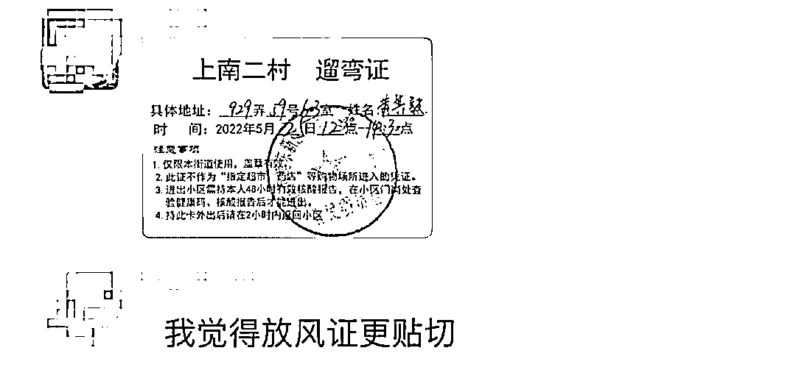

# 难得的关注！

> 原文：[`mp.weixin.qq.com/s?__biz=MzIyMDYwMTk0Mw==&mid=2247536753&idx=5&sn=eaf6e98bdd28d677464fdd2f5211b8e4&chksm=97cb9b49a0bc125f2b90f28e5b898aae90933b2dd29852fb62788d6f8fa639b93e7e2f913149&scene=27#wechat_redirect`](http://mp.weixin.qq.com/s?__biz=MzIyMDYwMTk0Mw==&mid=2247536753&idx=5&sn=eaf6e98bdd28d677464fdd2f5211b8e4&chksm=97cb9b49a0bc125f2b90f28e5b898aae90933b2dd29852fb62788d6f8fa639b93e7e2f913149&scene=27#wechat_redirect)

还是告诉上海朋友们一个好消息，你们大家的声音已经被人民网关注到了，并且写在文件里了。

这是文件中涉及到上海部分的内容。

我相信，这是与上海普通网友在微博和公众号下面的评论区里留言分不开的，留言得多了，总会被权威媒体注意到，然后写进它们的新闻稿件里。

当然，也有冷静的网友在发出这样的提醒。 

这个遛弯证依然刺痛了很多上海本地网友的心。

上海其他区的网友也晒出了自己的遛弯证。

有网友觉得，不如叫放风证的好。

有网友忍不住讲了这样一个道理。

个人希望人民网也能关注并报道这样的事情，这才是对上海普通市民有价值，也能真正帮助到他们的事情。

还有网友看到了这个，表示了深深的担心。

理科的网友则算了这样一笔账，上海此次成本损失高达四万亿。 

这是薛教授的研究成果。

这是间接损失成本

两项相加，共计四万亿。

对此，有网友表示。

还有网友看到了这样一个现实。

还有网友看到了这个。

刘益谦也被网友们围观了。

郁闷之下，有网友忍不住写下了这样一首赋。

不过好在有小区居民硬气了一回。

作家树下野狐也很有勇气，发出这样的质问。

希望这样的声音也被人民网报道，上海普通民众的声音被报道的得越多，则越透明，透明之下才会有公正，不会有前一段时间那么多乱象发生。

无论如何，这段时间上海普通市民过得太辛苦，他们经历了太多奇葩的事情了，强烈地冲击着网友们的认知，感受到了生活的另一面。现在只想原本的生活能够重新回来，当下所经历的一切能永久封存，不要想起，更不要经历。

让普通市民能过得好一点，才是上海这座城市应有的风貌。

来源：轻晖有墨  作者：晖思

← 向右滑动与灰产圈互动交流 →

