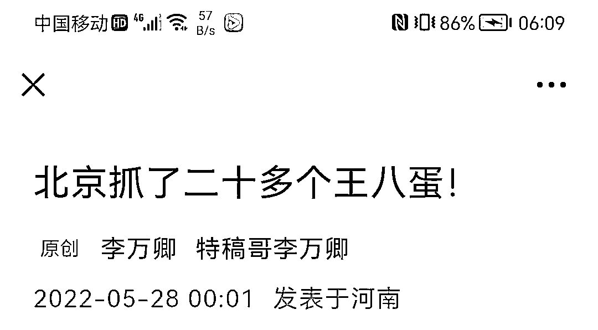
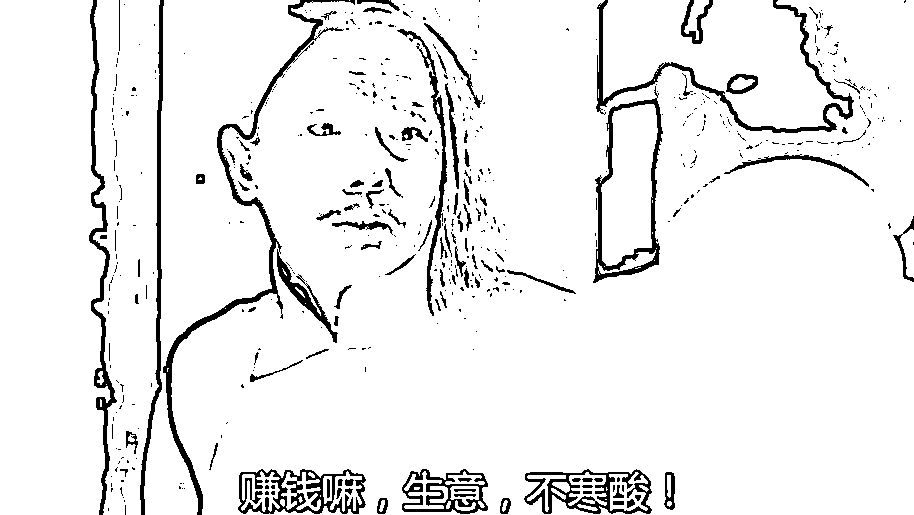
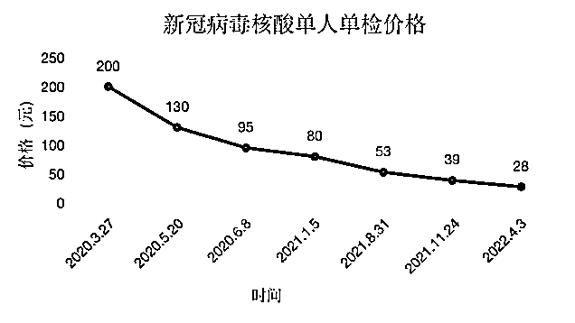
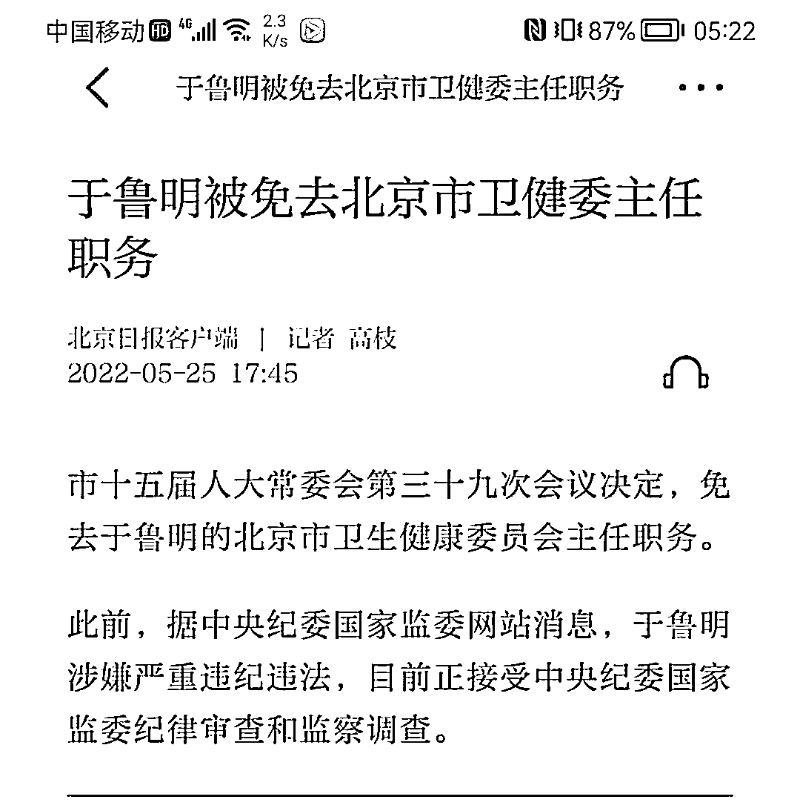

# 卫健委主任落马，社会面很快清零了！

> 原文：[`mp.weixin.qq.com/s?__biz=MzIyMDYwMTk0Mw==&mid=2247536848&idx=1&sn=10277188d53d307e9eaf180c8481c2fa&chksm=97cb9be8a0bc12fe9056b9db880c38130ab5ce73e495f0d75c693d23e54b98be036297234862&scene=27#wechat_redirect`](http://mp.weixin.qq.com/s?__biz=MzIyMDYwMTk0Mw==&mid=2247536848&idx=1&sn=10277188d53d307e9eaf180c8481c2fa&chksm=97cb9be8a0bc12fe9056b9db880c38130ab5ce73e495f0d75c693d23e54b98be036297234862&scene=27#wechat_redirect)

[`mp.weixin.qq.com/mp/readtemplate?t=pages/video_player_tmpl&action=mpvideo&auto=0&vid=wxv_2417074248205942786`](https://mp.weixin.qq.com/mp/readtemplate?t=pages/video_player_tmpl&action=mpvideo&auto=0&vid=wxv_2417074248205942786)

本文来源于网络

切断了核酸检测的利益输送链，病毒传播链自然也就断了。

北京终于实现社会面清零了，本轮疫情很快得到控制，**与北京人民的紧密配合紧密相关。**

还有一个很重要的原因，那就是对于核酸检测市场大扫除大清洗。

随着北京市卫健委主任于鲁明的落马，以及房山区 3 名卫健干部被查，朴石、金准、蓝博三家核酸公司被查，北京的疫情很快就得到了控制，没几天就实现了社会面清零。

一直都有个疑惑，随着核酸检测价格从最初的 200 元/人份到如今的几块钱，一降再降，第三方检测公司从最初的“野蛮暴利”到如今的“正常盈利”，行业发展越来越良态，但实在想不通为什么还有人依旧把现在的核酸检测贴上“暴利”标签。

看了最近北京疫情中的几档子事，心中了然，再次刷新了认知。

31 人被抓，有检测公司的负责人、有卫健委的干部......看后让人五味杂陈。

**何为 3 管混管检测？**

一名地方疾控部门检测科人员解释称，打个比方，这相当于原来每管的样本吸取 10 微升加到一个待测孔里，而现在从每管里面吸取 3.3 微升，即共吸取三管加到一个待测孔，可能会出现假阴性。

“原本弱阳性的标本，由于病毒载量减少了三分之一，可能检测不出来。”该地方疾控部门检测科人员称。

有核酸检测人士表示，新 guan 疫情出现时，为了能够短时间内完成全员核酸检测工作，最大程度降低新 guan 疫情输入及本地扩散风险，核酸检测可以采用一定的混检方式，即将多个人的采集拭子放到一个采集管中，目前最高可以 20 合 1，但不可避免混检会降低检测的灵敏度。

如今这种对多管样本进行 3 管混管检测，相当于是“混上加混”，会更进一步降低检测的准确性。

**为何冒险违法**

上述地方疾控部门检测科人员认为，或是出于加快速度，减少时间和人力成本损耗，以承担更多检测任务的缘故；或为了减少试剂消耗。

要遏制奥密克戎疫情快速传播，关键就在于核酸检测的早发现速度，因此对核酸检测企业的检测速度提出了更高要求。

3 月 22 日，国务院联防联控机制发布《区域新型冠状病毒核酸检测组织实施指南（第三版）》（下称《第三版》），为实现“早发现、早隔离、早诊断、早治疗”，进一步提升核酸检测质量和效率，要求新 guan 疫情发生后，所在的设区市，包括城区常住人口 1000 万以上的超大城市，应当在 24 小时内完成划定范围的区域核酸检测任务。

而此前，根据城市人口规模不同，核酸检测要求完成的时限不同，有 48 小时完成的，有 72 小时完成的。

近期，有核酸检测行业人士表示，任何一个环节衔接不好，都会影响到核酸检测的速度。

一些检测机构经历长时间的实践，对于如何快速且准确出具核酸检测报告，已摸索出了一系列经验，但对一些经验不足的机构而言，要在如此短的时间内里，加上检测量很大的情况下，能否一下子做到应对自如，仍需要打个问号。

一些核酸机构在承接大规模接核酸检测任务时，事先并未预估好自身的核酸检测产能，最后为了抢时间，忽视对质量的控制，而疲于应付任务。

**核酸检测到底有多赚钱呢？**

我们就拿几家检测龙头上市公司的业绩来说话。之江生物，2020 年，之江生物营业总收入超 20 亿元，利润总额为 11 多亿元，营业收入同比增长 692.72%，归属于上市公司股东的净利润同比增长 1708.96%。 

圣湘生物 2020 年其全年收入增长了 12 倍，营业总收入超过 47 亿元，利润总额约 30 亿元。2021 年有所下降，其财报显示，营收为 45 多亿元，利润总额超 26 亿元。两年时间，圣湘生物总营收 92 亿。

进入 2022 年后，在国家集采之下和竞争加剧之后，核酸检测的利润率大幅下滑。

单采每人次 28 元，混采每人次 8 元。这在很大程度上打击了医学检测机构的利润率。但这也在另一个方面，加大了核酸检测机构铤而走险的胆量。

归根到底，核酸检测是一门生意。是生意，就要赚钱，要赚大钱。当利润率下滑时，就得提高检测规模。

如何提高检测规模，以确保收回成本，并大赚一笔？这就让一部分人走上了歪门邪道。

此前，北京朴石医学检验实验室在监管飞行检查中被查出检验数据明显少于样本数据。

也就是说采了 1000 管最后只检测了 250 管，然后直接出报告，是阴是阳全凭他们一张嘴。

这并不是抽查出来的问题，而是来源于举报。

果然，昨天消息传来，房山区卫健委副主任杨大庆、医政科科长晋长皓、医政科三级主任科员邢曼，集体出事了。

原因是对北京朴石监督管理过程中，涉嫌严重违纪违法。

“上面”没有人，背后没“靠山”，朴石有多大胆子敢核酸造假？能顺利拿下房山的核酸检测业务？他们赚的钱能全部进自己的口袋？

继朴石之后，京城第二个核酸机构，金准医学检验实验室 17 人被采取刑事强制措施。

金准不是采而不检，检而不测，而是人为稀释样本。即将“5 混 1”“10 混 1”核酸样本，采用多管混检的方式进行检测，相当于“混上加混”，降低检测的准确性。

这样做对金准有什么好处呢？第一出结果更快了，第二减少了人力成本，第三省下了试剂费用。

北京给全国打出了样板，而效果也立竿见影。

随着北京市卫健委主任于鲁明的落马，以及房山区 3 名卫健干部被查，朴石、金准两家核酸公司被抄家，北京的疫情很快就得到了控制，没几天就实现了社会面清零。

你说神奇不神奇？诡异不诡异？

虽然我们无法判断这背后到底有多少联系，但总不能不让我们联想。如果上海当初也能大疫用重典，治乱下猛药，疫情会不会不至于如此蔓延？

两相对比，是不是我们能得出一些答案？

**切断了核酸检测的利益输送链，**

**病毒传播链自然也就断了!**

来源：和美之音

← 向右滑动与灰产圈互动交流 →

