# 雷锋变日本兵？兔子集体跳湖自杀？买罂粟籽面包？更多图书问题被发现

> 原文：[`mp.weixin.qq.com/s?__biz=MzIyMDYwMTk0Mw==&mid=2247536848&idx=2&sn=45cde17f753dbb5a2d5506c768720e78&chksm=97cb9be8a0bc12fe9bf00c4533c4bf9260250d77dedd47669326a9912325548d15d5f625552e&scene=27#wechat_redirect`](http://mp.weixin.qq.com/s?__biz=MzIyMDYwMTk0Mw==&mid=2247536848&idx=2&sn=45cde17f753dbb5a2d5506c768720e78&chksm=97cb9be8a0bc12fe9bf00c4533c4bf9260250d77dedd47669326a9912325548d15d5f625552e&scene=27#wechat_redirect)

**小学教辅书配日军背老太图**

**5 月 29 日，网曝陕西两家出版社联合出版的小学二年级语文下册《同步巧讲精练》教辅书中，雷锋做好事的配图为日军背老太。**

**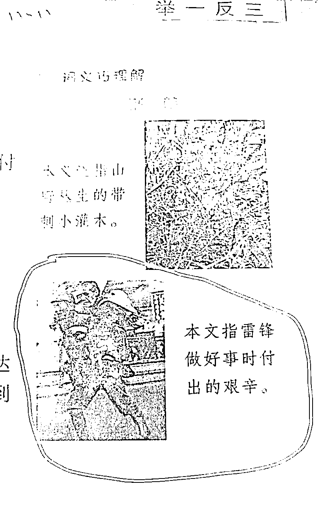**

**配图出现在词义巧理解栏中，一幅疑似穿着日军军装的人背着老奶奶的照片，配文为“雷锋做好事时付出的艰辛”。**

****

**据悉，这张日本兵背着老大娘的照片，**当时被日本的报纸登出来，是为了意图蒙蔽国际舆论，减轻战争区域中国老百姓的反抗，不过很快就被人识破了。****

**该书封面显示由畅销十余年“举一反三”品牌团队和金星国际教育集团《教材全解》团队联合出品。**

**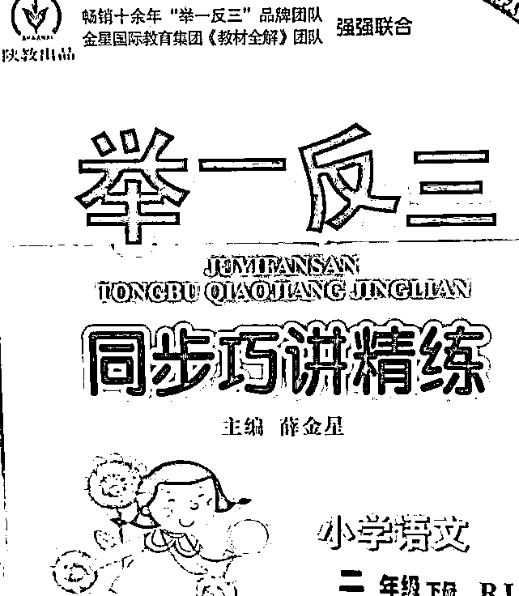**

**据查询，**金星国际教育集团有限公司已告解散。**该书由陕西新华出版传媒集团与陕西人民教育出版社联合出版。**

**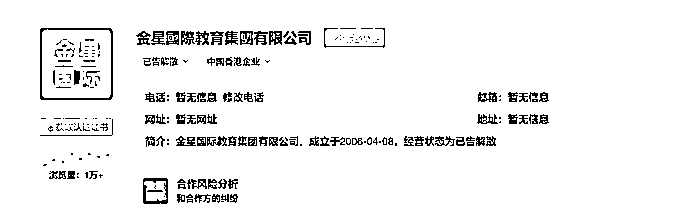**

**30 日，陕西人民教育出版社回应称，**正在积极处理，结果稍后公布。****

**媒体联系该书主编薛金星，目前没有得到回应。**

**在此事曝光后，网友们纷纷表示愤怒与不理解，为什么会放上这样一张照片，大家更是等待一个后续的说明与处理结果。**

**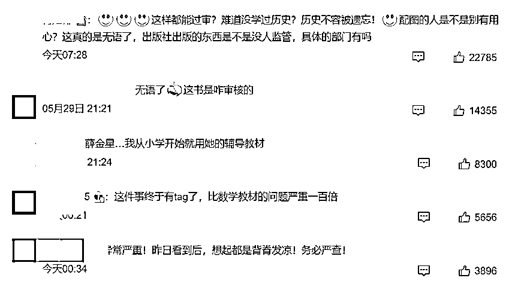**

****人教版配套阅读书现罂粟籽****

****近日，有家长发现，人教版一本二年级配套阅读材料中，出现“罂粟籽”字眼。　****

****有网友表示，其他出版社选用同样的文章时规避了这一字眼。****

****先看两张图片。****

****第一张图片是人民教育出版社的《七色花》，可以清楚的看见，**珍妮给母亲买了带罂粟籽的面包。******

****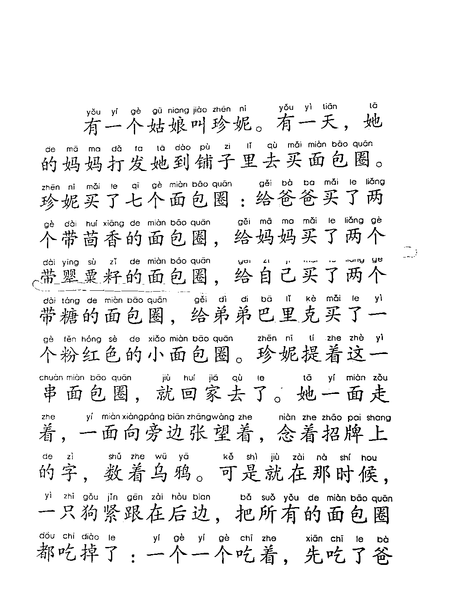****

****第二张是浙江教育出版社的《七色花》，**珍妮给母亲买的是带玫瑰花的面包。******

****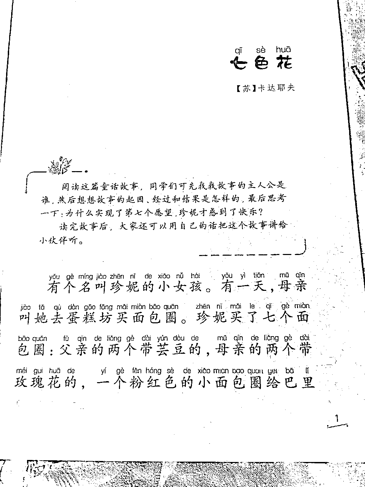****

****有网友表示，其他出版社并未出现或规避了敏感词，而罂粟籽在我国是严格管制的，在食品里也不得作为调味品。**对此有博主查询后表示，《七色花》带罂粟籽，是曹靖华原文翻译的。******

******网友们担心，如果孩子们看了人教版的七色花，大概会认为罂粟籽是可以食用的正常食物。******

********童书描述兔子集体跳湖自杀********

******近日，有网友在社交平台发文，认为一本睡前童书内容不当，其中一篇《想不开的兔子们》故事讲述一群兔子因为自己胆小，又对生活感到害怕，居然号召所有兔子们集体跳湖。******

******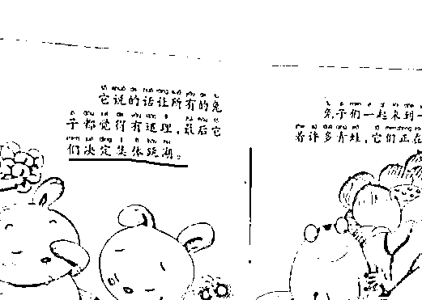******

******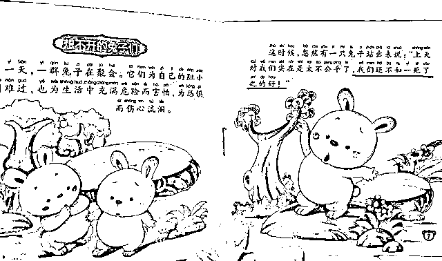******

******另一篇《没主见的鸟王》里，喜鹊说：“他们认为没有主见的男人是女人。”网友质疑：这是什么价值观？******

******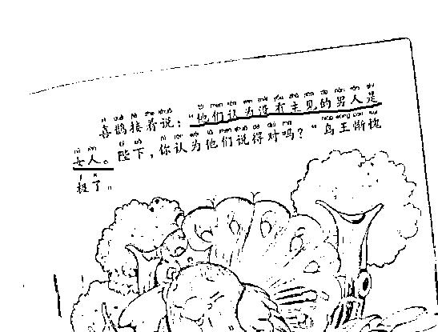******

******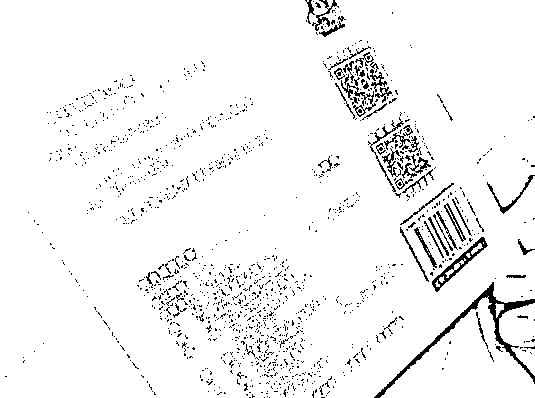******

******对此，长江出版社人员告诉记者，会让编辑重新翻看，将作回复。******

******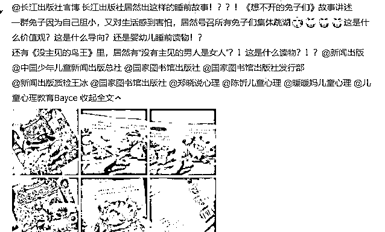******

******我国《出版管理条例》明确规定：以未成年人为对象的出版物不得含有诱发未成年人模仿违反社会公德的行为和违法犯罪的行为的内容，不得含有恐怖、残酷等妨害未成年人身心健康的内容。******

********62 种少儿图书教辅材料不合格********

******近日，国家新闻出版署通报“质量管理 2021”编校质量不合格图书名单。通过重点对 2020 年以来出版的少儿图书、教辅材料等进行编校质量检查审核，认定其中 62 种图书不合格。******

******什么是“图书编校差错率”？******

******图书编校差错率，**是指一本图书的编校差错数占全书总字数的比率，用万分比表示。**实际鉴定时，可以依据抽查结果对全书进行认定。比如检查的总字数为 10 万，检查后发现 2 个差错，那么这本书的差错率就是 0.2‱。**差错率超过 1/10000 的图书，其编校质量属不合格。********

******编校质量不合格图书名单******

******(上下滑动查看↓）******

******************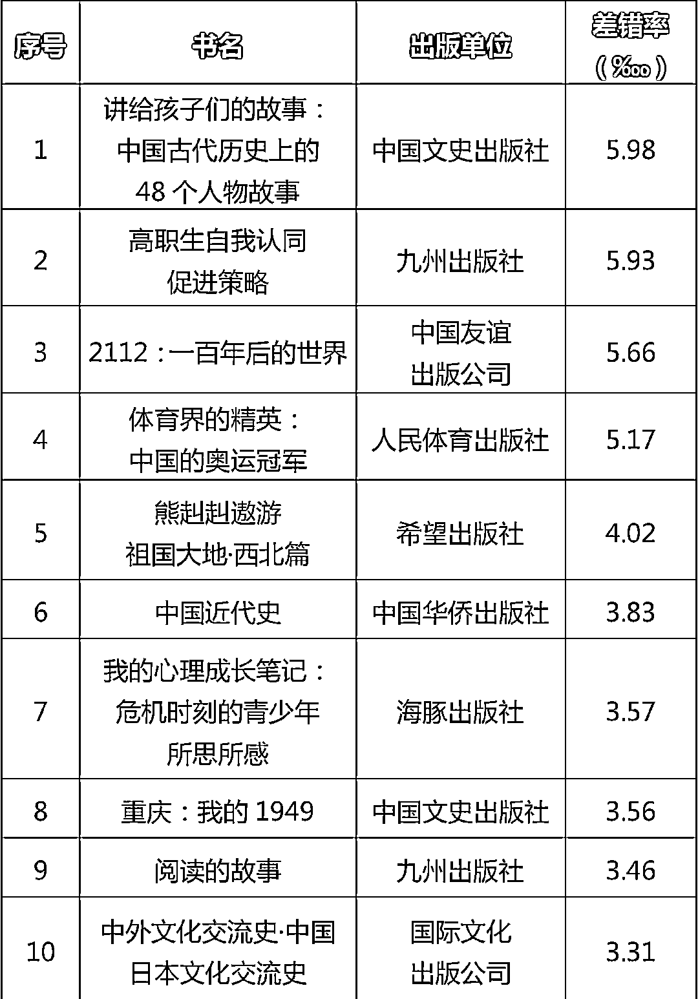************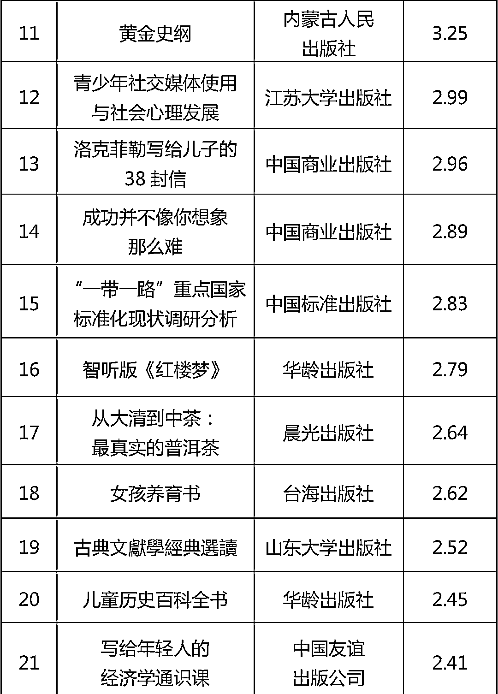************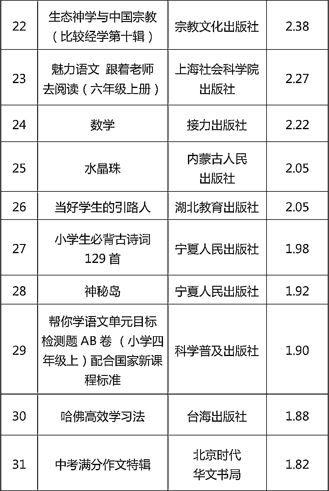************************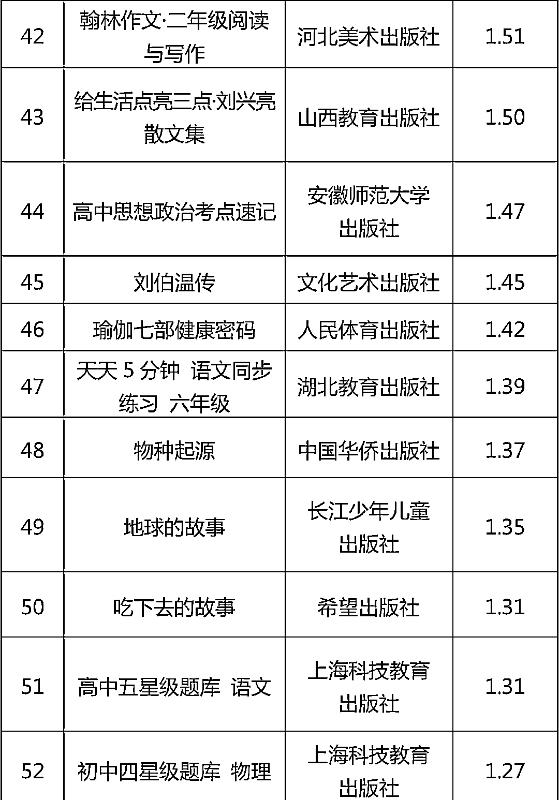************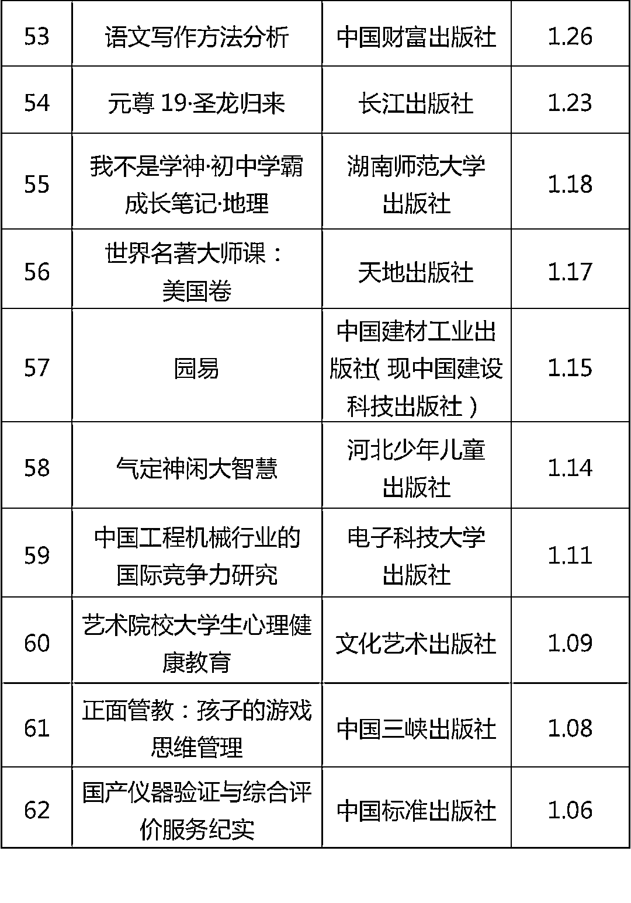******

******本次通报指出，根据《出版管理条例》第六十七条和《图书质量管理规定》第十六条、第十七条规定，国家新闻出版署将依法对相关出版单位进行处罚。相关出版单位要对差错率在万分之一以上万分之五以下的图书，**自检查结果公布之日起 30 日内全部收回，改正重印后可以继续发行。**对差错率在万分之五以上的图书，**自检查结果公布之日起 30 日内全部收回。********

********十年树木，百年树人********

********对少儿图书出版应慎之又慎********

********一字一句、一图一画都大意不得******** 

********你有发现过问题图书吗？********

******来源 ：南方日报综合自中国日报、首都教育、九派新闻******

************************

******← 向右滑动与灰产圈互动交流 →******

************