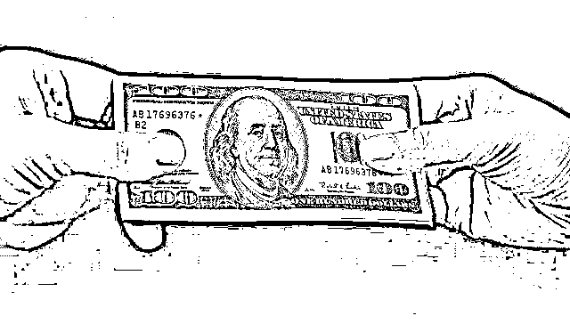
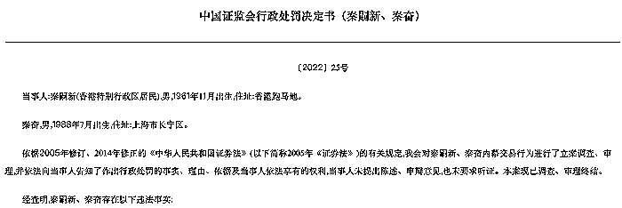
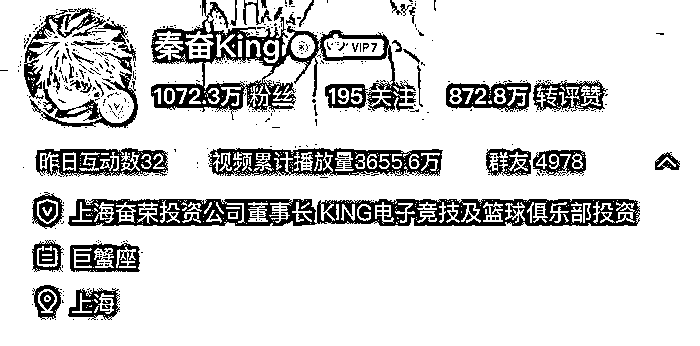
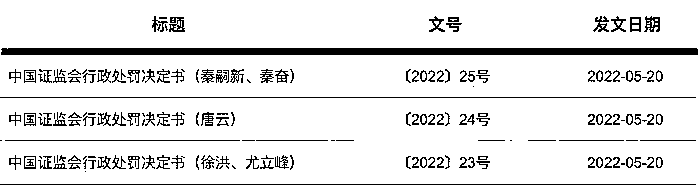

# 5000 万内幕交易没赚反亏，“富二代”秦奋被罚 60 万，称“像买彩票一样买了”

> 原文：[`mp.weixin.qq.com/s?__biz=MzIyMDYwMTk0Mw==&mid=2247536848&idx=3&sn=bda3eb4120a8bdd17a250c4b7f9b44d1&chksm=97cb9be8a0bc12fe6371c285f8aeeacc919c3ec3a7752e5f3d01673267df738e3f901a7a1795&scene=27#wechat_redirect`](http://mp.weixin.qq.com/s?__biz=MzIyMDYwMTk0Mw==&mid=2247536848&idx=3&sn=bda3eb4120a8bdd17a250c4b7f9b44d1&chksm=97cb9be8a0bc12fe6371c285f8aeeacc919c3ec3a7752e5f3d01673267df738e3f901a7a1795&scene=27#wechat_redirect)

图片来源：图虫

近日，中国证监会官网公布的一则行政处罚决定书，揭露了富通信息（000836.SZ，曾用名“鑫茂科技”）五年前一桩重组事项背后涉及的一系列内幕交易行为。

在此次内幕交易案中，“富二代”秦奋与其父秦嗣新参与其中。5 月 29 日，“秦奋 5000 万炒股涉内幕交易被罚 60 万”的消息冲上微博热搜，将事件的讨论度推上高潮。

界面新闻通过天眼查查询发现，秦奋对外投资主要集中在体育文化、汽车科技、电竞等领域，在资本市场并未留下太多足迹，在其持股公司中，仅 1 家间接持有上市公司三六零（601360.SH）极少量股权。

那么，秦奋父子二人是如何与鑫茂科技内幕交易案扯上关系？这起内幕交易还有谁参与其中？

**秦奋父子涉内幕交易被罚 60 万**

### **** 

**图源;中国证监会官网**

**据证监会披露的行政处罚决定书显示，父子二人秦嗣新、秦奋存在内幕信息公开前花 5000 万买入“鑫茂科技”的行为，构成违法行为，合计被处以 60 万元罚款。**

**据了解，秦奋因是上海有名的“富二代”而被大众熟知，但其身世一直较为神秘。随着此次鑫茂科技内幕交易案浮出水面，秦奋之父秦嗣新的身份也首次被公开。那么，秦奋父子二人是如何与这起内幕交易扯上关系？**

**该事件要追溯至 2016 年。据行政处罚决定书披露，唐某 1 实际控制微创（上海）网络技术有限公司（以下简称“微创网络”），知道徐洪是彼时上市公司鑫茂科技的董事长、实际控制人，想和徐洪谈收购事宜。徐洪认为微创网络是很好的收购标的，鑫茂科技和微创网络的重组可以助力上市公司的发展。**

**2016 年 9 月，徐洪开始与唐某 1 接触讨论鑫茂科技与微创网络重组。初步方案是唐某 1 和徐某成立并购基金收购微创网络股权后，再装入鑫茂科技。之后，徐洪联系时任广州证券员工唐某 2 帮忙对接资金，唐某 2 做了初步并购基金方案并安排下属程某寅联系优先级资金等。**

**经证监会认定，该内幕信息形成时间不晚于 2016 年 10 月 20 日，公开时间为 2017 年 8 月 8 日，内幕信息知情人包括徐某、唐某 1、唐某 2 等人。**

**据悉，徐洪与秦嗣新认识 20 余年。就在内幕信息公开前，徐洪为借钱和秦嗣新见面，秦嗣新知道徐洪是鑫茂科技的实际控制人，向徐洪询问鑫茂科技的运作情况。随后，秦嗣新转入大额资金至儿子秦奋三方存管银行账户，同日，秦奋三方存管银行账户向“秦奋”证券账户转入 5000 万元买入“鑫茂科技”。**

**对此，秦奋称其对资本市场没有兴趣，不知道基本市场概念，随意看行情软件看到了“鑫茂科技”这只股票，没有做过研究，像买彩票一样买了，凭感觉决策。秦奋还称，其证券账户由助理使用笔记本电脑下单，电脑在天津打篮球比赛时丢失。**

**针对秦奋的上述说法，证监会表示，不足以合理说明其交易的异常。最终对秦嗣新、秦奋合计处以 60 万元的罚款。**

****

**秦奋微博社交账号 图源:微博**

**值得注意的是，在证监会的行政处罚决定书中，秦奋父亲秦嗣新的信息首次被公开。处罚决定书显示，秦嗣新是香港特别行政区居民，1961 年 11 月出生，住址为香港跑马地。秦奋则于 1988 年 7 月出生，现居上海。目前，秦奋微博认证为上海奋荣投资公司董事长，KING 电子竞技及篮球俱乐部投资人。**

**天眼查数据显示，在秦奋的资本版图中，其担任法定代表人的企业有 2 家，其中一家已经注销，另一家为上海奋荣投资管理有限公司，该公司成立于 2012 年，注册资本为 3000 万元，由秦奋持股 65%，主要投资全球电子竞技、体育文化、汽车技术等领域。**

**界面新闻查询发现，秦奋在资本市场并未留下太多足迹。在其持有股份的 16 家公司中（5 家已注销），仅 1 家间接持有上市公司极少量股权。秦奋持股 5.85%的深圳天隆股权投资合伙企业（有限合伙）注册资本为 13151.60 万元，该公司的参股公司持有天津奇信志成科技有限公司 1.31%的股份，天津奇信志成科技有限公司为三六零（601360.SH）的第一大股东，持有上市公司股份 46.14%。**

**相较秦奋，秦嗣新的信息则较少出现在媒体报道中。界面新闻查在天眼查搜索秦嗣新后共显示八个结果，其中公司注册于上海的秦嗣新旗下三家公司均已处于吊销状态；对外任职方面，其在上海新润房地产发展有限公司担任副董事长，该公司成立于 1996 年，注册资本为 500 万元。但目前尚未能证实此人与本次涉案的秦嗣新是否为同一人。**

****另有董事长、券商员工被罚 60 万****

### ****

**图源;中国证监会官网**

**事实上，在上述鑫茂科技重组内幕交易案中，被查处的不止秦奋父子。**

**时任鑫茂科技董事长的徐洪作为内幕信息知情人，在内幕信息公开前，存在建议他人买卖“鑫茂科技”的行为，被处以 60 万元罚款。**

**具体来看，在内幕信息公开前，徐洪曾与尤立峰多次打电话、见面，交流鑫茂科技情况。徐洪表示“鑫茂科技”股票价格比较稳，此后，尤立峰通过龙某、汪某宇配资，于 2017 年 5 月 9 日使用“刘某”证券账户买入“鑫茂科技”61.36 万股，后于 2017 年 11 月 29 日卖出。相关交易并无获利。但因尤立峰未提供证据证明排除其存在利用内幕信息从事相关交易，证监会依法对徐洪、尤立峰分别处以 60 万元的罚款。**

**时任广州证券上海分公司机构部总经理唐云也是此次内幕交易的参与者之一。唐云参与设立并购基金收购微创网络股权过程，系内幕信息知情人，其控制使用 24 个账户以配资方式提前买入 9.45 亿鑫茂科技股票，最终卖出倒亏超 5000 万元。因违法情节严重，被处以 60 万元罚款和 10 年市场禁入。**

**从证监会公布的处罚决定书中可以看到，上述内幕交易当事人均未能从中获利，甚至产生亏损，但均为其违规行为付出代价。而鑫茂科技该次重组在筹划近一年后，最终也宣布终止。**

**那么，这家处于“风暴”中心的公司目前经营状况如何？据了解，在经过一系列股权变动后，富通信息目前控股股东为浙江富通科技集团有限公司，实控人为王建沂，专业从事以光纤光缆制造为核心的光通信业务和以石英管材产品为辅助的石英制品业务。**

**自 2017 年以来，富通信息业绩持续下滑。2017 年-2020 年，公司归母净利润由 8412.75 万元降至 1179.91 万元。2021 年，公司实现营收 14.30 亿元，同比增长 35.78%；实现归母净利润 651.94 万元，同比下降 44.75%。**

**二级市场方面，在业绩惨淡背景下，自 2017 年 3 月以来，富通信息股价便持续震荡下行。2022 年初，因赶上数字经济板块热潮，富通信息曾一度录得 4 天 3 板，不过之后迅速回落。截至最新收盘，富通信息股价报 2.60 元/股，较 1 月 19 日 4.12 元/股高点，累计下跌约 37%。**

**记者：庞宇 来源：界面新闻**

********

**← 向右滑动与灰产圈互动交流 →**

****