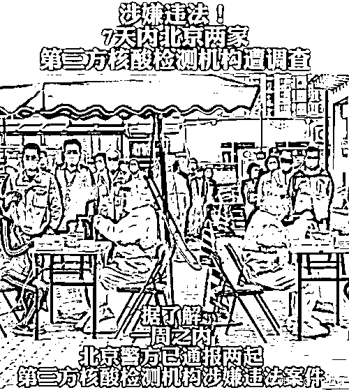
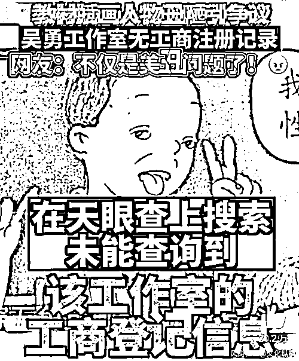
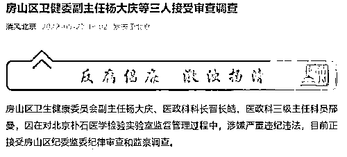
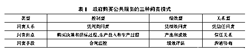

# 震怒全网的教材丑化和核酸造假，都指向同一个陷阱

> 原文：[`mp.weixin.qq.com/s?__biz=MzIyMDYwMTk0Mw==&mid=2247536848&idx=4&sn=2b707d0d7c1bbf23dfbc3014f6a47b84&chksm=97cb9be8a0bc12fe5fbcc1e8b0e73dc1363fefed84ad0a7c5544e49a774684b737fbdd485ef0&scene=27#wechat_redirect`](http://mp.weixin.qq.com/s?__biz=MzIyMDYwMTk0Mw==&mid=2247536848&idx=4&sn=2b707d0d7c1bbf23dfbc3014f6a47b84&chksm=97cb9be8a0bc12fe5fbcc1e8b0e73dc1363fefed84ad0a7c5544e49a774684b737fbdd485ef0&scene=27#wechat_redirect)

近日，小学教材插图丑化、核酸机构违法造假等事件接连发生，引发公众激烈批评。这些事件无不指向一个关键问题：为什么政府为实现公共利益而购买的公共服务，会出问题？出了问题，又该如何问责？

本文指出，很长一段时间以来，很多人认为政府购买公共服务能够利用市场竞争机制让公共服务变得更加专业、高效和灵活，乃至更加民主、可及和多样。**但政府购买公共服务并不像设想的那么完美，实际上，它不仅没有降低，反而可能增加公共服务提供的责任风险。**

**作者认为，政府购买公共服务带来三个新的责任风险：**一是市场失灵风险**，公共服务市场通常缺乏足够多的能提供服务的企业, 难以形成有效竞争，甚至经常出现**“赢者通吃”**的垄断现象；**二是委托代理风险**，由于信息不对称，政府很难百分百确定最优质的企业代理人，企业也很可能掩盖对自己不利，政府不一定能发现其中猫腻；**三是行政自由裁量权滥用风险**，一方面，有官员借助非政府组织逃脱法律约束、过度购买换取贿赂、推卸决策失误的责任，另一方面，那些企业也会忽视公平正义原则，对民众隐瞒、封闭关键信息。**

**由于政府购买公共服务混淆公私界线，已无法通过传统问责体系来解决责任风险问题，作者分析了三种不同的问责模式：**控制型问责、绩效型问责和关系型问责。**控制型问责，重在监控政府决策招标和企业服务这两方面是否合规；绩效型问责，重在评估政府购买服务的实际绩效；关系型问责，重在建立政府和非政府组织的信任合作关系, 以防止机会主义行为、提升服务供给质量。现实中, 各级政府采取的问责模式，一般由上述三种问责混合而成, 而且混合比例会因地因时而变。**

****本文原载《地方财政研究》2018 年第 4 期，原题为《政府购买公共服务的责任风险与问责模式》，**仅代表作者本人观点，特此编发，供诸君思考。**

****政府购买公共服务的责任风险与问责模式****

******▍****引言******

******很多学者认为, 与传统的方式相比, 政府购买公共服务不仅能够利用市场竞争机制让公共服务供给变得更加专业、高效和灵活, 而且可以通过引入社会参与机制使公共服务供给变得更加民主、可及和多样。但是不少研究却表明, 政府购买公共服务并不像设想的那么完美, 因为其实施的过程中总是充满了许多难以预料的困境。“新公共管理”概念的创造者克里斯托弗·胡德曾提到, 政府购买公共服务必然面临两个十分棘手的挑战：一是边界问题, 即哪些公共服务的提供不应该通过政府购买的形式；二是问责问题, 即如何确保政府购买公共服务的责任得到落实。**本文之所以选择关注政府购买公共服务的问责问题, 是因为问责一直被视为保护公共利益的主要机制。********

******问责可以被定义为一种问责主体和问责客体之间的特殊关系, 在该关系中, 问责客体有义务解释其所作所为, 问责主体能够予以质疑和评判, 如果解释无法回应质疑, 那么问责客体就需要承担一定的不利后果 。在政府直接生产公共服务的传统方式中, 问责关系相对清晰, 政府是唯一的问责客体, 通过宪法、行政法等公法的严格约束和严密监督, 使之对民众负责。**然而, 政府购买公共服务模糊了问责关系, 使传统的问责体系变得不再适用。其一, 非政府组织开始与政府共同承担公共服务供给的责任, 而责任共享非常容易导致责任归属不清、相互扯皮推诿的情况；其二, 政府不再是单纯的服务生产者, 而兼具服务设计者、服务购买者、服务监督者等多重身份, 这无疑增加了问责的难度；其三, 政府购买公共服务混淆了公私界线, 而传统问责体系依赖的公法是建立在公私二分的基础之上的。**有鉴于此, 本文试图从责任风险与问责模式两个角度探讨政府购买公共服务的问责问题。******

********

****（继北京朴石医学检验室涉嫌漏检之后，北京金准医学实验室也被立案侦查，这是一周之内第二起核检机构违法事件/截图自第一财经资讯）****

******▍****政府购买公共服务的责任风险******

******根据新公共管理的设想, 市场竞争是最完美的问责机制, 政府购买公共服务通过分离购买方和生产方创造了一个市场, 公共服务的生产者们为了获得购买合同不得不开展激烈的竞争, 由此公共服务能够以最有效、最经济的方式得到提供 。然而实际上, 政府购买公共服务不仅没有降低, 反而有可能增加公共服务提供的责任风险。下面将从市场失灵、委托代理关系和行政自由裁量权滥用三个方面来分析政府购买公共服务如何带来新的责任风险。******

********（一）市场失灵风险********

******所谓的市场失灵风险指的是, 由于公共服务市场存在失灵情况而导致政府购买公共服务无法获得理论预期的效果。**政府购买公共服务的倡导者忽视了极其关键的一点, 也即市场竞争能够发挥问责作用的必要前提是市场不存在失灵问题。事实上, 按照经典的市场失灵理论, 公共服务本身就是市场失灵的主要表现之一。**换言之, 正是因为公共服务是市场无法或难以有效提供的, 才决定交由政府来直接提供。诚然, 政府购买公共服务试图利用公开招投标机制创建出一个竞争性市场, 可是由于有效市场的条件要求过于苛刻, 市场失灵现象并未得到根除。******

****从市场的结构来看, 公共服务市场通常缺乏足够数量的服务生产者, 难以形成有效的竞争。在政府购买公共服务中, 购买者只有政府一家, 其购买的服务数量也相当有限, 根本不太可能养活大量的生产者。因此, **政府购买公共服务的实践中经常出现一种“赢者通吃”现象****：****在最开始的招标阶段, 一般会有足够多的服务生产者前来投标, 然而一旦某个生产者中标, 便很容易形成垄断, **一则因为其他大部分生产者无力维持生存而纷纷退出公共服务市场, 二则由于中标的生产者极易在生产公共服务的过程中获得新的优势, 比如与政府建立亲密关系、技术提升、规模扩大等。除了垄断之外, 服务生产者的数量不足也十分容易引发围标、串标、陪标等弊端。****

****从服务的性质来看, 政府向外购买的大部分公共服务属于软性服务, 面临产品难以定义和产出不易评估的困难。不难理解, 一个买家想要从自己新创建的市场中买到优质的服务, 必须首先向外精确地描述自己想买什么, 并能清楚地知道自己到底买到什么。一般而言, 政府向外购买的公共服务可以分为硬性公共服务和软性公共服务两类。前者在购买前可以被描述清楚, 在购买后可以被精确测量质量, 比如垃圾清理和道路建设；后者既难以在购买前被定义清晰, 也不易在购买后被准确评估, 例如社区矫正与残疾人关爱服务。国内外的大量经验和研究都表明, 由于产品定义和产出评估的难题, **政府购买硬性公共服务的成功概率相对高一些, 而政府购买软性公共服务则更容易遭遇市场失灵问题。******

********（二）委托代理风险********

******委托代理风险是指, 公共服务的买卖双方由于信息不对称导致了合同签订之前的逆向选择和合同签订之后的道德风险。在政府购买公共服务中, 政府和非政府组织会签订一份购买合同, 详细规定买卖双方的义务和责任, 比如买方需要提供多少数量的服务, 卖方应该何时支付价款。但是, 合同并不能自我执行, 作为委托方的政府需要千方百计地督促作为代理方的非政府组织按照合同要求提供公共服务, 由此形成了一种典型的委托代理关系。**著名的委托代理理论认为, 任何委托代理关系都不可避免地要面对两个相当棘手的难题, 一是逆向选择, 二是道德风险。********

********逆向选择是由购买合同签订之前买卖双方信息不对称引起的, 又被称为隐藏信息问题。**要想政府购买公共服务取得预期效果, 政府就必须遴选出最好的服务生产者。**然而由于服务生产者永远比政府要更加了解自己的信息, 因此政府无论如何努力地搜寻信息, 也难以百分百确定是否选择了最优质的代理人。**近年来, 各级政府经常碰到一种与逆向选择问题有关的情况：随着服务生产者的投标经验越来越丰富, 其投标文件的编制水平也越来越高, 甚至一些服务生产者还会寻找专业的标书编制公司来代写或加工自己的投标文件。这种信息隐瞒的情况已经迫使政府要么投入更大的成本和更多的时间来甄别服务生产者提供的信息, 要么不得不与一个远离预期的服务生产者开展一段艰难的合作。******

********

****（在人教版数学教材引发舆论关注之后，有媒体指出该工作室并无工商登记信息/截图自中新经纬）****

******道德风险则是由购买合同签订之后买卖双方信息不对称引起的, 也被称为隐藏行动问题。**即使政府能够辨别出最佳的服务生产者, 仍然不能保证一定能购买到高品质的公共服务, **因为服务生产者有可能在生产公共服务的过程中向政府只传递对自己有利的信息, 掩盖对自己不利的信息, 而政府不一定能够发现其中的猫腻。**为了防范道德风险, 政府一般会通过监控机制来获得服务生产者生产公共服务的关键信息, 比如开展暗访, 要求定期提交生产进度文件和调查服务对象等。诚然, 监控越严密, 道德风险发生的概率也越低。不过, 加强监控会产生两个相当麻烦的弊端：一是监控是要支付成本的, 监控越严密, 成本也越高, 从而有可能抵消政府购买公共服务的正面效应；二是监控太严意味着政府过多地干预了服务生产者的行为, 进而有可能导致委托人和代理人的界线消失, 也即普遍存在的“从伙伴变成伙计”现象。****

******（三）行政自由裁量权滥用风险******

******行政自由裁量权滥用风险指的是这样一种情况, 即政府购买公共服务赋予了政府和非政府组织大量的行政自由裁量权, 这些行政自由裁量权是保证非政府组织灵活性的必要条件, 却也同时给政府和非政府组织提供了滥用权力的机会。政府购买公共服务的倡导者总是认为, 决策与执行之间有着清晰的区别。具体来说就是, 作为买方的政府作出公共服务生产的决策, 而作为卖方的非政府组织仅仅执行前者的决策。但是在实践中, 决策与执行之间的分界线是十分模糊的。当政府将公共服务的生产职能外包给非政府组织的时候, 同时也把部分的行政自由裁量权转交了出去。一旦政府与非政府组织共享了公共服务供给中的行政自由裁量权, 权力滥用的风险也就提高了。******

********从政府的角度来看, 行政自由裁量权滥用风险有三个主要表现。一是“逃脱约束”。**通常来说, 政府的行为是受到宪法、行政法等公法的强有力约束的, 比如遵守严格的程序性规则。但在政府购买公共服务中, 政府巧妙地借助非政府组织摆脱了公法约束。**二是“过度购买”。**如果在政府监督机制不健全的情况下推行政府购买公共服务, 一些自私自利的政府官员将会利用购买合同来换取服务生产者的贿赂。为了获得更多的贿赂, 这些官员可能会把很多原本不适合外包的公共服务也外包出去。**三是“推卸责任”。**在政府直接生产公共服务之时, 责任归属非常清晰, 政府是唯一的问责对象。然而, 在政府购买公共服务之后, 政府很容易将自己的决策失误归咎于非政府组织的执行不力。******

********

****从非政府组织的角度来看, 承包公共服务生产让非政府组织获得了部分行政自由裁量权, 而这些权力的滥用风险体现在两个方面。一方面, 在政府购买公共服务中, 政府与非政府组织之间的合作关系建立在合同的基础之上, 因而**非政府组织更多考虑的是达成合同规定的具体任务 (比如服务对象的数量) , 而非确保行政自由裁量权的使用符合公平正义的原则 (比如在资源有限的情况下, 为什么 A 得到了服务, 而具有类似条件的 B 却没有)** 。另一方面, 与非政府组织签订购买合同的是政府而非民众, 因此**非政府组织没有义务主动向民众告知公共服务生产的过程和绩效, 民众也无法直接向非政府组织获取这些信息。**在信息不公开的情况下, 行政自由裁量权无疑存在相当高的滥用风险。****

******▍****政府购买公共服务的****问责模式******

********面对政府购买公共服务可能出现的诸多责任风险, 政府可以采用三种不同的问责模式进行控制, 也即控制型问责模式、绩效型问责模式和关系型问责模式。**这三种问责模式遵循着不一样的逻辑, 其特征具有明显的差异。表 1 从问责关系、问责焦点和问责手段三个维度描述和区分了上述三种问责模式, 其中, 问责关系的维度关注“凭何问责”；问责焦点的维度关注“何处问责”；问责手段的维度关注“如何问责”。******

********

******（一）控制型问责模式******

********不少文献都错误地认为, 控制型问责模式只适用于政府直接提供公共服务, 绩效型问责模式只适用于政府购买公共服务, 相互之间不能对调。**可是在实践中, 绩效型问责模式经常被运用到政府直接提供公共服务中, 例如大部分的政务大厅都会收集服务对象对窗口人员的满意度。同样的, 控制型问责模式也时常被运用于政府购买公共服务, 比如很多购买社工服务的合同会严格规定社工的投入数量。实际上, 控制型问责模式在确保政府购买公共服务的问责性中一直发挥着举足轻重的作用。******

****在问责关系方面, 控制型问责模式秉持运用约束性规则对政府购买公共服务进行问责的理念。一般来说, 控制型问责模式的具体实施包括三个步骤, 首先针对政府如何购买公共服务与非政府组织如何生产公共服务作出一系列详细而清晰的约束性规则, 然后根据这些规则来严密监控政府和非政府组织在政府购买公共服务中的实际行为, 最后依据监控到的违规情况予以相应的问责。**作为控制型问责模式的核心要件, 规则通常可以有两种类型：一是行为规则, 用于规范政府和非政府组织的行为, 比如禁止假公济私；二是技术规则, 用于规定它们如何完成任务, 例如设置垃圾处理的基本流程。******

******在问责焦点方面, 控制型问责模式往往将注意力聚焦在两个领域。第一个领域是政府购买公共服务的购买决策和招标过程, 其约束性规则主要由政府的财政部门具体制定。我国财政部明确要求政府购买公共服务的招标过程必须严格按照《政府采购法》的有关规定进行, 并出台过《关于坚决制止地方以政府购买服务名义违法违规融资的通知》等文件来规范政府购买公共服务的决策行为。第二个领域是非政府组织生产公共服务的投入和过程, 其约束性规则一般会在购买合同中予以规定。在投入方面, 购买合同通常会明确规定工作人员数量、设备数量、场地面积和服务时间等, 而在过程方面, 购买合同则会详细陈述公共服务的具体生产方式和限定服务对象的主要特征。******

********在问责手段方面, 控制型问责模式主要使用合规监控。**所谓合规监控指的是, 根据既定的规则, 对与政府购买公共服务相关的行为进行审查, 并设法纠正偏差行为。合规监控的目的在于保证政府购买公共服务的相关行为符合一些提前设定的规则。为了达到该目的, 合规监控必须有效地开展两类活动, 一是运用财务审计、实地督察、书面汇报、受理举报等工具获取公共服务购买方和生产方行为是否合规的信息, 二是在发现违规行为之后, 利用警告、惩罚、解除合同、诉诸司法等手段予以及时纠正。******

******（二）绩效型问责模式******

********大多数政府购买公共服务的倡导者都认同, 绩效型问责模式比控制型问责模式更加适合政府购买公共服务。**根据他们的设想, 政府购买公共服务的本质是将市场竞争机制引入到公共服务提供之中, 而市场竞争机制与绩效型问责有着天然的亲和性。这种亲和性体现在, 要想充分发挥市场竞争机制的积极作用, 就必须将问责的关注点落在公共服务的产出和效果, 并让公共服务生产者在生产投入和生产过程中拥有更多的自主决策权。足够的自主决策权不仅有助于激发服务生产者的创新活力, 而且可以促使服务生产者把更多的精力放在服务生产而非应付监控之上。******

******对于“凭何问责”的问题, 绩效型问责模式重视公共服务生产的最终结果, 主张运用绩效评估实现对政府购买公共服务的问责。**按照该问责模式的逻辑, 特定的投入和过程不一定会导致特定的结果, 而政府购买公共服务的目的至始至终都是获得预期的结果———特定数量和品质的公共服务, 因此政府购买公共服务的问责必须坚持结果导向。站在结果的角度, 就需要首先在购买合同中设置清晰的绩效目标与相应的评估标准, 然后在购买之后对绩效目标的达成情况进行准确的测量和评价, 并将绩效评估结果与奖惩措施相挂钩。****

****对于“何处问责”的问题, 绩效型问责模式倾向于关注政府购买公共服务的产出 (outputs) 和成效 (outcomes) 。产出指的是, 政府购买公共服务带来的直接结果, 即承包商生产的服务。通常来说, 产出可以用数字进行描述, 比如向 20 名失业人员提供了就业培训。而成效可以定义为, 产出对服务对象或社会事务造成的各种长期影响。有的成效可以用数字描述, 例如就业培训使 5 名失业人员再就业；有的则难以量化测量, 比如借书服务养成了社区居民的阅读习惯。依据绩效型问责模式的理念, 政府和非政府组织在签订购买合同时, 应该尽量将产出和成效而非投入和过程描述清楚, 并列出可测量的评估指标。****

****对于“如何问责”的问题, 绩效型问责模式最倚重的工具就是绩效评估。**为了让公共服务承包商获得比较灵活的决策自主权, 绩效型问责模式主张放松对投入和过程的监控；**为了保证决策自主权用于改进公共服务生产, 绩效型问责模式又非常注重运用绩效评估这一工具。所谓的绩效评估指的是, 根据购买合同规定的评估指标对政府购买公共服务的产出和成效进行达成度的测评。在绩效型问责模式下, 问责是以绩效评估结果为依据的。如果结果不佳, 政府购买公共服务就会被放弃；如果结果良好, 就可以继续进行；如果结果一般, 便需要予以相应的改进。****

******（三）关系型问责模式******

******除了控制型和绩效型这两种正式的问责模式之外, 政府购买公共服务还可以采用一种非正式的问责模式, 即关系型问责模式。**关系型问责模式的支持者认为, 单单依靠正式合同的理性规划, 并不足以保证政府购买公共服务的问责性, **一则由于任何合同都不可能对所有未来可能发生的情况作出明确的规定, 二则因为合同管理均是镶嵌在复杂的社会关系之中的。**故而, 在作为委托方的政府和作为承包方的非政府组织之间建立和维护一种相互依赖和相互信任的合作关系, 可以起到防止机会主义行为和提升服务供给质量的问责作用 。********

******在问责关系方面, 关系型问责模式侧重通过建立良好的信任关系来确保政府购买公共服务的问责性。这背后的逻辑是, 良好的信任关系能够让买方和卖方形成一种关于政府购买公共服务的共同预期, 而这种共同的预期恰恰可以推动双方主动共享愿景、信息和资源, 积极协商解决合同履行中出现的争议与问题, 从而有利于破除政府购买公共服务的各种责任风险, 尤其是逆向选择和道德风险。与关系型问责模式的这种逻辑不同, 控制型和绩效型问责模式都是建立在低信任的基础之上的, 非常强调服务标准 (规则或指标) 的清晰性和奖惩措施的严厉性。******

******在问责焦点方面, 关系型问责模式着眼于政府和非政府组织的信任关系。对于关系型问责模式来讲, 无论是监控投入和过程, 还是评估产出和成效, 都不如维护信任关系在问责中的重要作用。**在政府购买公共服务中, 信任关系可以来源于三个方面：一是基于合同的信任, 即相信合作双方不会无故违反合同规定, 二是基于能力的信任, 即相信合作双方有能力达到对方的期许, 三是基于善意的信任, 即相信合作双方会将共同的利益放在优先位置。一般来说, 这些信任关系非常难以建立和维系, 却极其容易遭到破坏。********

******在问责手段方面, 关系型问责模式主要运用沟通协商而非制裁威胁的手段。**控制型问责模式的合规监控与绩效型问责模式的绩效评估, 都是直接以制裁威胁作为强大后盾的, 而关系型问责模式的沟通协商则是以珍惜信任关系作为支撑的。**关系型问责模式对沟通协商手段的依赖可以体现在政府购买公共服务的每个主要阶段。在合同签订阶段, 合作双方既一起协商制定服务标准, 也不追求标准的精确性；在合同履行阶段, 合作双方总是极力避免陷入严格审查和应付审查的敌对情境, 而是通过平等协商和自由交流来解决合同履行中出现的种种问题；在合同验收阶段, 合作双方致力于建立长期持久的合作关系。******

******▍****结语******

******传统的公共服务问责体系以公私二分原则为基础, 适用的前提为政府是唯一的公共服务提供者。然而, 政府购买公共服务将非政府组织引入了公共服务的供给系统中, 并让其扮演了十分重要的生产者角色, 由此冲击了公私二分原则, 带来了诸多新的责任风险。本文从市场失灵、委托代理关系和行政自由裁量权滥用三个方面深入探究了政府购买公共服务可能产生的责任风险, 其中市场失灵侧重经济视角, 委托代理关系侧重组织视角, 行政自由裁量权滥用侧重政治视角。为了应对这些棘手的责任风险, 政府可以运用控制型、绩效型和关系型三种问责模式对政府购买公共服务进行问责。这三种模式具有各不相同的逻辑, 可以从问责关系、问责焦点和问责手段三个维度进行区分。当然, 这三种模式属于韦伯所说的“理想类型”。在现实中, 各级政府采取的问责模式一般由上述三种问责模式混合而成, 而且混合比例会因地因时而变。******

******来源：文化纵横，观察者网  文：华南理工大学 叶托、薛琬烨******

************************

******← 向右滑动与灰产圈互动交流 →******

************