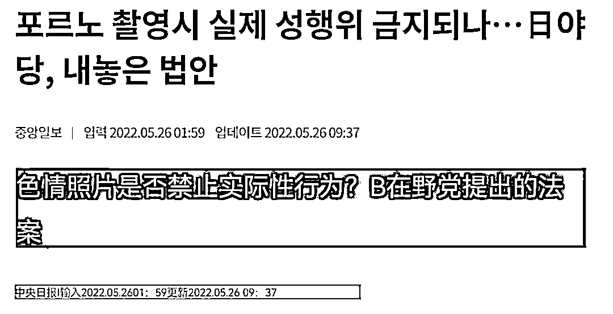
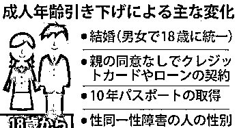
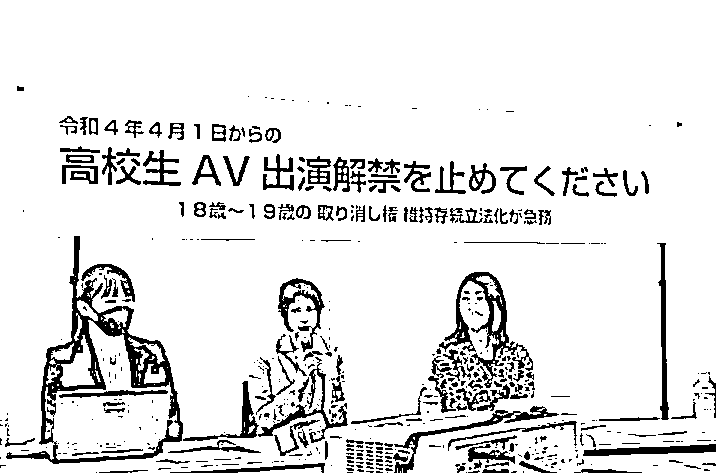
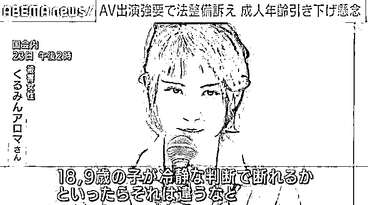
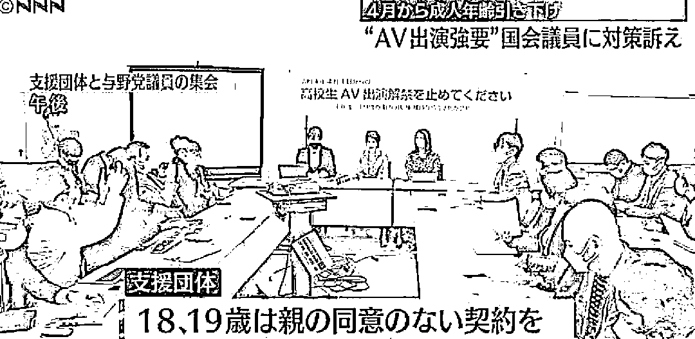
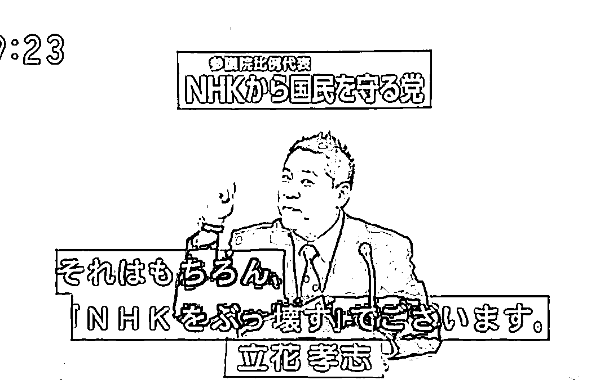
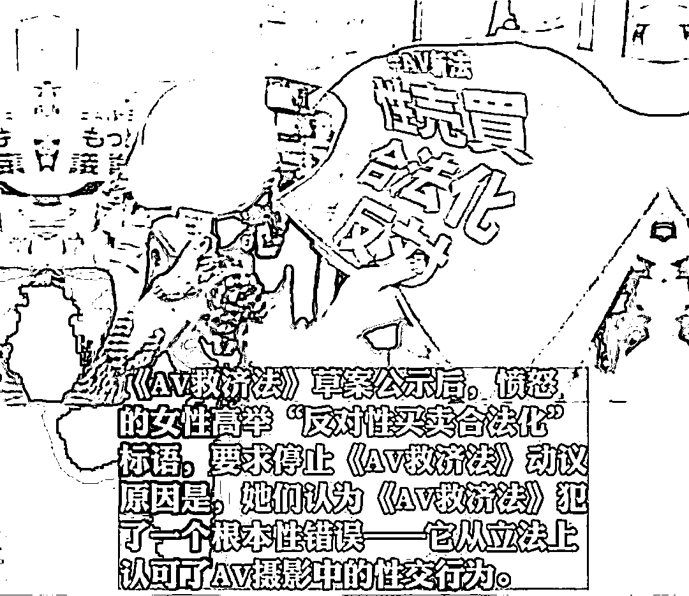
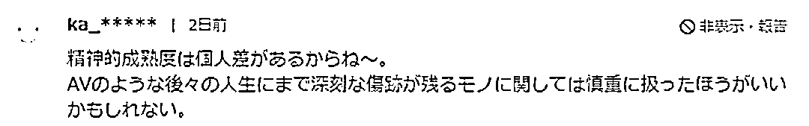

# 啥？日本 AV 产业要凉了？！

> 原文：[`mp.weixin.qq.com/s?__biz=MzIyMDYwMTk0Mw==&mid=2247536848&idx=6&sn=376260a7c0947c8a793cb18d5716b2b0&chksm=97cb9be8a0bc12fea66016821ef0b4bc4f3352d430f8e29dc72b2438e39f9b0ba85f33b4b09f&scene=27#wechat_redirect`](http://mp.weixin.qq.com/s?__biz=MzIyMDYwMTk0Mw==&mid=2247536848&idx=6&sn=376260a7c0947c8a793cb18d5716b2b0&chksm=97cb9be8a0bc12fea66016821ef0b4bc4f3352d430f8e29dc72b2438e39f9b0ba85f33b4b09f&scene=27#wechat_redirect)

提到日本的特色文化，想必大家一定会想到：**AV** 。

这个民风保守的国家，在“性”方面却异常开放，凭借制作精良的爱情动作片，风靡亚洲。

多少小伙在青春懵懂时，没有接受过来自岛国老师的**教导**和**熏陶**呢？

可是就在最近，发生了一件让无数 LSP 痛哭流涕的事情 —— **日本议员提议立法禁止 AV**。

在众议院内阁委员会上，日本议员表示将“禁止涉及性行为的色情制品”为目标制定法律：

> **“即使影视剧中有杀人的场景也只是演戏，在拍摄过程中不会真的杀人，然而性行为却在 AV 拍摄片场发生了；**
> 
> **从尊重人权的角度出发，作为制宪会议，我们承诺继续尽最大努力，消除性剥削。”**

WTF？什么情况，以 AV 产业闻名天下的日本竟然要禁止 AV？

要知道，日本 AV 产业发展至今已有数十个年头，其生产总值**占据日本总 GDP 的 1%**，是经济的重要支撑之一。

而且，从事 AV 产业的相关人员超过了 30 万人，这些人都靠着 AV 来养家糊口。

如果 AV 被禁止，不仅国家经济会受到影响，许多人也会断了收入来源。

怎么看，都是搬起石头砸自己脚的行为，雨仔悲天怜人，表示**强烈反对**！

那么日本议员为什么会提出禁止 AV 呢？起因要追溯到日本新民法的施行。

在新民法中，日本将成年的年龄**从 20 岁下调至 18 岁**。

这意味着年满 18 岁和 19 岁的人，可以脱离父母的掌控，自主与企业签订合同。

乍一看，似乎没有什么问题，毕竟咱中国一直是以 18 岁为分水岭。

但凡事都要结合国情来看。

日本虽然情色业发达，但此前有明确的法律规定，**禁止未满 18 岁**的人出演 AV。

同时，年龄在 18 岁到 20 岁之间的人，由于仍属于未成年，就算签订了 AV 合同，父母也可以使用**“未成年人取消权”**取消。

可如今伴随着成年年龄的下调，未成年人取消权失效，父母便无权再干涉。

这就会导致乱象的产生：

一些青涩懵懂的女高中生，为了赚钱，早早去拍摄 AV，走上一条不归路；

更恶劣的情况是，一些涉世未深的少女，被连哄带骗签下了 AV 合约后发现上当，却**得不到法律保护**。

针对有可能发生的乱象，许多日本网友联手在网络请愿。

他们希望在降低成年门槛的情况下，仍然保留 18 岁和 19 岁的“未成年人取消权”。

其中，前 AV 女优**胡桃香气**还现身说法，讲述自己因缺少保护所经历的悲惨遭遇。

当时还是学生的胡桃香气，跟着所谓的音乐星探前往到片场后，发现羊入虎口。

不仅被要求必须**裸体**，还被十几个大汉围堵，只能签下 AV 合约：

> **“当一个 18 岁或 19 岁的年轻人被星探挖掘，以为能实现梦想时，却发现事实并非如此；**
> 
> **我当时虽然已经超过 20 岁，但被十几个人围着被迫签下合同，这成了我一生难以抹去的伤痛，对于十几岁的人来说，更是难以拒绝。”**

眼看着民怨沸腾，日本议员们火速进行了应对，推出**《AV 救济法案》**。

该法案规定，AV 演员在作品发行一年内，拥有**无条件解约**的权利，公司无权申请索赔。

包括那些在 AV 行业耕耘已久的演员，同样享有这项权利。

有一说一，雨仔觉得这项法案真不错，既赋予了新人无忧保障，又给予了老人后悔机会，相当人性化。

只是，这个看似完美无缺的补救法案，又被日本网友冲烂了。

许多日本女性走上街头游行示威，要求停止《救济法案》的通过。

原因是她们认为该法案是在认可 **AV 中的真实性行为**。

这又是哪门子情况？难不成以前雨仔，啊呸，雨仔朋友们看的都是虚假的动作片？

实际上，日本 AV 电影是真刀真枪，但 AV 行业从来没有在明面上承认过，因为所有从事性的行为，在日本都是**违法**的。

为了规避法律，他们要么给关键部位打上马赛克，要么强调演员只是在表演，总之就是坚决否认影片中存在真实的性行为。

可是在《救济法案》中，明确将 AV 定义为“性行为影像品”，此举显然和法律产生了矛盾，因此有人认为这是在变相将**性买卖合法化**。

最终在吵来吵去后，有的议员直接开摆了，提出**立法禁止 AV** 的一刀切政策。

自从议员提议立法禁止 AV 后，日本民间爆发了热烈的舆论。

有支持的，同意禁止所有 AV 作品；

“也该为 20 岁以上的人提供保护。还是禁止制作成人片新片比较好……”

有反对的，认为演员是自愿进入 AV 行业；

“感觉不太对啊。既然 18 岁都能结婚了，那么自愿涉及风俗产业，也该自负责任。”

也有理中客建议慎重对待。

“精神的成熟度，每个人都有差别。对于成人片这种会对今后人生造成深刻伤害的东西，或许还是应该慎重对待比较好。”

而此事传入到国内后，同样掀起了不小的波澜。

有人偷着乐，有人眼婆娑，还有人眼疾手快，迅速扩充网盘的作品数量。 

在雨仔看来，日本**不可能完全禁止 AV**。

AV 作为其支柱产业，不是政客几句话就能轻易禁止，本身当下全球经济大环境就不景气，再自废武功，无疑是徒增负担。

但与此同时，日本也确实应该**认真规范 AV 行业**。

别看日本 AV 行业发展得如火如荼，其实隐藏着无数人的血与泪，日本内阁办公室曾有过调查，从事演艺行业的年轻女孩中，有 12% 的人被强制要求拍摄 AV。

谁敢不拍摄，轻则被殴打，重则被性侵。

想要脱身，必须**缴纳巨额违约金**，就算脱身，也留有把柄，甚至还会被找上门骚扰：

“他们知道我的住址，我回家后晚上也睡不着觉，我担心家人和学校会知道这件事，简直像活在地狱里。”

诚然有很多女孩靠拍 AV 摆脱了贫穷的处境，成为受人追捧的网红，赚了普通人一辈子都不敢奢望的金钱。

但同时有不少女孩因 AV，逼不得已走上绝路，遭受到伤害。

总有人说“存在即合理”，AV 的存在或许有其合理性，但更有不可忽视的问题，整个行业的风光不能掩盖个体的凄惨。

毕竟，女性是人，AV 女优也是人，**任何压榨和侮辱的行为，都不可取。**

来源：IT 之家

← 向右滑动与灰产圈互动交流 →

