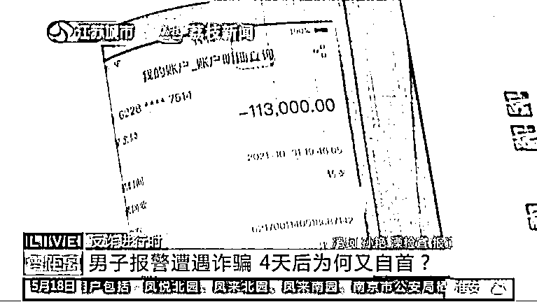
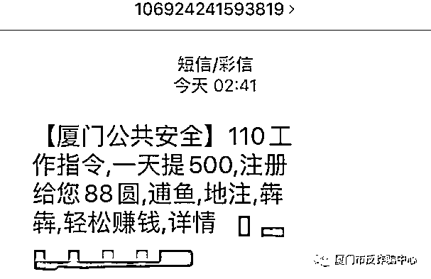
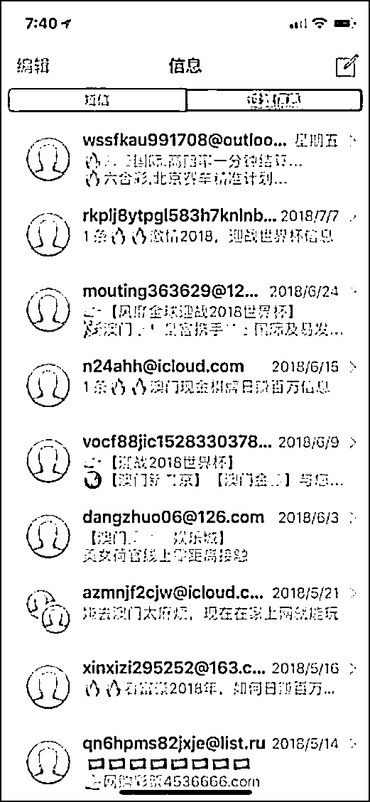
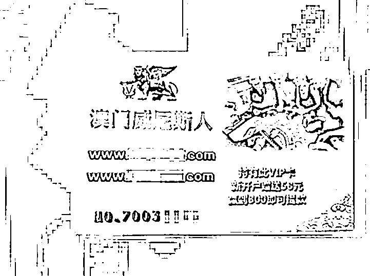
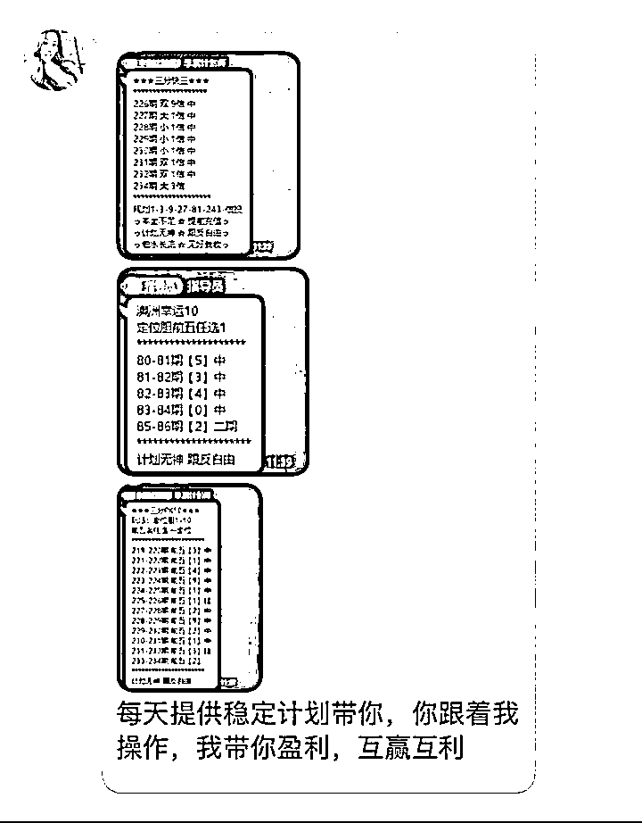
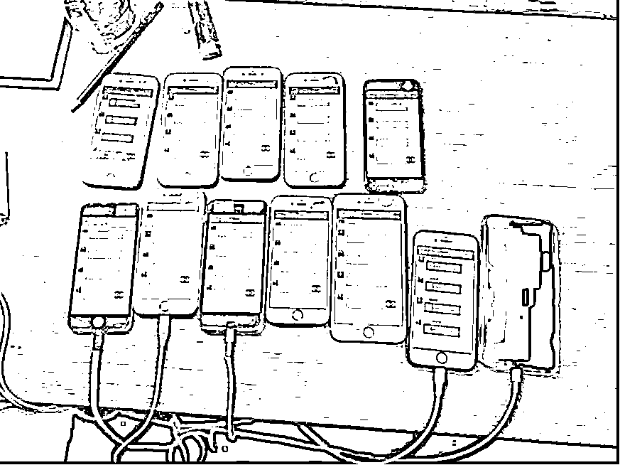
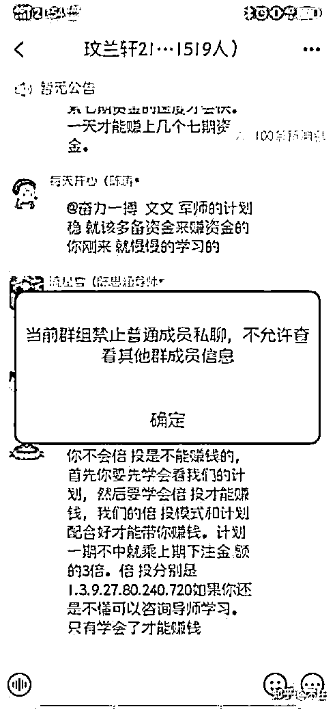
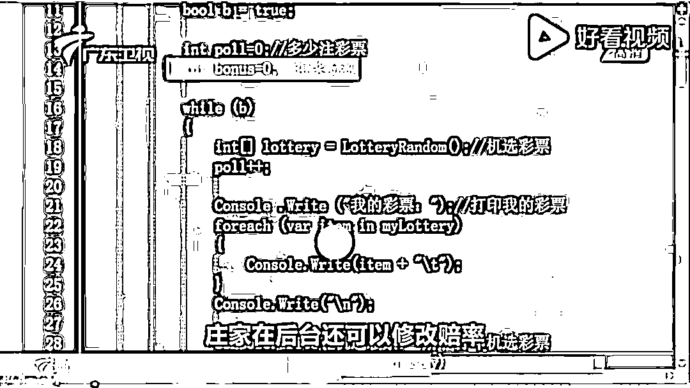
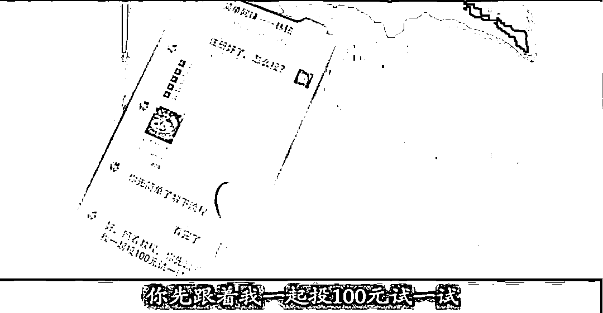
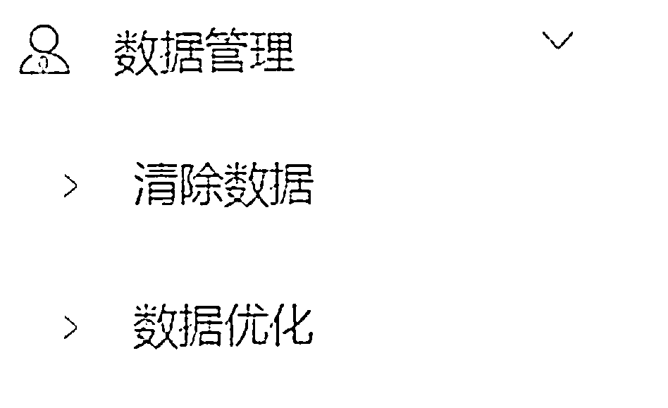

# 他骗来的 190 万却在赌博时输光了

> 原文：[`mp.weixin.qq.com/s?__biz=MzIyMDYwMTk0Mw==&mid=2247536848&idx=7&sn=e2ea9b1e0d86acba888011063be0a989&chksm=97cb9be8a0bc12fe7489db7317be9fe72a383cf1bb0bf4ef2a6673e37b2c34fdb27b61ff4f74&scene=27#wechat_redirect`](http://mp.weixin.qq.com/s?__biz=MzIyMDYwMTk0Mw==&mid=2247536848&idx=7&sn=e2ea9b1e0d86acba888011063be0a989&chksm=97cb9be8a0bc12fe7489db7317be9fe72a383cf1bb0bf4ef2a6673e37b2c34fdb27b61ff4f74&scene=27#wechat_redirect)

骗子也会被诈骗吗？当然！最近，热搜话题**#男子诈骗 190 万在网上赌博被骗光#**的主角——江苏男子夏某，就遭遇了这样的“糟心事”。 

夏某最近迷上了网络赌博，还在平台上赚了点钱。当他准备提现时，平台客服告诉他：“要想提现，需要先进行大额充值，流水达到一定金额才行。”囊中羞涩的他为了尽快 “提现”，居然干起了诈骗。 

之后，夏某以卖二手车的名义诈骗三人，骗来了 190 余万元。而当他钱全数充值进了网赌平台时，没等提现，账户里的钱很快就输光了。意识到自己被诈骗，他选择了报警，并且坦白了之前的违法行为。

 图片来源：江苏城市频道

由此可见，网络赌博确实是个大坑，“十赌十骗”，骗子也逃不过。今天，守哥就带大家看看，网络赌博诱人入坑的套路。

***01***

**斥巨资打广告，网赌宣传无孔不入**

像夏某一样的赌徒们使用的网赌软件或 APP 都是非法的，**这些软件并不能从正规渠道下载，而是不法分子通过短信或网络广告扩散的**。

图片来源：检察日报

相信不少人都收到过各种各样号称轻松致富的短信。

 图片来源：厦门反诈骗中心

甚至还收到过“高端赌场”的热情邀请。

图片来源：西湖之声

一些在线赌场的“高级”广告，还会使用五毛特效制作明星代言的虚假海报来增加可信度。

图片来源：厦门反诈骗中心

更过分的是，自家门口都能收到“赌场”的小卡片……

图片来源：北京青年报

从“网络投放”到“线下地推”再到雇佣“线上推广员”等，网络诈赌平台为此付出的“推广费”也非常夸张。某搜索引擎公司代理商就曾表示，推广网络赌博业务，一天就能消耗 1000 多万广告推广费用。

除了通过互联网散发“小广告”，骗子也会利用电话、短信等看似原始但命中率极高的方式直接联系受害人。

他们惯用的伎俩就是以“致富导师”的名义发送短信，**声称自己知道一个****玩网络博彩赚****大****钱****的方法，愿意分享给更多的人，共同致富****。**随后，导师以方便沟通为由要求添加好友私聊，图文并茂吹嘘“互赢互利”妙招。

图片来源：南方都市报

如果受害人信以为真，导师便会向其发送网赌 APP 的下载链接或二维码。一旦下载或注册，就等于是跳进了骗子安排好的陷阱。

***02***

**拉群演戏，策划暴富假象**

一些“规模较大”的诈骗团伙还会将多名受害人拉进所谓的“致富群”，在“导师”的带领下学习博彩妙招（网赌 APP 使用方法），**并用“赌钱有输有赢，下次一定翻倍赚回来”的逻辑给受害人洗脑****。**

图片来源：焦点访谈

这类网赌聊天群绝大多数都是托和骗子。有网赌团伙被警方抓获后曾供述：一个聊天群里有成员几十人或上百人，其中有百分之六十以上都是网赌平台的托。而这百分之六十的托，又只不过是两三个人拿不同的手机发着不同的消息，扮演着不同的角色。

图片来源：越城公安

他们乔装成靠网赌一夜暴富的“富豪”，在群里晒盈利图、虚假生活照，只是为了刺激受害者加大充值金额和投注金额。为了确保骗术不被暴露，这些看似活跃的社群通常还会**禁止群成员私聊****。**

图片来源：知乎

对于资金充足的重点诈骗对象，他们甚至会安排私人导师“一对一指导”，诱骗受害人在网赌 APP 上进行大额充值，所谓“输得越多，就越想要赢”，受害人从此身陷网赌平台不可自拔。

***03***

**篡改后台数据，放长线钓大鱼**

骗子掌控下的网赌平台，都有一套自己的后台管理系统，可以随意修改中奖率、赔率、用户钱包金额等。**所以在网赌平台上的输赢，并不是你以为的“运气有好有坏”****。**

图片来源：广东卫视

当受害人第一次使用平台进行赌博时，骗子指导受害人先小玩一把试试。然后通过数据篡改的方式，制造赢钱的假象。

图片来源：朝阳网警巡查执法

在蝇头小利的诱惑下，受害人大多会加大投入。而当受害人向平台提交提现要求时，骗子则会编造提现金额不达最低标准等借口，诱使其多次充值。**当骗子觉得“赚够了”，就马上****篡改****权限****、控制输赢，****甚至封禁账号，****令****赌徒****血本无归****。**

在一些网赌平台的后台里，骗子还部署了数据清除功能，他们一周清理一次数据，让犯罪证明无迹可寻。这也是网赌被骗后资金很难全数追回的原因之一。

图片来源：锦州网警巡查执法

看到这里，相信大家都明白了一个道理：骗子套路多，只有你想不到的，没有骗子做不出来的！那么，针对各类网赌骗术，我们该如何防范呢？

**反诈小结**

**01**

如果发现有人组织或者从事赌博，请前往公安部打击治理跨境赌博新媒体平台**“拒绝跨境赌博”微信公众号**举报。

**02**

戒除贪念，不要相信“天上掉馅饼”的好事。赌博违法，十赌十骗，**不要被蝇头小利所欺骗。**如果不幸入局，及时报警，把损失降到最低。

来源：守护者计划

← 向右滑动与灰产圈互动交流 →

