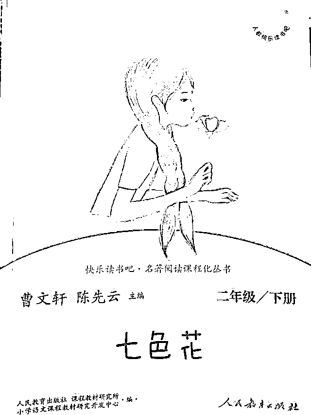

# 北大叫兽曹文轩，你的无耻行径终于败露了！

> 原文：[`mp.weixin.qq.com/s?__biz=MzIyMDYwMTk0Mw==&mid=2247536884&idx=1&sn=105b48a6781c70e90bac410702e72612&chksm=97cb9bcca0bc12daec6b6f9ff8e61ab624f1dbc926a6b79558cb357b0080e5acb5ba87a83c9f&scene=27#wechat_redirect`](http://mp.weixin.qq.com/s?__biz=MzIyMDYwMTk0Mw==&mid=2247536884&idx=1&sn=105b48a6781c70e90bac410702e72612&chksm=97cb9bcca0bc12daec6b6f9ff8e61ab624f1dbc926a6b79558cb357b0080e5acb5ba87a83c9f&scene=27#wechat_redirect)

5 月 30 日，《大语文》丛书的出版机构——明天出版社总编室工作人员告诉封面新闻记者，已关注到该丛书中的争议内容，正在自查。人教社工作人员也表示，关注到《七色花》引发的争议，正开会研判。 

封面新闻记者尝试联系曹文轩本人，但未能成功。

人教社图书《七色花》

**曹文轩主编丛书被指收录“露骨”民歌** 

**出版社：关注到争议内容 将自查**

近日，中国作家协会全国委员会委员、北京作协副主席、北京大学教授曹文轩主编的《大语文》丛书《像鹰学会飞翔》分册第 36 页，收录的一则民歌在网络引发热议。有网友认为内容“露骨”，“含有性暗示”，不适宜儿童阅读；也有网友认为，丛书是针对高年级学生的课外读物，并非童书，原文是经典文学作品，不应被“断章取义”。

5 月 30 日下午，明天出版社总编室工作人员告诉封面新闻记者，“我们已关注《大语文》丛书中的争议内容，正在自查。”

封面新闻记者从该争议内容上下文了解到，该内容为汪曾祺小说《受戒》中的一段民歌歌词，曹文轩将《受戒》节选编入《像鹰学会飞翔》分册，该丛书的推荐阅读年龄为 8-15 岁。

《受戒》是汪曾祺创作的短篇小说，发表于《北京文学》1980 年第 10 期。作品描写了小和尚明海与农家女小英子之间天真无邪的朦胧爱情。曾获得《北京文学》评选的 1980 年度优秀短篇小说奖的“获奖作品”奖。2018 年 9 月，入选中国改革开放四十周年最有影响力小说。

明天出版社《大语文》丛书 图片来自网络

**小学配套读物出现“罂粟籽”表述** 

**出版社：正开会研判**

由曹文轩、陈先云主编的读物《七色花》近日同样引发关注。有网友反映，人教社出版的读物《七色花》中出现“罂粟籽”表述，认为不妥。

对此，人教社媒体宣传部主任告诉封面新闻记者，已关注到相关争议，正开会研判。人教社一名工作人员也表示，罂粟籽是国外的一种调料，国内出版的外国文学经典著作中，直译为“罂粟籽”的情况比较多。

封面新闻记者注意到，《七色花》是前苏联作家瓦·卡达耶夫于 1940 年创作的童话。此次在网络引发争论的版本，属于人教社的“快乐读书吧·名著阅读课程化丛书”，丛书中收录的《七色花》一文由著名俄苏文学译者曹靖华翻译。

目前市面上可购得多版本《七色花》，电商平台提供的书摘显示，商务印书馆小学语文推荐阅读丛书中的《七色花》一文，也同样直译为“罂粟籽”。吉林出版集团由星月翻译的《七色花》则将罂粟籽改为“红豆”。天津教育出版社的《七色花》则译为“花籽儿”。

公开信息显示，罂粟籽即罂粟种子，在国外是一种调味料，用于加工面包、汉堡等。在我国，罂粟籽受到严格管制，不得在市场上销售或用于加工其他调味品。

人教社图书《七色花》(2018 年 12 月第 2 版 ) 第三页

来源：iitm，实测

← 向右滑动与灰产圈互动交流 →

