# 核酸腐败，触目惊心，丧尽天良！

> 原文：[`mp.weixin.qq.com/s?__biz=MzIyMDYwMTk0Mw==&mid=2247536884&idx=4&sn=4e80d8b388ca5975f781c476919a1eef&chksm=97cb9bcca0bc12daa8b871b42272cbd8c58eb6080554d4da21baab6f6fb4a0e8c61250b4d3dc&scene=27#wechat_redirect`](http://mp.weixin.qq.com/s?__biz=MzIyMDYwMTk0Mw==&mid=2247536884&idx=4&sn=4e80d8b388ca5975f781c476919a1eef&chksm=97cb9bcca0bc12daa8b871b42272cbd8c58eb6080554d4da21baab6f6fb4a0e8c61250b4d3dc&scene=27#wechat_redirect)

历时近 40 天，北京终于实现社会面清零了。

北京本轮疫情很快得到控制，有一个很重要的原因，那就是对于核酸检测市场大扫除大清洗。

**随着北京市卫健委主任于鲁明的落马，以及房山区 3 名卫健干部被查，朴石、金准、蓝博等多家核酸公司被抄家，北京的疫情很快就得到了控制，没几天就实现了社会面清零。**

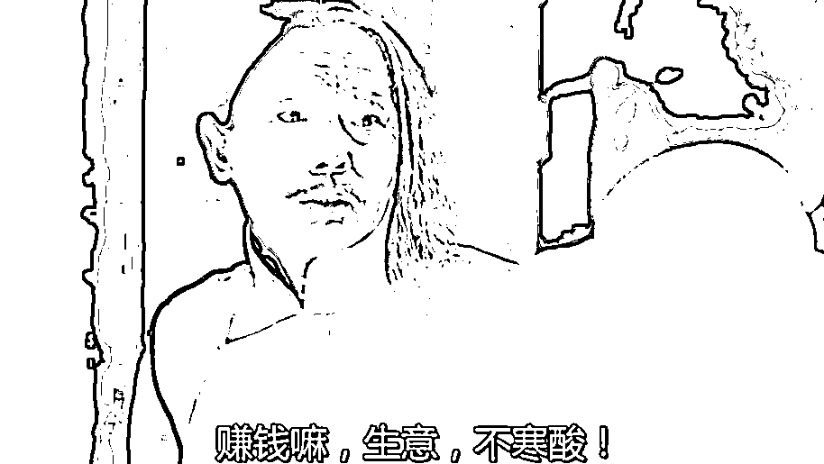

实际上，很多人一直都有个疑惑，随着核酸检测价格从最初的 200 元/人份到如今的几块钱，一降再降，第三方检测公司从最初的“野蛮暴利”到如今的“正常盈利”，行业发展越来越良态，但实在想不通为什么还有人依旧把现在的核酸检测贴上“暴利”标签。 

看了最近北京疫情中的几档子事，心中了然，再次刷新了认知。

这次，北京已有几十人被抓，有检测公司的负责人、有卫健委的干部......看后让人五味杂陈。

[`mp.weixin.qq.com/mp/readtemplate?t=pages/video_player_tmpl&action=mpvideo&auto=0&vid=wxv_2374460649910583297`](https://mp.weixin.qq.com/mp/readtemplate?t=pages/video_player_tmpl&action=mpvideo&auto=0&vid=wxv_2374460649910583297)

其实，司马南很早就发视频说：**不揪出核酸背后利益的黑手，疫情永远不会结束！** 

果不其然啊！

01、北京多家核酸检测机构遭调查

据“平安北京”通报：为有效保障群众生命安全和身体健康，服务全市防疫工作大局，卫健会同市场监管、公安等部门持续对全市核酸检测机构进行督查检查。

**5 月 28 日，发现“****北京中同蓝博医学检验实验室****”在核酸检测过程中涉嫌违法犯罪。**

**目前北京警方已对该实验室立案侦查，将法定代表人张某某（男，52 岁）等人查获，案件正在进一步工作中。**

**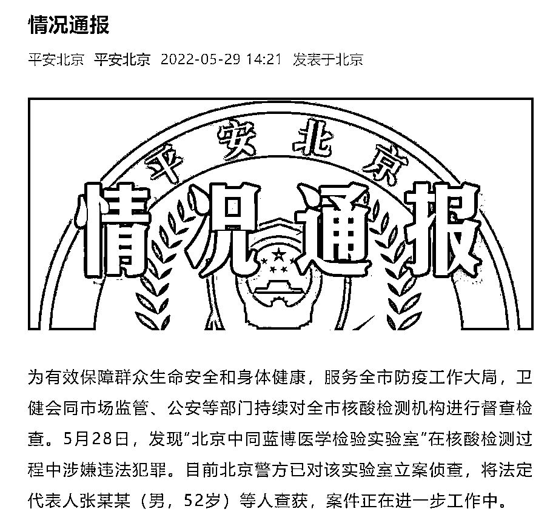**

**此前，据“平安北京”5 月 27 日发布情况通报：**针对“****北京金准医学检验实验室有限公司****”在核酸检测过程中涉嫌违法犯罪的行为，北京警方已对该公司立案侦查，**目前，已将实验室法定代表人王某某（男，43 岁）等人查获，案件正在进一步工作中。**

**另外，“平安北京”5 月 21 日消息，针对媒体报道、市民关注的**“****朴石医学检验实验室****”问题**，卫健部门已吊销该实验室《医疗机构执业许可证》，市场监管部门已立案查处。**

****根据卫健部门移送的案件线索，公安机关以涉嫌妨害传染病防治罪立案侦查，**对实验室实际控制人周某某（男，38 岁）、法定代表人武某某（男，37 岁）等 6 人，依法采取刑事强制措施，案件正在进一步工作中。**

**平安北京指出，对此类违法犯罪行为，公安机关将会同卫健、市场监管等部门，发现一起、查处一起，严厉打击，绝不手软。**

**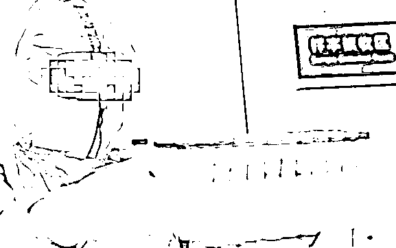**

****02、作案手段极其低劣，影响却极其恶劣！**** 

**在这几桩案件中，有一个细节值得注意：**被查获逮捕的是实验室法定代表人，而不是单个涉事员工。****

****这意味着，犯罪主体是公司，而非某一个员工。**这对疫情防控造成的恶劣影响要比单个员工事件大得多。**

**北京金准医学检测实验室有限公司，**是 5 月以来，京城查出的第二起核酸检测违法犯罪案件。****

**金准医疗的做假手段，其实很低劣，但影响却极其恶劣。据报道，每天送到这家公司检测的样本多达百万人份，其中绝大多数都是 10 人一管。**

**完全按标准进行的话，国家留给检测公司的利润大概是 5%左右——数量巨大，又是必检项目，这属于闭着眼挣钱啊，所以 5%的利润已经很高了。** 

****但金准并不满足，因为如果根本就不检测，那利润可就是 100%了。****

**于是，从 4 月 25 日开始，金准公司高层下令，**将 10 人一管改为 30 人一管，人为只吸取一个试管内 1/3 的液体，然后混合在一起进行检测。****

**本来 5%的利润率，一下子激增到了 205%。**

**但带来的结果，是样本被人为稀释，检测精准度大幅降低！**

**世上没有不透风的墙，他们这样做，实际已经不是什么秘密：**

**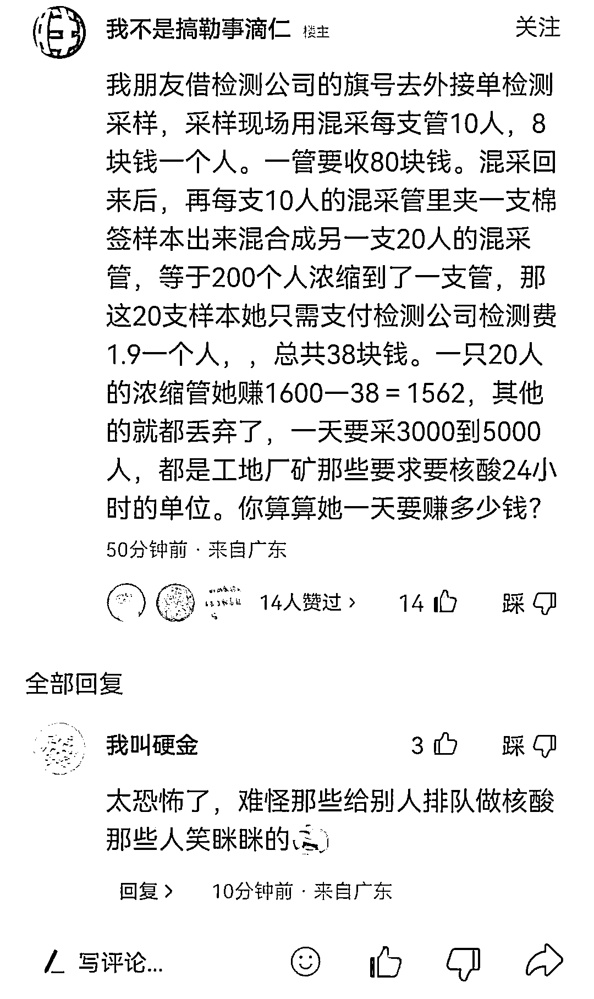**

**而想要检查核酸检测公司是不是有问题，有没有造假，方法其实也很简单——核对数据就可以了。**

**每天送到各大检测公司的样本数量是已知的数量，因为政府会按照这个数量和各大检测公司来进行酬劳结算。**

**然后，有关部门只要倒过来查每家公司过去一个月消耗的核酸试剂总量，同时检查每家公司核酸检测的 PCR 机器总量，以及每家公司消耗的人力总量，就行了。**

**以被查处的“北京金准”为例，这家机构每天要对百万人做核检，10 人一管，也就是 10 万管左右的工作量。**

****简单来说，我根据你这家公司有多少台 PCR 检测机，有多少名员工，用了多少核酸试剂，就能推算出来你到底检测了多少管样本！如果数据差异巨大，那么肯定有问题！****

****你要问了，既然如此漏洞百出，而且都已经传到网络上，他们就不怕被查？****

****不怕，因为有后台！比如最早被查处的北京朴石医学检验实验室，就因为有房山区卫健委的腐败分子撑腰，他们甚至拿着样本都不检测，直接给大家发报告。是阴性，还是阳性，全凭他们一张嘴说了算！**** 

**这不是我胡说。这不，近日，北京市纪委监委网站发布消息：**

****房山区卫健委副主任杨大庆、医政科科长晋长皓、医政科三级主任科员邢曼，因在对北京朴石医学检验实验室监督管理过程中，涉嫌严重违纪违法，目前正接受纪律审查和监察调查。****

****由此可知，朴石是有后台的，造假背后也是有交易的，而充当保护伞的，正是那些直接管理它的人！****

****疫情之下，举国关注，尚且如此，还不知道平时会干出什么勾当！****

**朴石的后台挖出来了，**金准背后有没有人给他们撑腰呢？****

****还有，全国存在多少没被挖出后台的呢？**比如上海那个出假阳报告的润达，就深不可测。事情曝出这么久，当地只说了句介入调查然后就没了下文，然后润达接着奏乐接着舞，该采样采样，该核酸核酸，没事人一样。**

**怎么着也要考虑一下居民的心理阴影面积吧，既然能一个小区 13 个阳性最后换一家复检全阴，甚至连瘫痪 10 几年的植物人都能阳了，那么这准确率到底有多少？**

**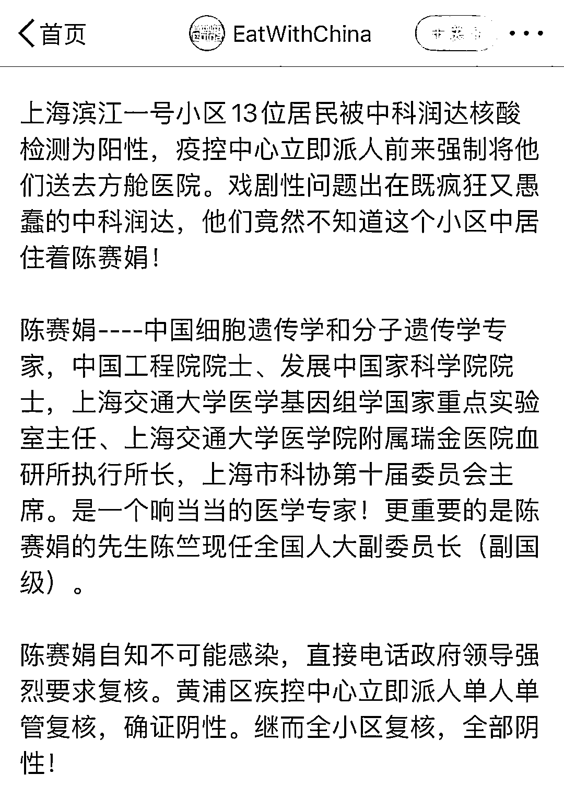**

**更重要的是，也不管是不是冤假错案，是不是冤枉了润达，或者说是润达的无心之错，大疫当前正是用人之际，戴罪立功也未尝不可，但总得给个明白话，给大家解释清楚吧！**

**北京也有个临时成立的核酸检测公司，好像叫什么朝安的，刚成立就碰巧赶上了疫情，就碰巧进了采样名单，堂而皇之开始采样检测，跟真的一样。好在，北京防疫，不仅仅防疫部门说了算，这家公司遂很快就显出原形，被踢出合作队伍。**

**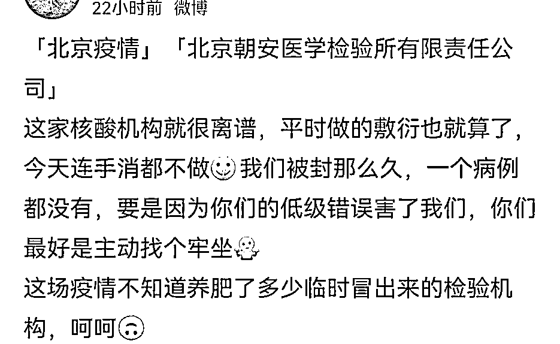**

****对京城防疫而言，这才过去 1 个月不到，就查出来多起。可从全国来看，像这样的案件正在呈现出扩大化的现象。****

****第一起是河南许昌，金域医学某负责人涉嫌“投毒”。****

**据相关人士以及业内流传的一份金域医学的调研纪要，均显示：当初被逮捕的员工已被放出，金域医学业务未受到实际影响。**

****第二起是合肥和合医学检测实验室、合肥诺尔为医学检测实验室双双作假**，出具“假阳性”报告。在查出真相后，这两家公司被踢出政府采购名单。**

**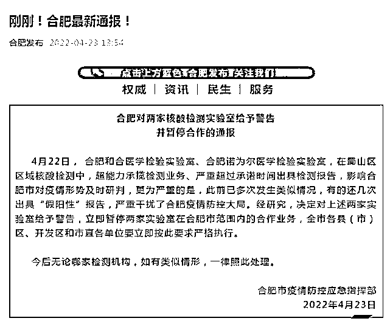**

****第三起就是上海中科润达医学检验实验室出具“假阳性”报告，遭到上海市民强烈要求撤换。**但中科润达是上海排名前三的核酸检测机构，一天检测量 30-40 万管，每天新冠检测收入就超过 800 万，一个月可收入 2 亿。**

**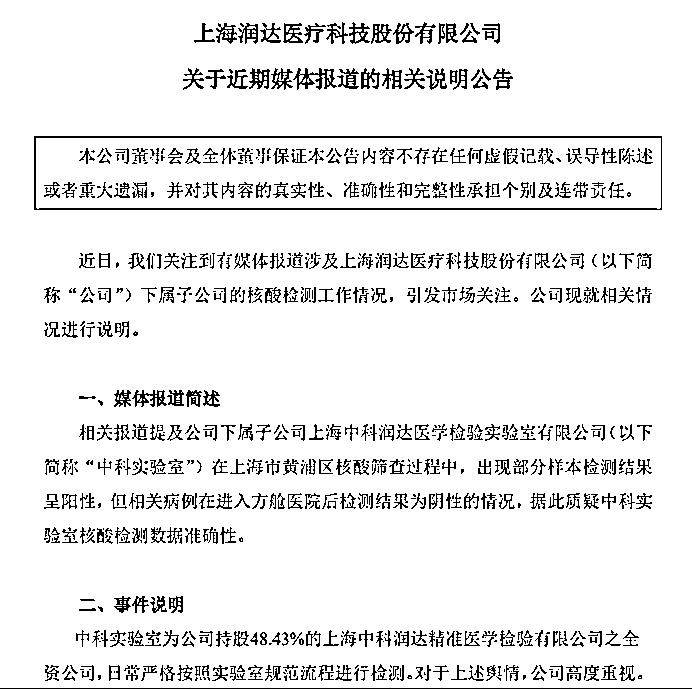**

****第四起、第五起、第六起则是北京朴石医学检测实验室、北京金准医学检测实验室和****北京中同蓝博医学检验实验室**。**

**另外，还有河南禹州核酸检测造假、济南华曦医学检验检测机构未经检测，就发布“假阴性”报告。**

**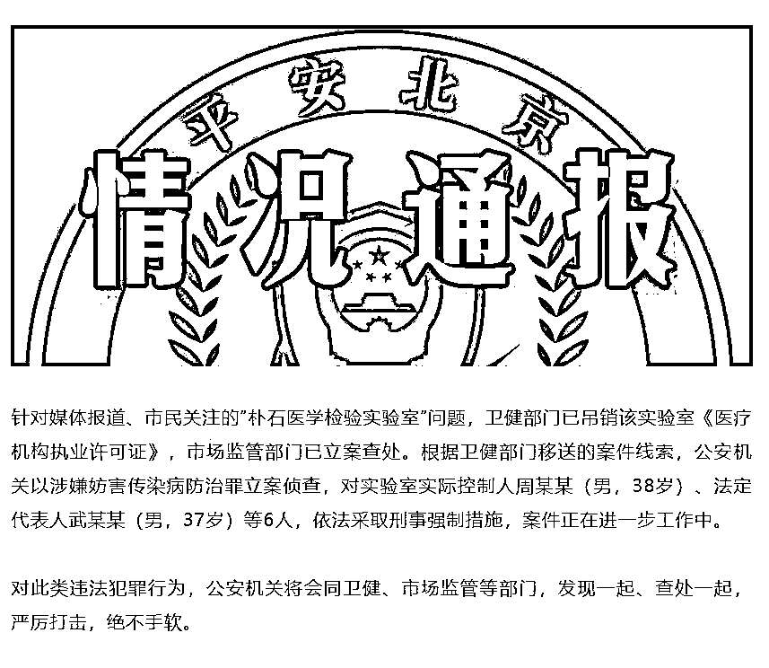**

**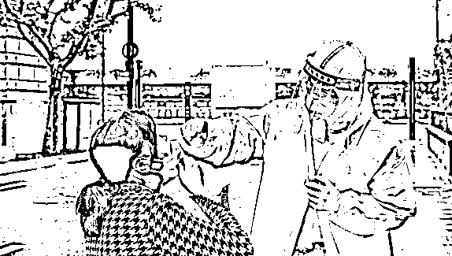**

****03、利益巨大，代价却很小****

**不管是“假阳性”，还是“假阴性”，这都会对中国疫情防控造成巨大的干扰和阻碍。可是，为什么这些核酸检测造假事件，屡禁不止呢？**

**没有什么复杂的原因，无非就两条：**一，利益大；二，代价小。****

****从处置结果，我们就能看到，合肥的两家核酸造假机构，只是被踢出政府采购名单。****

****河南的“投毒”事件，几乎没有影响到金域医学的业务经营。上海的润达医疗即便深陷市民质疑之中，可案件仍在调查中。****

******只有北京的处罚力度比较大**，北京朴石医学检测实验室被吊销营业执照，相关负责人被查获拘捕。北京金准医学检测实验室王学刚亦被查获审理。****

******对核酸检测作假的机构，有关部门的处罚力度是一步一步加强的。但在巨大的利益面前，仍然是难以阻挡。毕竟，中科润达在上海一个月的新冠检测收入就高达 2 个亿！******

****归根到底，核酸检测是一门生意。是生意，就要赚钱，要赚大钱。当利润率下滑时，就得提高检测规模。如何提高检测规模，以确保收回成本，并大赚一笔？这就让一部分人走上了歪门邪道。****

******揭开盖子，一查到底，北京的做法毫无疑问是值得点赞的，但其背后也隐含着一个不容忽视的逻辑：北京尚且如此，其他省市呢？******

******可以推断，核酸检测或许正在成为违法犯罪和腐败贪腐聚集的高发领域，如果不去严加监管的话。******

******毕竟，要是新冠疫情被消灭了，有些人就没法继续赚钱了。******

****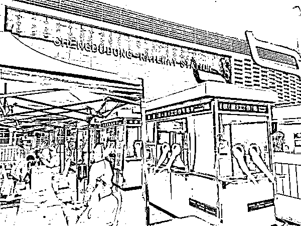****

******04、一个百亿市场的大生意******

******事实上，可以趁着疫情“赚钱”的，不仅仅核酸检测和打疫苗。******

****2022 年 5 月 24 日，江山欧派（603208.SH）零售工程部总监李永辉在一天内接到了两笔核酸采样亭的订单。两笔订单均为政府部门紧急招标项目，采购数量都在百台以上。****

****江山欧派是一家集研发、生产、销售、服务于一体的专业制门上市公司。疫情防控期间，企业日常经营受到影响，冷淡了许多。但是近来，持续不断地核酸采样亭订单却让这个家装企业有了少见的忙碌。****

****5 月中旬，各地政府开始兴建 15 分钟核酸“采样圈”，江山欧派这家制门企业才开始跨界研发、备料生产，积极参与各地政府招投标之中。****

****可市场的火爆程度还是远远超出了李永辉的预料。短短一两周时间，据他粗略估算，整个浙江约有三四成政府部门集中发布了招标采购公告。近期内，江山欧派几乎每天都能接到新的订单。****

****新冠肺炎疫情传播的速度惊人，核酸“采样圈”搭建的任务紧迫。**政府每一次招标都是“紧急采购”**。为了赶在远低于正常工期内交付，江山欧派工厂每到夜晚又出现了久违的灯火通明。****

****眼下，李永辉以及江山欧派的遭遇正是突然爆火的“核酸采样亭”市场的缩影。****

****2022 年 5 月 13 日、23 日，国家卫健委先后呼吁，大城市建立步行 15 分钟核酸“采样圈”。加之入夏后气温渐高，身着“大白”的医护工作者难以在高温下采样。这在短时间内催火了“核酸采样亭”的生意。****

****核酸采样亭应用于医疗防护，却并不属于医疗设备；门槛不高、又无国标，让与之相关的加工厂、配件商以各种形式纷纷转产，分羹这一市场。****

****他们有的是垃圾岗亭生产商，有的以铝合金加工为主业，有的是电动车公司，有的是空调企业。其中，有的企业规模较小，只能隐身背后给大企业代加工；此外，其中也不乏海尔、澳柯玛等知名品牌的身影。****

******入局者心知肚明，眼下核酸采样亭就像 2020 年初的口罩一样，是突发性的商机；但又不像口罩是快速消耗品、会反复采购，是非常态化的短期需求。政府紧急采购，需求集中释放，市场突增暴起，如果不能以最快的速度抢占红利期，很可能就会陷入口罩市场曾经历的供给过剩、价格火拼的泥潭。******

******正如一位业内人士所说，“风口来了，就要争分夺秒，晚一天都会少捡许多钱。”******

****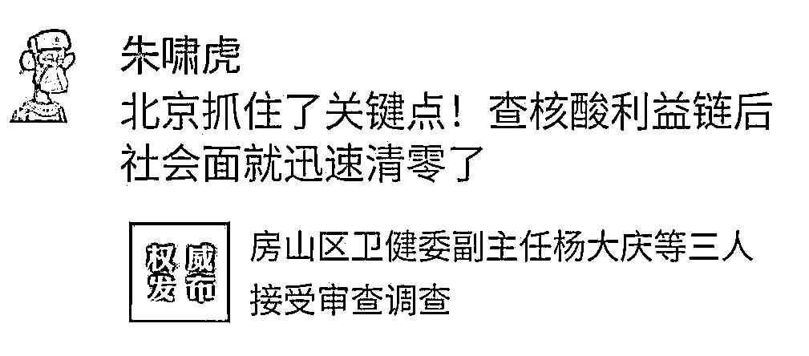****

******05、核酸检测与疫情升降竟然形成关联****** 

****北京社会面清零了，但这背后有几件事儿值得思考：**** 

******一是公安部门出马，核酸检测机构被查的多了，疫情传播速度就下降了。******

******二是医保局说核酸检测从医保支出改为地方财政支出后，问题立即发生变化。******

****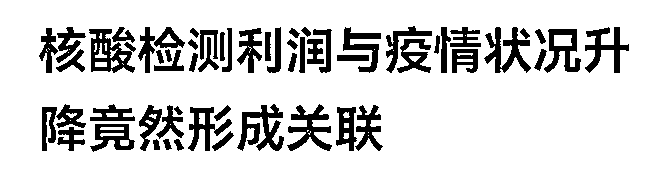****

****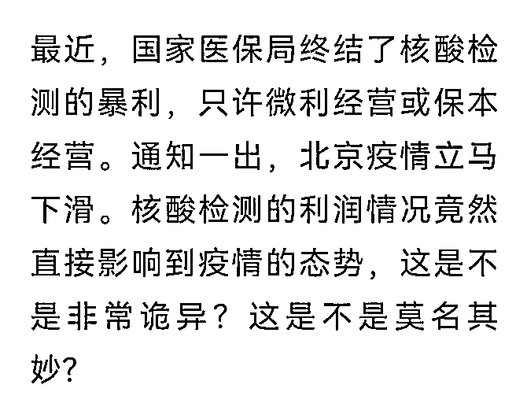****

********想想看，这两年什么最赚钱？就是新冠疫苗和核酸检测。********

******明面上，市民检测和接种，都是免费的，但真是免费的吗？怎么可能，企业可不是慈善机构，这钱地方政府不出，医保基金就会出。所以，很多人利用漏洞，从医保基金里套钱出来——然后分赃！******

****5 月 22 日，国家医保局办公室、国务院应对新型冠状病毒肺炎疫情联防联控机制医疗救治组有关负责人介绍，关于近期网上舆论非常关注的常态化核酸检测费用，按照《国务院应对新型冠状病毒感染肺炎疫情联防联控机制关于做好新冠肺炎疫情常态化防控工作的指导意见》《关于加快推进新冠病毒核酸检测的实施意见》，所需费用由各地政府承担。因此，目前各地均由财政部门对常态化核酸检测提供了资金支持。****

****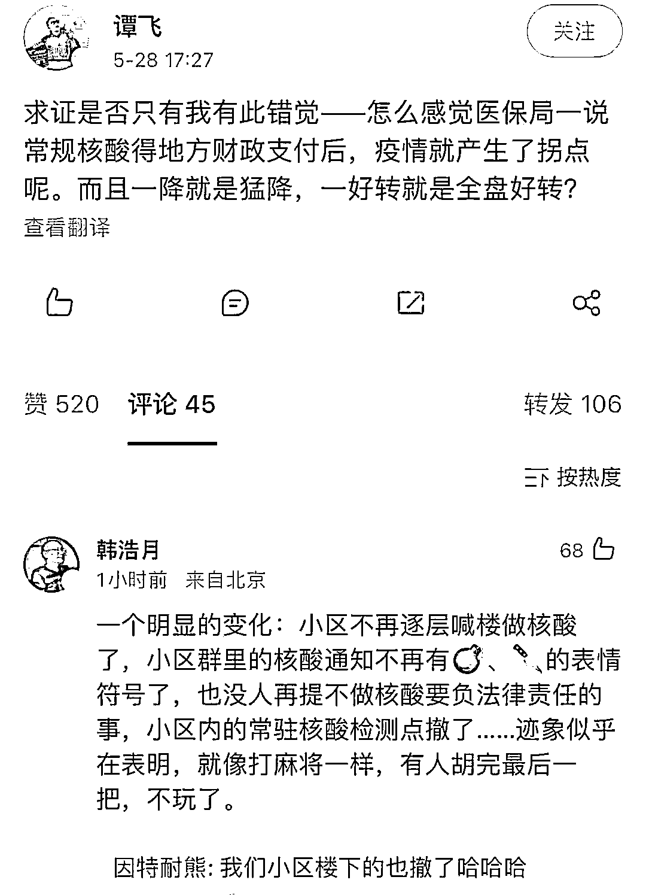****

******利益，利益，全部是利益在作祟！******

******关于"斩断黑手"这一点，全国各地，尤其是上海，要学北京。该出手出手，该处罚处罚，该抓人抓人，该入刑入刑。而且要从快从严从重，谨防借疫生财借疫腐败，否则，遗患无穷！******

******可以说，在巨大的利益面前，这帮家伙根本就不怕天打雷劈，只怕法律严惩！只有让这些借疫生财的奸商付出比得到更大的代价，才能让他们不敢以身试法，见利忘义！******

****这些人，真要庆幸生在这样一个政通人和的好时代。要是在过去，依律当斩并诛连九族，估计这人头得挂在城门上好几个月，人心可负苍天难欺，给我好好看看这人间！**** 

******一句话，在对借疫情大发国难财，祸国殃民之徒，绝不能有任何纵容姑息！否则，就会重蹈当年印度的“眼镜蛇效应”，劣币驱逐良币，病毒不死疫情不止，一业兴起百业俱废！******

****来源：领导智库，喻言亭阁 ****

****************

****← 向右滑动与灰产圈互动交流 →****

********