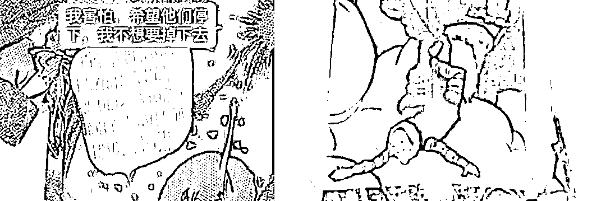
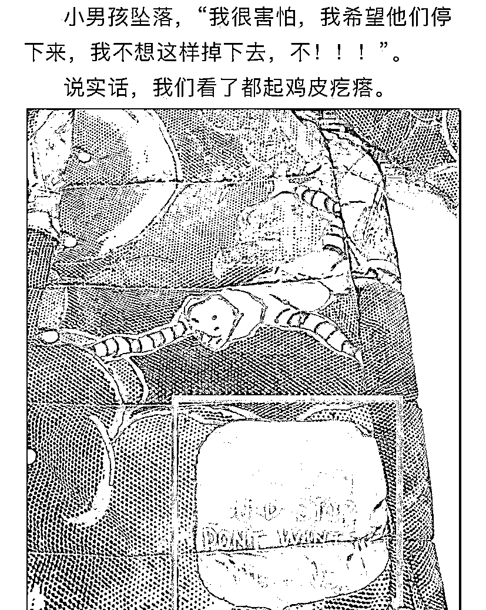
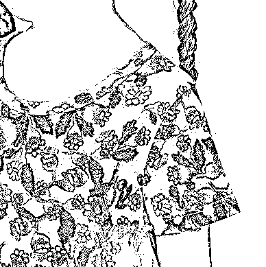
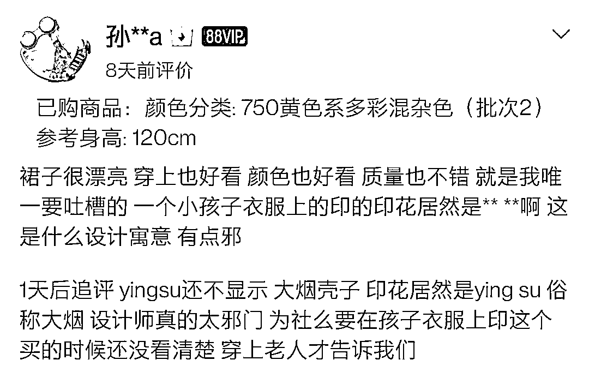
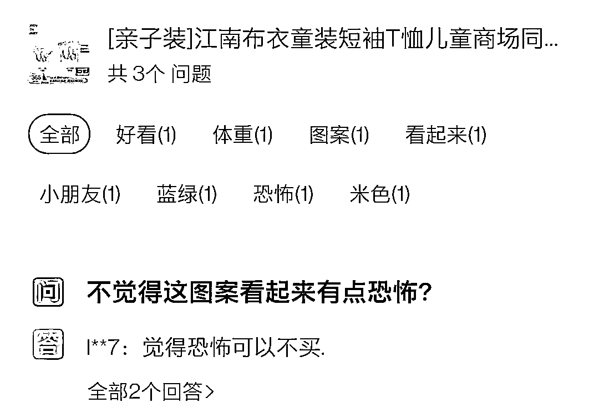
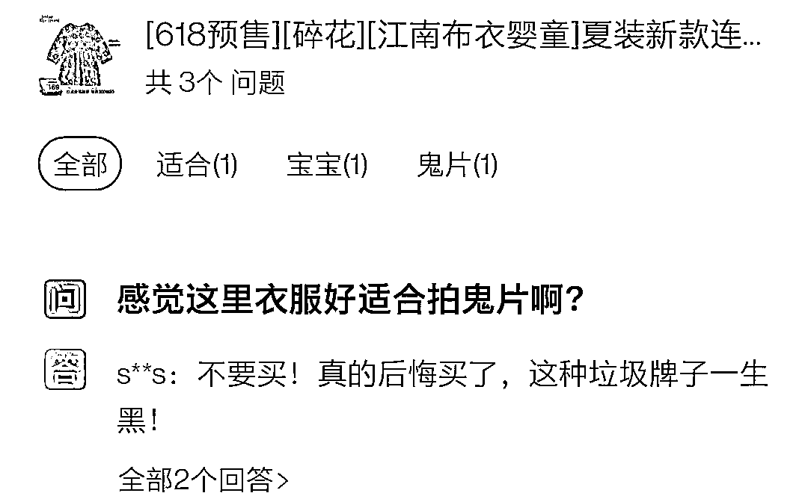
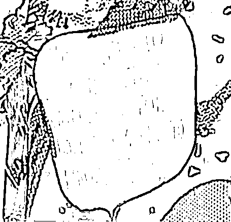
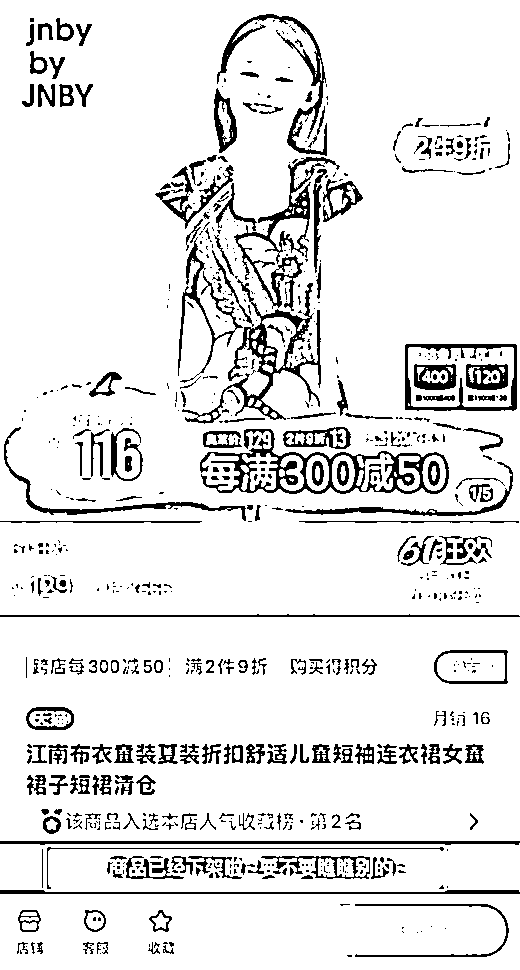
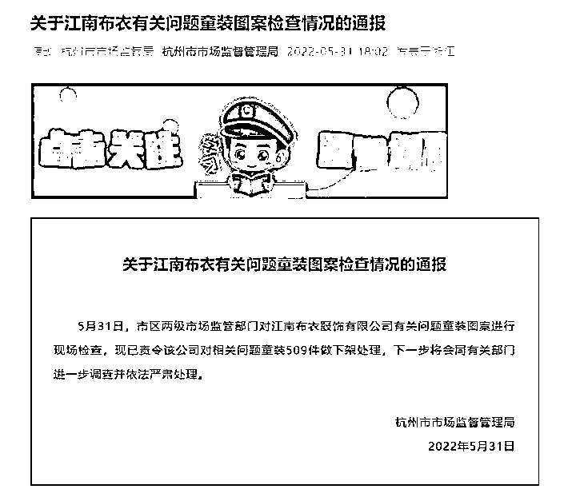
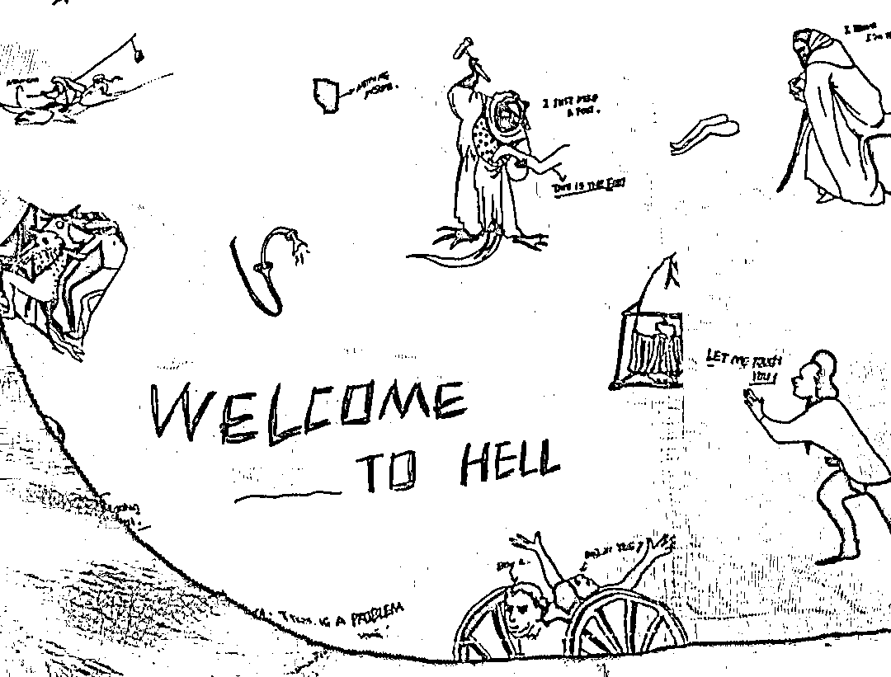

# 知名品牌又出事了！最新通报：责令下架！

> 原文：[`mp.weixin.qq.com/s?__biz=MzIyMDYwMTk0Mw==&mid=2247536884&idx=5&sn=177cfe62800e56e0d01c0ad1951c7c11&chksm=97cb9bcca0bc12da89ad71dad3bba9732b71bc15df2f0a093e79779f5f0ecdc5eb283379f59c&scene=27#wechat_redirect`](http://mp.weixin.qq.com/s?__biz=MzIyMDYwMTk0Mw==&mid=2247536884&idx=5&sn=177cfe62800e56e0d01c0ad1951c7c11&chksm=97cb9bcca0bc12da89ad71dad3bba9732b71bc15df2f0a093e79779f5f0ecdc5eb283379f59c&scene=27#wechat_redirect)

近日，有网友反映，江南布衣童装上出现吐舌头的鬼脸、疑似罂粟的图案以及奇怪的英文文案画风诡异引人不适。该引起争议的英文文案翻译成中文为：“我很害怕，我希望他们停下来，我不想这样落地，不！”

网友还发现江南布衣的童装出现许多类似鬼脸、小鬼的诡异图案。此外，江南布衣的电商店铺中，有买家评论称一款裙子上的图案疑似罂粟果实。“设计师太邪门了，为什么要在孩子衣服上印这个。”该买家评论道。

事件迅速发酵登上热搜后，有网友评论：“诡异图案何时能消停，江南布衣屡教不改。”有网友反问江南布衣：“穿在孩子身上的衣服图案不应该是纯真可爱活泼类型的吗？”有网友质疑其童装“自由、想象力、快乐、真实”的设计核心，称其为“拿变态当艺术”。

5 月 31 日下午，潇湘晨报记者致电江南布衣售后客服，客服表示：“目前确实收到了顾客反馈的图案问题，已进一步反馈到公司相关负责人，已经在处理中，后续会给顾客反馈的。”

随后潇湘晨报记者在网购平台江南布衣官方旗舰店搜索相关涉事童装，显示该商品已下架。

5 月 31 日，杭州市市场监督管理局发布《关于江南布衣有关问题童装图案检查情况的通报》： 

杭州市区两级市场监管部门对江南布衣服饰有限公司有关问题童装图案进行现场检查，现已责令该公司对相关问题童装 509 件做下架处理，下一步将会同有关部门进一步调查并依法严肃处理。

据悉，这不是江南布衣第一次因此类问题引发争议，2021 年 9 月，江南布衣童装曾被曝出画风诡异，服装上印有“Welcome to hell（欢迎来到地狱）”、“let me touch you（让我摸摸你）”等等字样图案。江南布衣官方微博对此也曾发文致歉，并表示已下架涉事产品。

来源： 潇湘晨报 记者 ：陈梦娟 申潇轶 实习生张圆

← 向右滑动与灰产圈互动交流 →

