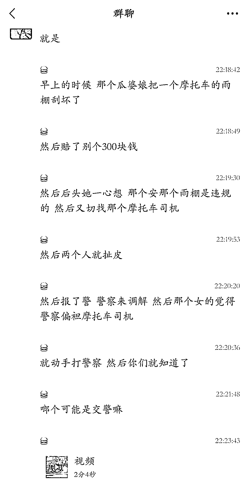
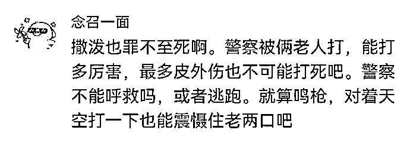

# 重庆民警开枪：公安是国家授权的暴力机关，本就不是服务行业

> 原文：[`mp.weixin.qq.com/s?__biz=MzIyMDYwMTk0Mw==&mid=2247536947&idx=1&sn=e81f3695bde7288faa96d22ecf9bb686&chksm=97cb9a0ba0bc131d07689b7ff3e5ccb916568e5dd0d571bcbf3ccae3aeba984d1b32ddaeb944&scene=27#wechat_redirect`](http://mp.weixin.qq.com/s?__biz=MzIyMDYwMTk0Mw==&mid=2247536947&idx=1&sn=e81f3695bde7288faa96d22ecf9bb686&chksm=97cb9a0ba0bc131d07689b7ff3e5ccb916568e5dd0d571bcbf3ccae3aeba984d1b32ddaeb944&scene=27#wechat_redirect)

图源：电影《让子弹飞》

公安是执法部门，是国家暴力机关，不是服务行业！

**村上春树有句名言：“在鸡蛋与高墙的碰撞中，我永远站在鸡蛋这边。”**

**这话听起来很有情怀，但在很多语境下，鸡蛋不弱，高墙不强。**

民警开枪了，然后各种妖魔鬼怪都出来了。 

5 月 30 日 18 时 50 分许，重庆市北碚区龙溪路港大电动城门口发生一起枪击事件。

**一句话概括：夫妻袭击民警，民警开枪后男子抢救无效死亡。**

遇事先看网民评论：

**我的观点：支持民警。**

**先明确一个概念：从警察职能角度讲，公安是国家授权的暴力机关，是执法部门，不是服务行业。**

这是事发后网上传播的一张图片。

民警的短袖执勤服已经被扯破，本应有一件黄色反光背心，被扯掉丢弃在女子身后。

**女子的手还抓住民警的腰带不放，民警的手始终护着枪，应该就是担心枪被抢，一旦枪被抢，后果不堪设想。**

网友讲述事件过程的截图和视频：

**如果对警察的处置觉得不公，可以申请复议，找纪委投诉甚至走司法程序，千万不要让小小的民事纠纷变成袭警，没人惯着你。**

**目前综合各种信息，死者和妻子因纠纷围着警察打，袭警事实成立；民警拔枪自卫疑似发生抢枪行为，然后枪击中了死者男子。**

我国法律规定民警开枪的总体原则是：**“当犯罪分子危及警察生命安全，或者严重威胁公共安全时，可以开枪射击。”**

如果执法记录仪中真拍下抢枪行为，基本可以确定男子白死。 

枪是致命性武器，这也就注定了开枪后没有任何挽回余地，什么后果全看命。

**只要中国警察一开枪，网络上的各种蛇虫鼠蚁就高潮了！**

在微博、知乎上看得我一肚子的气。

**一个个都在害怕警察公正执法，他们都是想着去犯罪吧，害怕自己被警察黑抓了，所以警察越是自缚手脚越对他们有利。**

这些网络喷子以圣人甚至精密机器人的标准、以毫秒为单位的“复盘”警察的整个执法过程。

全网都在等着民警有任何的一点点类似于“他没有说请”这样的瑕疵来狂欢赚流量。

**谁会在乎对方当时在袭警而民警的生命受到威胁？**

**谁会注意当时民警身上有枪万一发生枪支抢夺？**

**谁会理性告诉大家你使用枪支是合法合理？**

在这个时候，有枪无论你做什么都代表着强势，每个人都想争当一个“不惧强势、敢为弱势代言”的网络圣人。

最主流的说法是为什么不打脚？

**你让别人拿张白纸，上面画个 10 厘米的圆，两人相对站立，对方两个人无规律运动压着你打，然后你拿铅笔去戳，看能戳中不？**

试一下，你就知道这个说法有多扯蛋了。

看事容易做事难，你不是你视角中的上帝，警察也不是影视剧中的超人，你我皆凡人。

**喷子们怎么不拿美丽国做对比了呢？如果是在那个国家，这对夫妻估计都没了。**

别对警察动手，或使用肢体动作对警察构成安全威胁：警察也是人，正当防卫或防卫过当，袭警的人必然吃亏。

**这个悲剧警示人们，平时别总以为天高地厚没人管，撒泼打诨无法无天，都是成年人了，没有陌生人愿意迁就你的任性。**

**尤其是，警察！**

来源：昌南大队长

← 向右滑动与灰产圈互动交流 →

