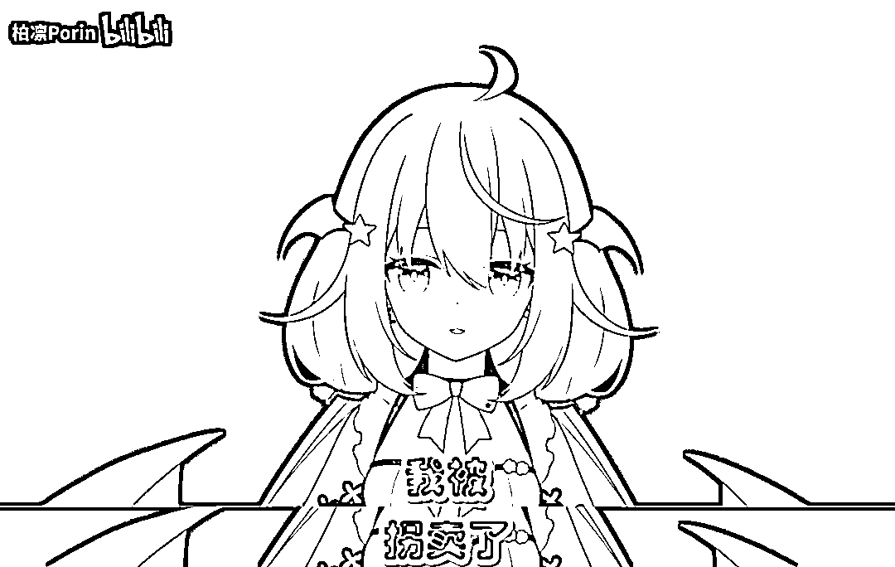
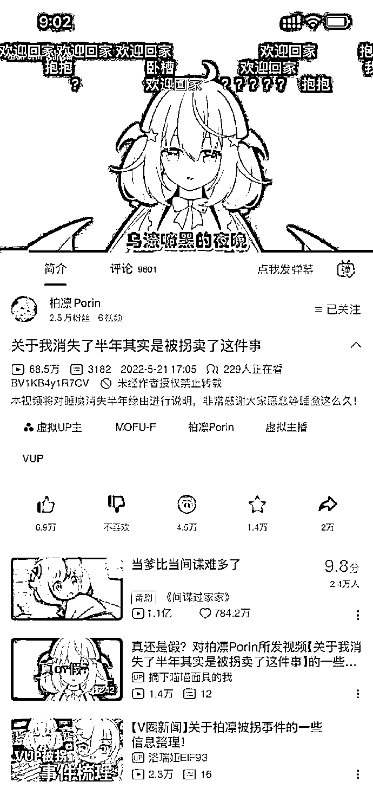
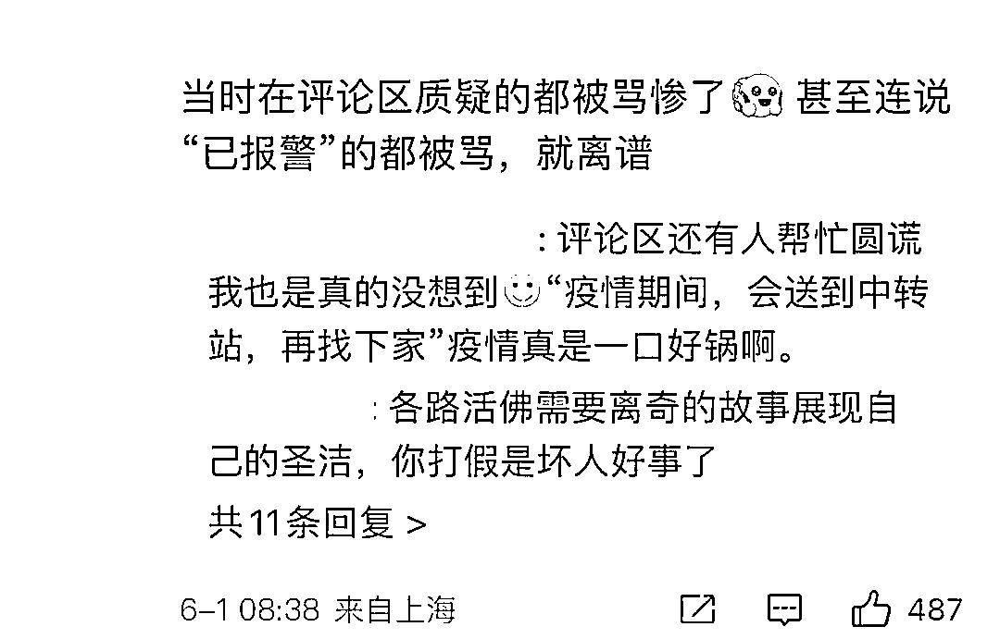
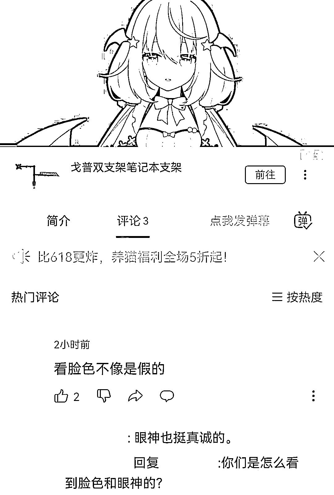
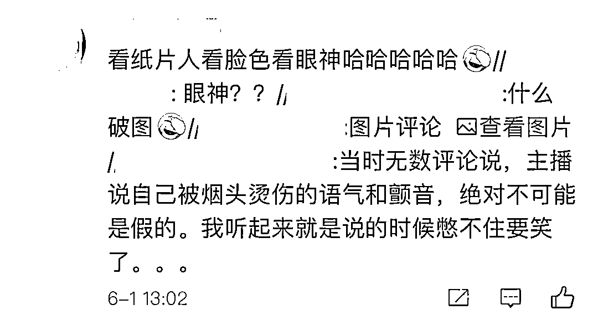

# B 站虚拟主播“睡魔”说自己被拐卖了才消失半年，后经警方查证是造谣

> 原文：[`mp.weixin.qq.com/s?__biz=MzIyMDYwMTk0Mw==&mid=2247536947&idx=3&sn=dc10dfd155da69c95fcd6f982daba3cf&chksm=97cb9a0ba0bc131d7917c878824d36f64d0fdbb5fcd05b8850277fc7c584c77d83071fac2e4f&scene=27#wechat_redirect`](http://mp.weixin.qq.com/s?__biz=MzIyMDYwMTk0Mw==&mid=2247536947&idx=3&sn=dc10dfd155da69c95fcd6f982daba3cf&chksm=97cb9a0ba0bc131d7917c878824d36f64d0fdbb5fcd05b8850277fc7c584c77d83071fac2e4f&scene=27#wechat_redirect)

不知道大家有没有冲到这浪 

B 站有一位虚拟主播

账号名是“柏凛 Porin”，视频里自称“睡魔”

TA 说：

**“自己消失半年，是因为自己被拐卖了，**

**后来是被警察解救。”**

为此

5 月 21 日，“柏凛 Porin”还更新了一条视频

解释这半年来的停更 ⬇️

**拐卖？？？** 

这可不是一般的主播停更原因啊

涉及刑事了啊！

结果...

到 5 月 31 日，就有账号出声明表示：

**拐卖内容不属实**

（“MOFU-F”大概是“柏凛 Porin”背后 MCN 公司？）

不管是因为什么原因断更

直接说不好吗？

就算要炒作，也不能拿“拐卖”这种理由啊

**这不是简单的占用社会资源**

**是在恶意消费网友的情绪！**

6 月 1 日

B 站作为平台方，处理通告也出来了：

**“柏凛 Porin”的账号永久封禁**

“柏凛 Porin”

在 5 月 21 日 17:05 发布于 B 站的视频如下

目前已被下架

视频 6 分钟

对于“拐卖”这么严肃的事情，相当语焉不详...

[`mp.weixin.qq.com/mp/readtemplate?t=pages/video_player_tmpl&action=mpvideo&auto=0&vid=wxv_2423982727445250051`](https://mp.weixin.qq.com/mp/readtemplate?t=pages/video_player_tmpl&action=mpvideo&auto=0&vid=wxv_2423982727445250051)

用这样的视频，来说明“自己被拐卖”的事情

而且情节夸张，脱离现实

警察带人去警局不开警车，开面包车？

在视频刚发布的时候

网友就有点怀疑的 ⬇️

但是那些质疑“拐卖”真实性的评论

都会被删或被骂

连说**“已报警”**的评论，也不能逃过...

有一条评论看得让人不知道说什么好

纸片人配音视频而已

**网友：看脸色不像是假的**

而且当时的评论区里 

还有不少人说：

**“主播说自己被烟头烫伤的语气和颤音**

**绝对不可能是假的”**

看过视频的话

大概能 get 是个什么语气了

反正画面是这样子的 ⬇️

既然拐卖是假

那什么乌漆嘛黑的夜，什么面包车，

什么阿姨，什么烟头

八成也都是加出来的戏了...

但也有**未经证实的一说**在网上传： 

“睡魔”皮下人没被拐卖

但是被父母送到少管所之类的地方了

所以停更半年

如果是真的，我寻思着...

“被父母送去治疗半年”这样的停更理由

不是也挺有流量的吗？

为什么一定要搞个假的“拐卖”出来？

背后的 MCN 公司也不管管虚拟主播的吗？

“睡魔”这样

不就是**“狼来了”**的故事！

这让那些真正大声疾呼需要救命的人怎么办 

之后是不是要先被人冷嘲热讽一番

然后再要求各种自证

才会有人施以援手？

抑郁，精神分裂，绝症，拐卖，自杀...
合着账号形象是虚拟主播

就什么内容都可以虚拟了？？？

套了个二次元皮套

就什么内容都拿来恰流量

是做人底线都没有了 

来源：脊梁 in 上海 SH

← 向右滑动与灰产圈互动交流 →

