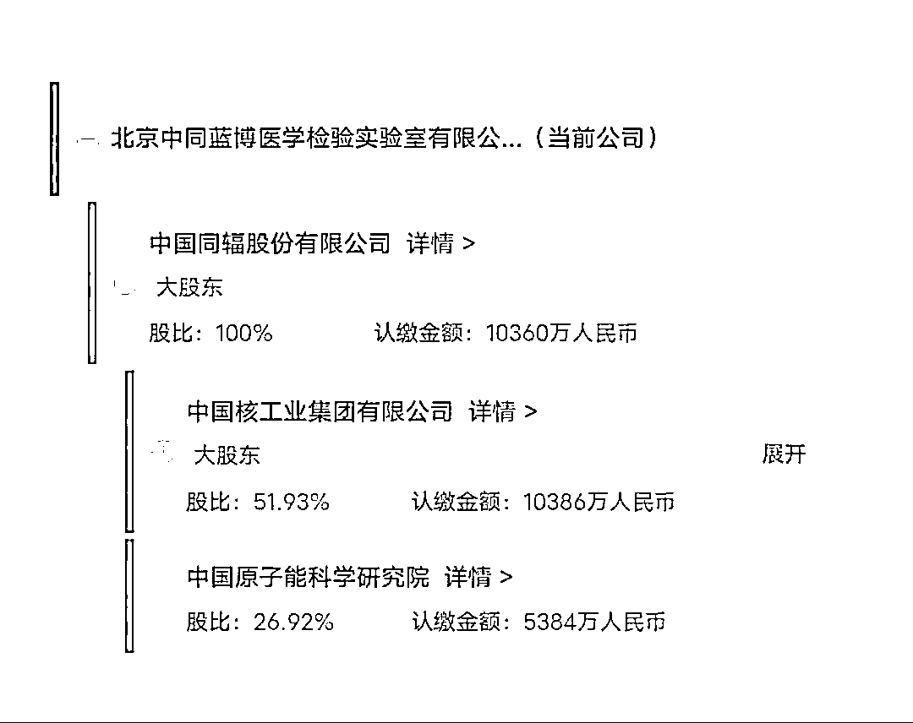
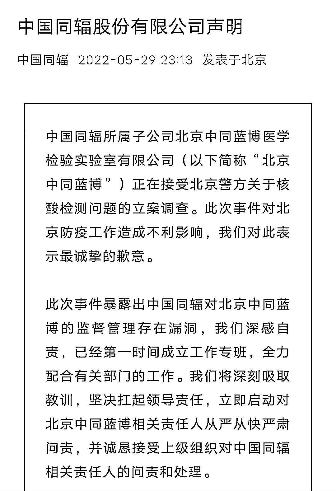
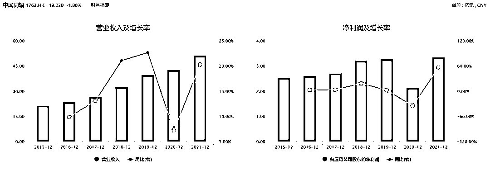
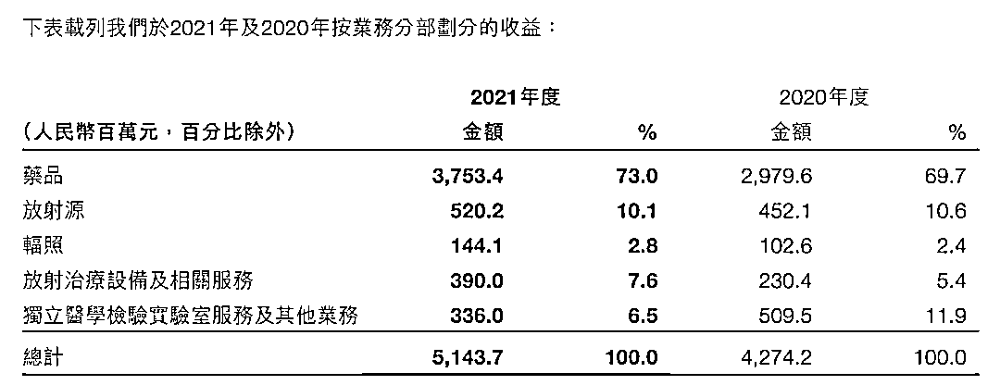
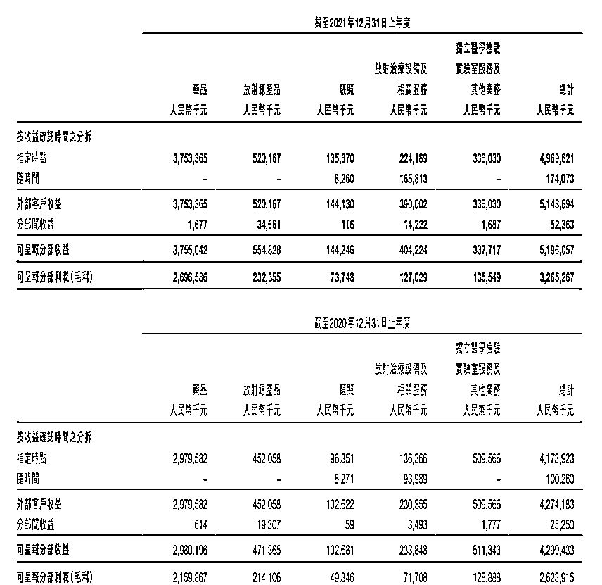
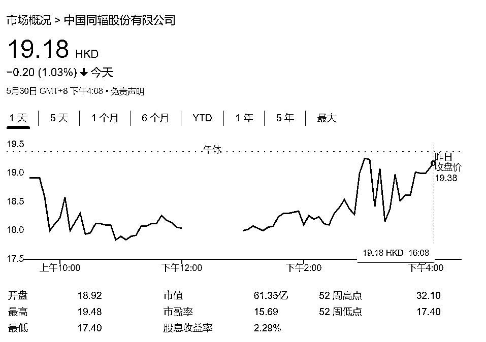

# 检验业务收入 2 亿多！揭露北京一核酸检测机构违法操作

> 原文：[`mp.weixin.qq.com/s?__biz=MzIyMDYwMTk0Mw==&mid=2247536947&idx=4&sn=1b7686137b5205a0ca2a135db3867d86&chksm=97cb9a0ba0bc131ded669687efb48d8dcd5de3a3befc23c0b46576ef3a61993e07597ffef998&scene=27#wechat_redirect`](http://mp.weixin.qq.com/s?__biz=MzIyMDYwMTk0Mw==&mid=2247536947&idx=4&sn=1b7686137b5205a0ca2a135db3867d86&chksm=97cb9a0ba0bc131ded669687efb48d8dcd5de3a3befc23c0b46576ef3a61993e07597ffef998&scene=27#wechat_redirect)

**文 | 周毅** 

北京又有一家核酸检测机构“暴雷”。

昨日（5 月 29 日），北京市召开第 349 场新冠肺炎疫情防控工作新闻发布会。发布会上通报了北京中同蓝博医学检验实验室违规多管混检情况。因其涉嫌违法犯罪，目前北京警方已对“中同蓝博”立案侦查。合肥市后来也宣布，将暂停该机构在当地的检测服务。

当日晚间，“中同蓝博”母公司中国同辐（1763.HK）发布声明，就事件致歉并表示将展开全面整改行动。值得一提的是，在港股上市的中国同辐，目前正筹划 A 股科创板上市。去年在医学检验服务收入方面，该公司营收超 2 亿元人民币。受核酸检测业务提振，中国同辐 2021 年“独立医学检验实验室服务及其他业务”的毛利率，已经恢复并超过了疫情前水平。

“中同蓝博”的问题出在了哪里？它身后的上市公司，又拥有一张什么样的肖像？

**为了节成本、赶进度，“中同蓝博”违规操作，涉嫌违法犯罪**

天眼查信息显示，“中同蓝博”成立于 2007 年。其母公司是 2018 年登陆港交所主板的中国同辐。中国同辐系中国核工业集团公司、中国原子能科学研究院及中国核动力研究设计院共同出资，以原中国同位素有限公司为平台搭建的中核集团核技术应用产业专业化公司，是国内核药行业的龙头企业之一。

天眼查 APP 截图

相比于此前因涉嫌违法犯罪被查处的“北京朴石”和“北京金准”医学检验实验室，“中同蓝博”的出身显然更具路人缘。“中同蓝博”的意外暴雷，让不少民众感到意外——问题是怎么出现的？

据北京卫健委通报称，通过视频检查和查看 PCR 仪上的扩增记录发现，北京中同蓝博医学检验实验室溯源记录不完整，记录规则不清晰，不能提供原始标本流转单和扩增板原始纸质记录，部分时间点扩增文件记录与实验室自述检测数量不符，违规对多管样本进行混管检测。

“以上情况严重违反质量安全规定，影响检测结果准确性，导致对核酸检测阳性人员发现和管控不及时，造成疫情进一步传播风险。”

据北京市公安局副局长、新闻发言人潘绪宏介绍，初步查明，该公司为了节约成本、加赶进度，严重违反新冠病毒核酸检测操作规范，在明知超量混检可能导致检测结果失准的情况下，仍然采取多管混检的方式进行检测，涉嫌妨害传染病防治罪。目前，该公司法定代表人张某某(男，52 岁)等 8 人已被警方依法采取刑事强制措施，案件正在进一步侦办中。

中国同辐股份 29 日在声明中表示，事件暴露出中国同辐对北京中同蓝博的监督管理存在漏洞，该公司深感自责，已经第一时间成立工作专班，全力配合有关部门的工作，同时立即启动对北京中同蓝博相关责任人从严从快严肃问责，并诚恳接受上级组织对中国同辐相关责任人的问责和处理。

声明截图（部分）

“中同蓝博”的母公司，到底是什么样的？

**母公司去年医学检验服务收入超 2 亿元，已筹划科创板上市**

“中同蓝博”是中国同辐的全资子公司。中国同辐 2021 年年报显示，该公司 73.0%的收入和 83.2%的毛利来源于药品板块，属于核医药行业。该公司表示，它是国内最大的显像诊断及治疗用放射性药品、尿素呼气试验药盒及测试仪、以及放射免疫分析药盒制造商。

年报称，2021 年中国同辐的经济效益实现快速增长，创历史最好水平。资料显示，该公司去年全年实现营业收入人民币 51.44 亿元，同比增长 20.3%；除税前利润人民币 8.02 亿元，同比增长 34.6%。值得一提的是，在中国同辐的的业务版图中，独立医学检验实验室是不可或缺的一环。

2021 年，中国同辐实现增收增利 WIND 截图

该集团旗下的独立医学检验实验室服务，主要就肝炎、内分泌、骨代谢、心血管疾病、糖尿病及其他疾病提供服务。在新冠疫情发生后，该集团开始承接核酸检测等业务，不仅在北京、成都、武汉和合肥相继开设了核酸检测点、面向个人提供服务，它还承担了冬奥会的部分检测工作。

疫情之下，虽然中国同辐的经营受到了冲击，但是在新冠检测需求的提振下，依然可以看到细分板块显著的增长：报道期内，中国同辐独立医学检验实验室服务及其他业务实现收入人民币 3.36 亿元，同比降低 34.1%；但其中独立医学检验实验室服务实现收入人民币 2.28 亿元，同比增长 77.0%。

年报截图

从数据上来看，很大程度上可以说，中国同辐的医学检验服务受益于核酸检测需求的增长。

不仅仅是“独立医学检验实验室服务”在 2021 年实现了独自增长，从“独立医学检验实验室服务及其他业务”整个条线的近年毛利率上面来看，该条线 2021 财年毛利率约为 40.14%，在 2020 年约为 25.21%；在 2019 年和 2018 年分别为 31%和 35.13%。疫情虽然给中国同辐医学检验服务的原有营收环境带来了消极影响，但也创造了新的增长点，并带动了整个条线毛利率的上涨。

年报截图

此外引人瞩目的是，中国同辐早早瞄准了科创板，准备两地上市。

去年 1 月，中国同辐发表公告称，该公司董事会批准启动建议发行 A 股股份及于上交所科创板上市的相关工作。在今年 4 月 28 日召开的 2021 年业绩说明会上，该公司再次表示，将加快推进 A 股科创板发行上市，筹措发展资金，优化融资结构，提升市场竞争力。据悉，目前该事项正在审批过程中。

在市场看来，中国同辐 A 股布局背后，是其市场竞争、估值溢价方面的多年隐痛。

从竞争环境来看，相比于其他赛道，核药行业的准入门槛更高，这意味着行业竞争会相对比较小。目前该行业内部，呈现出中国同辐和东诚药业两家企业争雄的“双寡头”局面。目前来看，东诚药业已经在深交所上市，从战略布局上来讲，登陆 A 股对中国同辐而言，意义不言而喻。

因为从市场估值来看，港股市场让中国同辐远远落后于竞争对手。

贵为龙头企业，H 股上市的中国同辐市盈率（TTM）仅在 15 左右；反观 A 股上市的东诚药业，其市盈率（TTM）超过了 67。在市场看来，中国同辐的竞争壁垒、行业地位和市场前景都是不俗甚至是独一无二的，但是不管是估值还是流动性，都与该公司的地位产生了不相匹配的落差空间。

在二级市场等投资者看来，这背后或许有两个方面的原因：一方面，中国同辐属于原料药企业，而当前市场风口是创新药领域，酒香也怕巷子深，中国同辐坐上冷板凳；另外一方面，港股市场普遍估值偏低，市场资金多青睐于互联网等新经济公司。即使在医药领域，创新药等赛道也会更为吃香。

这意味着如果可以拥抱 A 股，那么中国同辐可能会迎来更大的空间。

实现两地上市后，中国同辐能否取得与其市场地位和业绩表现相匹配的估值，仍有待后续观察。但是现在可以看到的是，今年以来，中国同辐股价整体处于下行通道。而现在该集团旗下全资子公司“中同蓝博”涉嫌违法犯罪被查，对于其核酸检测业务和市场认可度而言，或将是一个不容忽视的冲击。

****

**谷歌财经截图**

**<mpvideosnap class="js_uneditable custom_select_card channels_iframe videosnap_video_iframe" data-pluginname="videosnap" data-id="export/UzFfAgtgekIEAQAAAAAAF6kamncMiAAAAAstQy6ubaLX4KHWvLEZgBPEp6N8VAxPXaSDzNPgMIs_oVY8c28Ir4f5vTkRL9yX" data-url="https://findermp.video.qq.com/251/20304/stodownload?encfilekey=rjD5jyTuFrIpZ2ibE8T7YmwgiahniaXswqzaQjE3n363V6CoB72EW4hibM0tKJ5fR2MNsIX7Vic2ic9JJZw2LAiaAGBV9SPwL9Uhicsp7qhNCicoeyGFMVgsUwwzTmw&amp;adaptivelytrans=0&amp;bizid=1023&amp;dotrans=0&amp;hy=SH&amp;idx=1&amp;m=&amp;scene=0&amp;token=x5Y29zUxcibDWKKwjXfiaoebz2YwP430aHxI3wgTuOuFJiabPonIGdMwWcO0L5uylSCbWX8ruNFcmk" data-headimgurl="http://wx.qlogo.cn/finderhead/ibq4aVwOt6HNqrr8OD3sCviaytF3B8TqCwHicxsuIanAJo/0" data-username="v2_060000231003b20faec8c6e48a1acbd3ce04ef33b077a1e41d0d3794ed88ea537878dbe65910@finder" data-nickname="灰产圈+" data-desc="谁在利用疫情来套取国家资金？谁在发国难财？#疫情#抗疫#核酸检测@灰产圈+ " data-nonceid="8390302892267655113" data-type="video" data-width="1080" data-height="1904"></mpvideosnap>**

**来源：观察者网**

********

**← 向右滑动与灰产圈互动交流 →**

****