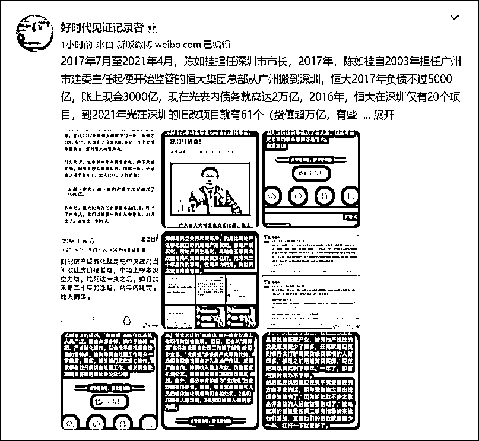

# 深圳市市长落马后，恒大、田惠宇、建行、深房理……一串的窝案终于都连起来了

> 原文：[`mp.weixin.qq.com/s?__biz=MzIyMDYwMTk0Mw==&mid=2247536947&idx=5&sn=04b2a88f7cbc130dcf7eb0d8d78b16ce&chksm=97cb9a0ba0bc131d91bb7aa73c453c630df1a84f72edbd74573e27d4aaf9723b50034b15b30a&scene=27#wechat_redirect`](http://mp.weixin.qq.com/s?__biz=MzIyMDYwMTk0Mw==&mid=2247536947&idx=5&sn=04b2a88f7cbc130dcf7eb0d8d78b16ce&chksm=97cb9a0ba0bc131d91bb7aa73c453c630df1a84f72edbd74573e27d4aaf9723b50034b15b30a&scene=27#wechat_redirect)

**@好时代见证记录者：**

深圳市原市长陈如桂落马！对深房理之流的野路子炒房模式团伙的查办总算取得突破性进展，当然他落马据说还涉及恒大！在过去几个月里，建行深圳分行原行长田惠宇，王业，副行长张学庆，风控总监韩凤林全部落马，加上之前落马的中信银行副行长兼深圳分行行长陈许英、浙商银行深圳分行原行长邹建旭、光大银行深圳分行原行长朱慧民、,包商银行总行行长助理兼包商银行深圳分行原行长潘慧盛、农业银行广东省分行副行长兼深圳分行原行长许涛、国开行广东省分行原行长吴德礼等人。据消息人士透露，在陈如桂担任深圳市市长的最后两年里，单违规利用高房价掏出来的银行贷款至少有 3000 亿。

**@好时代见证记录者：**

**2017 年 7 月至 2021 年 4 月，陈如桂担任深圳市市长，2017 年，陈如桂自 2003 年担任广州市建委主任起便开始监管的恒大集团总部从广州搬到深圳，恒大 2017 年负债不过 5000 亿，账上现金 3000 亿，现在光表内债务就高达 2 万亿，2016 年，恒大在深圳仅有 20 个项目，到 2021 年光在深圳的旧改项目就有 61 个（货值超万亿，有些宣传还说货值高达 2 万亿，这些旧改项目一般只能用于表内抵押担保或表外直接负债，所以恒大表外负债规模究竟有多少，至今是个吓死美国老百姓的迷）。银监会 2017 年 4 月对安邦、华信、明天、海航、万达、罗森内里调查、停贷去杠杆，肖老板还供出 5 个和明天集团一样规模模式的超级金融风险财团，开启降杠杆浪潮，结果四年来恒大光表内债务就膨胀了四倍，陈如桂作为恒大总部所在地深圳的市长，对此要负的监管调控责任，无论如何都是逃不过去的，因为给了恒大的这些旧改项目都被用于向金融机构融资扩张杠杆了。**

**当然对深房理之流的 3000 多个野路子炒房模式团伙的放纵，在政府负责制下，陈如桂也是负有主要责任的，据消息人士透露，在陈如桂担任深圳市市长的最后两年里，单违规利用高房价掏出来的银行贷款至少有 3000 亿！**

**在建行深圳分行原行长田惠宇，王业，副行长张学庆，风控总监韩凤林、中信银行副行长兼深圳分行行长陈许英、浙商银行深圳分行原行长邹建旭、光大银行深圳分行原行长朱慧民、,包商银行总行行长助理兼包商银行深圳分行原行长潘慧盛、农业银行广东省分行副行长兼深圳分行原行长许涛、国开行广东省分行原行长吴德礼等人落马后，陈如桂作为对深圳金融杠杆泡沫扩张的主要责任人，如今被追责审查，是自然而然的结果。**

****

****

**来源：iitm，@好时代见证记录者**

********

**← 向右滑动与灰产圈互动交流 →**

****